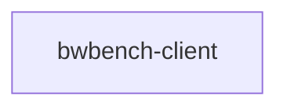

# `bwbench-client` 技术文档

> 路径：`os/arceos/tools/bwbench_client`
> 类型：二进制 crate
> 分层：ArceOS 层 / ArceOS 配套工具与辅助程序
> 版本：`0.1.0`
> 文档依据：当前仓库源码、`Cargo.toml` 与 `os/arceos/tools/bwbench_client/README.md`

`bwbench-client` 的核心定位是：ArceOS 配套工具与辅助程序

## 1. 架构设计分析
- 目录角色：ArceOS 配套工具与辅助程序
- crate 形态：二进制 crate
- 工作区位置：子工作区 `os/arceos/tools/bwbench_client`
- feature 视角：该 crate 没有显式声明额外 Cargo feature，功能边界主要由模块本身决定。
- 关键数据结构：可直接观察到的关键数据结构/对象包括 `EthernetMacAddress`、`NetDevice`、`Client`、`STANDARD_MTU`、`MAX_BYTES`、`MB`、`GB`。
- 设计重心：该 crate 运行在宿主机侧，重点是 CLI、配置、外部命令调用和开发流水线接线，而不是目标系统内核热路径。

### 1.1 内部模块划分
- `device`：设备抽象、枚举与访问封装

### 1.2 核心算法/机制
- 该 crate 是入口/编排型二进制，复杂度主要来自初始化顺序、配置注入和对下层模块的串接。

## 2. 核心功能说明
- 功能定位：ArceOS 配套工具与辅助程序
- 对外接口：从源码可见的主要公开入口包括 `new`、`mac_addr`、`bind_interface`、`interface_mtu`、`recv`、`send`、`EthernetMacAddress`、`ifreq`、`NetDevice`、`Client`。
- 典型使用场景：运行在宿主机侧，为构建、测试、镜像准备、依赖分析或开发辅助提供命令行能力。
- 关键调用链示例：按当前源码布局，常见入口/初始化链可概括为 `main()` -> `new()`。

## 3. 依赖关系图谱


### 3.1 直接与间接依赖
- 未检测到本仓库内的直接本地依赖；该 crate 可能主要依赖外部生态或承担叶子节点角色。

### 3.2 间接本地依赖
- 未检测到额外的间接本地依赖，或依赖深度主要停留在第一层。

### 3.3 被依赖情况
- 当前未发现本仓库内其他 crate 对其存在直接本地依赖。

### 3.4 间接被依赖情况
- 当前未发现更多间接消费者，或该 crate 主要作为终端入口使用。

### 3.5 关键外部依赖
- `chrono`
- `libc`

## 4. 开发指南
### 4.1 运行入口
```toml
# `bwbench-client` 是二进制/编排入口，通常不作为库依赖。
# 更常见的接入方式是通过对应构建/运行命令触发，而不是在 Cargo.toml 中引用。
```

```bash
cargo run --manifest-path "os/arceos/tools/bwbench_client/Cargo.toml"
```

### 4.2 初始化流程
1. 先确认该工具运行在宿主机侧，并准备需要的工作区、配置文件、镜像或外部命令环境。
2. 优先通过 CLI 子命令或 `--manifest-path` 方式运行，避免误把它当作裸机/内核镜像的一部分。
3. 对修改后的行为至少做一次成功路径和一次失败路径验证，重点检查日志、输出文件和外部命令返回值。

### 4.3 关键 API 使用提示
- 该 crate 的关键接入点通常是运行命令、CLI 参数或入口函数，而不是稳定库 API。
- 优先关注函数入口：`new`、`mac_addr`、`bind_interface`、`interface_mtu`、`recv`、`send`。
- 上下文/对象类型通常从 `EthernetMacAddress`、`ifreq`、`NetDevice` 等结构开始。

## 5. 测试策略
### 5.1 当前仓库内的测试形态
- 当前 crate 目录中未发现显式 `tests/`/`benches/`/`fuzz/` 入口，更可能依赖上层系统集成测试或跨 crate 回归。

### 5.2 单元测试重点
- 建议覆盖命令解析、配置序列化/反序列化、路径计算和失败分支。

### 5.3 集成测试重点
- 建议增加 CLI 金丝雀测试、示例工程 smoke test 或与 CI 命令一致的端到端验证。

### 5.4 覆盖率要求
- 覆盖率建议：命令分派和配置读写逻辑应保持高覆盖，外部命令执行路径至少要有成功/失败双向验证。

## 6. 跨项目定位分析
### 6.1 ArceOS
`bwbench-client` 直接位于 `os/arceos/` 目录树中，是 ArceOS 工程本体的一部分，承担 ArceOS 配套工具与辅助程序。

### 6.2 StarryOS
当前未检测到 StarryOS 工程本体对 `bwbench-client` 的显式本地依赖，若参与该系统，通常经外部工具链、配置或更底层生态间接体现。

### 6.3 Axvisor
当前未检测到 Axvisor 工程本体对 `bwbench-client` 的显式本地依赖，若参与该系统，通常经外部工具链、配置或更底层生态间接体现。
