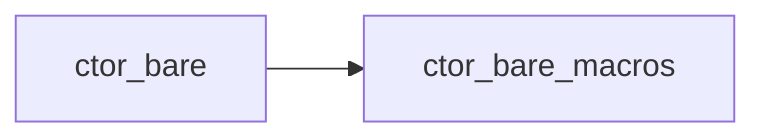

# `ctor_bare_macros` 技术文档

> 路径：`components/ctor_bare/ctor_bare_macros`
> 类型：过程宏库
> 分层：组件层 / 可复用基础组件
> 版本：`0.2.1`
> 文档依据：当前仓库源码、`Cargo.toml` 与 `components/ctor_bare/README.md`

`ctor_bare_macros` 的核心定位是：Macros for registering constructor functions for Rust under no_std.

## 1. 架构设计分析
- 目录角色：可复用基础组件
- crate 形态：过程宏库
- 工作区位置：子工作区 `components/ctor_bare`
- feature 视角：该 crate 没有显式声明额外 Cargo feature，功能边界主要由模块本身决定。
- 关键数据结构：关键“结构”更多体现在编译期语法树节点、宏输入 token 流和展开规则上。
- 设计重心：该 crate 应从宏入口、语法树解析和展开产物理解，运行时模块树通常不长，但编译期接口契约很关键。

### 1.1 内部模块划分
- 当前 crate 未显式声明多个顶层 `mod`，复杂度更可能集中在单文件入口、宏展开或下层子 crate。

### 1.2 核心算法/机制
- 该 crate 的核心机制是过程宏展开、语法树转换或代码生成，重点在编译期接口契约而非运行时数据结构。

## 2. 核心功能说明
- 功能定位：Macros for registering constructor functions for Rust under no_std.
- 对外接口：从源码可见的主要公开入口包括 `register_ctor`。
- 典型使用场景：供上游 crate 以属性宏、函数宏或派生宏形式调用，用来生成配置常量、接口绑定或样板代码。 这类接口往往不是运行时函数调用，而是编译期宏展开点。
- 关键调用链示例：典型调用链发生在编译期：宏入口先解析 token/参数，再生成目标 crate 需要的常量、实现或辅助代码。

## 3. 依赖关系图谱


### 3.1 直接与间接依赖
- 未检测到本仓库内的直接本地依赖；该 crate 可能主要依赖外部生态或承担叶子节点角色。

### 3.2 间接本地依赖
- 未检测到额外的间接本地依赖，或依赖深度主要停留在第一层。

### 3.3 被依赖情况
- `ctor_bare`

### 3.4 间接被依赖情况
- `arceos-affinity`
- `arceos-helloworld`
- `arceos-helloworld-myplat`
- `arceos-httpclient`
- `arceos-httpserver`
- `arceos-irq`
- `arceos-memtest`
- `arceos-parallel`
- `arceos-priority`
- `arceos-shell`
- `arceos-sleep`
- `arceos-wait-queue`
- 另外还有 `11` 个同类项未在此展开

### 3.5 关键外部依赖
- `proc-macro2`
- `quote`
- `syn`

## 4. 开发指南
### 4.1 依赖配置
```toml
[dependencies]
ctor_bare_macros = { workspace = true }

# 如果在仓库外独立验证，也可以显式绑定本地路径：
# ctor_bare_macros = { path = "components/ctor_bare/ctor_bare_macros" }
```

### 4.2 初始化流程
1. 在上游 crate 的 `Cargo.toml` 中添加该宏 crate 依赖。
2. 在类型定义、trait 接口或 API 注入点上应用宏，并核对输入语法是否满足宏约束。
3. 通过编译结果、展开代码和错误信息验证宏生成逻辑是否正确。

### 4.3 关键 API 使用提示
- 应优先识别宏名、输入语法约束和展开后会生成哪些符号，而不是只看辅助函数名。
- 优先关注函数入口：`register_ctor`。

## 5. 测试策略
### 5.1 当前仓库内的测试形态
- 当前 crate 目录中未发现显式 `tests/`/`benches/`/`fuzz/` 入口，更可能依赖上层系统集成测试或跨 crate 回归。

### 5.2 单元测试重点
- 建议覆盖语法树解析、输入约束检查和展开代码生成逻辑。

### 5.3 集成测试重点
- 建议增加 compile-pass / compile-fail 或 UI 测试，验证宏在真实调用 crate 中的展开行为。

### 5.4 覆盖率要求
- 覆盖率建议：宏入口、错误诊断和关键展开分支需要重点覆盖，必要时结合快照测试检查生成代码。

## 6. 跨项目定位分析
### 6.1 ArceOS
`ctor_bare_macros` 主要通过 `arceos-affinity`、`arceos-helloworld`、`arceos-helloworld-myplat`、`arceos-httpclient`、`arceos-httpserver`、`arceos-irq` 等（另有 13 项） 等上层 crate 被 ArceOS 间接复用，通常处于更底层的公共依赖层。

### 6.2 StarryOS
`ctor_bare_macros` 主要通过 `starry-kernel`、`starryos`、`starryos-test` 等上层 crate 被 StarryOS 间接复用，通常处于更底层的公共依赖层。

### 6.3 Axvisor
`ctor_bare_macros` 主要通过 `axvisor` 等上层 crate 被 Axvisor 间接复用，通常处于更底层的公共依赖层。
