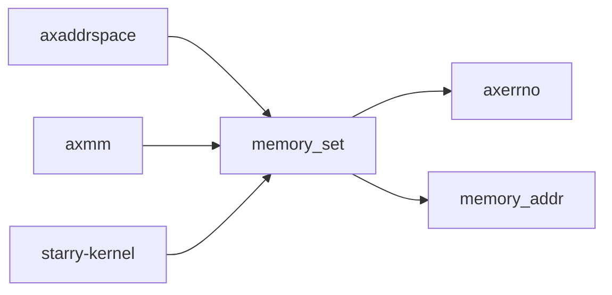

# `memory_set` 技术文档

> 路径：`components/axmm_crates/memory_set`
> 类型：库 crate
> 分层：组件层 / 可复用基础组件
> 版本：`0.4.1`
> 文档依据：当前仓库源码、`Cargo.toml` 与 `components/axmm_crates/memory_set/README.md`

`memory_set` 的核心定位是：Data structures and operations for managing memory mappings

## 1. 架构设计分析
- 目录角色：可复用基础组件
- crate 形态：库 crate
- 工作区位置：子工作区 `components/axmm_crates`
- feature 视角：主要通过 `axerrno` 控制编译期能力装配。
- 关键数据结构：可直接观察到的关键数据结构/对象包括 `MemoryArea`、`MemorySet`、`MockBackend`、`MappingError`、`MappingResult`、`Addr`、`Flags`、`PageTable`、`MAX_ADDR`、`DUMP_LOCK`。
- 设计重心：该 crate 通常作为多个内核子系统共享的底层构件，重点在接口边界、数据结构和被上层复用的方式。

### 1.1 内部模块划分
- `area`：内部子模块
- `backend`：内部子模块
- `set`：内部子模块
- `tests`：测试辅助与场景验证代码（按条件编译启用）

### 1.2 核心算法/机制
- 该 crate 的实现主要围绕顶层模块分工展开，重点在子系统边界、trait/类型约束以及初始化流程。

## 2. 核心功能说明
- 功能定位：Data structures and operations for managing memory mappings
- 对外接口：从源码可见的主要公开入口包括 `new`、`va_range`、`flags`、`start`、`end`、`size`、`backend`、`len`、`MemoryArea`、`MemorySet` 等（另有 3 个公开入口）。
- 典型使用场景：作为共享基础设施被多个 OS 子系统复用，常见场景包括同步、内存管理、设备抽象、接口桥接和虚拟化基础能力。
- 关键调用链示例：按当前源码布局，常见入口/初始化链可概括为 `new()` -> `start()` -> `map()` -> `test_map_unmap()`。

## 3. 依赖关系图谱


### 3.1 直接与间接依赖
- `axerrno`
- `memory_addr`

### 3.2 间接本地依赖
- 未检测到额外的间接本地依赖，或依赖深度主要停留在第一层。

### 3.3 被依赖情况
- `axaddrspace`
- `axmm`
- `starry-kernel`

### 3.4 间接被依赖情况
- `arceos-affinity`
- `arceos-helloworld`
- `arceos-helloworld-myplat`
- `arceos-httpclient`
- `arceos-httpserver`
- `arceos-irq`
- `arceos-memtest`
- `arceos-parallel`
- `arceos-priority`
- `arceos-shell`
- `arceos-sleep`
- `arceos-wait-queue`
- 另外还有 `28` 个同类项未在此展开

### 3.5 关键外部依赖
- 当前依赖集合几乎完全来自仓库内本地 crate。

## 4. 开发指南
### 4.1 依赖配置
```toml
[dependencies]
memory_set = { workspace = true }

# 如果在仓库外独立验证，也可以显式绑定本地路径：
# memory_set = { path = "components/axmm_crates/memory_set" }
```

### 4.2 初始化流程
1. 在 `Cargo.toml` 中接入该 crate，并根据需要开启相关 feature。
2. 若 crate 暴露初始化入口，优先调用 `init`/`new`/`build`/`start` 类函数建立上下文。
3. 在最小消费者路径上验证公开 API、错误分支与资源回收行为。

### 4.3 关键 API 使用提示
- 优先关注函数入口：`new`、`va_range`、`flags`、`start`、`end`、`size`、`backend`、`len` 等（另有 9 项）。
- 上下文/对象类型通常从 `MemoryArea`、`MemorySet`、`MockBackend` 等结构开始。

## 5. 测试策略
### 5.1 当前仓库内的测试形态
- 存在单元测试/`#[cfg(test)]` 场景：`src/lib.rs`。

### 5.2 单元测试重点
- 建议用单元测试覆盖公开 API、错误分支、边界条件以及并发/内存安全相关不变量。

### 5.3 集成测试重点
- 建议补充被 ArceOS/StarryOS/Axvisor 消费时的最小集成路径，确保接口语义与 feature 组合稳定。

### 5.4 覆盖率要求
- 覆盖率建议：核心算法与错误路径达到高覆盖，关键数据结构和边界条件应实现接近完整覆盖。

## 6. 跨项目定位分析
### 6.1 ArceOS
`memory_set` 不在 ArceOS 目录内部，但被 `axmm` 等 ArceOS crate 直接依赖，说明它是该系统的共享构件或底层服务。

### 6.2 StarryOS
`memory_set` 不在 StarryOS 目录内部，但被 `starry-kernel` 等 StarryOS crate 直接依赖，说明它是该系统的共享构件或底层服务。

### 6.3 Axvisor
`memory_set` 主要通过 `axvisor` 等上层 crate 被 Axvisor 间接复用，通常处于更底层的公共依赖层。
