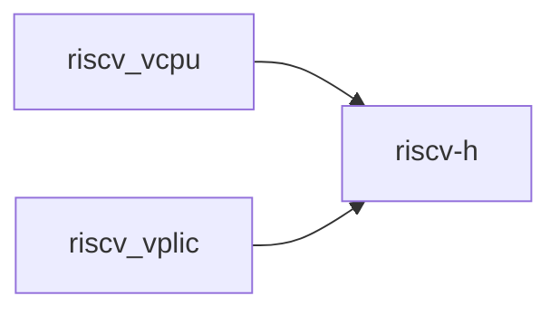

# `riscv-h` 技术文档

> 路径：`components/riscv-h`
> 类型：库 crate
> 分层：组件层 / 可复用基础组件
> 版本：`0.2.0`
> 文档依据：当前仓库源码、`Cargo.toml` 与 `components/riscv-h/README.md`

`riscv-h` 的核心定位是：RISC-V virtualization-related registers

## 1. 架构设计分析
- 目录角色：可复用基础组件
- crate 形态：库 crate
- 工作区位置：根工作区
- feature 视角：该 crate 没有显式声明额外 Cargo feature，功能边界主要由模块本身决定。
- 关键数据结构：该 crate 暴露的数据结构较少，关键复杂度主要体现在模块协作、trait 约束或初始化时序。
- 设计重心：该 crate 通常作为多个内核子系统共享的底层构件，重点在接口边界、数据结构和被上层复用的方式。

### 1.1 内部模块划分
- `register`：RISC-V Hypervisor Extension Registers This module provides access to Control and Status Registers (CSRs) defined in the RISC-V Hypervisor Extension. These registers enable virtual…

### 1.2 核心算法/机制
- 该 crate 的实现主要围绕顶层模块分工展开，重点在子系统边界、trait/类型约束以及初始化流程。

## 2. 核心功能说明
- 功能定位：RISC-V virtualization-related registers
- 对外接口：该 crate 更倾向按顶层模块组织接口，当前应重点关注 `register` 等模块边界。
- 典型使用场景：作为共享基础设施被多个 OS 子系统复用，常见场景包括同步、内存管理、设备抽象、接口桥接和虚拟化基础能力。
- 关键调用链示例：该 crate 没有单一固定的初始化链，通常由上层调用者按 feature/trait 组合接入。

## 3. 依赖关系图谱


### 3.1 直接与间接依赖
- 未检测到本仓库内的直接本地依赖；该 crate 可能主要依赖外部生态或承担叶子节点角色。

### 3.2 间接本地依赖
- 未检测到额外的间接本地依赖，或依赖深度主要停留在第一层。

### 3.3 被依赖情况
- `riscv_vcpu`
- `riscv_vplic`

### 3.4 间接被依赖情况
- `axdevice`
- `axvisor`
- `axvm`

### 3.5 关键外部依赖
- `bare-metal`
- `bit_field`
- `bitflags`
- `log`
- `riscv`

## 4. 开发指南
### 4.1 依赖配置
```toml
[dependencies]
riscv-h = { workspace = true }

# 如果在仓库外独立验证，也可以显式绑定本地路径：
# riscv-h = { path = "components/riscv-h" }
```

### 4.2 初始化流程
1. 在 `Cargo.toml` 中接入该 crate，并根据需要开启相关 feature。
2. 若 crate 暴露初始化入口，优先调用 `init`/`new`/`build`/`start` 类函数建立上下文。
3. 在最小消费者路径上验证公开 API、错误分支与资源回收行为。

### 4.3 关键 API 使用提示
- 该 crate 更偏编排、配置或内部 glue 逻辑，关键使用点通常体现在 feature、命令或入口函数上。

## 5. 测试策略
### 5.1 当前仓库内的测试形态
- 存在 crate 内集成测试：`tests/integration_tests.rs`。
- 存在单元测试/`#[cfg(test)]` 场景：`src/register/hypervisorx64/hgatp.rs`、`src/register/hypervisorx64/hstatus.rs`、`src/register/hypervisorx64/vsstatus.rs`。

### 5.2 单元测试重点
- 建议用单元测试覆盖公开 API、错误分支、边界条件以及并发/内存安全相关不变量。

### 5.3 集成测试重点
- 建议补充被 ArceOS/StarryOS/Axvisor 消费时的最小集成路径，确保接口语义与 feature 组合稳定。

### 5.4 覆盖率要求
- 覆盖率建议：核心算法与错误路径达到高覆盖，关键数据结构和边界条件应实现接近完整覆盖。

## 6. 跨项目定位分析
### 6.1 ArceOS
当前未检测到 ArceOS 工程本体对 `riscv-h` 的显式本地依赖，若参与该系统，通常经外部工具链、配置或更底层生态间接体现。

### 6.2 StarryOS
当前未检测到 StarryOS 工程本体对 `riscv-h` 的显式本地依赖，若参与该系统，通常经外部工具链、配置或更底层生态间接体现。

### 6.3 Axvisor
`riscv-h` 主要通过 `axvisor` 等上层 crate 被 Axvisor 间接复用，通常处于更底层的公共依赖层。
