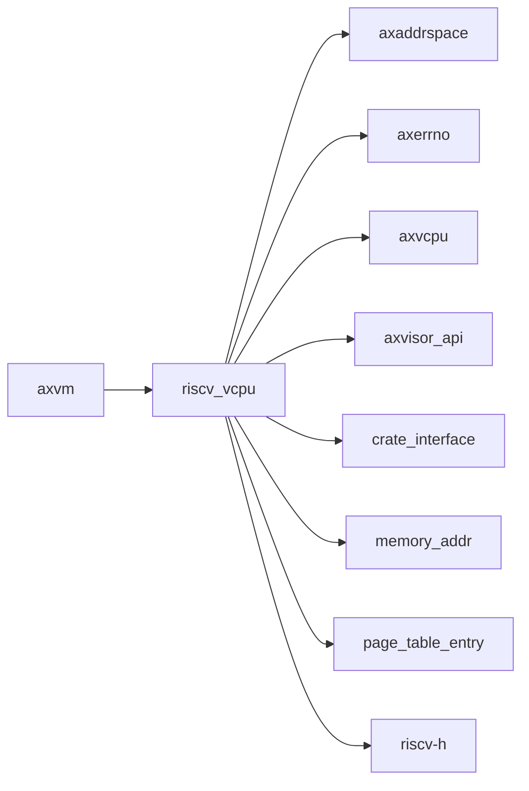

# `riscv_vcpu` 技术文档

> 路径：`components/riscv_vcpu`
> 类型：库 crate
> 分层：组件层 / 可复用基础组件
> 版本：`0.2.2`
> 文档依据：当前仓库源码、`Cargo.toml` 与 `components/riscv_vcpu/README.md`

`riscv_vcpu` 的核心定位是：ArceOS-Hypervisor riscv vcpu module

## 1. 架构设计分析
- 目录角色：可复用基础组件
- crate 形态：库 crate
- 工作区位置：根工作区
- feature 视角：该 crate 没有显式声明额外 Cargo feature，功能边界主要由模块本身决定。
- 关键数据结构：可直接观察到的关键数据结构/对象包括 `RISCVVCpuCreateConfig`、`TrapFrame`、`RISCVPerCpu`、`GeneralPurposeRegisters`、`HypervisorCpuState`、`GuestCpuState`、`GprIndex`、`Exception`、`DecodedOp`、`CreateConfig` 等（另有 5 个关键类型/对象）。
- 设计重心：该 crate 多数是寄存器级或设备级薄封装，复杂度集中在 MMIO 语义、安全假设和被上层平台/驱动整合的方式。

### 1.1 内部模块划分
- `consts`：Constants about traps
- `detect`：Detect instruction sets (ISA extensions) by trap-and-return procedure First, it disables all S-level interrupts. Remaining traps in RISC-V core are all exceptions. Then, it filter…
- `guest_mem`：内部子模块
- `percpu`：内部子模块
- `regs`：内部子模块
- `sbi_console`：内部子模块
- `trap`：内部子模块
- `vcpu`：vCPU 状态机与虚拟 CPU 调度逻辑

### 1.2 核心算法/机制
- vCPU 状态机、VM exit 处理与宿主调度桥接

## 2. 核心功能说明
- 功能定位：ArceOS-Hypervisor riscv vcpu module
- 对外接口：从源码可见的主要公开入口包括 `detect_h_extension`、`from_raw`、`reg`、`set_reg`、`a_regs`、`a_regs_mut`、`load_from_hw`、`gpt_page_fault_addr`、`RISCVVCpuCreateConfig`、`TrapFrame` 等（另有 7 个公开入口）。
- 典型使用场景：提供寄存器定义、MMIO 访问或设备级操作原语，通常被平台 crate、驱动聚合层或更高层子系统进一步封装。
- 关键调用链示例：按当前源码布局，常见入口/初始化链可概括为 `init_detect_trap()` -> `new()` -> `setup_csrs()`。

## 3. 依赖关系图谱


### 3.1 直接与间接依赖
- `axaddrspace`
- `axerrno`
- `axvcpu`
- `axvisor_api`
- `crate_interface`
- `memory_addr`
- `page_table_entry`
- `riscv-h`

### 3.2 间接本地依赖
- `axvisor_api_proc`
- `kernel_guard`
- `lazyinit`
- `memory_set`
- `page_table_multiarch`
- `percpu`
- `percpu_macros`

### 3.3 被依赖情况
- `axvm`

### 3.4 间接被依赖情况
- `axvisor`

### 3.5 关键外部依赖
- `bit_field`
- `bitflags`
- `cfg-if`
- `log`
- `memoffset`
- `riscv`
- `riscv-decode`
- `rustsbi`
- `sbi-rt`
- `sbi-spec`
- `tock-registers`

## 4. 开发指南
### 4.1 依赖配置
```toml
[dependencies]
riscv_vcpu = { workspace = true }

# 如果在仓库外独立验证，也可以显式绑定本地路径：
# riscv_vcpu = { path = "components/riscv_vcpu" }
```

### 4.2 初始化流程
1. 先明确该设备/寄存器组件的调用上下文，是被平台 crate 直接使用还是被驱动聚合层再次封装。
2. 修改寄存器位域、初始化顺序或中断相关逻辑时，应同步检查 `unsafe` 访问、访问宽度和副作用语义。
3. 尽量通过最小平台集成路径验证真实设备行为，而不要只依赖静态接口检查。

### 4.3 关键 API 使用提示
- 优先关注函数入口：`detect_h_extension`、`from_raw`、`reg`、`set_reg`、`a_regs`、`a_regs_mut`、`load_from_hw`、`gpt_page_fault_addr` 等（另有 10 项）。
- 上下文/对象类型通常从 `RISCVVCpuCreateConfig`、`TrapFrame`、`RISCVPerCpu`、`GeneralPurposeRegisters`、`HypervisorCpuState`、`GuestCpuState` 等（另有 7 项） 等结构开始。

## 5. 测试策略
### 5.1 当前仓库内的测试形态
- 当前 crate 目录中未发现显式 `tests/`/`benches/`/`fuzz/` 入口，更可能依赖上层系统集成测试或跨 crate 回归。

### 5.2 单元测试重点
- 建议覆盖寄存器位域、设备状态转换、边界参数和 `unsafe` 访问前提。

### 5.3 集成测试重点
- 建议结合最小平台或驱动集成路径验证真实设备行为，重点检查初始化、中断和收发等主线。

### 5.4 覆盖率要求
- 覆盖率建议：寄存器访问辅助函数和关键状态机保持高覆盖；真实硬件语义以集成验证补齐。

## 6. 跨项目定位分析
### 6.1 ArceOS
当前未检测到 ArceOS 工程本体对 `riscv_vcpu` 的显式本地依赖，若参与该系统，通常经外部工具链、配置或更底层生态间接体现。

### 6.2 StarryOS
当前未检测到 StarryOS 工程本体对 `riscv_vcpu` 的显式本地依赖，若参与该系统，通常经外部工具链、配置或更底层生态间接体现。

### 6.3 Axvisor
`riscv_vcpu` 主要通过 `axvisor` 等上层 crate 被 Axvisor 间接复用，通常处于更底层的公共依赖层。
