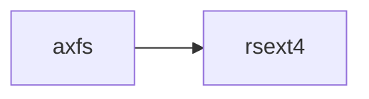

# `rsext4` 技术文档

> 路径：`components/rsext4`
> 类型：库 + 二进制混合 crate
> 分层：组件层 / 可复用基础组件
> 版本：`0.1.0`
> 文档依据：当前仓库源码、`Cargo.toml` 与 `components/rsext4/README.md`

`rsext4` 的核心定位是：可复用基础组件

## 1. 架构设计分析
- 目录角色：可复用基础组件
- crate 形态：库 + 二进制混合 crate
- 工作区位置：根工作区
- feature 视角：主要通过 `USE_MULTILEVEL_CACHE` 控制编译期能力装配。
- 关键数据结构：该 crate 暴露的数据结构较少，关键复杂度主要体现在模块协作、trait 约束或初始化时序。
- 设计重心：该 crate 通常作为多个内核子系统共享的底层构件，重点在接口边界、数据结构和被上层复用的方式。

### 1.1 内部模块划分
- `ext4_backend`：内部子模块

### 1.2 核心算法/机制
- 位图索引、空闲位搜索与资源分配
- 内存分配器初始化、扩容或对象分配路径
- 静态配置建模、编译期注入或 TOML 解析
- extent/区间树管理与块映射

## 2. 核心功能说明
- 功能定位：可复用基础组件
- 对外接口：该 crate 更倾向按顶层模块组织接口，当前应重点关注 `ext4_backend` 等模块边界。
- 典型使用场景：作为共享基础设施被多个 OS 子系统复用，常见场景包括同步、内存管理、设备抽象、接口桥接和虚拟化基础能力。
- 关键调用链示例：该 crate 没有单一固定的初始化链，通常由上层调用者按 feature/trait 组合接入。

## 3. 依赖关系图谱


### 3.1 直接与间接依赖
- 未检测到本仓库内的直接本地依赖；该 crate 可能主要依赖外部生态或承担叶子节点角色。

### 3.2 间接本地依赖
- 未检测到额外的间接本地依赖，或依赖深度主要停留在第一层。

### 3.3 被依赖情况
- `axfs`

### 3.4 间接被依赖情况
- `arceos-affinity`
- `arceos-helloworld`
- `arceos-helloworld-myplat`
- `arceos-httpclient`
- `arceos-httpserver`
- `arceos-irq`
- `arceos-memtest`
- `arceos-parallel`
- `arceos-priority`
- `arceos-shell`
- `arceos-sleep`
- `arceos-wait-queue`
- 另外还有 `11` 个同类项未在此展开

### 3.5 关键外部依赖
- `bitflags`
- `lazy_static`
- `log`

## 4. 开发指南
### 4.1 依赖配置
```toml
[dependencies]
rsext4 = { workspace = true }

# 如果在仓库外独立验证，也可以显式绑定本地路径：
# rsext4 = { path = "components/rsext4" }
```

### 4.2 初始化流程
1. 在 `Cargo.toml` 中接入该 crate，并根据需要开启相关 feature。
2. 若 crate 暴露初始化入口，优先调用 `init`/`new`/`build`/`start` 类函数建立上下文。
3. 在最小消费者路径上验证公开 API、错误分支与资源回收行为。

### 4.3 关键 API 使用提示
- 该 crate 更偏编排、配置或内部 glue 逻辑，关键使用点通常体现在 feature、命令或入口函数上。

## 5. 测试策略
### 5.1 当前仓库内的测试形态
- 存在单元测试/`#[cfg(test)]` 场景：`src/ext4_backend/bitmap.rs`、`src/ext4_backend/bitmap_cache.rs`、`src/ext4_backend/blockgroup_description.rs`、`src/ext4_backend/bmalloc.rs`、`src/ext4_backend/crc32c/crc32c.rs`、`src/ext4_backend/datablock_cache.rs` 等（另有 6 项）。

### 5.2 单元测试重点
- 建议用单元测试覆盖公开 API、错误分支、边界条件以及并发/内存安全相关不变量。

### 5.3 集成测试重点
- 建议补充被 ArceOS/StarryOS/Axvisor 消费时的最小集成路径，确保接口语义与 feature 组合稳定。

### 5.4 覆盖率要求
- 覆盖率建议：核心算法与错误路径达到高覆盖，关键数据结构和边界条件应实现接近完整覆盖。

## 6. 跨项目定位分析
### 6.1 ArceOS
`rsext4` 不在 ArceOS 目录内部，但被 `axfs` 等 ArceOS crate 直接依赖，说明它是该系统的共享构件或底层服务。

### 6.2 StarryOS
`rsext4` 主要通过 `starry-kernel`、`starryos`、`starryos-test` 等上层 crate 被 StarryOS 间接复用，通常处于更底层的公共依赖层。

### 6.3 Axvisor
`rsext4` 主要通过 `axvisor` 等上层 crate 被 Axvisor 间接复用，通常处于更底层的公共依赖层。
