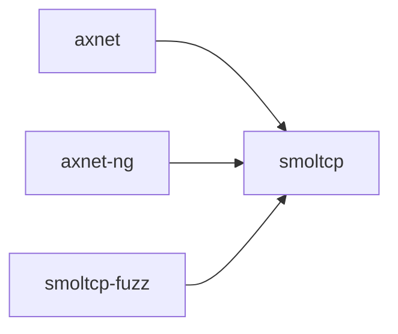

# `smoltcp` 技术文档

> 路径：`components/starry-smoltcp`
> 类型：库 crate
> 分层：组件层 / 可复用基础组件
> 版本：`0.12.0`
> 文档依据：当前仓库源码、`Cargo.toml` 与 `components/starry-smoltcp/README.md`

`smoltcp` 的核心定位是：A TCP/IP stack designed for bare-metal, real-time systems without a heap.

## 1. 架构设计分析
- 目录角色：可复用基础组件
- crate 形态：库 crate
- 工作区位置：根工作区
- feature 视角：主要通过 `_netsim`、`_proto-fragmentation`、`alloc`、`assembler-max-segment-count-1`、`assembler-max-segment-count-16`、`assembler-max-segment-count-2`、`assembler-max-segment-count-3`、`assembler-max-segment-count-32`、`assembler-max-segment-count-4`、`assembler-max-segment-count-8` 等（另有 168 个 feature） 控制编译期能力装配。
- 关键数据结构：可直接观察到的关键数据结构/对象包括 `Parser`、`StmPhy`、`StmPhyRxToken`、`StmPhyTxToken`、`PacketMeta`、`ChecksumCapabilities`、`Checksum`、`Medium`、`Socket`、`Result` 等（另有 7 个关键类型/对象）。
- 设计重心：该 crate 通常作为多个内核子系统共享的底层构件，重点在接口边界、数据结构和被上层复用的方式。

### 1.1 内部模块划分
- `macros`：内部子模块
- `parsers`：内部子模块
- `rand`：内部子模块
- `iface`：Network interface logic. The iface module deals with the *network interfaces*. It filters incoming frames, provides lookup and caching of hardware addresses, and handles managemen…
- `phy`：Access to networking hardware. The phy module deals with the *network devices*. It provides a trait for transmitting and receiving frames, Device and implementations of it: the _l…
- `socket`：Communication between endpoints. The socket module deals with *network endpoints* and *buffering*. It provides interfaces for accessing buffers of data, and protocol state machine…（按 feature: socket 条件启用）
- `storage`：Specialized containers. The storage module provides containers for use in other modules. The containers support both pre-allocated memory, without the std or alloc crates being av…
- `time`：Time structures. The time module contains structures used to represent both absolute and relative time. - [Instant] is used to represent absolute time. - [Duration] is used to rep…

### 1.2 核心算法/机制
- 拥塞控制、窗口调整与重传策略
- socket 状态机与连接管理
- TCP Reno 拥塞控制策略
- 轻量网络栈集成与协议处理

## 2. 核心功能说明
- 功能定位：A TCP/IP stack designed for bare-metal, real-time systems without a heap.
- 对外接口：从源码可见的主要公开入口包括 `rx`、`tx`、`ignored`、`ip_mtu`、`from_micros`、`from_micros_const`、`from_millis`、`from_millis_const`、`Parser`、`StmPhy` 等（另有 11 个公开入口）。
- 典型使用场景：作为共享基础设施被多个 OS 子系统复用，常见场景包括同步、内存管理、设备抽象、接口桥接和虚拟化基础能力。
- 关键调用链示例：按当前源码布局，常见入口/初始化链可概括为 `new()`。

## 3. 依赖关系图谱


### 3.1 直接与间接依赖
- 未检测到本仓库内的直接本地依赖；该 crate 可能主要依赖外部生态或承担叶子节点角色。

### 3.2 间接本地依赖
- 未检测到额外的间接本地依赖，或依赖深度主要停留在第一层。

### 3.3 被依赖情况
- `axnet`
- `axnet-ng`
- `smoltcp-fuzz`

### 3.4 间接被依赖情况
- `arceos-affinity`
- `arceos-helloworld`
- `arceos-helloworld-myplat`
- `arceos-httpclient`
- `arceos-httpserver`
- `arceos-irq`
- `arceos-memtest`
- `arceos-parallel`
- `arceos-priority`
- `arceos-shell`
- `arceos-sleep`
- `arceos-wait-queue`
- 另外还有 `11` 个同类项未在此展开

### 3.5 关键外部依赖
- `bitflags`
- `byteorder`
- `cfg-if`
- `defmt`
- `env_logger`
- `getopts`
- `heapless`
- `idna`
- `insta`
- `libc`
- `log`
- `managed`
- 另外还有 `4` 个同类项未在此展开

## 4. 开发指南
### 4.1 依赖配置
```toml
[dependencies]
smoltcp = { workspace = true }

# 如果在仓库外独立验证，也可以显式绑定本地路径：
# smoltcp = { path = "components/starry-smoltcp" }
```

### 4.2 初始化流程
1. 在 `Cargo.toml` 中接入该 crate，并根据需要开启相关 feature。
2. 若 crate 暴露初始化入口，优先调用 `init`/`new`/`build`/`start` 类函数建立上下文。
3. 在最小消费者路径上验证公开 API、错误分支与资源回收行为。

### 4.3 关键 API 使用提示
- 优先关注函数入口：`rx`、`tx`、`ignored`、`ip_mtu`、`from_micros`、`from_micros_const`、`from_millis`、`from_millis_const` 等（另有 7 项）。
- 上下文/对象类型通常从 `Parser`、`StmPhy`、`StmPhyRxToken`、`StmPhyTxToken`、`PacketMeta`、`ChecksumCapabilities` 等（另有 5 项） 等结构开始。

## 5. 测试策略
### 5.1 当前仓库内的测试形态
- 存在 crate 内集成测试：`tests/netsim.rs`。
- 存在单元测试/`#[cfg(test)]` 场景：`src/iface/fragmentation.rs`、`src/iface/interface/mod.rs`、`src/iface/interface/sixlowpan.rs`、`src/iface/neighbor.rs`、`src/iface/route.rs`、`src/iface/rpl/lollipop.rs` 等（另有 48 项）。
- 存在示例程序：`examples/benchmark.rs`、`examples/client.rs`、`examples/dhcp_client.rs`、`examples/dns.rs`、`examples/httpclient.rs`、`examples/loopback.rs` 等（另有 9 项），可作为冒烟验证入口。
- 存在基准测试：`benches/bench.rs`。
- 存在模糊测试入口：`fuzz/fuzz_targets/dhcp_header.rs`、`fuzz/fuzz_targets/ieee802154_header.rs`、`fuzz/fuzz_targets/packet_parser.rs`、`fuzz/fuzz_targets/sixlowpan_packet.rs`、`fuzz/fuzz_targets/tcp_headers.rs`、`fuzz/utils.rs`。

### 5.2 单元测试重点
- 建议用单元测试覆盖公开 API、错误分支、边界条件以及并发/内存安全相关不变量。

### 5.3 集成测试重点
- 建议补充被 ArceOS/StarryOS/Axvisor 消费时的最小集成路径，确保接口语义与 feature 组合稳定。

### 5.4 覆盖率要求
- 覆盖率建议：核心算法与错误路径达到高覆盖，关键数据结构和边界条件应实现接近完整覆盖。

## 6. 跨项目定位分析
### 6.1 ArceOS
`smoltcp` 不在 ArceOS 目录内部，但被 `axnet`、`axnet-ng` 等 ArceOS crate 直接依赖，说明它是该系统的共享构件或底层服务。

### 6.2 StarryOS
`smoltcp` 主要通过 `starry-kernel`、`starryos`、`starryos-test` 等上层 crate 被 StarryOS 间接复用，通常处于更底层的公共依赖层。

### 6.3 Axvisor
`smoltcp` 主要通过 `axvisor` 等上层 crate 被 Axvisor 间接复用，通常处于更底层的公共依赖层。
