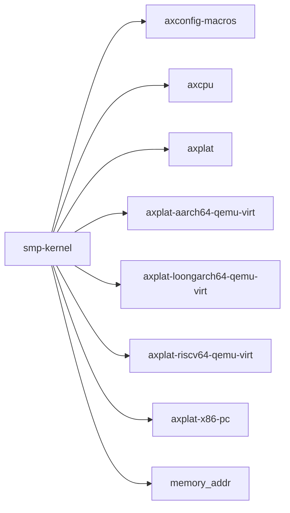

# `smp-kernel` 技术文档

> 路径：`components/axplat_crates/examples/smp-kernel`
> 类型：二进制 crate
> 分层：组件层 / 可复用基础组件
> 版本：`0.1.0`
> 文档依据：当前仓库源码、`Cargo.toml` 与 `components/axplat_crates/examples/smp-kernel/README.md`

`smp-kernel` 的核心定位是：可复用基础组件

## 1. 架构设计分析
- 目录角色：可复用基础组件
- crate 形态：二进制 crate
- 工作区位置：子工作区 `components/axplat_crates`
- feature 视角：该 crate 没有显式声明额外 Cargo feature，功能边界主要由模块本身决定。
- 关键数据结构：可直接观察到的关键数据结构/对象包括 `CPU_NUM`、`INITED_CPUS`、`PERIODIC_INTERVAL_NANOS`、`NEXT_DEADLINE`。
- 设计重心：该 crate 更适合被理解为板级 bring-up 演示：重点不是抽象层次，而是最小平台初始化路径能否成立。

### 1.1 内部模块划分
- `init`：初始化顺序与全局状态建立
- `irq`：IRQ 注册、屏蔽与派发路径
- `mp`：多核启动与 CPU 协同初始化

### 1.2 核心算法/机制
- 该 crate 以平台初始化、板级寄存器配置和硬件能力接线为主，算法复杂度次于时序与寄存器语义正确性。
- 该 crate 是入口/编排型二进制，复杂度主要来自初始化顺序、配置注入和对下层模块的串接。
- 初始化顺序控制与全局状态建立
- 中断注册、派发和屏蔽控制

## 2. 核心功能说明
- 功能定位：可复用基础组件
- 对外接口：从源码可见的主要公开入口包括 `init_smp_ok`、`init_kernel`、`init_kernel_secondary`、`init_irq`、`start_secondary_cpus`。
- 典型使用场景：用于演示 `axplat` 平台抽象的最小内核样例，便于验证中断、SMP、串口或启动路径。 这类 crate 的核心使用方式通常是运行入口本身，而不是被别的库当作稳定 API 依赖。
- 关键调用链示例：按当前源码布局，常见入口/初始化链可概括为 `main()` -> `init_smp_ok()` -> `init_kernel()` -> `init_kernel_secondary()` -> `init_irq()` -> ...。

## 3. 依赖关系图谱


### 3.1 直接与间接依赖
- `axconfig-macros`
- `axcpu`
- `axplat`
- `axplat-aarch64-qemu-virt`
- `axplat-loongarch64-qemu-virt`
- `axplat-riscv64-qemu-virt`
- `axplat-x86-pc`
- `memory_addr`
- `percpu`

### 3.2 间接本地依赖
- `arm_pl011`
- `arm_pl031`
- `axbacktrace`
- `axconfig-gen`
- `axerrno`
- `axplat-aarch64-peripherals`
- `axplat-macros`
- `crate_interface`
- `handler_table`
- `int_ratio`
- `kernel_guard`
- `kspin`
- 另外还有 `5` 个同类项未在此展开

### 3.3 被依赖情况
- 当前未发现本仓库内其他 crate 对其存在直接本地依赖。

### 3.4 间接被依赖情况
- 当前未发现更多间接消费者，或该 crate 主要作为终端入口使用。

### 3.5 关键外部依赖
- `cfg-if`
- `const-str`
- `linkme`

## 4. 开发指南
### 4.1 运行入口
```toml
# `smp-kernel` 是二进制/编排入口，通常不作为库依赖。
# 更常见的接入方式是通过对应构建/运行命令触发，而不是在 Cargo.toml 中引用。
```

```bash
cd "components/axplat_crates/examples/smp-kernel" && make ARCH=<x86_64|aarch64|riscv64|loongarch64> run
```

### 4.2 初始化流程
1. 进入示例目录后用 `make ARCH=<arch> run` 触发最小内核演示，以验证平台抽象接线。
2. 必要时切换 `ARCH`/board 配置，观察串口、中断、SMP 等最小功能是否正常。
3. 若把示例迁移到新平台，优先保证启动、异常和控制台路径先成立，再扩展其他能力。

### 4.3 关键 API 使用提示
- 该 crate 的关键接入点通常是运行命令、CLI 参数或入口函数，而不是稳定库 API。
- 优先关注函数入口：`init_smp_ok`、`init_kernel`、`init_kernel_secondary`、`init_irq`、`start_secondary_cpus`。

## 5. 测试策略
### 5.1 当前仓库内的测试形态
- 当前 crate 目录中未发现显式 `tests/`/`benches/`/`fuzz/` 入口，更可能依赖上层系统集成测试或跨 crate 回归。

### 5.2 单元测试重点
- 若存在纯函数或配置辅助逻辑，可覆盖地址布局计算、设备树解析和平台参数选择分支。

### 5.3 集成测试重点
- 重点验证启动、串口、中断、时钟和内存布局等 bring-up 基线能力，必要时覆盖多板级/多架构。

### 5.4 覆盖率要求
- 覆盖率建议以平台场景覆盖为主：至少确保一条真实启动链贯通，并覆盖关键 cfg/feature 组合。

## 6. 跨项目定位分析
### 6.1 ArceOS
当前未检测到 ArceOS 工程本体对 `smp-kernel` 的显式本地依赖，若参与该系统，通常经外部工具链、配置或更底层生态间接体现。

### 6.2 StarryOS
当前未检测到 StarryOS 工程本体对 `smp-kernel` 的显式本地依赖，若参与该系统，通常经外部工具链、配置或更底层生态间接体现。

### 6.3 Axvisor
当前未检测到 Axvisor 工程本体对 `smp-kernel` 的显式本地依赖，若参与该系统，通常经外部工具链、配置或更底层生态间接体现。
