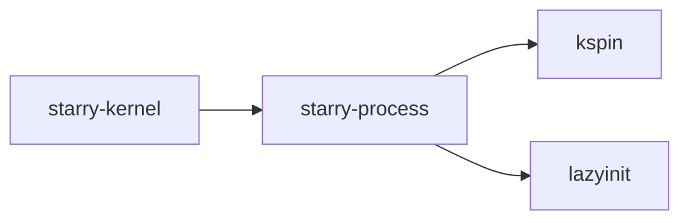

# `starry-process` 技术文档

> 路径：`components/starry-process`
> 类型：库 crate
> 分层：组件层 / 可复用基础组件
> 版本：`0.2.0`
> 文档依据：当前仓库源码、`Cargo.toml` 与 `components/starry-process/README.md`

`starry-process` 的核心定位是：Process management for Starry OS

## 1. 架构设计分析
- 目录角色：可复用基础组件
- crate 形态：库 crate
- 工作区位置：根工作区
- feature 视角：该 crate 没有显式声明额外 Cargo feature，功能边界主要由模块本身决定。
- 关键数据结构：可直接观察到的关键数据结构/对象包括 `Process`、`ProcessGroup`、`Session`、`Pid`、`INIT_PROC`。
- 设计重心：该 crate 通常作为多个内核子系统共享的底层构件，重点在接口边界、数据结构和被上层复用的方式。

### 1.1 内部模块划分
- `process`：内部子模块
- `process_group`：内部子模块
- `session`：内部子模块

### 1.2 核心算法/机制
- 进程生命周期、资源共享与回收

## 2. 核心功能说明
- 功能定位：Process management for Starry OS
- 对外接口：从源码可见的主要公开入口包括 `pid`、`is_init`、`parent`、`children`、`group`、`create_session`、`create_group`、`move_to_group`、`Process`、`ProcessGroup` 等（另有 1 个公开入口）。
- 典型使用场景：作为共享基础设施被多个 OS 子系统复用，常见场景包括同步、内存管理、设备抽象、接口桥接和虚拟化基础能力。
- 关键调用链示例：按当前源码布局，常见入口/初始化链可概括为 `is_init()` -> `create_session()` -> `create_group()` -> `new()` -> `new_init()` -> ...。

## 3. 依赖关系图谱


### 3.1 直接与间接依赖
- `kspin`
- `lazyinit`

### 3.2 间接本地依赖
- `crate_interface`
- `kernel_guard`

### 3.3 被依赖情况
- `starry-kernel`

### 3.4 间接被依赖情况
- `starryos`
- `starryos-test`

### 3.5 关键外部依赖
- `ctor`
- `weak-map`

## 4. 开发指南
### 4.1 依赖配置
```toml
[dependencies]
starry-process = { workspace = true }

# 如果在仓库外独立验证，也可以显式绑定本地路径：
# starry-process = { path = "components/starry-process" }
```

### 4.2 初始化流程
1. 在 `Cargo.toml` 中接入该 crate，并根据需要开启相关 feature。
2. 若 crate 暴露初始化入口，优先调用 `init`/`new`/`build`/`start` 类函数建立上下文。
3. 在最小消费者路径上验证公开 API、错误分支与资源回收行为。

### 4.3 关键 API 使用提示
- 优先关注函数入口：`pid`、`is_init`、`parent`、`children`、`group`、`create_session`、`create_group`、`move_to_group` 等（另有 20 项）。
- 上下文/对象类型通常从 `Process`、`ProcessGroup`、`Session` 等结构开始。

## 5. 测试策略
### 5.1 当前仓库内的测试形态
- 存在 crate 内集成测试：`tests/common/mod.rs`、`tests/group.rs`、`tests/process.rs`、`tests/session.rs`。

### 5.2 单元测试重点
- 建议用单元测试覆盖公开 API、错误分支、边界条件以及并发/内存安全相关不变量。

### 5.3 集成测试重点
- 建议补充被 ArceOS/StarryOS/Axvisor 消费时的最小集成路径，确保接口语义与 feature 组合稳定。

### 5.4 覆盖率要求
- 覆盖率建议：核心算法与错误路径达到高覆盖，关键数据结构和边界条件应实现接近完整覆盖。

## 6. 跨项目定位分析
### 6.1 ArceOS
当前未检测到 ArceOS 工程本体对 `starry-process` 的显式本地依赖，若参与该系统，通常经外部工具链、配置或更底层生态间接体现。

### 6.2 StarryOS
`starry-process` 不在 StarryOS 目录内部，但被 `starry-kernel` 等 StarryOS crate 直接依赖，说明它是该系统的共享构件或底层服务。

### 6.3 Axvisor
当前未检测到 Axvisor 工程本体对 `starry-process` 的显式本地依赖，若参与该系统，通常经外部工具链、配置或更底层生态间接体现。
