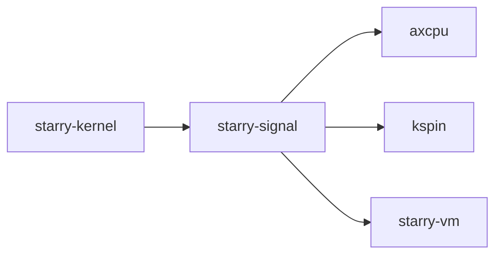

# `starry-signal` 技术文档

> 路径：`components/starry-signal`
> 类型：库 crate
> 分层：组件层 / 可复用基础组件
> 版本：`0.3.0`
> 文档依据：当前仓库源码、`Cargo.toml` 与 未检测到 crate 层 README

`starry-signal` 的核心定位是：Signal management library for Starry OS

## 1. 架构设计分析
- 目录角色：可复用基础组件
- crate 形态：库 crate
- 工作区位置：根工作区
- feature 视角：该 crate 没有显式声明额外 Cargo feature，功能边界主要由模块本身决定。
- 关键数据结构：可直接观察到的关键数据结构/对象包括 `SignalActionFlags`、`SignalAction`、`PendingSignals`、`SignalSet`、`SignalInfo`、`DefaultSignalAction`、`SignalOSAction`、`SignalDisposition`、`Signo`、`SIGINFO` 等（另有 3 个关键类型/对象）。
- 设计重心：该 crate 通常作为多个内核子系统共享的底层构件，重点在接口边界、数据结构和被上层复用的方式。

### 1.1 内部模块划分
- `api`：对外接口与能力封装
- `arch`：按 CPU 架构分派底层实现
- `action`：内部子模块
- `pending`：内部子模块
- `types`：内部子模块

### 1.2 核心算法/机制
- 进程生命周期、资源共享与回收
- 信号投递、屏蔽和唤醒协作

## 2. 核心功能说明
- 功能定位：Signal management library for Starry OS
- 对外接口：从源码可见的主要公开入口包括 `signal_trampoline_address`、`put_signal`、`dequeue_signal`、`is_realtime`、`default_action`、`add`、`remove`、`has`、`SignalActionFlags`、`k_sigaction` 等（另有 8 个公开入口）。
- 典型使用场景：作为共享基础设施被多个 OS 子系统复用，常见场景包括同步、内存管理、设备抽象、接口桥接和虚拟化基础能力。
- 关键调用链示例：该 crate 没有单一固定的初始化链，通常由上层调用者按 feature/trait 组合接入。

## 3. 依赖关系图谱


### 3.1 直接与间接依赖
- `axcpu`
- `kspin`
- `starry-vm`

### 3.2 间接本地依赖
- `axbacktrace`
- `axerrno`
- `crate_interface`
- `kernel_guard`
- `lazyinit`
- `memory_addr`
- `page_table_entry`
- `page_table_multiarch`
- `percpu`
- `percpu_macros`

### 3.3 被依赖情况
- `starry-kernel`

### 3.4 间接被依赖情况
- `starryos`
- `starryos-test`

### 3.5 关键外部依赖
- `bitflags`
- `cfg-if`
- `derive_more`
- `event-listener`
- `extern-trait`
- `linux-raw-sys`
- `log`
- `strum`

## 4. 开发指南
### 4.1 依赖配置
```toml
[dependencies]
starry-signal = { workspace = true }

# 如果在仓库外独立验证，也可以显式绑定本地路径：
# starry-signal = { path = "components/starry-signal" }
```

### 4.2 初始化流程
1. 在 `Cargo.toml` 中接入该 crate，并根据需要开启相关 feature。
2. 若 crate 暴露初始化入口，优先调用 `init`/`new`/`build`/`start` 类函数建立上下文。
3. 在最小消费者路径上验证公开 API、错误分支与资源回收行为。

### 4.3 关键 API 使用提示
- 优先关注函数入口：`signal_trampoline_address`、`put_signal`、`dequeue_signal`、`is_realtime`、`default_action`、`add`、`remove`、`has` 等（另有 10 项）。
- 上下文/对象类型通常从 `SignalActionFlags`、`k_sigaction`、`SignalAction`、`PendingSignals`、`SignalSet`、`SignalInfo` 等（另有 1 项） 等结构开始。

## 5. 测试策略
### 5.1 当前仓库内的测试形态
- 存在 crate 内集成测试：`tests/action.rs`、`tests/api_process.rs`、`tests/api_thread.rs`、`tests/common/mod.rs`、`tests/concurrent.rs`、`tests/pending.rs` 等（另有 1 项）。

### 5.2 单元测试重点
- 建议用单元测试覆盖公开 API、错误分支、边界条件以及并发/内存安全相关不变量。

### 5.3 集成测试重点
- 建议补充被 ArceOS/StarryOS/Axvisor 消费时的最小集成路径，确保接口语义与 feature 组合稳定。

### 5.4 覆盖率要求
- 覆盖率建议：核心算法与错误路径达到高覆盖，关键数据结构和边界条件应实现接近完整覆盖。

## 6. 跨项目定位分析
### 6.1 ArceOS
当前未检测到 ArceOS 工程本体对 `starry-signal` 的显式本地依赖，若参与该系统，通常经外部工具链、配置或更底层生态间接体现。

### 6.2 StarryOS
`starry-signal` 不在 StarryOS 目录内部，但被 `starry-kernel` 等 StarryOS crate 直接依赖，说明它是该系统的共享构件或底层服务。

### 6.3 Axvisor
当前未检测到 Axvisor 工程本体对 `starry-signal` 的显式本地依赖，若参与该系统，通常经外部工具链、配置或更底层生态间接体现。
