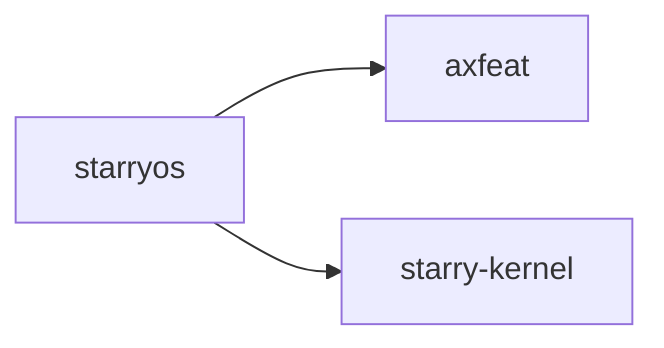

# `starryos` 技术文档

> 路径：`os/StarryOS/starryos`
> 类型：二进制 crate
> 分层：StarryOS 层 / StarryOS 启动镜像入口
> 版本：`0.2.0-preview.2`
> 文档依据：当前仓库源码、`Cargo.toml` 与 未检测到 crate 层 README

`starryos` 的核心定位是：A Linux-compatible OS kernel built on ArceOS unikernel

## 1. 架构设计分析
- 目录角色：StarryOS 启动镜像入口
- crate 形态：二进制 crate
- 工作区位置：子工作区 `os/StarryOS`
- feature 视角：主要通过 `qemu`、`smp`、`vf2` 控制编译期能力装配。
- 关键数据结构：可直接观察到的关键数据结构/对象包括 `CMDLINE`。
- 设计重心：该 crate 是 StarryOS 的启动镜像/应用打包入口，复杂度主要体现在 rootfs、feature、启动参数和内核主包之间的装配关系。

### 1.1 内部模块划分
- 当前 crate 未显式声明多个顶层 `mod`，复杂度更可能集中在单文件入口、宏展开或下层子 crate。

### 1.2 核心算法/机制
- 该 crate 是入口/编排型二进制，复杂度主要来自初始化顺序、配置注入和对下层模块的串接。

## 2. 核心功能说明
- 功能定位：A Linux-compatible OS kernel built on ArceOS unikernel
- 对外接口：该 crate 的公开入口主要是 `main()` 或命令子流程，本身不强调稳定库 API。
- 典型使用场景：用于生成和运行 StarryOS 启动镜像，把 rootfs、内核 feature 和运行参数装配到完整系统入口中。
- 关键调用链示例：按当前源码布局，常见入口/初始化链可概括为 `main()`。

## 3. 依赖关系图谱


### 3.1 直接与间接依赖
- `axfeat`
- `starry-kernel`

### 3.2 间接本地依赖
- `arm_pl011`
- `arm_pl031`
- `axalloc`
- `axallocator`
- `axbacktrace`
- `axconfig`
- `axconfig-gen`
- `axconfig-macros`
- `axcpu`
- `axdisplay`
- `axdma`
- `axdriver`
- 另外还有 `62` 个同类项未在此展开

### 3.3 被依赖情况
- 当前未发现本仓库内其他 crate 对其存在直接本地依赖。

### 3.4 间接被依赖情况
- 当前未发现更多间接消费者，或该 crate 主要作为终端入口使用。

### 3.5 关键外部依赖
- `axplat-riscv64-visionfive2`

## 4. 开发指南
### 4.1 运行入口
            ```toml
            # `starryos` 是二进制/编排入口，通常不作为库依赖。
            # 更常见的接入方式是通过对应构建/运行命令触发，而不是在 Cargo.toml 中引用。
            ```

            ```bash
            cargo xtask starry rootfs --arch riscv64
cargo xtask starry run --arch riscv64 --package starryos
            ```

### 4.2 初始化流程
1. 先准备 rootfs、用户程序镜像和 StarryOS 目标架构配置。
2. 用 `cargo xtask starry rootfs --arch <arch>` 准备运行环境，再执行 `cargo xtask starry run --arch <arch>`。
3. 关注 init 进程、rootfs 挂载、syscall 行为和用户程序启动结果是否符合预期。

### 4.3 关键 API 使用提示
- 该 crate 更偏编排、配置或内部 glue 逻辑，关键使用点通常体现在 feature、命令或入口函数上。

## 5. 测试策略
### 5.1 当前仓库内的测试形态
- 当前 crate 目录中未发现显式 `tests/`/`benches/`/`fuzz/` 入口，更可能依赖上层系统集成测试或跨 crate 回归。

### 5.2 单元测试重点
- 建议围绕 syscall 语义、进程/线程状态转换、地址空间或信号处理分支做单元测试。

### 5.3 集成测试重点
- 建议结合 rootfs、用户程序加载和 `test-suit/starryos` 做端到端回归，验证 Linux 兼容行为。

### 5.4 覆盖率要求
- 覆盖率建议：syscall 分发、关键状态机和错误码映射应覆盖主要正常/异常路径；复杂场景需以集成测试补齐。

## 6. 跨项目定位分析
### 6.1 ArceOS
当前未检测到 ArceOS 工程本体对 `starryos` 的显式本地依赖，若参与该系统，通常经外部工具链、配置或更底层生态间接体现。

### 6.2 StarryOS
`starryos` 直接位于 `os/StarryOS/` 目录树中，是 StarryOS 工程本体的一部分，承担 StarryOS 启动镜像入口。

### 6.3 Axvisor
当前未检测到 Axvisor 工程本体对 `starryos` 的显式本地依赖，若参与该系统，通常经外部工具链、配置或更底层生态间接体现。
