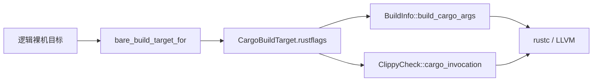

# AArch64 严格对齐与短复制内联

AArch64 裸机构建通过 `CargoBuildTarget.rustflags` 调整短复制的内联代价，同时保留原目标的严格对齐要求。该策略由 axbuild 统一提供，原生性能证据与后续优化进展记录在 [性能议题 #2308](https://github.com/rcore-os/tgoskits/issues/2308)。

## 1. 编译策略

调度器会在栈、队列与线程记录之间转移小型聚合值。`bare_build_target_for()` 选择的编译策略影响这些转移最终展开为装载、存储指令，还是调用通用复制函数；状态所有权仍由原来的 Rust 类型维护。

### 1.1 内联代价

[LLVM 23 的 AArch64 实现](https://github.com/llvm/llvm-project/blob/release/23.x/llvm/lib/Target/AArch64/AArch64ISelLowering.cpp#L1256) 在严格对齐模式下把 `MaxStoresPerMemcpy` 设为 4，其他模式下设为 16。即使源与目标已经满足标量访问对齐，较大的聚合值也可能因为这个代价上限被转换为函数调用。

[`bare_build_target_for()`](../../scripts/axbuild/src/build/bare_build.rs) 为工作区 AArch64 裸机目标提供 `-Cllvm-args=--max-store-memcpy=16`。参数的单位是内联存储操作数，不是字节数；实际访问宽度仍由 LLVM 的合法化规则与已知对齐决定。该选项还覆盖 LLVM 的对应体积优化上限，因此修改它时也要检查代码体积与缓存代价。

### 1.2 访问约束

[`aarch64-unknown-none-softfloat.json`](../../scripts/targets/bare/aarch64-unknown-none-softfloat.json) 继续声明 `+strict-align`、`-neon` 与 soft-float ABI。提高内联代价上限没有改变 `getOptimalMemOpType()` 对源、目标对齐和可用寄存器类型的选择条件。

[`someboot::el_entry()`](../../platforms/someboot/src/arch/aarch64/entry.rs) 在启用 MMU 前执行早期初始化，因此启动代码仍需要严格对齐。不能用全局关闭 `strict-align` 代替这项代价调整，也不能用开启内核 SIMD 获得更宽复制。其他裸机架构、标准库检查目标及外部目标没有因此增加编译默认值。

## 2. 构建接入

编译默认值跟随已解析的目标传递。构建与 Clippy 都消费 `CargoBuildTarget`，使静态检查使用同一份目标选择与参数来源。

### 2.1 参数流向

[`BuildInfo::build_cargo_args()`](../../scripts/axbuild/src/build/info.rs) 先加入目标默认值，再加入调用方参数，通过 Cargo 的目标 `rustflags` 传给 rustc。[`ClippyCheck::cargo_invocation()`](../../scripts/axbuild/src/clippy/check.rs) 则把同一组默认值放在 `--` 后、已有 rustc 参数之前。位置无关代码、链接脚本和调用方配置沿原有流程保留。

两条入口共享参数所有者，图中的分叉只表示 Cargo 构建参数与 Clippy 参数的不同装配位置。

该设置只改变编译期的复制展开选择，不增加运行时开关或第二份目标规格。调整策略时应从这个共同入口修改，避免构建与检查形成不同配置。

### 2.2 验证边界

axbuild 的现有构建参数与 Clippy 调用测试用于核对参数装配，`cargo xtask clippy --package axbuild` 用于检查实现。最终性能必须通过实际构建配置生成的原生镜像复测，并记录工具链、目标、镜像与基准程序散列。

性能比较保持同一计时入口、处理器亲和与采样条件，保留未成功入睡等无效样本记录。QEMU 指令回调、复制调用数量和静态代码体积用于解释生成代码，不能代替原生延迟或完整正确性验证。编译器升级后应重新确认该 LLVM 参数与目标默认值，再以实际运行结果决定是否保留。
