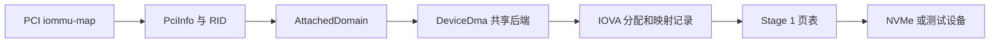

# ArceOS Arm SMMUv3 PCI DMA 设计

本设计以 QEMU 11.1.1 的 Arm `virt,iommu=smmuv3` 和本地 Linux 7.1 的 Arm SMMUv3 Stage 1 驱动为首轮边界。目标是让 ArceOS 中固件声明受 IOMMU 管理的 PCI 设备通过 `dma-api` 获得真实 IOVA，并让 NVMe 数据 DMA 与 MSI-X 写入都经过同一个设备域。该能力属于内存隔离和 `unsafe` 生命周期的高风险变更，合入前需要 DMA、PCI、中断和 Arm SMMU 领域审查。

## 1. 行为与范围

`virt` 的 PCI root complex 通过 `iommu-map` 将 requester ID 路由到 SMMU StreamID。PCI 适配层根据固件路由选择 `DeviceDma` 的 Direct 或 Translated 后端，NVMe 等驱动只接收设备 DMA 能力。首轮只支持单个 FDT PCI root complex、4 KiB 页、Stage 1、SSID 0 和 QEMU 实现；ACPI、PASID、stall、热换域、实体板卡和其他 IOMMU 后端不在本轮接口承诺内。

### 1.1 成功标准

NVMe 在 SMMU 域中完成实际读写，`DeviceDma::info()` 表示 `Translated`，设备看到的 IOVA 与物理地址不同，且无意外 SMMU fault。`iommu-testdev` 在映射存在时访问成功、映射不存在或已解除时访问被拒绝，EVTQ 记录可解释的故障。固件给设备指定 IOMMU 时，控制器初始化、StreamID 解析或绑定失败必须令该设备探测失败，不能退回 Direct DMA。

### 1.2 方案选择

保持 Direct DMA 只能满足未启用 IOMMU 的旧配置；只改 `DmaDomainId` 元数据会把物理地址错当 IOVA；只做 SMMU 表项而不接入 `dma-api` 则无法覆盖 NVMe 真实缓冲区。选用独立的可移植 SMMUv3 硬件驱动、窄 IOMMU 域能力和 ArceOS PCI 适配层，使页表、设备发现和 DMA 缓冲区分别有清楚的所有者。

## 2. 所有权与地址流

SMMUv3 驱动持有 CMDQ、EVTQ、Stream Table、ASID、Context Descriptor 与 Stage 1 页表。PCI 适配层解析 FDT 并为每个 RID 取得 StreamID，绑定后保存该设备独立的 `AttachedDomain`。`dma-api` 的设备后端持有域的共享引用及 IOVA 分配记录，DMA 资源的销毁必须先解除翻译并同步 TLB，再交还 IOVA 和物理页。

### 2.1 正常数据路径

下图中的 `PciInfo`、`DeviceDma`、`AttachedDomain` 是边界对象。`dma-api` 返回的 `DmaAddr` 始终是设备可见地址；SMMU 控制队列自身使用物理地址，不能递归通过受管理的 PCI 域。

控制器先建立控制队列与 Stream Table；设备绑定时发布 CD[0] 和 STE，完成配置失效与 `CMD_SYNC`。后续 DMA 分配先取得物理页和符合设备 mask 与域 aperture 的 IOVA；由于 PTE 暴露整页，OS 适配层在发布任何 PTE 前清零并同步全部物理页，包括请求长度之外的尾部，再建立逐页映射。PCI bus mastering 只在绑定成功后启用。Streaming DMA 在设备访问前后仍根据 `DmaCoherency` 和方向执行缓存同步。映射返回失败时逐步撤销已建 PTE；只有失效同步成功后才释放地址或缓冲区。

### 2.2 MSI-X 路径

`PciIrqLease` 在 MSI-X 表可对设备生效前，为中断控制器 doorbell 物理页建立写入映射。`rdif-msi::MsiMessage.address` 的页内偏移保持不变，表项中写入映射后的 IOVA。`allocate()` 与后续 `enable()` 或 `enable_source()` 重新编程表项时使用同一映射。首版的 PCI 域常驻，租约释放后也保留 doorbell 映射至域结束；仅屏蔽向量无法证明在途 MSI 写入已经排空。Linux 7.1 的 `iommu_dma_prepare_msi()` 与 `iommu_dma_compose_msi_msg()` 采用相同职责划分。

Stage 1 的页表 AP 位无法表达仅写权限，因此 doorbell 请求 `WRITE` 时实际页表允许读写；本实现与 Linux 7.1 的 Arm LPAE Stage 1 映射一致。域仅暴露目标 doorbell 页，调用方不能把 `WRITE` 当作禁止设备读取该页的安全保证。

## 3. 故障与生命周期

绑定 StreamID 是单次所有权转移。重复绑定、SID 越界、能力缺失、队列超时和表项配置失败都返回类型化错误。`iommu-map` 的 requester ID 基址若含掩码忽略的位，整张路由表在 PCI 控制器探测时被拒绝，避免永远无法命中的条目让设备落入 Direct DMA。SMMU 初始化只接受能表达首轮 Stage 1 语义的 IDR 能力；不接受无法保障命令同步与故障读取的控制器。首版校验 FDT 中断描述并通过任务上下文主动读取 EVTQ，不注册异步故障中断处理器。设备探测在绑定失败时停止，不能把固件约束降级为物理直通。

### 3.1 资源状态

一个 DMA 分配或 streaming 映射依次经历保留 IOVA、页表提交、设备可见、撤销中、已同步释放。提交失败时，若回滚的 IOTLB 同步也失败，记录连同物理资源进入隔离状态；释放失败同理。隔离资源不能被重分配，避免设备仍持有翻译时的 use-after-free。EVTQ 中的 SID、IOVA 与 fault 原因用于定位意外访问，不把 fault 当作自动恢复信号。EVTQ 溢出时先向硬件确认新的 overflow epoch，再报告丢失事件，使后续诊断仍可继续读取队列。

### 3.2 缓冲区借用

安全 `StreamingMap` 必须持有原缓冲区的可变借用直至解除映射。需要异步设备跨调用保持原始指针时，调用方使用单独的 `unsafe` 构造入口，承担缓冲区在 DMA 完成和失效同步前始终有效且不被 CPU 并发访问的责任。旧调用点必须在同一改动中迁移。

## 4. 兼容性与验证

无 `iommu-map` 路由的设备继续使用 Direct DMA；命中路由的设备以实际域能力构造 `DeviceDma`。现有 NVMe、AHCI、网络和 USB 调用方需随 `dma-api` 的错误与生命周期签名修改，不能留下一个返回物理地址却宣称 `Translated` 的入口。VirtIO PCI HAL 仍直接使用物理地址，因此首轮 QEMU 用例不加载该设备；意外发现带绑定域的 VirtIO PCI 设备时拒绝探测。

### 4.1 可运行证据

独立 AArch64 QEMU 用例用 `virt,iommu=smmuv3`、NVMe 和 `iommu-testdev`，检查读写、拒绝访问、EVTQ、边界和重复绑定。该用例还启用 `ax-driver/iommu-dma-test`：用真实 ArceOS 物理页分配器和可控域验证部分映射失败后的同步回滚、IOVA 复用，以及失效失败后的资源隔离。无 IOMMU 的现有 DMA 用例用于回归。代码完成后运行 `cargo fmt`、受影响软件包的 `cargo xtask clippy`、适用的 `cargo xtask test`，以及 `cargo xtask arceos test qemu --arch aarch64 --test-group rust --test-case iommu-dma`，并核对最终成功标记确实来自该用例。

### 4.2 性能与回滚

每次映射和解除映射增加 IOVA 分配、页表操作及 SMMU 命令同步，首轮以正确性优先；批量失效的收益需要后续在相同 QEMU 配置下测量 NVMe 吞吐与延迟。回滚时关闭 QEMU `iommu=smmuv3` 配置并回到 Direct DMA 路径；不存在持久格式迁移。运行中不热切换域，必须重启客体，避免旧 IOVA 与设备队列继续活动。
