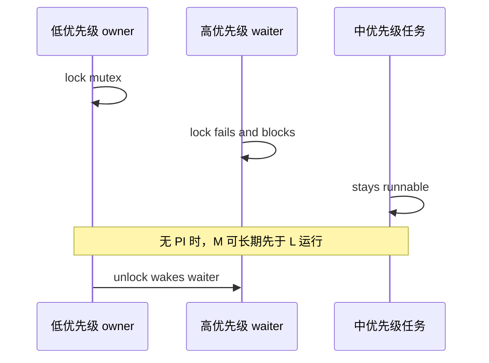
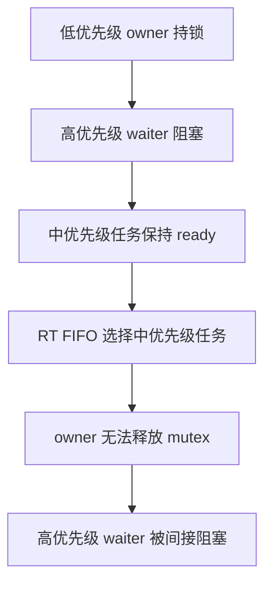
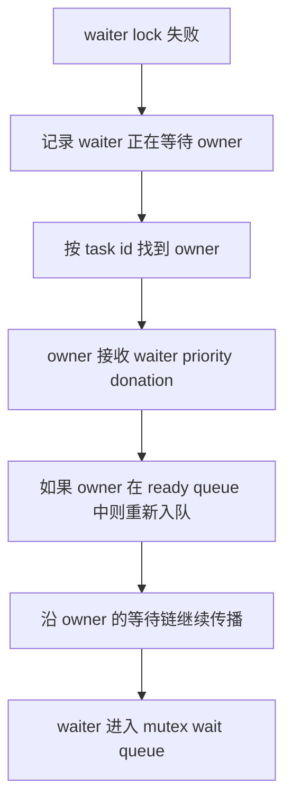
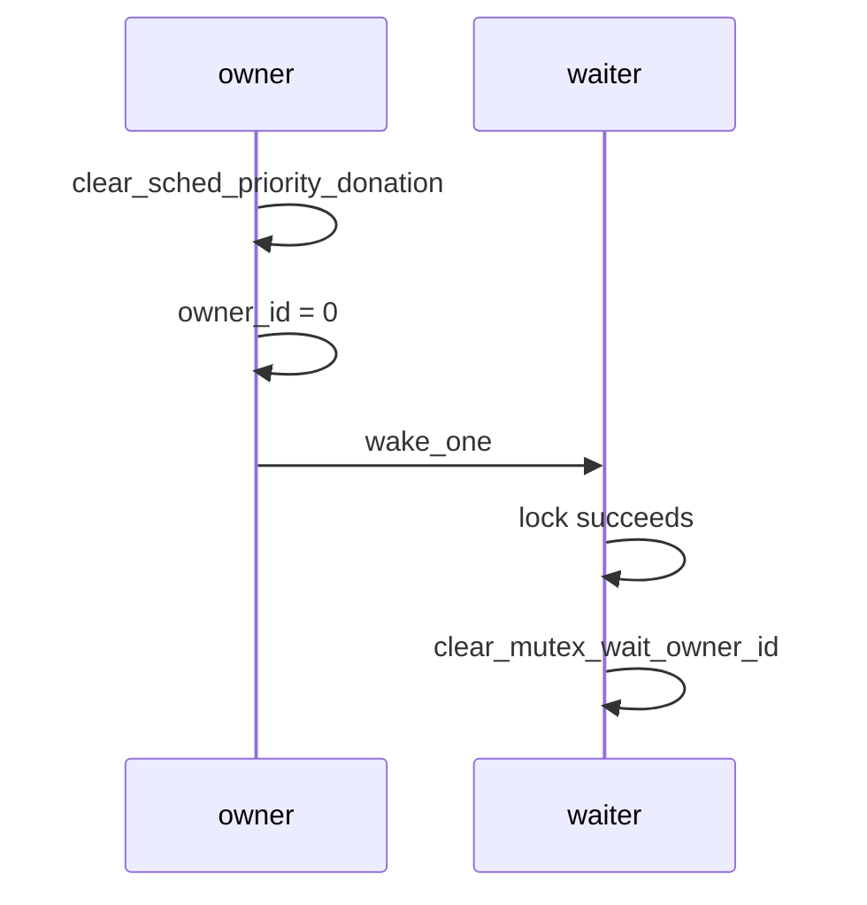
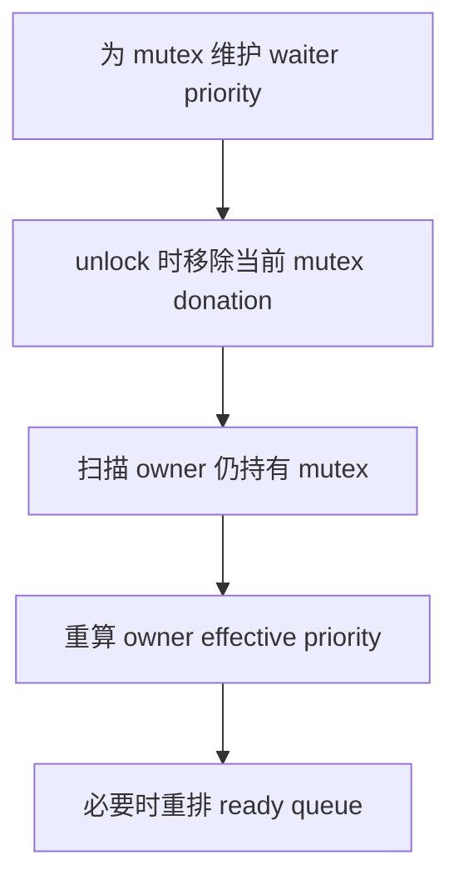

# axtask 优先级继承设计

## 1. 原有行为

优先级继承解决的是实时 FIFO 调度下的锁等待问题，而不是普通 ready queue 排序问题。`sched-rt-fifo` 已经让 `RtFifoScheduler` 按任务优先级选择 runnable task，但原有 `axtask::sync::mutex::RawMutex` 只负责互斥、阻塞和唤醒，没有把 waiter 的优先级反馈给持锁 owner；因此高优先级任务一旦等待低优先级 owner，就仍可能被中优先级任务间接阻塞。

### 1.1 调度基础

实时 FIFO 调度器位于 `components/axsched/src/rt_fifo.rs`，通过 `RtPriority::rt_priority()` 获取任务优先级，并用 `(Reverse(priority), enqueue_order)` 排序 ready queue。这个层次只认识“可运行任务”的优先级，不知道任务为何阻塞，也不负责判断 mutex owner 是否应该被临时提升。

| 代码锚点 | 原有职责 | PI 前的限制 |
| --- | --- | --- |
| `RtFifoScheduler::pick_next_task()` | 选择最高优先级 ready task | 只处理 ready queue 中的任务 |
| `RtFifoScheduler::task_tick()` | 判断是否需要抢占当前任务 | 不能提升正在持锁运行的低优先级 owner |
| `TaskInner::sched_priority()` | 暴露任务调度优先级 | 只有一个 priority 概念，无法区分基础优先级和临时 donation |
| `BaseScheduler::set_priority()` | 设置任务优先级 | 对 ready task 的重新排序需要额外处理 |

这意味着 RT FIFO 和 PI mutex 必须在不同层次协同。调度器保证 ready task 的顺序，mutex 在任务阻塞时产生 donation，`axtask` run queue 负责在 donation 改变 ready task 有效优先级后重新入队。

### 1.2 Mutex 缺口

原有 `RawMutex` 的核心状态只有 `owner_id` 和 opaque `wait_queue`。`lock_after_prepare()` 在 `owner_id` 非零时只会调用 `ActiveMutexOps::wait_until_unlocked()` 阻塞当前任务，`unlock()` 清空 `owner_id` 后调用 `ActiveMutexOps::wake_one()`，中间没有 owner task 查询、priority donation、chain propagation 或 donation cleanup。



这个交错在协作式或普通 FIFO 场景下不一定暴露，但在 `sched-rt-fifo` 中会破坏“高优先级任务尽快得到 CPU”的目标。只在 wait queue 中按 FIFO 唤醒也不够，因为真正需要优先运行的是持锁 owner，而不是已经阻塞的 waiter。

### 1.3 失败形态

没有 PI 时，高优先级 waiter 对 mutex 的等待不会改变 owner 的调度地位。只要中优先级任务保持 runnable，RT FIFO 会持续选择中优先级任务，低优先级 owner 就无法运行到 unlock，高优先级 waiter 也无法完成。



这个问题的关键不是 wait queue 自身的公平性，而是 owner 的 effective priority 没有反映等待者的实时需求。实现 PI 时必须把“基础优先级”和“临时继承优先级”拆开，否则 unlock 后无法恢复 owner 的真实基础优先级。

## 2. 实现方案

当前实现选择在 `sched-rt-fifo` feature 下扩展现有 sleepable `Mutex`，而不是引入新的公共 mutex 类型。这样可以让 `std::sync::Mutex` 映射到的内核 mutex 在实时 FIFO 场景下直接具备 PI 语义，同时通过 `#[cfg(feature = "sched-rt-fifo")]` 保持普通调度配置的原有轻量路径。

### 2.1 任务优先级状态

`TaskInner` 需要同时保存基础优先级、有效优先级和等待关系。基础优先级来自调用方显式设置，donation 只临时提升有效优先级，`sched_priority()` 返回调度器实际观察到的 effective priority。

| 字段或方法 | 语义 | 维护规则 |
| --- | --- | --- |
| `base_sched_priority` | 调用方设置的基础优先级 | `set_sched_priority()` 写入 |
| `donated_sched_priority` | 当前最高临时 donation | `donate_sched_priority()` 只接受更高 donation |
| `effective_sched_priority` | 调度器读取的有效优先级 | `refresh_effective_sched_priority()` 取 base 和 donation 最大值 |
| `mutex_wait_owner_id` | 当前任务正在等待的 mutex owner | contended lock 设置，成功 lock 后清空 |
| `sched_priority()` | 调度优先级查询入口 | 返回 effective priority |

这个拆分让 mutex donation 不会覆盖用户设置的基础优先级。`clear_sched_priority_donation()` 将 donation 重置为 `i32::MIN` 后重新计算 effective priority，owner 在释放 mutex 后可以回到基础优先级。

### 2.2 Donation 流程

mutex 争用发生在 `RawMutex::lock_after_prepare()` 中。当 `owner_id.compare_exchange_weak()` 发现锁已经被其他任务持有时，当前 waiter 调用 `donate_owner_priority(owner_id)`，把自己的 effective priority 捐给 owner，然后再进入 `ActiveMutexOps::wait_until_unlocked()` 阻塞。



链式传播由 `donate_priority_chain()` 完成。它通过 `task_by_id(TaskId::from_u64(owner_id))` 定位 owner，调用 `owner.donate_sched_priority(priority)` 更新 effective priority，再通过 `run_queue::requeue_task_after_priority_change()` 让 ready queue 重新按照新优先级排序。

### 2.3 Run Queue 重排

RT FIFO ready queue 的 key 包含任务当前优先级，所以 ready task 被 donation 提升后不能只改 `TaskInner` 字段。`run_queue::requeue_task_after_priority_change()` 会在 `sched-rt-fifo` 下选择目标 run queue，并调用 `AxRunQueueRef::requeue_task()` 将任务从 scheduler 中移除再添加回去。

| 代码锚点 | 职责 | 必要性 |
| --- | --- | --- |
| `RtFifoScheduler::remove_task()` | 用 `Arc::ptr_eq` 找到 ready queue 中的任务 | priority 改变后旧 key 已不可靠 |
| `RtFifoScheduler::set_priority()` | 修改 ready task priority 后重新入队 | 保证显式 set priority 也能重排 |
| `requeue_task_after_priority_change()` | 从 mutex donation 路径触发 scheduler 重排 | 保证 owner 被提升后能被 RT FIFO 选中 |
| `AxRunQueueRef::requeue_task()` | 在持有 run queue guard 时 remove/add | 保持 scheduler 访问序列化 |

`remove_task()` 改为按 `Arc::ptr_eq` 查找任务，是因为 donation 或 `set_priority()` 可能已经改变 `rt_priority()`。如果继续使用当前 priority 和旧 enqueue order 直接构造 key，就可能找不到 ready queue 中的旧项，导致重排失效。

### 2.4 Unlock 清理

owner 释放 mutex 时，`RawMutex::unlock()` 会先校验当前任务确实是 owner，然后清理当前任务的 priority donation，清空 `owner_id`，最后唤醒一个 waiter。成功获取 mutex 的任务会调用 `clear_current_mutex_wait_owner()`，避免后续链式 donation 错误地沿着已经结束的等待关系传播。



当前实现采用“unlock 时清空当前 donation”的最小模型，适合单 mutex owner 场景和已覆盖的链式 donation 场景。更完整的多 mutex PI 模型需要按每个 held mutex 重新计算仍然等待的最高 waiter priority，这不是本次实现的目标。

### 2.5 Lockdep Bridge

`os/arceos/modules/axtask/src/sync/bridge.rs` 也需要同样的 donation 逻辑，因为 lockdep 路径会通过 `mutex_acquire()` 和 `mutex_release()` 走桥接层，而不是直接使用 `RawMutex::lock_after_prepare()` 的普通路径。桥接层在 `all(feature = "multitask", feature = "sched-rt-fifo")` 下执行 donation、等待 owner 记录和 donation 清理，非实时配置仍保留 no-op 实现。

| 路径 | Contended lock 行为 | Release 行为 |
| --- | --- | --- |
| 普通 mutex path | `donate_owner_priority(owner)` 后阻塞 | `clear_current_priority_donation()` 后唤醒 |
| lockdep bridge path | `donate_mutex_owner_priority(owner)` 后阻塞 | `clear_current_mutex_priority_donation()` 后唤醒 |
| 非 `sched-rt-fifo` path | donation helper 为 no-op | cleanup helper 为 no-op |

这样可以保证是否启用 lockdep 不改变 `sched-rt-fifo` 下的 mutex PI 语义。维护时需要同步检查 `mutex/mod.rs` 和 `sync/bridge.rs`，避免某条构建路径遗漏 donation 或 cleanup。

## 3. 测试用例

测试分为 scheduler 单元测试和 ArceOS QEMU 集成测试。前者验证 `RtFifoScheduler` 的纯算法行为，后者在单核 QEMU 中实际构造任务、mutex 和优先级反转交错，确认 axtask、std mutex 和 run queue 接入可以形成闭环。

### 3.1 Scheduler 单测

`components/axsched/src/tests.rs` 覆盖 RT FIFO ready queue 的排序和重排行为。新增的 `rt_fifo_set_priority_reorders_ready_task()` 专门验证 ready task 在 priority 改变后会被移除并重新插入到正确位置。

| 测试 | 覆盖行为 |
| --- | --- |
| `rt_fifo_picks_higher_priority_before_fifo_order` | 高优先级任务先于更早入队的低优先级任务运行 |
| `rt_fifo_preserves_fifo_order_within_same_priority` | 同优先级任务保持 FIFO 顺序 |
| `rt_fifo_set_priority_affects_future_enqueue_order` | 非 ready task 修改 priority 后影响后续入队排序 |
| `rt_fifo_set_priority_reorders_ready_task` | ready task 修改 priority 后立即重排 |
| `rt_fifo_tick_preempts_only_for_higher_priority_ready_task` | 只有更高优先级 ready task 会触发 tick 抢占 |
| `rt_fifo_tick_rotates_default_priority_runtime_tasks` | priority 0 任务允许默认轮转 |
| `rt_fifo_tick_does_not_rotate_equal_realtime_priority_tasks` | 相同实时优先级任务不因 tick 轮转 |

这些测试不依赖 QEMU，可以快速定位调度器算法退化。它们不能替代 mutex PI 集成测试，因为 donation 涉及 `TaskInner`、task id registry、wait queue 和 run queue guard。

### 3.2 QEMU 集成场景

`test-suit/arceos/rust/src/task/rt_fifo.rs` 在 `sched-rt-fifo` case 下构造多个确定性交错。每个场景都用主任务临时提高优先级完成 staging，再降低主任务优先级让 worker 进入预期运行顺序。

| 测试函数 | 主要场景 | 通过条件 |
| --- | --- | --- |
| `run_priority_order_test()` | 两个不同优先级 worker | 高优先级 worker 先记录运行顺序 |
| `run_same_priority_fifo_test()` | 三个同优先级 worker | 按创建顺序记录运行顺序 |
| `run_default_priority_rotation_test()` | priority 0 worker 主动 yield | observer 能被调度执行 |
| `run_mutex_priority_inheritance_test()` | 低优先级 owner、高优先级 waiter、中优先级干扰任务 | high waiter 能完成，medium 不能长期压制 owner |
| `run_mutex_donation_clears_after_unlock_test()` | owner unlock 后记录自身 priority | owner effective priority 恢复为基础值 0 |
| `run_mutex_try_lock_does_not_donate_test()` | 高优先级任务 `try_lock()` 已持有 mutex | `try_lock` 失败不会提升 owner |
| `run_mutex_uses_highest_waiter_priority_test()` | 两个 waiter 竞争同一 mutex | 更高优先级 waiter 对 owner 的 donation 生效 |
| `run_mutex_abc_chain_priority_inheritance_test()` | A 等 B，B 等 C 的链式等待 | A 的高优先级 donation 能传播到 C |

这些 QEMU 用例的成功输出由 `qemu-x86_64.toml` 的 `success_regex = ["ArceOS test suite run OK!"]` 捕获，失败路径由 `(?i)\bpanic(?:ked)?\b` 和 `ARCEOS_TEST_FAIL` 捕获。本 case 使用 `build-x86_64-unknown-none.toml` 中的 `max_cpu_num = 1`，符合当前 `sched-rt-fifo` 只支持单核的约束。

### 3.3 运行证据

当前集成测试通过以下命令验证 x86_64 单核 QEMU 路径。该命令会构建 `arceos-test-suit` 的 `sched-rt-fifo` feature，并运行 `test-suit/arceos/rust/cases/sched-rt-fifo/qemu-x86_64.toml` 指定的 QEMU 配置。

```bash
cargo xtask arceos test qemu --test-group rust --test-case sched-rt-fifo --target x86_64-unknown-none
```

通过日志中应同时出现基础调度和 mutex PI 场景的成功标记，例如 `sched-rt-fifo mutex priority inheritance OK`、`sched-rt-fifo mutex donation cleanup OK`、`sched-rt-fifo mutex ABC chain donation OK`，最后由 test runner 打印 `ArceOS test suite run OK!`。

## 4. 边界和后续工作

当前方案是 `sched-rt-fifo` 单核路径下的最小 PI 闭环。它修复了最关键的 owner donation、ready queue 重排和 unlock cleanup，但还没有承诺完整 POSIX `PTHREAD_PRIO_INHERIT` 语义，也没有解决 SMP 实时调度所需的跨 CPU push/pull 和 remote preemption。

### 4.1 已知边界

实现保持在 `axtask` 内部边界中，没有新增用户态 ABI，也没有改变非 `sched-rt-fifo` 配置的 mutex 行为。PI 状态以 task id 串联 owner 等待链，链式传播用 `CPU_CAPACITY.max(32)` 作为有界保护，避免异常等待环导致无限循环。

| 边界 | 当前行为 | 后续风险 |
| --- | --- | --- |
| 调度范围 | 只支持 `SMP=1` | 多核需要全局最高优先级选择和跨核抢占 |
| Donation 模型 | 每个 task 保存最高 donation | 多 mutex owner 需要按 held mutex 重新计算 donation |
| Waiter 唤醒 | 仍使用现有 `wake_one()` | 多 waiter 下还未实现 priority-aware wait queue |
| ABI 语义 | 内核 mutex 内部能力 | 尚未声明 POSIX PI mutex 或 Linux ABI 兼容性 |

这些边界需要在 PR 描述和后续评审中保持清楚。当前实现的价值是让 RT FIFO 下的基础优先级反转不再阻塞高优先级任务，而不是一次性完成完整实时锁子系统。

### 4.2 改进方向

下一步如果要提高 PI 完整度，应优先补齐 per-mutex waiter priority 管理，而不是继续扩大全局 task 字段。owner 释放一个 mutex 时，需要根据自己仍持有的其他 mutex 及其 waiter 重算 donation，才能避免“释放一个锁后清掉另一个锁的 donation”的情况。



如果后续支持 SMP，`requeue_task_after_priority_change()` 还需要配合远程 run queue、IPI 和任务迁移协议。否则 donation 只能改变本地 queue 顺序，无法保证系统级最高优先级任务或 owner 最先运行。
