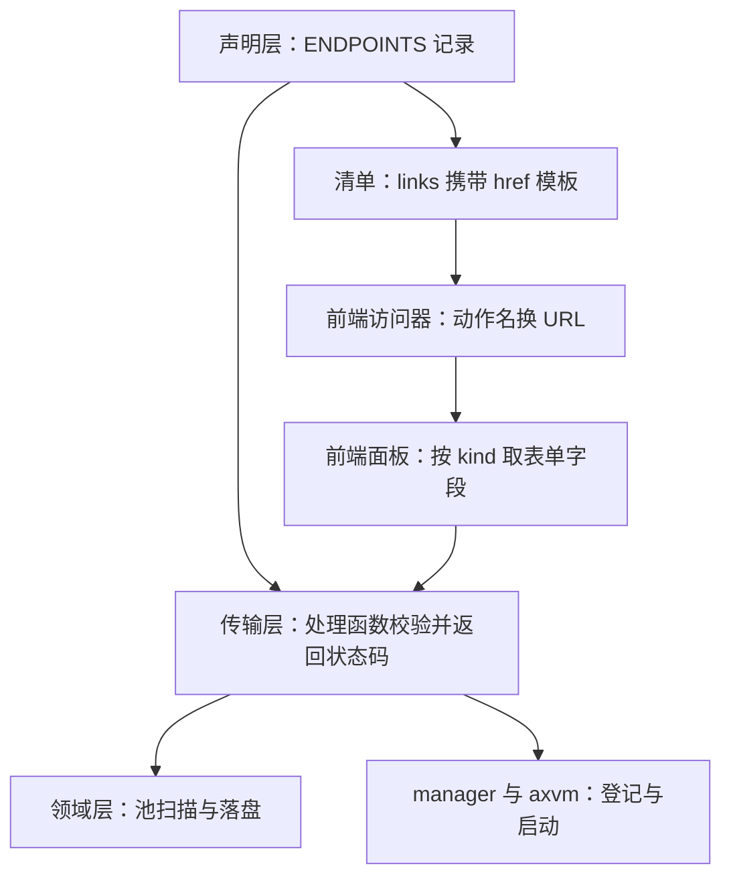

# Axvisor 控制面设计

## 问题与成功标准

Axvisor 的客户机管理目前只能通过物理串口上的管理 shell 完成。要在 QEMU 或板卡上创建一台客户机、投放一个磁盘映像、起停它并进入它的终端，操作者必须依次执行 shell 命令、手工核对文件是否就位、自行判断哪条终端通道可用。这些步骤没有可复用的界面，也无法被自动化用例以外的方式观察。

仓库里存在一份实验性的网页实现（`src/http/`），但它同时承担路由、鉴权、页面模板和客户机操作，页面的导航列表与后端的真实路由没有共同来源，曾出现过界面列出后端并不存在的路由的情况。它无法支撑继续增加接口：每加一个动作都要同时改三处，且没有任何机制能阻止三处不一致。

本设计要解决的问题是：把客户机登记表、配置池、生命周期动作和终端通道统一暴露成一组可被程序化调用的接口，并让网页界面成为这些接口的**消费方**而不是平行实现。完成后的可观察标准有三条。

1. 从浏览器可以完成「选择或上传内核与磁盘、创建客户机、启动、接入终端、投放文件、关闭」的完整流程，页面刷新后状态仍然正确。
2. 网页界面不持有任何请求路径字面量，动作与路径只有一个声明来源；新增或改名一个动作不需要改前端代码。
3. 全部接口可脱离浏览器复现：每一条浏览器发出的请求都能用命令行工具重放，且终端通道以外的能力都不依赖前端。

初始范围不包含：鉴权与多用户、跨主机访问的默认开启、物理宿主网卡上联、客户机内部的网络协议实现、终端会话的控制帧协议、客户机在线迁移，以及旧网页实现的能力补全。

## 现有代码与未采用的复用方案

历史实验实现（当时位于 `os/axvisor/src/http/browser_console/`）提供了浏览器终端的可用基础，它的问题在于把通道表、页面模板、静态资产与客户端操作放在同一组模块里。通道表与终端网关这部分能力予以保留并重构为运行期注册表；页面模板与静态资源服务被前端构建产物取代；鉴权模块整体删除，理由见安全边界一节。

`os/axvisor/src/control/network_console/` 的通道与前端行编辑逻辑继续复用，控制面只替换它的端点声明方式：从静态端点表改为运行期注册表，使通道按客户机登记动态分配。

参照工程 `webui_demo` 提供了本设计采用的界面架构约束：导航项全部来自后端声明、面板之间互不引用、共享逻辑只能下沉到纯函数库。**只采用这些约束，不复制其代码** —— 它与 Axvisor 的接口形态、构建方式和信任模型都不同，直接移植会把两套假设混在一起。

未采用的方案是在旧模块内增量扩展接口。旧模块的页面模板与路由表是两份独立的清单，任何一次新增都要人工维持它们一致；继续在它之上扩展，等于把「界面与真实能力不一致」的缺陷固化成结构。

## 选定架构

控制面按职责切成四层：声明层（`control/capability/`）、传输层（`control/transport/`）、领域层（`control/domain/`）和内嵌资源层（`control/web/`）。前端源码 `web-ui/` 位于内核之外，只在构建期产出被人被打包进二进制的静态资源。

### 能力声明与两个投影

所有路由在 `control/capability/table.rs` 的资源声明中登记一次，每个 `Resource` 持有自己的动作表。一条 `Endpoint` 记录携带动作名 `name`、能力分类 `verb`、HTTP 方法 `method`、路径模板 `path` 和构造处理函数的闭包 `build`。两个消费者从同一批记录派生：`router()` 生成 Axum 路由，`descriptor::panels()` 生成前端清单。

选择「一批记录、两个投影」而不是「一份清单加一份路由表」，是因为后者需要人工维持两份清单一致，而这两份清单的一致性恰恰是旧实现失效的地方。清单同时携带契约版本 `PROTO`，客户端读到不匹配的版本直接报错，不按当前字段猜测语义。

路由挂载时对「路径与方法」去重，因为通道资源声明的是同一路径模板的两个不同参数，重复挂载会让框架直接 panic。这一步属于必要处理而非防御。

### 状态权威的归属

控制面引入三类新状态，每一类都有唯一所有者。

客户机的存在与状态由内核登记表拥有。控制面新增的事件流是登记表的差量投影，不保存独立状态：它以 250 毫秒轮询登记表，比对前后快照产出增量事件，队列满时丢弃新事件。这个选择意味着事件流只承担「提示有变化」的职责，客户端在丢帧后重读登记表即可收敛。

可用的客户机配置由文件系统上的池目录拥有，而不是编译期内嵌的清单。控制面扫描编译期配置的目录来源并回落到默认根目录，把找到的候选、读不懂的文件和缺少依赖的条目一起返回。内核因此不再需要在启动时知道有哪些客户机。

上传进度由磁盘上的实际长度拥有。会话表只记录目标目录、总长度与状态，不记录已写字节数，续传时读取暂存文件的真实长度作为唯一依据。

### 端到端的动作路径

一次「创建并启动客户机」的改动会穿过全部四层，这条路径也是判断改动该落在哪一层的样板。下图说明各层在这一条动线上各自负责什么。



前端从清单得到「创建」这个动作的 URL，表单字段集来自另一个只读动作；提交后由传输层校验请求体形状，把表单字段序列化回配置文本并交给领域层落盘，最后调用编排入口登记客户机。前端在这条路径上不判断任何业务规则，它只呈现字段与禁用状态。

## 所有权与同步

通道是控制面里唯一需要跨请求协调的共享资源。通道编号固定：0 号是管理台自身，1 到 8 号给客户机，上限由 `MAX_GUEST_CONSOLES` 决定。通道在客户机登记时按最小空槽分配，在移除时释放；分配失败意味着并发终端已达上限，此时登记请求整体失败并返回 503，而不是退化成「没有终端也能用」。

传输会话保存在内存中的会话表里，由暂存目录作为其可恢复的落点。会话表的丢失是允许的状态：进程重启后对未知会话标识的续传请求返回 404，客户端据此重新开启一次传输，已写入的数据按磁盘长度继续有效。

事件轮询线程独立于请求处理，它持有上一次快照作为比对基准。空闲超过 5 秒后线程休眠，有订阅者时唤醒，并在第一帧只发全量快照 —— 此时保留的基准快照已经过期，用它算出的差量会误导客户端。

本改动同时调整了 `axvm` 生命周期状态机的一处所有权转移。失败的生命周期转换会把资源集留在状态里，而资源回收需要成对地取走资源与运行时。为避免在持有状态锁的情况下执行释放，`machine.rs` 增加了 `take_resources_for_destroy`，把资源所有权移出锁的作用域后再回收。这改变了两个可观测事实：`Destroying` 成为不可观测的内部瞬态，`Failed` 成为携带资源的终态。`lifecycle.md` 与 `lifecycle-internals.md` 已随此变更更新。

## 失败语义

控制面的错误映射集中在传输层，领域层以类型化错误向上报告，状态码由处理函数在返回处决定。选择状态码时有几条刻意的判断。

缺少引用文件返回 409 而不是 404，因为请求指向的资源存在、只是前置条件未满足；控制面在 VM 准备前用共享的文件谓词检查内核启动文件和 `virtio-blk` file backend，响应体同时列出缺失的具体路径，使客户端不必二次探索。更深层的 AxVM 设备构建错误仍按通用配置错误处理，不引入已删除的 backing-file 专用错误类型。存储空间不足使用 507 这一 WebDAV 语义码，以便客户端沿用既有的空间不足分支。

分片传输的失败被设计成可重试且不产生半成品。写入过程中的失败只影响当前分片，客户端重读偏移量后继续发送即可；放置阶段若目标文件名已存在则拒绝而不覆盖，因为那可能正是某台运行中的客户机正在使用的映像。同一会话标识换目录或换总长度时返回冲突并回报真实偏移量，防止一个会话被复用到另一台客户机。

终端通道的失败有一个协议层面的细节需要处理：连接被拒绝时浏览器只报告一次不带原因的无名关闭，客户端无法从事件本身区分「通道被占用」和「网络不可达」。因此前端的处理方式是关闭后重新读取通道表，若该通道的 `attached` 为真则丢弃并改连下一条空闲通道，不在原通道上重试。

生命周期动作的失败需要客户端区分两类原因：非法状态转移返回 409，资源耗尽返回 503。前端在动作提交后不推断终态，而是轮询登记表直到观察到预期状态或超时，超时显式报错。

## 迁移与兼容性

本改动删除旧的网页实现整层。删除范围是 `os/axvisor/src/http/` 下的全部文件，包括鉴权模块、页面模板、服务器装配、客户端操作模块，以及被内嵌的第三方终端资产（`xterm-6.0.0` 的脚本、样式与许可证文本）。

第三方资产的处置需要单独说明。旧实现把终端脚本与样式连同其许可证一起放进仓库并在旁边写明来源；新实现改为声明包依赖，由构建流程从包管理器取得。这让仓库不再保留该许可证文本，而产物目录又不纳入版本控制。**发布物中仍包含第三方代码，因此需要在终端依赖旁边恢复一份来源与许可证说明**，这一项在本文档之外单独处理。

对外行为有两处变更需要在提交说明中显式点出。`axvmconfig` 新增两个必填命令行参数，旧的命令行调用会直接失效；同时模板开始产出内存区配置，此前该字段为空。这两项不属控制面，但由同一个构建入口暴露，因此一并记录。

兼容性按「新增不破坏既有」处理。清单的动作集合与路径从声明读出，新增动作不需要改前端；契约版本保证字段语义变化可以被客户端识别；未知 `kind` 降级渲染而不报错，使后端可以先于前端增加面板。与之相对，未知 `verb` 不降级而是抛错，因为「本该存在的动作缺失」属于契约缺陷，发一个必然失败的请求只会掩盖问题。

## 安全边界

控制面按 local-host 信任模型设计：没有账号、没有令牌、没有多用户。这是明确的前提 —— 需要它服务的只有本机操作者，引入身份体系会带来与收益不相称的状态与配置。

鉴权模块整体删除后，准入由两道机制承担。绑定地址默认是回环地址，取自编译期环境变量，因此**不是运行期可以收回的开关**：某个构建配置一旦写入非回环地址，该二进制的客户机创建、销毁与文件写入能力就永久对外，且无法在启动后关闭。WebSocket 升级时校验请求来源与主机同源，但这一检查依赖浏览器发送来源字段，对命令行工具与脚本不构成拦阻。

因此跨主机暴露必须是一次显式决策，并同时满足：构建配置中留下说明性注释；评估该宿主网络的可达范围；接受来源校验不覆盖非浏览器客户端这一事实。测试用例中出现的非回环绑定（QEMU 端口转发所需）属于这一决策的具体实例，它只影响该用例构建出的镜像，且注释已说明原因。

## 备选方案

下表列出本设计在关键分叉上比较过的方案。每项结论都指向它未能满足的某条成功标准。

| 方案 | 结论 |
| --- | --- |
| 在旧 `src/http/` 模块内增量扩展接口 | 不采用：页面清单与路由表是两份独立事实，继续扩展会固化不一致。 |
| 保留鉴权并对所有 mutating 请求继续要求令牌 | 不采用：在 local-host 前提下没有身份概念可依赖，令牌只能变成构建期常量，安全强度不高于回环绑定，却增加一处必须同步的状态。 |
| 前端维护自己的路径常量清单 | 不采用：这正是旧实现失效的机制，动作与路径的一致性无法靠人工维持。 |
| 用编译期内嵌的客户机清单替代目录扫描 | 不采用：内嵌清单要求改配置即重新构建，且无法表达「同一目录下有哪些可用映像」。 |
| 每个动作一个大请求（例如一次上传即完成） | 不采用：中断后无法定位重启点，只能整体重传。 |
| 事件流直接推送全量状态 | 不采用：推送量与客户机数量成正比，且会让客户端把事件流当成权威状态。 |
| 让传输层只依赖领域层，生命周期动作也经领域层转发 | 未采用：控制面的领域层只覆盖新增概念，客户机生命周期属于 `axvm` 与编排入口的既有领域；多加一层转发不会带来第 2 个消费者所需的抽象。 |

这些结论中最容易被重新提出的是最后一条。只有当出现第二个数据面消费者（例如命令行入口或第二种协议也需要起停客户机）时，把生命周期动作下沉到领域层才具备收益：那时前置检查与错误映射会被复制第二份。当前只有一个消费者，转发层只会多出一层必须穿透的调用。

## 验证

验证按「接口契约、前端产物、自动化用例」三层组织。前两层可以在开发机上完成，第三层需要 QEMU 或板卡。

接口契约的静态检查由 `scripts/test/check_axvisor_control_layers.py` 承担，它拒绝声明层之外出现路径字面量、拒绝传输层与资源层引用声明层、拒绝领域层引用上层，并比对前端引导路径与内核侧常量是否成对一致。

宿主侧测试位于 `os/axvisor/tests/axtest.rs`，覆盖登记表投影、通道分配与释放、通道满载、事件差量与传输会话校验等不需要完整虚拟化环境的路径，可直接以宿主目标运行。

端到端验证使用仓库统一入口，逐用例运行：

```bash
cargo xtask axvisor test qemu --arch aarch64 --test-case http-control-plane
cargo xtask axvisor test qemu --arch aarch64 --test-case browser-console
cargo xtask axvisor test qemu --arch aarch64 --test-case web-ui
cargo xtask axvisor test qemu --arch aarch64 --test-case qemu-vm-pool
cargo xtask axvisor test qemu --arch aarch64 --test-case qemu-vm-pool-http
```

前端产物由独立的 web UI 步骤验证：`cd os/axvisor/web-ui && npm ci && npm test && npm run build`。内核构建不调用包管理器，因此这一步必须显式写进 CI，而不能依赖宿主预装或某个 QEMU 用例的副作用。

CI 采用的用例集合登记在 `.github/ci/checks/axvisor.toml`：aarch64 控制面检查运行 `http-control-plane`、`browser-console` 和 `qemu-ivc-arceos`，并在同一检查中执行 web UI 的 `npm test` 与 `npm run build`；`web-ui`、`qemu-vm-pool`、`qemu-vm-pool-http` 以及三客户机终端用例仍是手工诊断入口，未计入 CI 绿灯。

覆盖的缺口需要如实记录：文件传输的存储不足与完整分片上限仍没有在仓库用例资产中断言；当前已覆盖范围不可表示和声明总长超限，以及 400、404、409、200 与 204 这些路径。另外，`axvmconfig` 新增的必填参数改变了命令行行为，未在本文档的验证范围内提供独立用例。

## 回滚与剩余风险

回滚不需要数据迁移。本改动不引入持久格式变更，可回滚的内容是新增的源码与文档；旧网页实现的整层删除在同一提交内，按提交整体回滚即可恢复。前端产物不纳入版本控制，回滚后重新构建会按旧版本重新生成。唯一需要在回滚时注意的是 `axvm` 生命周期状态机的语义变更：它带有文档与测试的一致性要求，若只回滚控制面而不回滚它，`lifecycle*.md` 会描述一个不存在的状态机。

剩余风险按可独立审查的方式列出，供领域审查人判断。

首个风险是鉴权移除与编译期绑定地址的组合，它们的交互决定了最坏情况下的暴露面。缓解方式是把它写成构建配置的显式决策并保留注释，可能的收紧方向是要求非回环绑定时必须同时提供共享密钥，或直接取消该环境变量。

第二个风险是「就位」判定在前端与服务端是两套实现：服务端使用池的缺失映像谓词，前端通过列目录判断。两侧条件的一致性靠行为维持，任一侧改动都不会让另一侧报错，只会静默放过或误拦。端到端用例可以覆盖常见路径，但覆盖本身不会让两侧条件自动一致。

第三个风险是传输分片的读校验与写盘不在同一临界区，同一会话的并发分片存在重复写窗口。当前客户端按串行发送，因此不会自行触发，但接口没有把这个约束表达出来。

其余待决事项包括：`axstd` 惰性初始化表的并发修复与本改动无直接依赖，它的影响面涉及多线程与 libc 兼容路径，是否拆分独立提交需要作者判断；终端通道不自动重连而事件流使用指数退避，两处可靠性策略不一致，属已知差异；清单中的方法字段目前没有前端消费者。
