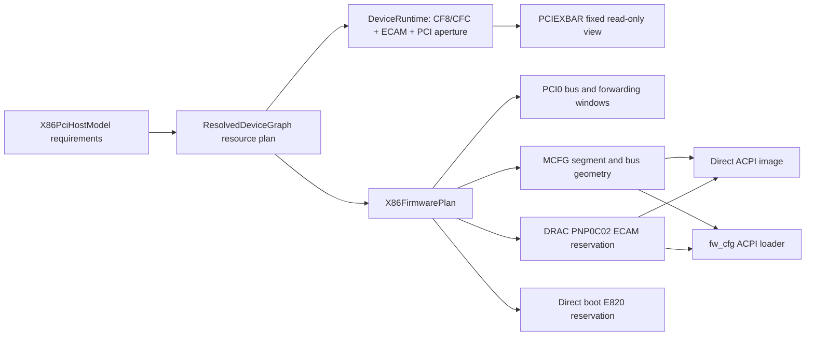

# Axvisor x86 Q35 ECAM

## 1. 问题与范围

基线3531e72e734ada002ee20520f7467e58e5ea69e9。Axvisor x86 Q35 当前只提供 CF8/CFC 配置机制 #1，客户机固件无法通过标准 PCI Express 配置空间访问扩展配置寄存器。该设计为现有 Q35 PCI 根增加固定 256 MiB ECAM，并让运行时设备图、PCIEXBAR、ACPI MCFG、根资源保留和 Linux 直接启动内存图描述同一地址范围。

成功标准是 Linux 能通过 MCFG 发现 Q35 的 segment 0、bus 00–ff，`/proc/iomem` 中出现对应的 PCI MMCONFIG 资源，且既有 ECAM PCI 枚举用例仍能发现完整 endpoint，并能从 Q35 host bridge 的 sysfs 配置文件读取 offset `0x100`。`PciEcamConfigFrontend` 将 function-relative offset `0x000` 到 `0xfff` 映射到共享配置镜像；未建模的扩展寄存器默认读零且只读，平台可显式声明字节值和写掩码。传统 capability 布局仍限于前 256 B，CF8/CFC configuration mechanism #1 仍只访问传统配置空间。此改动不增加 PCI host 公共接口、不改变设备 BDF/BAR/INTx 分配、不实现动态 ECAM 重定位或 PCIe extended capability 语义。

## 2. 资源所有权与数据流

`X86PciHostModel` 是 x86 Q35 ECAM 基址、大小和资源 slot 的唯一所有者。解析后的 `ResolvedDeviceGraph` 先分配并固定 MMIO 资源，再由 PCI host build 使用同一个 `PciRootBinding` 装配 ECAM、CF8/CFC 和 PCI BAR aperture。ACPI 只消费同一图产生的 resolved contribution 与 PCI topology，不维护第二套 endpoint 或内存窗口清单。

`PciEcamConfigFrontend::selection()` 从 ECAM MMIO offset 解码 BDF 和 12-bit function-relative config offset，再经 `PciRootBinding` 分派到 `PciRootState`。`ConfigOffset` 接受 `[0, 0x1000)`；`FunctionState` 与 `PowerOnConfig` 为每个 function 保留完整 4 KiB 镜像及写掩码，未配置的扩展空间由零初始化。`CONVENTIONAL_CONFIG_SPACE_SIZE` 单独约束 capability placement，因此扩展空间可被访问但不会被误当作传统 capability 列表。x86 host 只提供该通用前端，不按 BDF 在架构 exit 路径中分派。`X86PciEcamPlan` 保存从 ACPI graph contribution 解析出的 base、size、segment 与 bus 范围，供 PCI0、MCFG、ECAM reservation 和 E820 共同消费。

上图表达同一 resolved resource 被运行时设备和两条固件生成路径共同消费。PCIEXBAR 的只读值描述这个固定运行时窗口；MCFG 与 PCI0 bus range 描述固件发现；DRAC 与 E820 则防止操作系统把同一区间重新分配。

## 3. 地址布局与配置寄存器

Q35 ECAM 固定为 `0xb000_0000..0xc000_0000`，PCI BAR aperture 仍为 `0xc000_0000..0xd000_0000`。256 MiB ECAM 包含 256 个 1 MiB bus window；x86 自动 MMIO 池在 ECAM 基址处结束，因而自动分配不能落入 ECAM。若 ECAM 与 guest RAM 或其他已分配 MMIO 冲突，VM 规划阶段失败，不允许静默重叠。

PCI host 的 PCIEXBAR 位于 config offset `0x60..0x67`。该设备图始终映射固定 ECAM，因而根桥只读回 `0x0000_0000_b000_0001`；写入不改变映射。QEMU 9.2 的 `MCH_HOST_BRIDGE_PCIEXBAR_DEFAULT` 是 `0xb0000000`，其 enable 位清零，QEMU 通过该位控制映射。本模拟器采用固定、始终启用的策略，故该寄存器读回与 QEMU reset readback 有意不同；迁移到动态 PCIEXBAR 前必须同时设计运行时 MMIO 重定位、资源冲突处理和 firmware table 更新。

## 4. 固件描述与启动方式

`X86FirmwarePlan::from_graph` 要求 host contribution 恰含 CF8/CFC PIO、ECAM MMIO 和 PCI aperture MMIO。ECAM 必须非零、1 MiB 对齐、由 1 至 256 个完整 bus window 构成且不溢出；所有已分配 PCI function 的 segment 与 bus 必须落入计划覆盖范围。Q35 当前是 segment 0、起始 bus 0，MCFG base 始终指 bus 0。

DSDT 的 `PCI0._CRS` 描述 bus range、CF8/CFC 和 PCI forwarding windows，但不重复声明 ECAM。根命名空间下的 `DRAC`（HID `PNP0C02`）通过 `_CRS` 声明不可缓存 ECAM 区间；Linux PCI/ACPI 文档说明 MCFG 本身不是资源保留机制，x86 旧式 host bridge 驱动也不能安全地把 ECAM 当普通 PCI forwarding window 放进 PCI0 `_CRS`。PCI0 继续使用既有 `PNP0A03` 身份。

`X86FirmwarePlan` 的 direct ACPI image 与 fw_cfg ACPI loader 复用同一 `build_mcfg()`。两者都将 MCFG 加入 XSDT、计算校验和并发布同一 base/segment/bus range。直接 Linux boot params 还将 ECAM 加为 E820 reserved range；其他启动流程依赖 ACPI `PNP0C02` 资源声明。Linux v6.12 x86 ACPI PCI 初始化代码从 MCFG 建立 segment/bus 范围映射。

## 5. 替代方案与兼容性

继续只用 CF8/CFC 无法为需要 extended config space 的 PCIe 客户机提供完整发现能力；只映射 ECAM 而不发布 MCFG 又没有标准的静态发现入口。仅增加 MCFG 也不足以保留区域，因为旧操作系统可能忽略该表。把 ECAM 加进 PCI0 `_CRS` 会让 x86 PCI root 把它当成可转发窗口，且不能替代通用 motherboard resource 声明；因此本设计选择 MCFG 加根级 PNP0C02，并对直接启动额外保留 E820。

地址对 Linux 客户机可见，添加完整 4 KiB ECAM 镜像不改变现有 CF8/CFC 行为或 endpoint 的传统 PCI ABI；CF8/CFC 仍由 8-bit configuration mechanism #1 offset 解码，不会别名到扩展空间。当前平台未声明的扩展寄存器按零值只读处理，不代表已实现 PCIe capability 或其副作用。回滚只需撤销 host resource/runtime、PCIEXBAR、ACPI MCFG/PNP0C02 与 E820 变更；无磁盘或持久状态迁移。ECAM 热路径新增的工作仅为一次运行时设备区间查找和已有 PCI config dispatch，不增加 endpoint 枚举状态。

## 6. 验证与审查门槛

`axdevice` 的 root 与 frontend 单元测试覆盖 offset `0x100`、可写的扩展配置字节 `0x104`、镜像末尾 `0xffc` 和 function 边界 `0x1000`，并确认写掩码与 absent BDF 语义保持一致；capability 测试继续验证传统 capability 不越过 `0xff`。`pci_config` provider 单元测试验证 fixed resource、PCIEXBAR 只读语义以及 runtime 实际 ECAM 读写；ACPI 单元测试验证直接镜像 XSDT/MCFG 指针、geometry 与 checksum，fw_cfg 测试验证 loader pointer/checksum 命令和 MCFG 内容。Axbuild BusyBox 的 PCI 枚举检查要求 MCFG 可读、`/proc/iomem` 包含 `b0000000-bfffffff : PCI MMCONFIG 0000 [bus 00-ff]`，并通过 `/sys/bus/pci/devices/0000:00:00.0/config` 读取 offset `0x100` 的零值，以证明来宾访问没有在传统空间边界被截断。既有 `pci-enumeration-vmx` CI 继续证明客户机端到端枚举和扩展空间读取。

合入前必须确认 PCIEXBAR 的固定启用/只读策略与 QEMU reset 差异、PNP0C02 resource descriptor 的 Linux/OVMF 解释，以及 direct/OVMF 两条启动路径。必要证据由 VMX 与 SVM PCI 枚举 CI 及 OVMF ACPI CI 提供。

外部语义核对固定为 QEMU 9.2 的 [Q35 PCIEXBAR 定义](https://raw.githubusercontent.com/qemu/qemu/v9.2.0/include/hw/pci-host/q35.h) 和 [Q35 ECAM 更新逻辑](https://raw.githubusercontent.com/qemu/qemu/v9.2.0/hw/pci-host/q35.c)，Linux 6.12 的 [x86 ACPI PCI 初始化](https://github.com/torvalds/linux/blob/v6.12/arch/x86/pci/acpi.c)，以及 Linux 文档的 [PCI host bridge ACPI 资源规则](https://docs.kernel.org/PCI/acpi-info.html)。后者引用 PCI Firmware 3.2 §4.1.2 与 PCI Express 4.0 §7.2.2，指出非热插拔段由 MCFG 描述，MMCFG 还须通过 motherboard resource 保留，并且该资源不应重复放入根 PCI bus `_CRS`。
