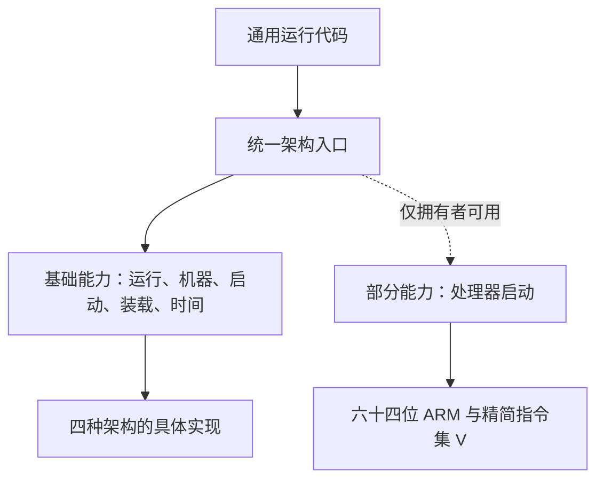

# AxVM 分层能力接口设计

状态：一期实现基线

本文是 AxVM 架构适配边界的权威设计说明。它回答三个问题：通用代码应该依赖什么，架构差异应该放在哪里，以及新增能力时什么时候值得抽象。

## 先记住四句话

> 能力的有无由“谁实现了接口”表达，不由散落的条件编译表达。
> 公共行为放在默认方法中，不在多个架构里复制。
> 每一层只收留这一层全体成员都具备的动作。
> 只有一个真实实现时先保留具体代码，等第二个消费者出现再抽象。

这四句话的目的不是减少代码行数，而是让错误出现在正确的位置：没有某项能力的架构一旦误用，编译器应立即拒绝；通用代码不应通过架构名称猜测行为；相同语义应只有一个实现来源。

## 从“共同动作”开始理解

AxVM 每次构建只选择一种目标架构。无论选中哪一种，虚拟机都必须完成下列事情：

- 建立并运行虚拟处理器；
- 准备机器级资源与处理器放置方案；
- 决定客户机从哪里开始执行；
- 把镜像写入客户机内存，并保证处理器随后能够看见写入结果；
- 读取宿主时间；
- 进入和退出该架构的运行期。

这些动作是“四种架构都有”的最大公约数，因此统一到一个顶层入口。通用运行代码只认识这个入口，不需要知道当前是六十四位 ARM、精简指令集 V、六十四位 x86 还是龙芯。

顶层入口并不把所有方法重新声明一遍，而是组合已经按职责拆开的基础接口。源码名称只在下表映射一次，后文使用中文概念名称。

| 中文概念 | 源码标识 | 职责 |
| --- | --- | --- |
| 统一架构入口 | `Architecture` | 通用运行代码面对的唯一架构表面 |
| 基础运行能力 | `ArchOps` | 虚拟处理器运行、退出分派、运行期进入与退出 |
| 机器能力 | `MachinePlatform` | 地址空间、设备图和处理器放置方案 |
| 客户机启动能力 | `GuestBootPlatform` | 启动处理器状态与固件交接 |
| 镜像装载能力 | `BootImagePlatform` | 镜像装载策略和写后可见性 |
| 宿主时间能力 | `HostTimePlatform` | 宿主时钟来源 |
| 处理器启动能力 | `CpuUpOps` | 启动已经存在但尚未运行的其他处理器 |

```rust
trait Architecture:
    ArchOps
    + MachinePlatform
    + GuestBootPlatform
    + BootImagePlatform
    + HostTimePlatform
{
}
```

这是静态组合：目标架构在构建时已经确定，不增加运行期查表、动态分发或额外对象。

## 对外只有虚拟机能力，架构选择完全私有

AxVM 的使用者关心的是创建虚拟机、准备启动内容、注册设备、运行虚拟处理器和管理生命周期，不应负责判断当前宿主属于哪种架构。因此，架构目录及其“当前目标”命名空间都属于内部装配细节，不从软件包根导出。

内部结构分成两步：

1. 架构目录根只声明四个目标模块，并用四处不可避免的条件编译决定哪个模块进入构建；
2. “当前目标”命名空间集中提供选中实现的类型别名和内部转发，其他内部模块必须显式经过这个命名空间，不能再把架构符号摊平到架构目录根。

对外入口按领域命名，例如虚拟机、启动准备、设备、生命周期和宿主服务。即使某个宿主服务目前只有一种架构需要做额外工作，调用者看到的仍是“准备块设备直通”一类领域动作，而不是“调用某架构函数”。不需要额外工作的目标在同一入口内完成空操作。

允许对外出现的架构信息必须是普通数据，而不是平台代码入口。例如，离线工具可以用一个封闭枚举查询不同客户机机器模板；这个枚举在所有构建目标上形状相同，不会让调用者依赖当前目标模块。

## “部分架构具备”不能伪装成共同动作

处理器启动是最典型的部分能力。六十四位 ARM 和精简指令集 V 需要由 AxVM 响应客户机的处理器启动请求；六十四位 x86 和龙芯当前没有这条通用调用路径。

因此，处理器启动能力独立于顶层共同能力：

- 有能力的架构显式实现；
- 没有能力的架构不提供空实现；
- 消费者只有在类型已经承诺拥有该能力时才能调用；
- 如果把调用错误地带到不具备该能力的架构，编译直接失败。

空方法和始终返回“不支持”都不能达到这个效果。它们会让调用在编译期看似合法，把架构边界错误拖到运行期，甚至静默忽略本应处理的请求。

## 条件编译与能力表达不是一回事

条件编译回答的是“这段代码在哪个构建目标中出现”。能力接口回答的是“哪个类型承诺能够完成这件事”。两者各有明确用途。

### 必须保留的条件编译

- 在架构目录根挑选四个目标模块中的一个；
- 选择只存在于某一目标的寄存器、页表和虚拟处理器后端；
- 选择依赖项、构建功能或测试替身；
- 隔离只有特定硬件指令集才能通过编译的具体实现。

这些条件都描述构建产物的物理组成，保留是正确的。

### 进入通用代码就属于边界泄漏的条件编译

- 通用虚拟处理器循环按架构名称决定要不要保存通知快照；
- 通用设备访问函数因为某个架构的后续动作而携带架构类型；
- 为一个可命名能力的每个方法分别写一遍目标判断；
- 用目标判断隐藏误用，使缺少能力的架构得到空行为。

这些写法把“谁拥有能力”的知识复制到消费者中。新增架构时，每个判断点都可能漏改。正确做法是把共同机制保留在通用层，把差异放进能力实现或架构自己的退出路径。

## 默认行为、具体覆盖与不抽象

### 默认行为来自真实重复

当两个或更多架构已经具有相同语义时，公共部分才能上提为默认方法。默认方法不是对未来的猜测，而是对现有重复的归纳。

本期有两个代表：

- 最后一个虚拟处理器退出时，默认执行统一的架构运行期退出动作；
- 处理器启动流程中相同的状态检查、错误转换和唤醒步骤由公共默认行为完成。

这样，相同行为只有一个实现来源，后续修复不需要同步修改多个架构。

### 具体覆盖必须说明真实差异

六十四位 x86 在最后一个虚拟处理器退出后，还需要清理额外的中断转发状态，因此它先执行共同退出动作，再完成自己的清理。覆盖的理由来自硬件与状态所有权差异，不是为了保持旧文件形状。

六十四位 ARM 对等待策略有特殊要求，但“检查之后、真正休眠之前又发生通知”这一竞态并非 ARM 独有。通用运行期统一保存通知代数，ARM 只覆盖怎样等待。这样竞态保护留在所有架构可复用的机制层，架构实现只描述策略差异。

### 单一实现保持具体代码

龙芯当前有两项只有自己使用的动作：

- 设备写入完成后排出平台中断事件；
- 向宿主注册平台中断注入器。

它们分别留在龙芯退出处理路径和“当前目标”命名空间。龙芯客户机中断路由也由 AxVM 在虚拟机注册和注销时自动挂接与拆除，外部编排层不再调用龙芯专用函数。现在提取公共能力接口只会制造一个实现者和一个消费者，并迫使通用设备写入函数携带无关的架构知识。未来出现第二个真实实现，并且语义确实相同后，再提取新的能力接口。

## AxVM 的四层对应关系



### 架构层

架构层负责硬件语义和架构生命周期。处理器放置属于机器能力；客户机内存写后的缓存可见性属于镜像装载能力；进入、退出架构运行期属于所有架构都参与的生命周期动作。它们不再混放在一个过大的基础接口中。

### 运行期

通用虚拟处理器循环只依赖统一入口。通知代数快照、丢失唤醒保护、最后退出的共同动作都在通用机制中完成。某架构需要不同等待方式或额外退出清理时，只覆盖相应策略点。

### 设备层

设备体系已经按消费者需要拆成窄能力：设备访问、普通轮询、带客户机内存的轮询、中断控制、生命周期、授权后的时间与唤醒服务等。设备实现只取得自己申请并获准使用的能力，不直接取得整个虚拟机对象。

这里不进行机械拆分，原因是：

- 同一个设备模型需要先声明资源需求，再用同一份已解析计划完成构建；拆成互不关联的对象会削弱二者的一致性；
- 生命周期、轮询和中断控制已经是可选能力，缺席本身有清楚含义；
- 设备运行时保存的是路由索引与能力句柄，不应复制具体中断控制器的内部状态；
- 为每个字段都建立接口会隐藏设备注册顺序和资源所有权，反而更难审计。

### 资源层

资源需求、申请方式、节点种类和解析后资源是封闭的状态集合。它们回答的是“当前处于规划的哪一步”“谁拥有哪一段地址或中断号”，不是“某个类型能做什么”。因此继续使用类型化枚举和拥有所有权的数据结构，不改造成能力接口。

设备主线保持不变：

```text
设备图解析 → 一次性资源申请 → 原子注册 → 封存运行期
```

任何一步失败，都按既有事务边界回滚；本设计不改变配置格式、资源分配结果、固件内容和虚拟机生命周期顺序。

## 类型化启动策略

旧的内部判断用一个真假值表达“是否为六十四位 x86 的直启客户机内核镜像”。真假值只告诉调用者走哪条分支，却没有说清策略的含义。

一期把它改为两种明确策略：

- 保留镜像中已经配置好的入口和启动约定；
- 按通用启动协议调整镜像。

旧的真假值查询已经移除。对外只保留类型化启动策略和“准备客户机启动内容”的架构无关流程。后续新增启动方式时，可以增加有名字的策略，而不需要继续叠加互相依赖的真假参数。

## 测试放置与运行边界

测试方式由“被测行为依赖什么”决定，不由源码原本属于哪个架构目录决定。

- 纯计算、解析、状态机、资源规划和并发顺序只依赖标准运行环境，使用普通单元测试；单元测试放在对应源码末尾。
- 需要跨公开入口验证多个模块协作的普通测试放在软件包的 `tests/` 目录。
- 只有必须执行目标专有指令、真实中断、每处理器状态或完整宿主运行期的行为，才进入内核测试或虚拟开发板测试。
- 不用路径属性把另一个架构的生产源码复制进宿主测试，也不用读取源码文本并搜索关键字来证明边界。前者绕过真实模块关系，后者只能检查拼写，不能检查类型和行为。

因此，共享寄存器映射与每处理器中断事务中的纯状态逻辑已经移到宿主能力目录，在任意开发主机上直接运行普通测试；真实虚拟处理器、中断控制器和硬件退出路径继续由 Axvisor 的虚拟开发板冒烟测试覆盖。本期没有为了形式完整而新增空的内核测试目标。

## 新增内容时如何判断放置层次

### 新增架构

1. 先实现所有架构都必须具备的五组基础能力。
2. 显式声明实现统一入口，让编译器检查共同契约是否完整。
3. 只实现该架构真实拥有的部分能力；不要为空缺能力补空方法。
4. 复用默认行为。只有硬件语义或状态所有权不同才覆盖，并在注释中写明原因。
5. 架构私有动作先放在具体架构模块；不要为了目录对称提前抽象。

### 新增能力

依次回答：

1. 四种架构是否都有？都有则进入已有基础能力，或在职责确实独立时形成新的共同基础能力。
2. 是否只有部分架构有，而且能用领域名称准确描述？是则建立部分能力接口。
3. 是否已有两个真实实现或消费者？没有则保持具体代码。
4. 多个实现中是否存在相同语义？有则提取默认行为；不同处继续覆盖。
5. 消费者是否只依赖完成任务所需的最小能力？若仍需知道架构名称，说明边界尚未收敛。

### 新增虚拟设备

1. 设备模型声明命名资源需求、固件信息和构建方法。
2. 资源规划器一次性分配并生成解析后资源；设备不能自行猜测地址或中断号。
3. 设备构建只能消费计划签发的资源和授权能力。
4. 只有设备真实支持轮询、生命周期或中断控制时，才注册相应可选能力。
5. 新设备不应推动架构基础接口增长；架构只负责平台设备、资源池与退出入口的连接。

## 评审速查表

| 看到的现象 | 应采取的做法 |
| --- | --- |
| 所有架构都有同一动作 | 放入职责相符的共同基础能力 |
| 只有部分架构具备可命名能力 | 建立部分能力接口，由实现列表表达有无 |
| 两处以上具有相同语义 | 提取默认行为 |
| 某架构语义或所有权不同 | 覆盖并说明原因 |
| 只有一个实现和一个消费者 | 留在具体架构路径 |
| 通用代码出现架构名称判断 | 检查是否发生边界泄漏 |
| 数据表示规划状态与所有权 | 使用封闭数据类型，不改造成能力接口 |
| 需要选择目标专有寄存器或后端 | 保留在目标选择边界的条件编译 |

## 一期边界

一期是行为保持型重构，只收敛架构知识的位置。它不引入运行期架构选择，不增加动态分发或新依赖，不重写设备图、资源规划、注册事务、固件生成和虚拟机生命周期顺序。龙芯中断路由的挂接与拆除仍发生在原有注册、注销阶段，只是所有权回到 AxVM 内部。验收标准是：外部接口不出现当前目标模块，内部调用显式经过“当前目标”命名空间，通用代码只面对统一入口，部分能力的误用能被编译器阻止，公共行为只有一个来源，单一实现不污染通用层。
