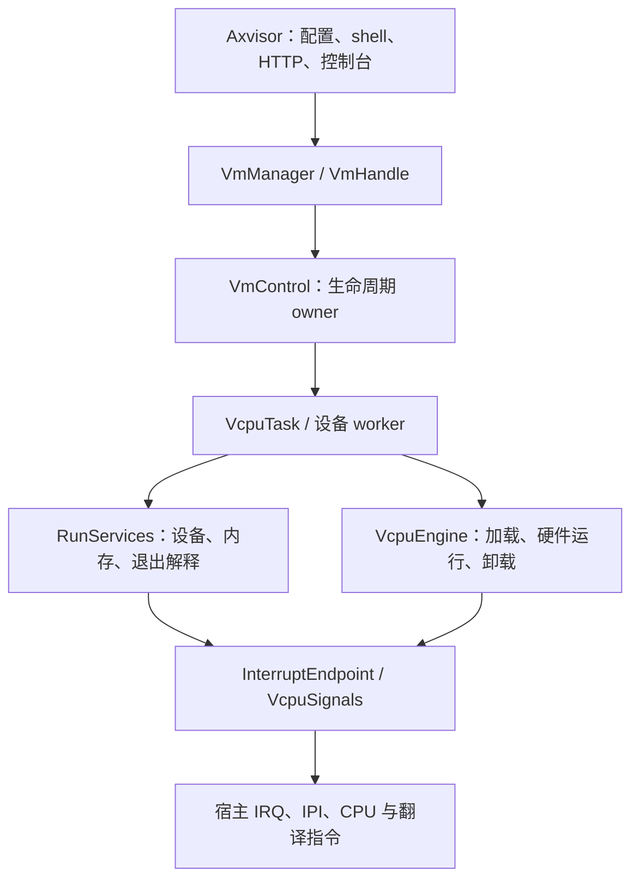

# AxVM 所有权与锁边界

本文记录由 `5284316aeaac` 方案迁移到最新 `dev` 基线 `b0d6736a5eba` 实施的公共契约。该重构允许破坏 Rust 源码接口，保留 TOML、设备资源规划和 guest ABI。实现期间以本文件中的后置条件验收，构建通过不代表生命周期或硬件协议已经得到运行证明。

## 1. 架构与所有权

`VmManager` 拥有注册表和跨 VM 通道。每个 VM 的控制任务由 `control::Owner` 实现，独占生命周期、资源转换和当前操作。每个 `VcpuTask` 独占可变硬件后端；设备只取得一个运行期的窄端口。

### 1.1 执行上下文



管理、设备和资源转换位于可睡眠任务上下文。底层只持有预绑定身份、信号、翻译根和控制器短状态。底层对象不能保存完整 `VmHandle`、设备服务集合或需要睡眠锁查询的生命周期对象。CPU-local 当前上下文只发布执行身份和 signal target。

### 1.2 锁语义

| 名称 | 获取与持有的语义 |
| --- | --- |
| `Mutex` | 可睡眠互斥；poison 和 PI 等差异由来源模块说明 |
| `RwSemaphore` | 可睡眠读写同步 |
| `RtSpinLock` / `RtSpinRwLock` | 竞争可睡眠，成功取得后保持任务迁移约束 |
| `RawSpinLock` / `RawSpinRwLock` | 获取与持有期间不可睡眠；IRQ 策略由获取方法表达 |
| `LocalLock` | 当前 CPU 的本地状态保护 |

普通 raw 获取禁抢占，`*_irqsave` 同时保存 IRQ 状态；显式 raw 获取承担其上下文契约。RT 锁没有不改变 IRQ 状态的 `*_irqsave` 兼容拼写。无数据后端使用 `MutexBackend`、`RwSemaphoreBackend`、`RawSpinLockIrqSaveBackend`；外部 `lock_api` trait 保持原契约。所有同义 mutex 别名删除。

raw guard 只修改它拥有的短状态。唤醒、IPI、设备回调、join 和可能阻塞的析构在 guard 外执行。注册表和 mailbox 锁外执行 VM 操作。等待队列谓词只读取本 vCPU 的 request、pending 和准入状态。

## 2. 管理与完成协议

`VmKey` 包含 VM ID 和实例代次；`RunId` 包含实例和运行代次；`OperationId` 在实例内唯一；`VcpuInstance` 另有激活代次。递增使用受检运算。旧端口和旧确认只能指向原对象。实例代次由受检的宿主原子计数分配，注册表仍由每个 manager 自己持有；多个 manager 不会产生相同 `VmKey`。宿主虚拟化初始化由 `OnceLock` 只执行一次，失败结果保留，不能让并发构造重复初始化 pCPU。

### 2.1 公共入口

`VmCreatePlan` 消费配置、`PreparedGuestBoot` 和共享 `BootImageProvider`。`VmManager::create` 在同一注册表事务中预约 ID，owner 完成资源和镜像装载后发布 `Ready` 句柄。`get` 与 `list` 返回 `VmHandle`，调用方不能穿透生命周期或后端。

`VmHandle` 提供 `start`、`pause`、`resume`、`stop(reason)`、`reset` 和 `destroy`，返回 `VmOperation<T>`。`accepted().await` 表示 owner 已校验并开始操作；`wait()` 或操作本身的 `.await` 表示后置条件成立。丢弃观察者不取消 owner 负责的操作，句柄析构不执行阻塞销毁。

mailbox 与完成状态使用睡眠 mutex。Future 的检查和 Waker 注册在同一边界完成，通知在锁外执行。同步等待释放 mutex 后阻塞。owner 退出的完成观察使用宿主退出/join 状态，owner 不 join 自己。

### 2.2 生命周期后置条件

| 操作 | 成功后的条件 |
| --- | --- |
| create | 资源、设备、启动内容和控制任务就绪，状态 `Ready` |
| start | 必需 vCPU 初始化完成，设备、路由和唤醒有效，运行准入打开 |
| pause | 所有参与 vCPU 已卸载并 park，设备后台执行和 DMA 静默，状态 `Paused` |
| resume | 设备恢复，保留 work/pending 可消费，准入打开且 owner 已唤醒 |
| stop | vCPU、worker、timer 和 IRQ 路由静默，任务完成回收，状态 `Stopped` |
| reset | 旧运行期停止并回收，新运行期启动，返回新 `RunId` |
| destroy | 资源释放、精确实例注销，控制任务退出得到确认 |

start/resume 不强制执行第一条 guest 指令；实际执行进展另行观察。聚合 entry/park 计数用于诊断，不能代替逐参与者确认。 owner 在同一快照发布事务中固定生命周期、退休计数和参与者的 `VcpuProgress` 观察集合；`VmHandle::snapshot` 在锁外采样其中的原子计数，使持续进入可见。观察对象不保留后端或任务，新运行发布替换整组观察，旧查询不会混入新运行的计数。

普通操作按接收顺序串行；等待确认期间继续消费事件和 guest 请求。重复 stop 合并完成观察；已达到 pause/resume/stop/destroy 目标时幂等返回。部分失败逆序补偿，补偿失败关闭入口并保留资源进入 `Failed`。观察者超时不证明资源可以释放。清理失败保留注册项和所有权，允许重试 destroy。

### 2.3 接口形状

管理调用只提交拥有参数的操作，完成观察不取得 owner 的内部对象。`VmSnapshot` 保留 `run`、`current_operation`、`last_failure`、`last_stop_reason` 及设备、内存和逐 vCPU 观察值。公共入口位于 `manager`、`operation` 与 `identity`，由 crate 根重导。

```rust
impl VmManager {
    pub fn new() -> AxVmResult<Self>;
    pub fn create(&self, plan: VmCreatePlan) -> AxVmResult<VmOperation<VmHandle>>;
    pub fn get(&self, id: VMId) -> Option<VmHandle>;
    pub fn list(&self) -> Vec<VmHandle>;
    pub fn shutdown(&self) -> AxVmResult<()>;
}
impl VmHandle {
    pub fn key(&self) -> VmKey;
    pub fn snapshot(&self) -> VmSnapshot;
    pub fn start(&self) -> AxVmResult<VmOperation<RunId>>;
    pub fn pause(&self) -> AxVmResult<VmOperation<()>>;
    pub fn resume(&self) -> AxVmResult<VmOperation<()>>;
    pub fn stop(&self, reason: StopReason) -> AxVmResult<VmOperation<()>>;
    pub fn reset(&self) -> AxVmResult<VmOperation<RunId>>;
    pub fn destroy(&self) -> AxVmResult<VmOperation<()>>;
    pub fn join_control_task(&self) -> AxVmResult<()>;
}
impl<T> VmOperation<T> {
    pub fn id(&self) -> OperationId;
    pub fn accepted(&self) -> impl Future<Output = AxVmResult<()>> + '_;
    pub fn wait(self) -> AxVmResult<T>;
}
impl<T> Future for VmOperation<T> {
    type Output = AxVmResult<T>;
}
```

`destroy` 的完成由宿主普通任务退出回调确认，回调不能 join 自己；同步调用方可再通过 `join_control_task` 回收管理句柄，`shutdown` 统一执行这一步。并发 join 共享一次结果，失败保留原句柄，后续调用可重试。取消但尚未完成回收的 staged vCPU 同样保留后端 transfer 和任务句柄，禁止提前释放运行资源。

## 3. 硬件与运行服务

硬件进入和设备处理通过拥有所有权的 `Entry`、`Exit` 与 `Completion` 分离。通用编排只有一个实现，机器指令、CPU-local 同步和退出记录保留架构差异。

### 3.1 进入与退出

```text
任务侧准备 → bind/pin → 提交 Completion → 消费 pending
→ IRQ-off → 发布 IN_GUEST → 成对屏障与请求/准入复查
→ 硬件进入/退出 → 捕获退出与必要本地 IRQ 同步
→ 卸载并恢复 CPU/IRQ 上下文 → 解释退出与调用设备
```

`VcpuEngine::run_once(&mut self, entry, completion, signals)` 返回拥有所有权的退出记录或 `Interrupted`。返回任务层时必须已卸载后端并恢复上下文。不能恢复硬件绑定的错误使用既有致命终止约定。MMIO/PIO、推进指令和寄存器写入形成下一次进入提交的 `Completion`。

AArch64 的 `prepare_vcpu` 在 pin 前取消旧等待；迁移到其他 pCPU 时，先在任务上下文完成旧 CPU 的宿主定时器激活。相同 pCPU 保留 active claim，直到客户机撤销该电平，避免到期 CNTV 重复触发宿主退出。pin 后通过 `entry_cpu_is_ready` 再核对归属；准备与 pin 之间发生迁移时，提交已有 Completion 和 pending 后取消本次进入，返回任务层重试远端交接。绑定内只发布 canonical 电平或执行本 CPU ACK/DIR。GIC native 错误携带静态操作与类型化数值，不在 IRQ-off 路径格式化。GICv2 active stack 与退休批次使用固定容量；有限控制器表在构造时准备存储，动态 MSI 表在任务层分配替换缓冲区后短暂交换，raw guard 内不分配或释放节点。

RISC-V 的 SBI ecall 捕获拥有值的 `RiscvSbiCall`，卸载后执行控制台或固件调用。DBCn 使用固定 512 字节缓冲区和规范允许的部分传输，访问租约先校验完整地址范围再调用固件。retentive HSM suspend 先退休 ecall 并准备成功返回值，再等待本 vCPU 信号；没有实现的 non-retentive 状态返回明确不支持。普通 WFI/HLT 不覆盖客户机返回寄存器。

CPU_ON 的拓扑解析和预约由控制任务执行，目标 owner 初始化寄存器并确认启动。CPU_OFF 的后端在退出和 join 后交还控制任务。等待控制回复的 vCPU 已 unbound，仍处理 park/stop/取消。确认匹配实例、运行、激活代次及操作号，过期 startup 成功不能重新打开 guest 入口。

### 3.2 端口与设备

`RunServices` 封存本次运行的设备路由。`InterruptEndpoint` 预绑定源、控制器和运行代次，不查全局注册表，不解析“当前 runtime”。硬 IRQ 使用固定源槽、控制器原生 pending/active 和预绑定 kick。只按控制器锁存规则合并，guest vector 不能替代物理源身份与 active 状态。

`DeviceWorkPort` 在持久完成状态发布后唤醒指定 poller；poller 退出时由 owner 转交给其他在线 vCPU。设备 stop/reset 使用异步请求端口，不能同步等待控制 owner。

`DeviceLifecycle::suspend` 成功表示后台执行静默，结果可保留到 resume；`stop` 成功表示 worker/硬件活动结束。文件块设备和 PCI 子设备纳入此契约，join 在设备状态锁外执行。PCI 根路由、准入与生命周期短状态使用任务 `Mutex`；并发 stop 等待独立的操作完成 latch，回调不持有状态锁。IRQ 撤销失败保持 `Stopping` 和资源归属，后续 stop 继续退休；不能把失败发布为 `Dead`。真正的硬 IRQ 发布仍只访问预绑定的 `RunSignals` 和 raw 源槽。

## 4. 内存与回收

`GuestMemoryPort` 只提供受控复制和既有 scoped DMA，不返回普通 Rust 引用。一次访问固定 mapping revision，并保持 backing 所有权。`MappingLease` 保留映射有效性和 backing。

### 4.1 内存更新

```text
准备完整新映射、页表根与 backing
→ 关闭入场、kick、确认 owner 静默 → 暂停设备
→ 关闭新访问并等待在途复制/DMA → 安装新根
→ 所有可能缓存旧翻译的 pCPU 失效并确认
→ 发布 MemoryRevision → 退休旧根/backing → 恢复原状态
```

AArch64 也执行静默协议，保留架构广播/本地 TLBI。准备失败保持旧运行期；安装/失效失败保持入口关闭并保留新旧资源。缺少可证明 DMA 静默或撤销能力的直通设备返回明确错误并保留 backing。新旧根同时存在产生临时页表开销。

x86 EPT 使用真实 INVEPT。SVM 的失效采用逻辑退休：静默期间没有 owner 使用旧翻译，`axcpu` 的每次 VMRUN 在客户机执行之前都无条件设置 `FlushAll` 并清零 clean bits，因此旧缓存不能被新运行使用。完成时不声称 SVM 已立即执行物理缓存刷新；这个契约依赖现有 VMRUN 的必经刷新，后续优化不得移除该边界。RISC-V 使用 HFENCE.GVMA，LoongArch 使用对应 GID 的 INVTLB，AArch64 保留广播 TLBI 与完成屏障。

### 4.2 停机与跨 VM 通道

stop 先关闭 guest-entry 与 IRQ 准入，再发布停止并 kick/wake，随后屏蔽注销 producer，确认 vCPU、回调、worker/DMA 静默，join 并退休，最后发布 `Stopped`。kick 必须先于远端退出或注销的等待。

IVC 通道表归 manager，内部发布者键使用 `VmKey`，通知绑定目标 `RunId`，guest ABI 仍使用 VM ID/channel key。通道锁外通知。回收遵循关闭端点、撤销自身 GPA 并确认翻译退休、释放 aperture、提交通道移除、最后 backing owner 释放共享页。一个 VM 退出不能释放另一个 VM 仍持有的页。

### 4.3 受控内存入口

`VmHandle::update_memory` 消费新的映射所有权或校验过的撤销范围；`expected_run` 防止旧端口变更新运行。`MappingLease::allocate` 在任务上下文分配 page-aligned RAM，并校验权限和地址翻译；不能用它把 MMIO 当普通 RAM。设备授权和 IVC 使用各自既有规划入口建立 lease。

```rust
pub enum MemoryUpdate {
    Map(MappingLease),
    Unmap(GuestRange),
}
impl VmHandle {
    pub fn update_memory(&self, expected_run: RunId, update: MemoryUpdate)
        -> AxVmResult<VmOperation<MemoryRevision>>;
    pub fn guest_memory(&self, expected_run: RunId) -> AxVmResult<GuestMemoryPort>;
}
```

`GuestMemoryPort` 的复制固定 revision，并在关闭准入之后等待所有在途访问结束。`GuestRange` 和 `MemoryRevision` 的表示私有，只暴露校验构造或观察方法；不返回可以绕过退休协议的普通 Rust 引用。IVC 撤销必须提交严格晚于已安装 revision 的退休确认。

## 5. 迁移与证据

全仓调用方、facade、guard、文档同步迁移，不保留弃用别名或双轨入口。Axvisor 持有实例化 manager，shell 同步等待，HTTP 异步观察；pause/stop 接受后响应，start/resume/delete 等完成，HTTP 不调用阻塞 wait。

### 5.1 验证

使用项目 `cargo xtask` 入口验证 native/bridge 锁、真实 owner 完成与取消、CPU_ON 竞争、IRQ 进入竞态、文件 worker、内存退休和 IVC 多 VM 回收。四架构构建和 smoke 分开记录，x86 分别覆盖 VMX/SVM。运行受影响 timer/IRQ/块设备/IVC 用例及控制台/HTTP。缺少硬件的目标列为未验证，构建和其他架构结果不能替代。

Rust 修改执行 `cargo fmt` 和定向 Clippy；全仓名称迁移后执行全工作区 Clippy。提交后 `cargo xtask test --since` 核对真实软件包和功能选择。高风险所有权与 unsafe 协议在合入前需要独立领域审查；测试不能替代安全证明。

### 5.2 资源成本

每 VM 控制任务配置 256 KiB 栈，每次运行的 IRQ signal worker 配置 64 KiB 栈；vCPU owner 继续使用 256 KiB 栈。固定 IRQ 槽在运行准备时分配，硬 IRQ 发布期间不增长。内存更新同时保留新旧翻译根、decode 快照及被移除 backing，直到失效和访问退休完成；额外页表占用随映射形状变化，不能仅按 RAM 字节数估算。

同环境的启动、重入与设备 I/O 比较仍需真实运行记录。该段记录配置成本，不把静态栈配置当实测峰值，不把编译通过当性能结果。

### 5.3 上游取舍

Linux KVM 的调用线程执行 ioctl/KVM_RUN，没有通用每 VM 控制任务；采用其 request/kick 和进入复查协议。[KVM request 协议](https://docs.kernel.org/virt/kvm/vcpu-requests.html)。

生命周期单 owner 是本项目的设计选择，参考 [Firecracker VMM/vCPU 分工](https://github.com/firecracker-microvm/firecracker/blob/0dd90d4c672d49083f306a47b22542e82b7025e6/docs/design.md)。封存服务与窄设备能力参考 [crosvm 架构](https://github.com/google/crosvm/blob/382dae244d99fe6a87f501bbd9cfb20122bc3f21/ARCHITECTURE.md)；执行热路径和设备处理的分离参考 [QEMU KVM 路径](https://github.com/qemu/qemu/blob/81ce3a87737aa50716c42db8886082d12783e0a1/accel/kvm/kvm-all.c#L3437)；静默与释放分阶段参考 [Xen domain 生命周期](https://github.com/xen-project/xen/blob/24bd190cd99447ec634da6cb56590ccf44ad627d/xen/common/domain.c#L1381)。
