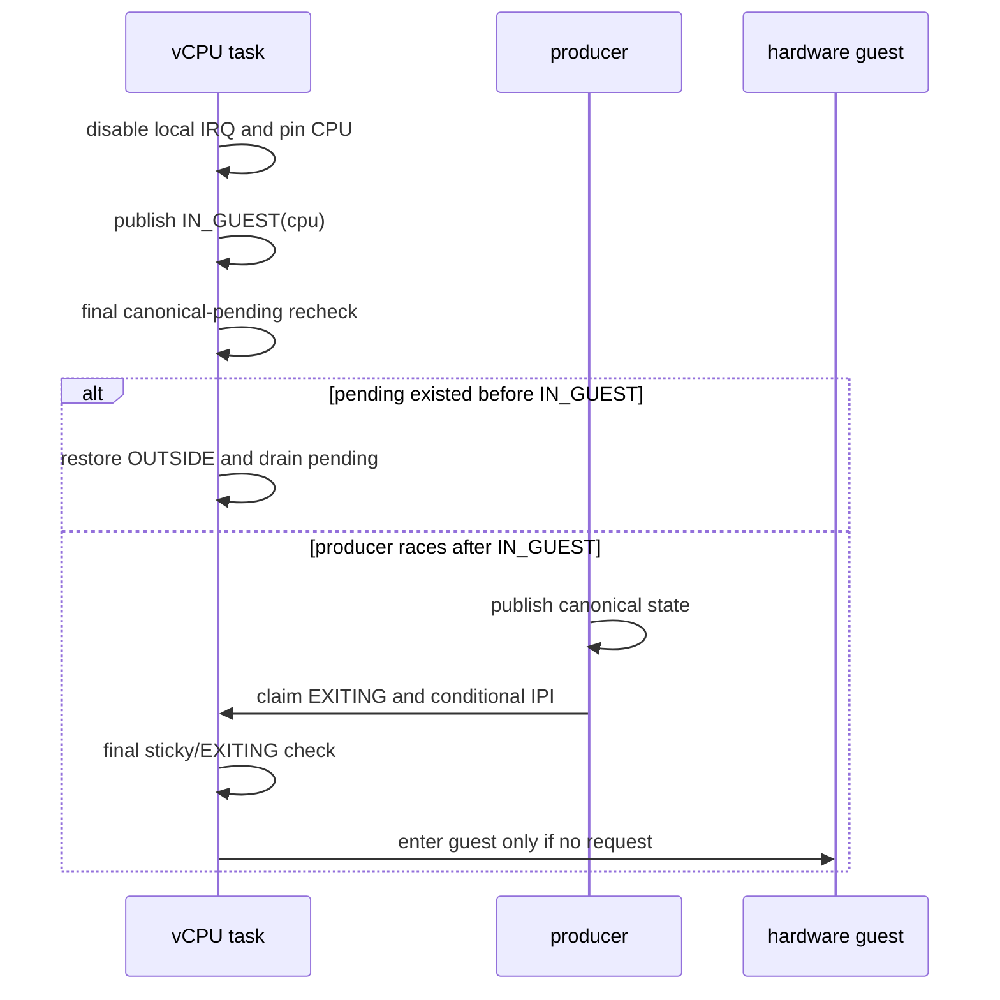

# AxVM vCPU kick 分层与状态机

## 1. 问题与结论

PR #1775 的 x86 定时器链曾在每次 vLAPIC 到期后无条件执行共享 wait queue 唤醒、deferred worker 和物理 IPI。VMX 已经因本地 host timer IRQ 退出 guest 时，这会制造第二条 kick 链；在 PREEMPT_RT 调度压力下，它会放大 worker、IPI 和 vCPU entry 的竞争。

AxVM 现在把一次通知拆成三个互不替代的阶段：

1. 生产者发布权威 pending 或业务状态；
2. runtime 推进 wait condition 并解除 WFI、HLT 或生命周期等待；
3. 只有远端 CPU 仍处于 guest mode 时，才发送物理 IPI。

这对应 Linux KVM 的 request bit、`KVM_REQ_UNBLOCK`、`vcpu->mode` 和 `kvm_vcpu_kick()` 分工。kick 不是 pending state 的所有者，也不能用一次线程唤醒代替 wait condition。

## 2. 生产者分类

不同生产者必须根据权威状态能否被下一次 backend entry 直接读取，选择不同入口。

| 生产者 | 权威状态 | runtime 入口 |
| --- | --- | --- |
| VGIC、vLAPIC、架构中断后端 | 控制器自己的 pending、level、LR 或 APIC 状态 | `VmRuntimeHandle::kick_vcpu()` |
| `VcpuIrqDispatcher` | 按 vCPU 线程世代登记的 queue entry | enqueue 后调用 `kick_vcpu()` |
| device poll、访问端口工作 | runtime 或设备自己的工作标志 | `VmRuntimeHandle::request_vcpu()` |
| stop、pause、resume、reset | VM 或设备生命周期状态 | `VmRuntimeHandle::request_all_vcpus()` |
| IVC notify | endpoint 已发布的 guest IRQ | `VmRuntimeHandle::kick_all_vcpus()` |
| x86 vLAPIC hard timer | `x86_vlapic` 的原子到期和 pending 状态 | `VcpuKickHandle::kick_from_hard_irq()` |

`kick_vcpu()` 要求调用者已经发布可被 vCPU 读取的权威状态。`request_vcpu()` 还会发布 sticky entry request，适用于 pending 不由架构 backend 直接消费的工作。公共 `kick_vm_vcpu(vm_id, vcpu_id)` 只提供“状态已发布”的 task-context 入口。

## 3. capability 与生命周期

`VcpuKickHandle` 绑定一个 vCPU host thread 世代，只保存：

- `Arc<VcpuRunState>`：vCPU 生命周期内稳定的 guest-entry ownership；
- `ThreadWakeHandle`：当前 host thread 世代的直接调度 capability。

`VmRuntimeHandle::add_vcpu_task()` 把 thread、kick capability 和 IRQ dispatcher owner 一起登记。CPU_OFF 先把整组对象从 active registry 转入 retired registry；join 后一起释放。旧 hard callback 只能命中旧 wake handle，或者向 VM-owned deferred worker 发布一个 vCPU bit；worker 会重新从 active registry 获取当前世代。

kick capability 不携带 IRQ 号、虚拟控制器、VM registry、设备或调度器 CPU 快照。vCPU 的 guest owner 只能从 `VcpuRunState::mode` 读取。

## 4. guest-entry 事务

`VcpuRunState` 有两个原子字段：

- `mode`：`OUTSIDE`、`IN_GUEST(cpu)` 或 `EXITING(cpu)`；
- `exit_requested`：为设备和生命周期工作保留的 sticky entry request。

entry 顺序如下：

发布 `IN_GUEST` 必须早于最终 queue recheck。这样，较早的 enqueue 由 recheck 发现，较晚的 enqueue 一定观察到 `IN_GUEST` 并认领退出，不需要给每个控制器事件附加 generic sticky request。

`VcpuGuestEntry::Drop` 在正常 VM exit、entry retry、entry cancellation 和错误展开时都恢复 `OUTSIDE`，并断言一次 entry 期间 owner CPU 没有变化。entry 全程位于 `PreemptGuard` 和 `IrqSaveGuard` 保护下；迁移必须先离开 guest mode。

## 5. task-context kick

task-context 的顺序固定为：

1. 生产者发布权威状态；若没有 backend pending，再发布 sticky entry request；
2. `notification_generation` 以 Release 推进，并唤醒共享 wait queue；
3. `ThreadWakeHandle` 唤醒目标 host thread；
4. `request_exit()` 原子读取 guest owner；
5. `OUTSIDE` 不发 IPI，本地 guest 只认领 `EXITING`，远端 guest 返回 owner CPU；
6. runtime 在 registry 锁外发送远端 IPI。

`notification_generation` 是逻辑 unblock 条件。只调用 `ThreadWakeHandle::wake()` 不能保证 `WaitQueue::wait_until` 的谓词变真，线程可能醒来后再次睡眠。

## 6. hard-IRQ 边界

`VcpuKickHandle::kick_from_hard_irq(current_cpu)` 只执行原子操作和 generation-bound thread wake。它不查询 VM registry，不获取普通锁，也不直接发送可能等待 APIC delivery 的 IPI。

| guest 状态 | hard-IRQ 结果 | 后续动作 |
| --- | --- | --- |
| 当前 CPU 的 guest | `Complete` | 当前 host IRQ 已经完成本地 VM exit，只认领 `EXITING` |
| 已有调用者认领 `EXITING` | `Complete` | 不重复提交 doorbell |
| `OUTSIDE` | `Defer` | worker 推进逻辑 unblock，防止 waiter 重新睡眠 |
| 远端 CPU 的 guest | `Defer` | worker 刷新 active 世代并条件发送 IPI |
| wake handle 已退出或不可用 | `Defer` | worker 从 active registry 重新解析目标 |

x86 vLAPIC hard timer callback 先发布 APIC pending，再调用这个接口。相同 CPU 上的 VMX external-interrupt exit 本身就是 doorbell；只有 timer owner 与 guest owner 不同，或 vCPU 已在 guest 外等待时，才提交 `DeferredVcpuKick`。

AArch64 的 blocked-vCPU software timer 不是控制器 kick：它按 `(owner_cpu, owner_thread)` 绑定 registration 和 wake handle，完成 `Aarch64TimerWaitState` token 后直接唤醒同一 host wait 世代；CPU migration 或 CPU_OFF/CPU_ON 会先废弃旧 timer epoch。vCPU 恢复后才重新计算 timer level 并发布 VGIC PPI。真实 VGIC pending 和 host timer PPI 仍通过 `Aarch64VcpuWake`、deferred worker 和 task-context `kick_vcpu()` 解除 wait。两条链不能混为一个 callback。

## 7. 失败与回收语义

deferred publisher 使用预分配 bitset 合并同一 vCPU 的重复请求。worker 启停跟随 VM 架构 runtime；停止后清空残留 bit。worker 找不到运行中的 VM 或 active vCPU 时丢弃 bit，因为 controller pending 已由对应 VM 生命周期回收，不能把旧世代请求转交给未来新线程。

`kick_all_vcpus()` 只用于调用者已经发布了规范状态的广播通知；`request_all_vcpus()` 先对所有 active capability 发布 sticky request。两者都只推进一次共享 notification generation，随后在 registry 锁外逐个执行条件 IPI。即使 active 集合为空，它们也推进 wait condition，使控制面等待者能观察已经发布的状态。

## 8. 验证要求

确定性测试至少覆盖：

1. `OUTSIDE` sticky request 只取消下一次 entry；
2. 最终 entry check 能看到本地 `EXITING` claim；
3. local hard IRQ 不提交远端 doorbell；
4. `OUTSIDE` 和 remote guest 会转交 task-context worker；
5. 多个 task kick 只能认领一次 remote exit；
6. queue publish 发生在逻辑 unblock 和物理 kick 之前；
7. waiter 在 park 边界前后都不会丢失 notification generation。

运行时验证包括 x86 VMX direct ACPI、MP fallback、OVMF ACPI，以及 AArch64 GICv2、GICv3 timer stress。实体机结果必须记录 board、guest、精确提交和 CI job。
