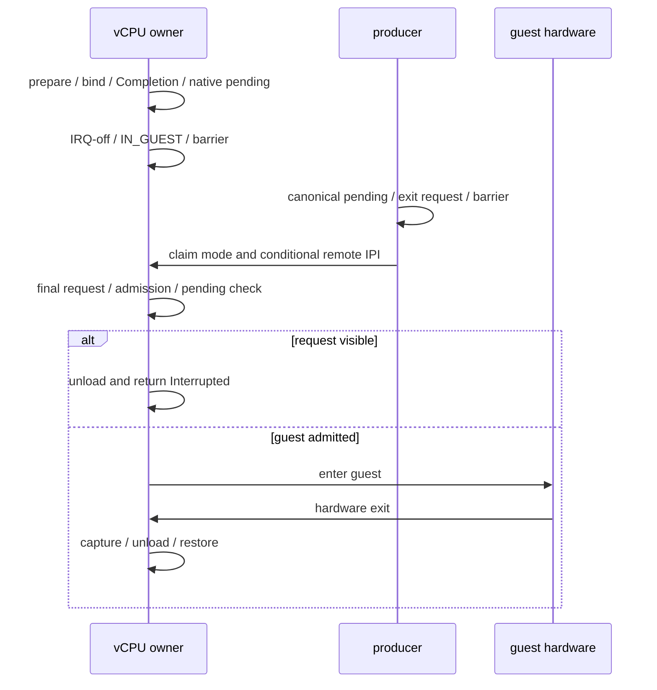

# AxVM vCPU 请求与进入协议

中断控制器保存 pending、active 与物理源身份，运行期 `RunSignals` 保存预绑定执行目标和有限 IRQ 发布状态，`VcpuSignals` 保存 guest mode、准入、退出与 unblock 请求。kick 在权威状态发布之后执行，不能代替 pending，也不能由一次线程唤醒推断等待条件成立。

## 1. 运行期能力

每个端口绑定完整 `RunId` 和目标，reset 关闭旧运行对象并建立新对象。IRQ 和硬件路径不按 VM ID 查询注册表，也不通过完整 VM 对象解析“当前 runtime”。

### 1.1 发布者

`VcpuSignalSlot` 的注册包含 `VcpuInstance`、`Arc<VcpuSignals>` 和 `ThreadWakeHandle`。控制 owner 在启动前发布整组能力，退出和 join 确认后退休；旧 callback 只能指向旧运行对象。

| 发布者 | 权威状态 | 通知入口 |
| --- | --- | --- |
| GIC / vLAPIC / vPLIC | 控制器的 pending / active | native 状态提交后 `RunSignals::kick_from_irq` |
| 通用与 LoongArch 源 | 固定容量、区分源身份的队列 | `publish_queued` 后 kick |
| 设备后台完成 | 设备持久完成记录与 work flag | `DeviceWorkPort::notify` |
| 生命周期 owner | mailbox command 与准入请求 | `VcpuPort::send` |
| IVC | 运行代次绑定的目标 IRQ endpoint | 通道表锁外通知 |

队列和注册都在准备阶段建立容量，hard IRQ 不动态增长。关闭准入后，旧端口返回 `SignalError::Closed`；不同运行或激活的确认不能作用于新 owner。

### 1.2 等待条件

`VcpuWait::wait_pending` 只读取自身 stop、entry admission、sticky unblock、native pending、固定队列和指定 poller 的 work。它不取得生命周期、mailbox 或设备 mutex。控制回复等待期间的 vCPU 已卸载后端，仍处理 park、stop 和取消。

`RunSignals::notify_work` 先提交 owner-independent work，再唤醒当前 poller；没有在线 poller 时 work 保持，owner 变更不会清除它。`set_poll_owner` 在指定值提交后于锁外唤醒，非指定 vCPU 不消费 work。

## 2. 进入握手

`VcpuSignals::mode` 为 `OUTSIDE`、`IN_GUEST(cpu)` 或 `EXITING(cpu)`，`exit_requested` 是跨 outside 窗口保留的请求。`VcpuGuestEntry` 在所有正常、重试和失败路径恢复 outside。

### 2.1 最后检查

进入方在 pin 与 IRQ-save 作用域内发布 mode，执行 SeqCst 屏障，然后复查准入、canonical pending 和退出请求。发布方在 canonical state 与 sticky 请求提交后执行配对屏障，再观察并认领 guest mode。

```mermaid
sequenceDiagram
    participant V as vCPU owner
    participant P as producer
    participant H as guest hardware
    V->>V: prepare / bind / Completion / native pending
    V->>V: IRQ-off / IN_GUEST / barrier
    P->>P: canonical pending / exit request / barrier
    P->>V: claim mode and conditional remote IPI
    V->>V: final request / admission / pending check
    alt request visible
        V->>V: unload and return Interrupted
    else guest admitted
        V->>H: enter guest
        H->>V: hardware exit
        V->>V: capture / unload / restore
    end
```

较早请求由最终检查观察，较晚请求观察 IN_GUEST 并留下 doorbell。Release / Acquire mode 标记本身不替代这条配对协议；设备和控制服务只在卸载及上下文恢复后调用。

### 2.2 task kick

`runtime::kick::kick_target` 在 raw guard 外发布 unblock 和退出请求，`request_exit` 原子认领 mode。outside 不发送 IPI，本地 guest 只认领退出，远端 guest 发送 IPI；线程唤醒通过预绑定 `ThreadWakeHandle` 执行。

相同 guest mode 的多个发布者只认领一次远端退出。进入窗口结束后 mode 恢复，后续请求可以对新一次进入重新认领。CPU 迁移只能发生在后端已卸载时。

## 3. 硬中断与回收

hard IRQ 路径在 canonical pending 发布后调用 `RunSignals::kick_from_irq`，该对象只有原子、短 raw 状态和预绑定目标。睡眠锁、owner mailbox、设备回调和动态注册表均不可达。

### 3.1 IRQ kick

`kick_from_irq` 立即发布 sticky 请求并执行 `request_exit` 的配对屏障。远端 guest 通过宿主 `ax-ipi::notify_cpu` 接收不阻塞、可合并的 doorbell；其发送中状态允许 IRQ 重入，不等待另一个发送者。任务 wake 由 `RunSignalWorker` 消费预分配 bitmap 后执行。

不能只向 worker 排队而省略进入请求：native pending 可能在 `before_guest` 与最后入场检查之间到达，控制器快照还未同步，延后的 wake 也尚未执行。立即请求与 doorbell 封闭这条窗口。

### 3.2 静默确认

`IrqProducerGuard` 覆盖发布、请求和通知，`close_interrupts` 关闭新发布，`interrupts_quiet` 只有在所有 producer 退出后成立。停止顺序先关闭准入、发 stop 并 kick，再注销 producer；控制任务等待期间继续消费 vCPU 事件和 guest 请求。

`RunSignalWorker::stop` 在任务上下文 join，失败保留原句柄用于重试。控制 owner 在 vCPU、worker、timer、IRQ callback 和内存访问确认静默后才退休路由与 backing。陈旧 callback 不重新绑定未来运行。

## 4. 验证

确定性交错负责证明发布与确认规则，真实 SMP 和中断执行负责证明宿主与机器行为。两类证据各自记录，不能由其中一种替代另一种。

### 4.1 组件协议

现有 `VcpuSignals`、`RunSignals`、操作完成和 confirmation 测试覆盖 sticky outside 请求、最后检查、单次 mode claim、旧运行拒绝、固定队列源身份、持续 work 与 poll owner 交接。增强同一行为证明时确认错误实现必然失败，不使用源码关键字作为行为判据。

### 4.2 真实运行

通过项目 Axvisor SMP 入口运行 CPU_ON / pause / stop 竞争以及 timer、块设备和 IVC 用例。AArch64 保留 GICv2/v3 ACK、priority drop 和 physical LR 身份；x86 分别验证 VMX/SVM 的物理 IRQ 服务点和 EOI；RISC-V 验证 PLIC claim/complete 与 owner VSEIP；LoongArch 验证物理源、路由和 ACK/EOI。没有执行的目标列为未验证。
