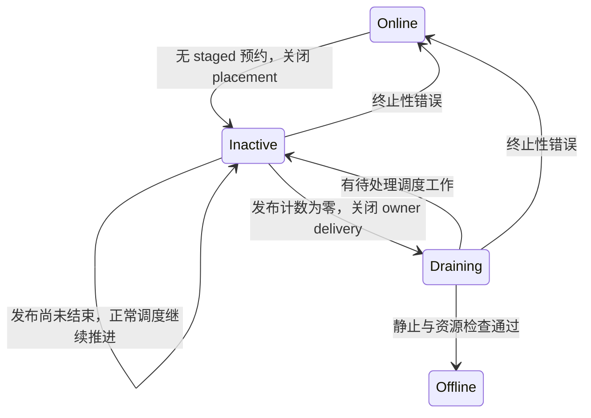

# CPU 下线中的发布排空

## 1. Linux 下线顺序

本次修复以 Linux v7.1 提交 `8cd9520d35a6c38db6567e97dd93b1f11f185dc6` 的实际代码为依据。源码位于本地 `/home/zhourui/linux-src`；该目录现有 `.config` 未启用 `CONFIG_PREEMPT_RT`，本说明不把本地构建作为 RT 验证结果。

### 1.1 停止接收新任务

`kernel/sched/core.c::sched_cpu_deactivate` 先执行 `nohz_balance_exit_idle`、`set_cpu_active(cpu, false)` 和 `balance_push_set(cpu, true)`，随后执行 `synchronize_rcu`，等待此前使用 active 状态的读者退出。清除 active 状态必须发生在等待之前，否则新的投递仍能不断进入。

TGOSKits 的 `CpuRemote::try_deactivate` 对应关闭 placement 准入：将同一原子字中的 `Online` 改为 `Inactive`，保留已有发布计数。`CpuPublicationClass::Placement` 随即拒绝新租约；已有 `CpuRemotePublication` 和 `OwnedCpuRemotePublication` 仍能完成发布并释放计数。只有生命周期所有者能改变阶段，发布者只能增减计数。`begin_idle_pull` 同样取得 placement 租约并在发布预约后重检 active 状态，避免其他 CPU 在关闭准入的同时重新建立 idle-pull 请求。

### 1.2 排空与最终检查

Linux 在 `sched_cpu_wait_empty` 中调用 `balance_hotplug_wait` 和 `sched_force_init_mm`。`balance_hotplug_wait` 通过 `rcuwait_wait_event` 等待运行队列及迁移禁止引用排空；PREEMPT_RT 的 `balance_push` 显式检查 `rq_has_pinned_tasks`。`sched_cpu_dying` 最后在 rq 锁和 IRQ 保护下检查剩余任务，而不是把一次调度返回当作静止证明。

TGOSKits 的 `TaskSystem::take_cpu_offline` 仍要求调用方事先完成普通线程、设备服务和截止时间的清理。本次补齐的是发布读者与待调度工作的排空，不包含 Linux 的完整 smpboot、stopper、设备停放或物理 CPU 断电流程。普通非静止资源仍返回 `CpuNotQuiescent`，不把它们当作可以忽略的通知。

## 2. 生命周期与所有权

`TaskSystem::take_cpu_offline` 在登记表锁下区分持久预约和短暂发布，并由 CPU owner 推进现有四态生命周期。只有完成 `Draining` 的完整静止检查，才允许释放运行时 CPU 资源和提交 `Offline`。

### 2.1 持久预约与在途发布

`ThreadRecord::activation` 保存 staged 线程的 `PreparedMigrationDelivery`，其 `target()` 是必须保留的首次激活目标。stage、activate、cancel 与下线检查共用登记表锁，所以检查该字段不会遗漏尚未登记或并发取走的预约。存在目标 CPU 的 staged 预约时，下线立即拒绝，CPU 继续接受原预约的激活。

除此之外，发布租约属于正在完成的操作。下线先停止新 placement，再以 `try_begin_draining` 的精确原子比较确认所有已有发布者已经退出。该比较把 `Inactive` 变为 `Draining`，同时关闭新的 owner delivery；之前的 release 递减与此处的 acquire 比较建立队列发布的可见性。普通 `Arc` 只保留端点内存，不承担这一发布宽限期证明。`IdlePullClaim` 也持有同一租约，直至源 CPU 完成调度事务并清除 claim：不能在迁移消息发布完成时就提前结束对目标 CPU 的读者保护。该协议覆盖本调度端点的租约读者，不声称替代 Linux 全部 RCU 使用者。

### 2.2 待处理与回滚

`NotReady` 表示下线仍在进行：发布租约未释放时保留 `Inactive`；关闭投递后发现待调度工作时，`resume_owner_drain` 从 `Draining` 回到 `Inactive`。调用者必须释放 IRQ 和 owner 借用，让正常调度路径处理工作，再继续同一次下线。期间 placement 始终关闭。

其他错误由同一返回路径恢复 `Online`。成功则提交 `Offline`。运行时的 `probe_idle_cpu_round_trip` 直接处理这一真实返回值，`IdleOfflineRejection` 只提供诊断，不再决定是否继续排空。

阶段变化可概括为：

回到 `Inactive` 只开放 owner delivery，不重新开放 placement。最终失败和待处理结果分别保留，避免将预约冲突变成无限等待，也避免将正常在途发布变成测试失败。

## 3. 回归验证

现有 ArceOS `task-cpu-lifecycle` 用例通过真实 SMP 调度验证发布与下线之间的顺序，测试入口和 CI 配置保持不变。

### 3.1 发布租约跨核交错

`with_idle_offline_reader` 分别在 CPU 0 实际持有 CPU 1 的 owner-publication 租约和已提交的 `IdlePullClaim`。CPU 1 进入下线检查后，测试确认其处于 `Inactive`，且探针没有发布完成结果；释放租约后，原请求必须完成真实 offline/online。旧实现会在发布计数非零时直接返回 `PlacementPublication`，或者在 idle-balance claim 仍存活时提前进入 `Draining`，因此同一用例失败。测试不重新发送请求，也不增加失败重试。

### 3.2 保留的相邻约束

原用例继续验证 staged 预约拒绝下线、取消不执行入口、激活一次、执行资源回收后可下线、重上线后的线程运行及 WFI 边界通知。MM 锁回归仍在另一核持有全局 MM 锁期间注入待调度工作，并要求原请求完成下线，证明排空和 CPU 准备不依赖该锁。用例的两秒进展上限和成功断言不变。
