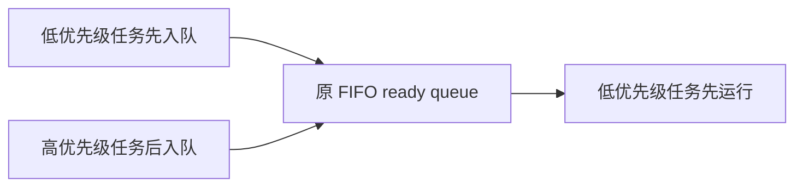
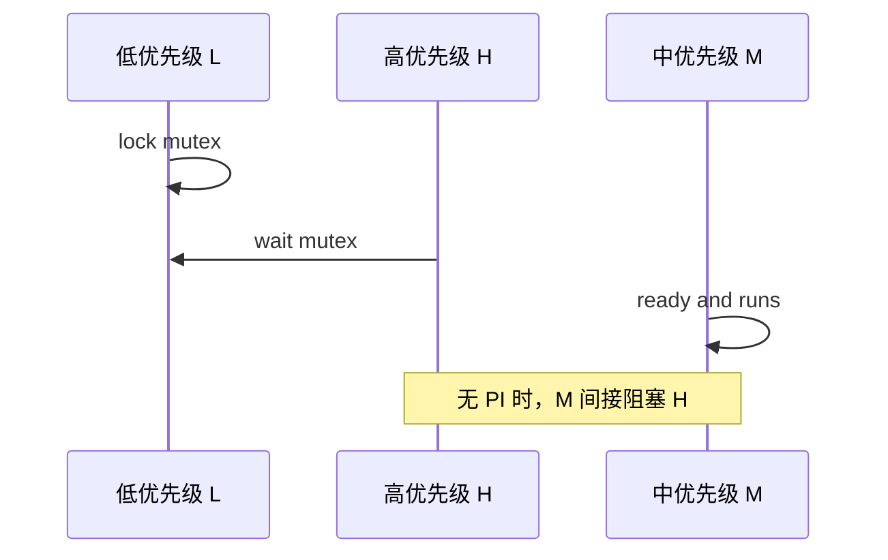
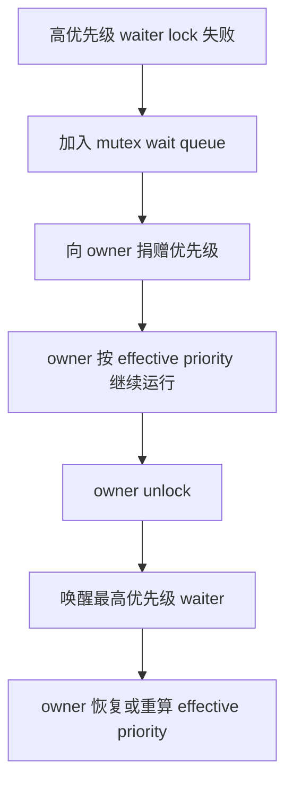

# 现有fifo问题以及改进方案

## 1. 现有语义

现有 ArceOS 多任务运行时在没有启用 `sched-rr` 或 `sched-cfs` 时选择 `ax_sched::FifoScheduler<TaskInner>`，入口位于 `os/arceos/modules/axtask/src/api.rs`。这个默认 FIFO 调度器实现简单、行为稳定，适合作为普通内核任务的协作式 ready queue，但它只表达“先进入 ready queue 的任务先运行”，并不表达实时系统通常要求的“高优先级任务先运行”。

### 1.1 调度入口

调度器选择由 `axtask` 的 feature 决定，默认路径仍然使用原有 FIFO，新增实时路径通过 `sched-rt-fifo` 显式启用。这样可以把实时语义作为可选择能力接入 ArceOS，而不是改变现有默认行为并影响普通 ArceOS、StarryOS 或 Axvisor 配置。

| 配置路径 | 调度器类型 | 主要语义 |
| --- | --- | --- |
| 默认配置 | `ax_sched::FifoScheduler<TaskInner>` | 按 ready queue 入队顺序选择任务 |
| `sched-rr` | `ax_sched::RRScheduler<TaskInner, MAX_TIME_SLICE>` | 时间片轮转，tick 到期后重调度 |
| `sched-cfs` | `ax_sched::CFScheduler<TaskInner>` | 按 vruntime 近似公平调度 |
| `sched-rt-fifo` | `ax_sched::RtFifoScheduler<TaskInner>` | 高优先级任务优先，同优先级 FIFO |

这个选择层属于 OS glue，真正的调度算法仍放在 `components/axsched`。`axtask` 只把 `TaskInner` 包装成对应 scheduler task，并负责 run queue、block、wake、timer tick 和 context switch。

### 1.2 队列行为

原有 `components/axsched/src/fifo.rs` 使用 `List<Arc<FifoTask<T>>>` 作为 ready queue，`add_task()` 将任务放入队尾，`pick_next_task()` 从队首取任务，`task_tick()` 永远返回 `false`。这意味着 timer tick 不会因为更高优先级任务存在而请求抢占，`set_priority()` 也返回 `false`。

```rust
fn pick_next_task(&mut self) -> Option<Self::SchedItem> {
    self.ready_queue.pop_front()
}

fn task_tick(&mut self, _current: &Self::SchedItem) -> bool {
    false
}
```

这段行为对普通 FIFO 是正确的，但对实时 FIFO 不完整。实时 FIFO 需要在 ready queue 中维护优先级顺序，并在当前任务优先级低于最高 ready 任务时让 `axtask` 标记 `need_resched`。

## 2. 问题边界

实时性问题不能只通过给任务保存一个 `sched_priority` 字段解决，因为调度器、等待队列和同步原语都必须观察同一个优先级事实。当前 `TaskInner` 已有 `sched_priority`，但默认 FIFO 不读取该字段；`WaitQueue` 使用 `VecDeque<AxTaskRef>`，普通 `notify_one()` 按队首唤醒；sleepable mutex 只记录 `owner_id`，没有 owner task 引用，也没有 priority inheritance 状态。

### 2.1 优先级缺口

实时 FIFO 的基础要求是：高优先级 ready task 优先运行，同优先级 task 才按 FIFO 顺序运行。原有 FIFO 不区分任务优先级，所以低优先级任务只要更早入队，就会先于后入队的高优先级任务运行。



这个结果不满足实时任务的抢占预期。`RtFifoScheduler` 使用 `RtPriority::rt_priority()` 读取有效优先级，并用 `(Reverse(priority), enqueue_order)` 作为 ready queue key，使高优先级任务先被 `pick_next_task()` 取出，同优先级任务仍保持入队顺序。

### 2.2 同步缺口

优先级反转出现在高优先级任务等待低优先级任务持有的锁时。如果中优先级任务持续运行，低优先级 owner 无法及时释放锁，高优先级 waiter 会被间接阻塞。当前 `axtask::sync::mutex::RawMutex` 只保存 `owner_id` 和 opaque wait queue，因此还不能完成 priority donation 和 owner effective priority restore。



完整 PI mutex 需要让 mutex 能定位 owner task，waiter 阻塞时把更高优先级捐给 owner，unlock 时再基于仍然等待的 waiter 重新计算 owner effective priority。这个改动涉及 `TaskInner`、run queue 重排和 wait queue 唤醒策略，应该作为下一阶段独立实现和验证。

### 2.3 通信缺口

`components/ax-rt/src/mailbox.rs` 中的 SPSC ring 和 doorbell 适合做 RT task 与普通 task 或 AMP peer 之间的非阻塞通信，但 mailbox 不能替代调度器和 mutex 的实时语义。它可以承载命令、事件和门铃通知，却不能保证高优先级任务先获得 CPU，也不能解决 mutex owner 被中优先级任务抢占的问题。

| 能力 | 合适边界 | 是否解决调度实时性 |
| --- | --- | --- |
| RT FIFO | `components/axsched` + `axtask` | 是，解决 ready task 选择顺序 |
| PI mutex | `axtask::sync::mutex` + `TaskInner` | 是，解决锁等待导致的优先级反转 |
| mailbox | 独立通信 crate 或 `ax-rt` 抽取组件 | 否，只解决消息传递和通知 |

因此 mailbox 应作为实时系统的数据通道，而不是作为 ArceOS 实时改造的核心调度机制。它可以在 RT FIFO 和 PI mutex 之后继续抽象，服务跨核或跨域通信。

## 3. 改进方案

本次改动先落地最小可验证闭环：新增 `RtFifoScheduler`，并通过 `axtask` 的 `sched-rt-fifo` feature 显式选择它。当前阶段只支持 `SMP=1`，因为多 CPU 下需要全局 RT push/pull、跨 CPU 抢占和任务迁移协议才能承诺系统级“最高优先级先运行”。这个阶段不替换默认 FIFO，也不在同一改动中实现 PI mutex，避免把调度策略、同步语义和通信抽象混成一个不可审查的大变更。

### 3.1 实时调度

`components/axsched/src/rt_fifo.rs` 新增 `RtPriority`、`RtFifoTask<T>` 和 `RtFifoScheduler<T>`。`RtPriority` 是 `ax-sched` 与具体任务类型之间的最小能力边界，调度器只需要读取和设置实时优先级，不依赖 `axtask::TaskInner` 的内部字段。

| 类型或函数 | 职责 |
| --- | --- |
| `RtPriority::rt_priority()` | 返回调度排序使用的有效实时优先级 |
| `RtPriority::set_rt_priority()` | 由 `BaseScheduler::set_priority()` 写回任务基础优先级 |
| `RtFifoTask<T>` | 保存 inner task 和入队顺序 |
| `RtFifoScheduler<T>` | 按优先级和入队顺序维护 ready queue |

`RtFifoScheduler::task_tick()` 不实现时间片轮转，只在 ready queue 中存在比当前任务更高优先级的任务时返回 `true`。`axtask` 的 timer path 会据此设置当前任务的 preempt pending 标志，从而满足实时 FIFO 的抢占条件。

### 3.2 ArceOS 接入

`os/arceos/modules/axtask/Cargo.toml` 新增 `sched-rt-fifo = ["multitask", "preempt"]`，`os/arceos/ulib/axstd/Cargo.toml` 透传同名 feature。`axtask::api` 在该 feature 启用时选择 `ax_sched::RtFifoTask<TaskInner>` 和 `ax_sched::RtFifoScheduler<TaskInner>`。

```rust
pub(crate) type AxTask = ax_sched::RtFifoTask<TaskInner>;
pub(crate) type Scheduler = ax_sched::RtFifoScheduler<TaskInner>;
```

`TaskInner` 实现 `ax_sched::RtPriority`，当前阶段直接以 `sched_priority` 作为实时优先级来源。后续实现 PI mutex 时，应把该接口切换到 effective priority，`sched_priority` 保持 base priority，避免 donation 和用户设置优先级互相覆盖。

### 3.3 后续同步

PI mutex 应作为下一阶段独立实现。推荐新增 `PiMutex<T>` 或 feature-gated PI raw mutex，而不是立即改变所有 sleepable `Mutex` 的语义；这样可以让实时路径先选择 PI mutex，普通路径继续使用现有轻量 mutex。

完整 PI 流程应包含以下状态变化：waiter 争用 mutex 时进入 priority-aware wait queue，owner 接受 donation 并触发 run queue 重排，unlock 时唤醒最高优先级 waiter，并在释放该 mutex 后重算 owner effective priority。



这个流程需要与 `WaitQueue`、`TaskInner` 和 scheduler ready queue 重排协同实现。测试应覆盖低优先级 owner、高优先级 waiter 和中优先级干扰任务的确定性交错，确保没有 PI 时会失败、有 PI 后通过。

## 4. 验证计划

验证应优先放在能直接表达语义的最低层。当前 RT FIFO 的核心行为位于 `components/axsched`，因此先用调度器单元测试固定优先级排序、同优先级 FIFO 和 tick 抢占判定；ArceOS 集成层再通过 feature 构建和 clippy 证明接入路径可编译。

### 4.1 已覆盖行为

新增测试覆盖 `RtFifoScheduler` 的三个基本行为。它们不依赖 QEMU 或板卡，可以在 host cargo test 中稳定运行，并在调度器退化为普通 FIFO、同优先级顺序被破坏或 tick 抢占条件缺失时失败。

| 测试 | 覆盖行为 |
| --- | --- |
| `rt_fifo_picks_higher_priority_before_fifo_order` | 高优先级任务先于更早入队的低优先级任务运行 |
| `rt_fifo_preserves_fifo_order_within_same_priority` | 相同优先级任务保持 FIFO 顺序 |
| `rt_fifo_tick_preempts_only_for_higher_priority_ready_task` | 只有 ready queue 中存在更高优先级任务时 tick 请求重调度 |

这些测试只证明调度器算法本身成立。它们不声称已经解决 mutex priority inheritance，也不覆盖用户态 Linux `SCHED_FIFO` ABI。

### 4.2 单核启动卡点

调试 `sched-rt-fifo` 的单核 QEMU 用例时，系统一度卡在 `axruntime::serial::build_runtime()` 创建 `serial0-maint` 之后、`console::activate_before_smp()` 完成之前。`activate_before_smp()` 会通过 `SerialRuntimeHandle::begin_console_handoff()`、`adopt_prepared_console()` 和 `commit_console_handoff()` 请求串口维护任务处理 control queue；若 `serial0-maint` 仍按默认优先级运行，RT FIFO 单核场景下它可能得不到及时调度，主任务便一直等不到 runtime console started 状态。修正方式是在 `ax-runtime/sched-rt-fifo` 下将串口维护任务设为内部高优先级，同时保持测试中的用户 worker 优先级低于它，避免启动握手影响 RT FIFO 行为断言。

### 4.3 待补行为

后续 PI mutex 合入前需要新增确定性回归测试，构造低优先级任务持锁、高优先级任务等待和中优先级任务干扰的场景。测试必须观察到 owner 被临时提升、unlock 后 waiter 被优先唤醒、owner priority 被恢复或重算。

| 后续能力 | 推荐验证层级 | 通过条件 |
| --- | --- | --- |
| effective priority | `axtask` unit 或 axtest | donation 后 scheduler 使用提升后的优先级 |
| priority-aware wait queue | `axtask` wait queue 测试 | 多 waiter 时唤醒最高优先级任务 |
| PI mutex | `axtask` 同步测试 | 中优先级任务不能阻塞持锁 owner 释放高优先级 waiter |
| mailbox 抽象 | 独立 crate 测试 | ring 满、空、doorbell pending 和 IRQ-safe flag 行为可复现 |

这些后续工作应保持分阶段提交。RT FIFO、PI mutex 和 mailbox 分别解决不同问题，只有组合后才构成更完整的 ArceOS 实时改造。当前文档把边界写清楚，是为了避免把 mailbox 当成优先级反转的替代方案，或误认为原有 FIFO 已满足实时调度。
