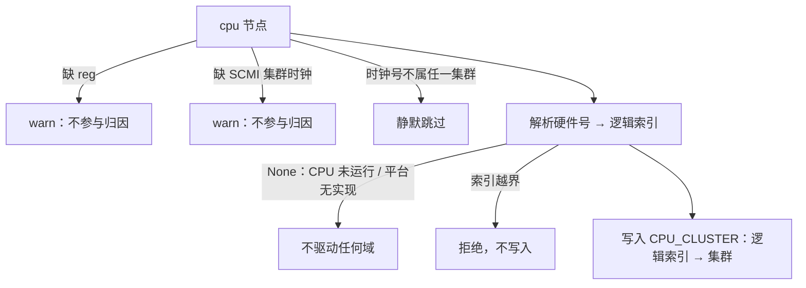

# RK3588 CPU DVFS 设计说明

特性开关 `ax-driver/rk3588-cpufreq`（默认关闭，Orange Pi 5 Plus 板卡构建启用）为 RK3588
提供 ondemand CPU 调频调压。本文是这套驱动的行为契约：调频域与安全边界、负载归因（逻辑
CPU 到物理集群的映射拥有者与排序规则）、调度策略与降频下限，以及可在串口上核对的验收
手段。实现位于 `drivers/ax-driver/src/soc/rockchip/cpufreq.rs`，内核侧轮询任务位于
`os/StarryOS/kernel/src/entry.rs`。

## 1. 功能与安全边界

### 1.1 调频域与两根杠杆

RK3588 的 CPU 时钟是电压耦合的 PVTPLL：SCMI 时钟号只选定环形振荡器目标，实际送达频率
跟随核心轨电压。因此一次 OPP 迁移必须成对操作 SCMI ring 与 PMIC 轨电压，且顺序保证任何
中间状态都只会过压、不会欠压（升档先压后频，降档先频后压，见 `apply_opp` 与
`run_apply_steps` 的主机端测试）。

三个物理调频域、它们的 SCMI 时钟号与 boot 目标如下（依据 `orangepi5plus.dts`）：

| 集群 | 物理 CPU | SCMI 时钟号 | boot OPP |
| --- | --- | --- | --- |
| A55（小核） | cpu0-3 | 0 | 1008 MHz @ 675 mV |
| A76 big0 | cpu4/5 | 2 | 1200 MHz ring @ 675 mV |
| A76 big1 | cpu6/7 | 3 | 1200 MHz ring @ 675 mV |

两个大核集群使用完整电压杠杆：RK8602/RK8603 轨电压可经 I2C 读回，每次写都确认后才提交
OPP。A55 是 ring-only：其 RK806 轨电压读路径存在硬件限制（MISO 不进移位寄存器），因此只
在启动对齐阶段执行一次有界的降压，运行期不再写 A55 轨电压，仅移动 SCMI ring；675 mV 对
所有 ≤1008 MHz 的 ring 都过压，不可能欠压（`Cluster::voltage_managed` 固定了这一划分，
`a55_ladder_is_ring_only_on_the_boot_rail` 测试锁定）。

### 1.2 失败安全与探测时序

失败安全由 `GOV_READY` 门控：任一时刻 A76 I2C PMIC 未起来，governor 不武装，所有集群停
在 boot OPP；A55 SPI 失败不阻止 governor（A55 本就 ring-only）。探测本身是
`PostKernel`/`DEFAULT` 级、一次性守卫 `APPLIED` 保护，发生在 `start_secondary_cpus()`
之前，重定时 A76 时其上没有被调度的核心。

## 2. 负载归因契约

governor 收到的 `busy[i]` 是**逻辑 CPU i** 的累计忙计数（内核调度 tick 维护，见
`ax_task::cpu_busy_ticks` 与 entry.rs 的采样循环），而调频域是物理集群。归因要回答的问
题是：逻辑 CPU i 实际运行在哪个物理集群上。

### 2.1 逻辑编号的拥有者

逻辑 CPU 编号由**内核的 CPU 列表**决定，不由设备树的文档顺序决定：someboot 的
`CpuIdOrder`（`platforms/someboot/src/smp/cpu_iter.rs`）把 boot hart 的固件硬件号排在
逻辑 0，其余 CPU 按固件（FDT `/cpus` 文档序）跟进。per-CPU 内核状态（调度队列、忙计数）
全部按这套索引分配。驱动的归因必须与它一致，唯一的正确来源是询问内核本身：

`axklib::cpu::resolve_logical_index(hardware_id)`
→ `Klib::cpu_resolve_logical_index`（`components/axklib`）
→ `ax_hal::topology::resolve_cpu_index`（axruntime 实现）
→ somehal `cpu_id_to_idx`（即当初分配 per-CPU 索引的同一映射）。

ax-driver 位于 ax-task/ax-hal 之下，不能直接依赖它们，`Klib` 是既有的上行能力通道。
未实现该能力的平台得到 `None`，行为退化为回退路径（见 2.3）。

之所以强调这一点，是因为 guest FDT 的文档顺序可能与逻辑顺序脱节：Axvisor 的
`create_guest_fdt`/`need_cpu_node`（`virtualization/axvm/src/boot/fdt/core/create.rs`）
按 `phys_cpu_ids` **成员**过滤 `/cpus/cpu@*` 并保留宿主 DT 顺序，不按数组顺序重排；而
每个 vCPU 的 guest MPIDR 等于其 `phys_cpu_ids[i]`（`virtualization/axvm/src/arch/aarch64/vm.rs`
的 `mpidr_el1`）。对非单调绑定如 `phys_cpu_ids = [0x400, 0x000]`，guest FDT 仍先列出
cpu@0，但逻辑 CPU 0 运行在 A76 cpu@400 上。按遍历序号归因会把大核负载记到 A55 集群：
governor 推高小核而真正承载负载的大核从不升频——这正是本契约要排除的失效模式。

### 2.2 逐节点归因规则

`map_cpus_from_fdt` 对每个 `/cpus` cpu 节点做同一套判定：取节点的 `reg`（固件硬件号）
与 SCMI 时钟号（`cpu_node_topology`），把硬件号经 2.1 的能力解析成逻辑索引，再把该时钟
号对应的集群记入 `CPU_CLUSTER[logical]`（`store_cpu_clusters` 为可主机测试的纯核心）。



这些分支不是防御性堆砌，而是可独立验收的契约：诊断"某个集群不调频"或"调错集群"时，可
按下表逐项排除输入侧原因。

| 情况 | 处理 | 理由 |
| --- | --- | --- |
| 节点缺 `reg` 或缺可识别 SCMI 集群时钟 | warn 后跳过 | 节点无法标识身份或所属域 |
| 时钟号不属于任何 CPU 集群 | 跳过 | `cluster_index_from_clock_id` 之外无目标域 |
| 硬件号解析为 `None` | 不驱动任何域 | 内核未运行该 CPU（离线/未纳入 CPU 集）或平台未实现该能力 |
| 逻辑索引越界（≥ `CPU_CLUSTER.len()`） | 拒绝写入 | 防御畸形解析结果，不 panic |
| 两个节点 `reg` 重复 | 畸形 DT，后写覆盖 | DT 规范要求 `reg` 唯一；映射仍是"逻辑索引 → 集群"的函数，无害 |

所有跳过都是保守方向：被跳过的 CPU 不贡献任何忙碌读数，因此绝不会把某个域"读成全空
闲"而误降频，只会让它维持原状态。

### 2.3 部分映射与回退

部分映射是合法状态：只有至少映射到一个在线逻辑 CPU 的集群参与决策；没有任何在线 CPU
的集群在 `governor_poll` 中被整体跳过（`counts[ci] == 0 → continue`），不会被当作全空
闲而永远降频。仅当整趟 FDT 走查一无所获（`map_cpus_from_fdt() == 0`，例如平台未实现
2.1 的能力）时，`map_cpus_from_physical_topology` 按 cpu0-3 / cpu4-5 / cpu6-7 的物理区间
回退，裸机行为与历史版本一致。

## 3. 调度策略与降频下限

### 3.1 ondemand 决策

每个集群共享一个时钟，因此由其**最忙的核心**驱动（`next_opp_idx`，主机可测）：任一核
心忙碌百分比 ≥ `UP_THRESHOLD_PCT`（80%）时一步跳到梯顶（快速攻击）；全部核心 <
`DOWN_THRESHOLD_PCT`（30%）时降一档；其余保持。窗口按实际流逝时间折算（慢唤醒不会虚
增负载），首次轮询只建立基线不做决策。

### 3.2 boot OPP 下限

降档以 `BOOT_OPP_IDX`（A55 1008 / A76 1200 ring @ 675 mV）为下限：突发 I/O 型负载在两次
读盘之间读作近空闲，降到 boot OPP 以下会拖慢其完成路径（板上实测 490 MB 模型读取：静态
1200 MHz 25.4s，允许降到 408 MHz 则 29.8s）。由此有一个直接推论：A55 梯子的顶格就是它
的 boot OPP，所以 A55 永远不会被 governor 降档，只在 ring-only 梯内保持 1008 MHz。

## 4. 启用与构建

特性在两个 Orange Pi 5 Plus 构建配置中启用：

- `test-suit/starryos/board-orangepi-5-plus/build-aarch64-unknown-none-softfloat.toml`
  —— 板卡 CI runner 实际构建的配置，标准板卡测试入口会在真实硬件上编译、启动并运行
  governor：

  ```bash
  cargo xtask starry test board --board orangepi-5-plus
  ```

  该套件每个用例都启动此内核；governor 引起的启动 panic/挂起会命中用例的 `panic`
  失败正则，板卡 CI 由此回归保护该特性。
- `os/StarryOS/configs/board/orangepi-5-plus.toml` —— 通用板卡构建模板（CI 之外的
  `max_cpu_num` 全核构建）。

自定义构建启用时，向该配置的 `features` 列表加入 `"ax-driver/rk3588-cpufreq"`。

## 5. 可观测验证

### 5.1 启动与运行日志

启动早期（console 交接前）输出轨电压与重定时结果；governor 武装条件是 A76 I2C PMIC 成
功（A55 SPI 失败不影响，A55 ring-only）：

```text
cpufreq: A55 rail boot voltage = <uV> uV
cpufreq: A55 <before>-><after>, A76 <before>-><after> MHz
cpufreq: ondemand governor armed (A76 I2C up; a55_spi=<bool>, A55 ring-only)
```

governor 武装后的第一次 `governor_poll`（任务启动后约一个 `GOV_PERIOD_MS`）构建归因映射
并输出一行最终映射，误归因的启动可以直接在串口定位：

```text
cpufreq: busy attribution cpu0->A76b0 cpu1->A55 ...
```

运行期每次 OPP 迁移输出
`gov: <cluster> peak=<n>% opp <i>-><j> = <mhz> MHz @ <mv> mV`。精确送达频率可用
`cpuprobe` 的 `mhz_pmc` 读取（PMU 周期计数器在启动时使能）；配套的
`apps/starry/sysbench-board` harness（PR #1658）驱动全核负载并与 Linux 基线对比。

### 5.2 频率读数

`log_frequency_readout()` 是只读快照，由 StarryOS 内核 `entry.rs` 的 `init` 在决定是否
派生 governor 任务之后调用，输出三个域的 SCMI ring 频率、governor 武装状态、各域 OPP
索引与当前核心的送达频率（PMU 实测）：

```text
cpufreq readout: A55=<mhz> MHz, A76b0=<mhz> MHz, A76b1=<mhz> MHz, governor=<bool> \
(gov_ready=<bool>), opp_idx=(<i>,<i>,<i>), current-core delivered=<mhz> MHz
```

它不改动任何时钟与电压，用于回答"这个内核此刻实际跑在哪个集群、多高频率"。

### 5.3 确定性验收

映射逻辑的确定性验证在主机单元测试层（`cargo test -p ax-driver --features
rk3588-cpufreq --lib cpufreq`），其中非单调用例曾在按 FDT 序号归因的旧实现下实际失败后
再修复（红-绿证据）：

| 测试 | 固定的行为 |
| --- | --- |
| `non_monotonic_pin_books_busy_under_the_cluster_it_runs_on` | `[0x400, 0x000]` + boot-hart 优先解析：busy[0]→A76b0、busy[1]→A55 |
| `identity_order_books_each_cpu_under_its_own_cluster` | 裸机全核顺序下逐 CPU 与 `Cluster::cpus()` 一致 |
| `single_vcpu_pin_books_under_its_pinned_cluster` | SMP=1 绑 cpu@400：仅 cpu0→A76b0 |
| `offline_hardware_id_books_nowhere` | 内核未运行的硬件号不落入任何逻辑索引 |
| `out_of_range_logical_index_is_refused` | 越界逻辑索引被拒绝且不 panic |
| `cluster_clock_ids_map_to_governor_cluster_indices` | SCMI 时钟号→集群索引表 |
| `physical_topology_fallback_partitions_all_cpus` | 回退物理区间与 `Cluster::cpus()` 一致 |
| `governor_*` / `apply_*` / `opp_table_*` | 阈值、boot-OPP 下限、升降档顺序与事务提交语义 |

非单调跨集群绑定的板卡验收条件（当前尚未在实体板上执行，为合并后的确认项）：

1. guest 配置 `phys_cpu_ids = [0x400, 0x000]`（SMP=2），vCPU0 绑 A76 big0；
2. 启动串口出现 `cpufreq: busy attribution cpu0->A76b0 cpu1->A55`；
3. 在 vCPU0 上施加 CPU 密集负载：出现 `gov: A76b0 ... opp 2-><更高>` 升档行，`gov: A55`
   不因该负载升档，`cpufreq readout:` 中 A76b0 的 `opp_idx` 上移而 A55 保持；
4. 把负载移到 vCPU1 后 A55 的行为对称成立。
