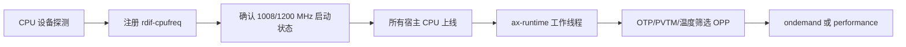

# RK3588 CPU 调频设计

Orange Pi 5 Plus 有三个独立 CPU 调频域：A55 cpu0-3、A76 cpu4-5、A76 cpu6-7，
对应 SCMI 时钟号 0、2、3。每个域共用一个时钟和一条 CPU/mem 电源轨。
`rdif-cpufreq` 描述通用调频域、OPP、限制和硬件错误；
`ax-runtime::cpufreq` 为 ArceOS、StarryOS 和 Axvisor 提供唯一的 governor 工作线程。
RK3588 的 OPP 表筛选、温度规则、DSU 约束和转换顺序位于 `rockchip-soc::rk3588`，
`ax-driver::soc::rockchip` 负责 FDT 探测以及 SCMI、PMIC、OTP、TSADC、GRF 的资源适配。
原 `ax-driver::cpufreq` 公共门面和 StarryOS 校准入口已移除；内核调用方通过
`ax-runtime::cpufreq` 发起串行请求。

## 1. 启动与控制

`ax-runtime::bootstrap` 在设备探测建立启动 OPP 后启动次级 CPU，随后创建唯一的
调频工作线程。该顺序保证硅片分档与运行时调档开始时，三个 CPU 域都已有可确认的
初始频率。

### 1.1 启动顺序

启动过程先注册 `rdif-cpufreq`，再确认启动时钟和电源轨，最后由
`ax-runtime::cpufreq::start` 接管策略；以下流程标出硬件与策略的交接点。

探测先注册 CPUFreq 设备，再把三个时钟设到已验证的启动 ring，确认 RK8602、RK8603
和 RK806 电压读回，并将轨电压逐级对齐到 750 mV。设备探测未建立安全状态时查询
返回 `NotReady`；没有设备才返回 `NotSupported`。完成所有宿主 CPU 上线后，运行时从宿主 bootargs
读取 `cpufreq.default_governor=ondemand|performance`。缺省或无效值为 `ondemand`，
无效值另记告警。Axvisor 客户机命令行不控制宿主调频。固定频率调整只供内核调用，
本次没有 StarryOS 用户态 ABI。

### 1.2 调频接口

`rdif-cpufreq::Interface` 是驱动与三套系统共用运行时之间的契约。调用方按调频域
读取 OPP 和限制，由运行时将策略切换、固定频率请求和温度刷新送入同一工作线程。

`rdif-cpufreq::Interface` 按域提供 `domains`、`available_opps`、`current_opp`、
`limits`、`set_frequency` 和 `refresh_limits`。`DomainInfo.cpu_ids` 是调度器逻辑 CPU
编号；适配器通过 `axklib::cpu::resolve_logical_index` 转换设备树中的硬件 ID，
不得假定设备树文档顺序等于逻辑顺序。运行时把策略、固定频率请求和温度刷新串行
送入同一个任务上下文。`current_opp` 是完整读回后的策略状态，实际送达频率须以
绑核 PMU 周期计数和系统计时器测量。

`ondemand` 每 100 ms 采样各域最忙核心的非 idle 比例：达到 80% 升至当前上限，
全部低于 30% 降一档。`performance` 持续请求限制内最高 OPP。温度或 DSU 约束
改变后，驱动先完成必要降档，才公布新限制；固定请求若当前不可用返回
`OppUnavailable`。硬件读回失败返回 `HardwareFailure`，受影响域停止后续写入，并以
`NotReady` 表示软件已不能证明当前 OPP。任一域调档失败都会关闭三个调频域：
SCMI 写入可能已生效而读回失败，大核实际频率未知时不能再按旧索引降低 A55/DSU。

## 2. 芯片筛选与转换

RK3588 驱动以板卡 DTB、OTP 和 PVTM 决定可用 OPP，再让 SoC 转换状态机依次确认
供电、GRF read margin 与 SCMI 时钟。筛选失败保留启动状态，转换失败关闭后续写入。

### 2.1 OPP 筛选

`rockchip-soc::rk3588::cpufreq_opp` 负责解析 DT OPP 电压和硬件掩码，
`ax-driver::soc::rockchip::cpufreq::select_domain_opps` 提供 OTP、PVTM 与温度实测值。
只有这两层都确认的档位才进入 `available_opps`。

CPU OPP 来自板卡 DTB 的三个 `operating-points-v2` 表。OTP byte 6 的低五位
`0x0d`、`0x0a` 分别是 M/bin1、J/bin2，其余是标准/bin0。探测双读 OTP 缓存；
PVTM 在表指定的 750 mV 和 1.416/1.608 GHz 测量点取 GRF 样本，按 TSADC 温度
修正后，从 `rockchip,pvtm-voltage-sel*` 选择电压档。测量频率必须与这两个
已确认的板级值严格相等，异常 DT 值在 SCMI 升频前拒绝。随后同时匹配
`opp-supported-hw` 型号与电压档掩码，优先读取 `opp-microvolt-L<档>`，
没有该属性才读取普通 `opp-microvolt`。`opp-info` OTP 修正电压仍受 OPP
允许的最大值限制。任一必要输入缺失、格式无效或测量无法恢复启动时钟时，
不发布依赖该输入的高档。

高档当前只对实体板验证过的标准 SKU 分档开放：A55 PVTM 档 0、1，
两组大核 PVTM 档 0、3。J/M SKU 及其他 PVTM 档保留启动 OPP；即使 DT
列出更高频率，也不因静态表存在就开放。新增分档需补齐对应实体板的轨电压
读回和绑核频率测量，再更新这道门控。

### 2.2 OPP 转换

`rockchip-soc::rk3588::cpufreq::transition` 决定调档顺序，RK3588 适配层分别实现
轨电压、GRF read margin 和 SCMI 时钟写入与读回。软件 OPP 索引只在整个转换完成
后更新，因此中途失败不会被报告为已达到目标档。

三域使用各自的轨：RK806 DCDC2 经 SPI2 驱动 A55，RK8602/8603 经 I2C0 驱动
两个大核域。调压每步至多 25 mV，读回选择码并等待稳定。CPU 与 mem supply
在该板卡指向同一物理轨，只写一次。GRF read margin 按电压表设置并读回；
SCMI 设置也必须读回目标 ring。SoC 层转换状态机规定：

| 转换 | 第一步 | 第二步 | 部分失败后的处理 |
| --- | --- | --- | --- |
| 升档 | 确认供电和 read margin | 确认 SCMI 时钟 | 停止；可能过压，不提交 OPP |
| 降档 | 确认 SCMI 时钟 | 确认 read margin 和供电 | 停止；可能过压，不提交 OPP |

RK3588 大核频率对 A55/DSU 有最低频率要求。按 BSP 规则，大核目标频率的
80% 向下取整到 100 MHz；升大核前先满足小核下限，降小核前先检查两个大核
当前频率。不能满足该要求的大核档从当前限制中排除。

## 3. 温度与失效

`refresh_limits` 在每轮策略计算前读取真实 TSADC，并由 `ThermalState` 应用温度迟滞。
必要的降档或升压完成后才允许后续策略请求观察新状态；读回错误会关闭受影响的
调频能力。

### 3.1 温度限制

`ThermalState::update` 维护高低温两个独立迟滞条件，`refresh_limits` 将它们映射到
每域的频率上限和有效电压，并在超限时先执行降档。

TSADC 初始化七个通道的 120 °C 硬件关机比较器及 CRU 路由，等待三个 CPU
通道出现有效样本后才公开传感器。低于 10 °C 启用 750 mV 电压下限，超过
15 °C 解除；高于 85 °C 将 A55 限到 1.608 GHz、大核限到 2.208 GHz，
低于 80 °C 恢复。温度丢失时，电压使用 750 mV 下限，频率仅保留确认过的
1008/1200 MHz 启动档。每次工作线程轮询先更新这些限制再处理请求。

### 3.2 失效边界

`check_ready` 只开放读回已确认的调频域；`mark_domain_failed` 在转换状态不再可信时
关闭三个域，避免大核频率未知后继续按旧 DSU 约束调小核。

OTP/PVTM/传感器、PMIC 读回、SCMI 时钟或 GRF 确认失败均不得通过猜测软件
索引开放档位。RK806 已在实体板上读回 buck2 选择码；任何无法再次读回的
A55 实例仍不能进入需升压的 OPP。板卡 DTB 静态最高 A55 1.8 GHz、
大核 2.4 GHz，并不意味着每颗芯片都能使用。标准 SKU 的某一 PVTM 档
最高为 2.256 GHz，较高档可选择 2.352 GHz；实际以 OTP、PVTM 和表掩码为准。

## 4. 验证与开放

主机测试验证纯规则与参数解析；板卡测试验证电源、时钟和调度器共同工作时的
实际结果。测试只证明覆盖到的芯片分档与温度场景，新增分档仍需另行测量。

### 4.1 自动化验证

`cargo xtask test` 运行 `rockchip-soc` 的 OPP 与转换规则测试及 `ax-runtime` 的
CPUFreq 策略测试。ArceOS 的 `cpufreq` 板卡用例补充三域并发调档和 PMU 实测。

主机测试覆盖 OPP 双掩码与电压选择、PVTM 分档、10/15 °C 和 85/80 °C
迟滞、DSU 下限、转换每一步失败时停止，以及启动参数解析。板卡路径是
`cargo xtask arceos test board --board orangepi-5-plus --test-case cpufreq`：
用例读取三个 RDIF 域，设置最高/最低档，跨核同时请求两个档位，再在八个
逻辑 CPU 上用 PMU 周期计数与 CNTVCT 测量实际送达频率。板卡测试专用的
`rk3588-cpufreq-thermal-test` 特性可叠加温度限制：真实 TSADC 每次仍须成功
读取，真实高温和传感器故障不能被模拟温度覆盖。用例按 86、80、79 °C 与
9、15、16 °C 顺序验证限频降档、迟滞和恢复，以及低温电压下限与实际频率。
芯片分档未开放全部三个高档域时会记录 `THERMAL_SKIP_UNREADY`，不把该板
当作高档温度测试通过。QEMU 结果仅验证接口与启动，不作为实体板频率证据。

### 4.2 板卡结果

以下数据来自 2026-09-24 的 Orange Pi 5 Plus 实体板运行，包含两种 PVTM 分档。
频率以绑核 PMU 周期计数与系统计时器换算，轨电压由 PMIC 选择码读回确认。

2026-09-24 的 OrangePi-5-Plus-3 运行通过：OTP 标准 SKU，PVTM 分档
A55 0、大核 0；OPP 上限 A55 1.8 GHz、大核 2.256 GHz。板上绑核测量
A55 最高档约 1.783 GHz，大核两域约 2.163-2.171 GHz；三域最低
408 MHz 档测得约 396 MHz。RK806 在该板确认 750、675 和 950 mV
写入读回；两个大核轨在 675 mV 与 1.0 V 间完成升降。精确原始日志保留
在本次本地验证记录中。另一次 `OrangePi-5-Plus-1` 运行通过：标准 SKU，
PVTM A55 档 1、大核档 3，选择上限为 1.8/2.352/2.352 GHz；绑核测得
A55 约 1.827 GHz，大核约 2.241-2.252 GHz，三域最低档约 396 MHz。
两块板均确认升降档后的轨电压读回。最终代码再次在
`OrangePi-5-Plus-1` 通过 ArceOS 调频板卡用例：三域最高、最低及并发请求后，
八个核心实测最高约 1.828/2.243/2.254 GHz，最低约 396 MHz。
同一型号的板卡在受控温度用例中完成三域热限制降档与恢复，并确认低温下
750 mV 轨电压读回和约 396 MHz 的实际频率。此项是合成温度的电源、时钟和
软件策略闭环测试，不是实体芯片在 9 °C 或 86 °C 环境下的热稳定性证明。
StarryOS 的 `native-hardware-smoke` 在 `OrangePi-5-Plus-3` 通过，宿主启动
`Ondemand`，筛得 1.8/2.256/2.256 GHz；Axvisor 的
`orangepi-5-plus-linux` 冒烟用例在 `OrangePi-5-Plus-2` 通过，宿主启动
`Ondemand`，筛得 1.8/2.352/2.352 GHz，Linux 客户机进入 shell。
这两项启动用例没有逐簇切档与绑核频率测量；该行为由 ArceOS 板卡用例验证。
实际环境中的高低温切换尚未完成，常温及合成温度结果不能替代该项证据。

### 4.3 合入门禁

实体板测量证明当前两组标准 SKU 分档的常温行为，合入前仍需独立审查高档的
电源、时钟与失效边界；真实环境的高低温稳定性也尚无证据。

高于先前保守档位的 OPP 在合入前须由合格 RK3588 电源/时钟领域审查人确认
供电范围、PVTPLL/固件要求、read margin、DSU 时序、失败状态及板卡测量。
该审查是独立门禁，测试通过不代表审查完成。
