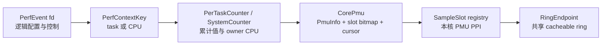
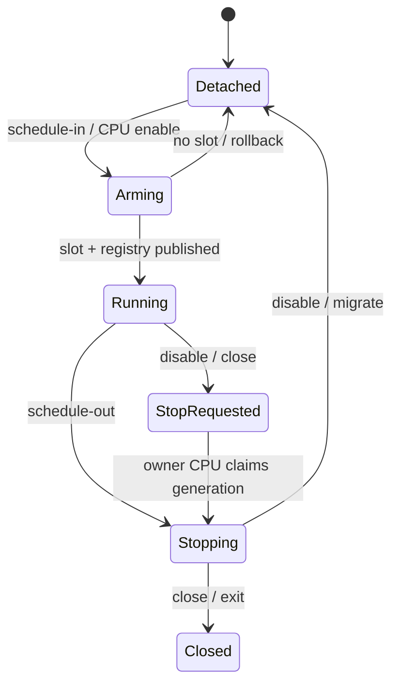

# StarryOS AArch64 Linux perf 设计

本文定义 StarryOS 在 AArch64 上兼容 Linux `perf_event_open(2)` 与 upstream `perf` 的实现边界。设计基线为 Linux v7.1 和 TGOSKits `dev` 提交 `5b2c89621f9bd25a5c5b57f28374f218eaca6da8`，来源实现为 JosephJoshua 的 PR #1577、#1601、#1602、#1603 及其间的调用链提交。旧分支只作为行为与测试来源，不直接合并；实现必须服从当前 CPU-local、IRQ、timer、PID、地址空间和锁模型。

## 1. 兼容范围

本功能让 AArch64 StarryOS 用户态通过标准 perf ABI 创建 task、CPU 和 system-wide 事件，并让 upstream `perf stat`、`perf record` 与 `perf report` 完成控制流。QEMU TCG 用于验证 ABI、生命周期和 ring 协议，OrangePi 5 Plus 用于验证真实 PMUv3、big.LITTLE 与溢出中断。

### 1.1 Linux v7.1 对照

`sys_perf_event_open()` 先执行 flags 与 `perf_event_attr` 版本拷贝，再解析目标和 group。下表记录本分支必须保持的用户可见语义，错误码由 `perf::uapi` 的显式校验转换，不依赖 `kbpf` 当前结构体大小。

对照源码是本地 `~/linux-src` 的精确标签 v7.1（`8cd9520d35a6c38db6567e97dd93b1f11f185dc6`）：[`perf_copy_attr()`](https://github.com/torvalds/linux/blob/8cd9520d35a6c38db6567e97dd93b1f11f185dc6/kernel/events/core.c#L13544-L13611)、[`perf_event_open()`](https://github.com/torvalds/linux/blob/8cd9520d35a6c38db6567e97dd93b1f11f185dc6/kernel/events/core.c#L13844-L14172)、[`_perf_ioctl()`](https://github.com/torvalds/linux/blob/8cd9520d35a6c38db6567e97dd93b1f11f185dc6/kernel/events/core.c#L6598-L6704)、[`group_sched_in()`](https://github.com/torvalds/linux/blob/8cd9520d35a6c38db6567e97dd93b1f11f185dc6/kernel/events/core.c#L2859-L2897) 和 [`perf_output_read_group()`](https://github.com/torvalds/linux/blob/8cd9520d35a6c38db6567e97dd93b1f11f185dc6/kernel/events/core.c#L8128-L8175) 分别约束 attr、target、ioctl、组调度与采样读布局；ARM event 映射以 [`arm_pmuv3.c`](https://github.com/torvalds/linux/blob/8cd9520d35a6c38db6567e97dd93b1f11f185dc6/drivers/perf/arm_pmuv3.c#L1195-L1273) 为准。

| 能力 | Linux v7.1 语义 | StarryOS 实现锚点 |
| --- | --- | --- |
| `attr.size` | 0 视为 VER0；短结构零填充；超长未知尾部必须全零；非法大小 `E2BIG` 并回写内核大小 | `perf::uapi::copy_perf_event_attr()` |
| flags | 支持 `FD_NO_GROUP`、`FD_OUTPUT`、`FD_CLOEXEC`；`PID_CGROUP` 的合法组合返回 `EOPNOTSUPP`；未知位 `EINVAL` | `PerfOpenFlags`、`sys_perf_event_open()` |
| task target | `pid >= 0,cpu == -1` 跟随线程；`cpu >= 0` 时限定运行 CPU | `PerfTarget::Task` |
| CPU target | `pid == -1,cpu >= 0` 为 system-wide；`-1/-1` 返回 `EINVAL` | `PerfTarget::Cpu` |
| group | 默认 ioctl 只控制指定 event，`PERF_IOC_FLAG_GROUP` 才控制整组；读快照 leader-first；跨上下文 link 返回 `EINVAL` | `PerfEvent::{members,group_leader,read_group}`、`PerTaskCounter::link_group()`、`SystemCounter::link_group()` |
| output | `FD_OUTPUT` 与 `SET_OUTPUT` 只允许相同 perf context；`SET_OUTPUT(-1)` 解除重定向 | `PerfEvent::{redirect_to,set_output}`、`PerfEventOps::{redirect_output,detach_output}` |
| read | 支持 value、ID、`time_enabled`、`time_running`、LOST 与 GROUP | `PerfReadValues` |
| sample | 支持 `PERF_SAMPLE_READ`、TID、CPU、period 和 kernel/user FP callchain | `sampling::{SampleSlot,SampleReadEntry}`、`perf::unwind` |
| mmap page | 只在事件实际运行于硬件槽时公开非零 `index` 与用户读能力 | `SystemCounter::write_rdpmc_snapshot()`、`PerTaskCounter::write_rdpmc_snapshot()` |

硬件事件若事件编码合法但目标 CPU 的 `PMCEID` 未实现，返回 Linux ARM PMUv3 backend 对应的 unsupported 错误；格式错误返回 `EINVAL`，错误 fd 返回 `EBADF`，目标线程消失返回 `ESRCH`。不能把未知字段、未知事件或输出关系静默忽略。

### 1.2 来源提交映射

JosephJoshua 的提交是累积能力链。迁移按能力拆分，以便每个提交能独立审查，并在当前 `dev` 上保留明确的来源说明。

| 来源 | 迁移能力 | 本分支修正 |
| --- | --- | --- |
| PR #1577 | SMP per-CPU PMU、big.LITTLE、system-wide、multiplex、mmap 计数页 | 删除全局 allocator 和旧 timer hook；按真实 CPU 能力调度；TCG 与板卡断言分离 |
| 调用链提交 | kernel/user frame-pointer callchain | IRQ 边界只发布值快照；用户 SP 取自 `UserContext.sp`；no-fault walker 不保存裸 `TrapFrame *` |
| PR #1601 | 五类 software counter、HW_CACHE | 补齐 inherit、enable-on-exec、迁移与每核 PMCEID 校验 |
| PR #1602 | 精确 TGID/TID、LOST | 事件 arm 时固定 PID identity；LOST 在下一次成功提交前写入，IRQ 不等待消费者 |
| PR #1603 | group、`PERF_SAMPLE_READ`、`record -a` | leader 所有权、弱成员引用、预构建 IRQ 快照、跨线程与关闭顺序校验 |

原 PR 的文件和提交仅用于追溯。当前实现不恢复旧 `axtask` 函数指针 hook、不降级 `axbacktrace`，也不引入第二套 current-CPU 指针或裸 PID 所有权。

## 2. 所有权模型

PMU 寄存器、IRQ PPI 和计数器槽天然属于 CPU。task event 的 fd 只拥有逻辑配置与累计值，真正运行的一代由目标 CPU 的状态持有。`CpuPin` 保护本核读取，`ExclusiveCpu` 保护本核硬件修改；远端 task-context 控制通过当前 CPU worker 执行，scheduler 与 IRQ 路径不等待、不分配。

### 2.1 每核状态

`percpu::CORE_PMU: CorePmu` 由 CPU-local 存储承载，每核缓存 `PmuInfo`、槽位 bitmap 和复用游标；`PmuInfo` 包含 `MIDR_EL1`、counter 数量与宽度以及 `PMCEID0/1_EL0`。`CPU_INFOS` 只提供跨核只读探测缓存，硬件槽仍只能由 owner CPU 分配。sysfs 从同一探测结果发布 event source 与 CPU mask，不能用 CPU 编号奇偶或硬编码 type 推断 cluster。



task event 用 `context_sequence` 的奇偶代次让远端 reset 只在稳定的 sched-in/out 区间提交；`last_cpu`、`slot`、`running` 与 owner-CPU 同步调用共同约束当前硬件代。disable、close 和线程退出先在 owner CPU 撤下 counter 与 `SampleSlot`，再释放保存 ring 生命周期的锚点，避免旧事件清除已经复用的槽或让 IRQ 看到失效指针。

### 2.2 调度与复用

task event 在 scheduler switch-in 时尝试进入本核运行队列，switch-out 时折叠计数并撤销 mmap `index`。system-wide event 固定在指定 CPU。unpinned 事件以调度单元轮转，`time_enabled/time_running` 分别累计逻辑启用和真实占槽时间；硬件 group 只能整体装载或整体等待。task pinned event 在调度时无法放置会进入 ERROR 并让 `read()` 返回 EOF；open-enabled system pinned event 会在 open 的同步放置阶段返回 `EBUSY`，之后启用失败也通过 `EBUSY` 报告。直接 system-wide sampling 需要在 open 时保留物理槽，因此槽耗尽也会立即返回 `EBUSY`。



每核首次完成 perf 初始化时注册复用 tick。callback 只推进预先分配的队列和寄存器状态，不获取可睡眠锁、不分配内存，也不执行对象析构。跨 CPU 同步操作只提交短的寄存器事务；资源释放在 task context、所有硬件与 IRQ registry 引用撤销之后执行。

### 2.3 group 与继承

文件层 `PerfEvent::{members,group_leader}` 和硬件层 `PerTaskCounter` / `SystemCounter` 的双向 group link 都使用 `Weak`，避免关闭顺序形成引用环；fd 表、task 的 `perf_counters` 和 event backend 提供实际强所有权。link 时验证 task identity 或 CPU context 完全相同；控制传播先收集仍存活的成员，再逐一操作。与 Linux v7.1 一致，普通 ioctl 只作用于指定 event，只有 `PERF_IOC_FLAG_GROUP` 才从 leader 传播到 siblings；member 自己的 `attr.disabled` 状态不会在 link 时被改写。

software inherit 使用“每线程 slice + 共享 aggregate”结构。child 的调度起点、last CPU 和 enable-on-exec 独立，累计值通过 `Arc<SwAggregate>` 汇入根事件；根 fd 关闭后，仍运行的 descendants 由自身 `Arc` 保持 aggregate 生命周期，不能引用已释放 event。

## 3. 中断与采样

采样路径必须在 PMU hard IRQ 中有确定的时间和空间上界。IRQ handler 只读取本核 registry，生成固定上限记录并尝试一次 ring 提交；它不得等待用户 tail、远端 CPU、内存分配器或可睡眠锁。

### 3.1 中断上下文快照

AArch64 kernel IRQ 和 user IRQ 入口按值构造 `InterruptedContext { pc, sp, fp, privilege }`。用户 SP 必须来自进入汇编保存的 `UserContext.sp`，不能读取 Rust dispatch 时已恢复为线程头指针的 `SP_EL0`。per-CPU snapshot 仅在一次 `dispatch_irq()` 动态作用域内可见，RAII guard 在返回和 unwind 路径清除旧值。

`perf::unwind::{kernel_callchain,user_callchain}` 调用 `axbacktrace::walk_fp()` 并注入 reader：内核栈使用 `nofault::read_kernel_word()`，用户栈使用 `nofault::read_user_word()`。walker 检查 8 字节对齐、地址单调递增、地址范围、checked arithmetic、合理 frame gap 与输出容量，且不在遍历过程中分配。

### 3.2 ring 与 LOST

`sampling::RingEndpoint` 同时拥有 cacheable `GlobalPage`、固定 mapping geometry 和 `IrqMutex` producer gate。VMA anchor 与 redirect source 对 endpoint 持 `Arc`；活动 `SampleSlot` 的裸 endpoint 指针只在 event 持有的强引用存续期内注册。所有 PMU、sideband 与 redirect writer 经过同一个串行化入口。

ring 无空间或 producer gate 竞争时增加 event 的 pending lost 数。下一次能够写入时先提交 `PERF_RECORD_LOST`，成功后才清零 pending 数，再尝试当前 record；任一步失败都保留累计值。该过程不等待消费者，因此满环测试能在有限时间内结束。

### 3.3 读取快照

`PERF_SAMPLE_READ` 在 arm 前构建有容量上限的 `[SampleReadEntry; MAX_SAMPLE_READ_EVENTS]` 并存入 `SampleSlot`。数组按 leader-first 保存稳定 callback context 和 event ID，IRQ 只做 owner-local PMU/原子读取与定长编码，不遍历可变 group 列表，也不进行分配。group member 保留自己的 `attr.disabled` 状态；仅 leader disabled、member enabled 的常见 perf 模式会在 leader 启用时整体装载。

## 4. 事件语义

硬件与软件事件共享 target、group、output 和 fd 控制层，但计数来源不同。公共层不根据 backend 类型改变 Linux ABI 的错误优先级或 read/sample 布局。

### 4.1 硬件事件

generic hardware event 和 `PERF_TYPE_HW_CACHE` 最终转换为 ARM PMUv3 event code。每个目标 CPU 根据自身 `PMCEID` 决定可调度性；与 Linux v7.1 `__armv8_pmuv3_map_event_id()` 一致，branch event 优先选择 `BR_RETIRED`，不可用时回退到 `PC_WRITE_RETIRED`。A55/A76 均使用 Linux 的通用 PMUv3 map，sysfs source 的 type 和 cpumask 来自探测结果，测试只能从 sysfs 发现 type。

| Linux cache 事件 | ARM PMUv3 access | ARM PMUv3 miss |
| --- | --- | --- |
| L1D | `0x04` | `0x03` |
| L1I | `0x14` | `0x01` |
| LLC read | `0x36` | `0x37` |
| DTLB | `0x25` | `0x05` |
| ITLB | `0x26` | `0x02` |
| BPU | `0x12` | `0x10` |

Linux v7.1 的 A55/A76 初始化使用 `PMUV3_INIT_SIMPLE`，所以通用 map 只接受表中的 read 组合；L1/LL/TLB write、PREFETCH、NODE 和非法 op/result 组合返回明确错误。QEMU 上 cache、branch 或 raw event 的数值不是验收依据；合法拒绝也属于 TCG 门禁的预期结果。

### 4.2 软件事件

software backend 实现 `CPU_CLOCK`、`TASK_CLOCK`、`PAGE_FAULTS`、`CONTEXT_SWITCHES` 和 `CPU_MIGRATIONS`。调度 hook 更新 clock、switch 和 migration；用户 page fault 与 kernel-on-user-memory fault 分别在各自入口精确记一次；fork 根据 inherit 创建 child slice；exec 只启用带 `enable_on_exec` 的事件。

software event 同样参加 group 控制和 sample read。关闭 leader、先关闭成员或 child 先退出均不得留下悬空引用；退出路径先复制事件 `Arc` 列表并释放 thread lock，再执行可能等待 owner CPU 的 teardown。

## 5. 验证边界

验证分成确定性 host contract、Starry QEMU system case、upstream perf app 和真实板卡四层。每层证明不同事实，QEMU 绿色不能被解释成真实 PMU 性能正确。

### 5.1 QEMU TCG

AArch64 QEMU 显式使用 `-cpu cortex-a53,pmu=on -smp 4`。TCG 可验证 `perf_event_open`、计数器生命周期、溢出控制、mmap ring、group、LOST、callchain 编码和 upstream perf 控制流；cycle 是虚拟时间，instructions 依赖精确 icount，多数 cache/branch/stall 事件不实现或为零。

```bash
cargo xtask starry test qemu --arch aarch64 -c qemu/system
cargo xtask starry test qemu --arch x86_64 -c qemu/system
cargo xtask starry test qemu --arch riscv64 -c qemu/system
cargo xtask starry test qemu --arch loongarch64 -c qemu/system
cargo xtask starry app qemu -t linux-perf --arch aarch64
```

system cases 覆盖 target 矩阵、SMP 迁移、超槽复用、group 生命周期、ring wrap/redirect、有限时长 LOST、四层用户 FP callchain、software inherit、enable-on-exec、HW_CACHE 支持矩阵以及 attr/flags 错误顺序。upstream perf smoke 只依赖 cycles 和 software events，不用默认 instructions 作为成功条件。

### 5.2 OrangePi 5 Plus

板卡 app 使用 8 核 Starry build，不复用 `max_cpu_num = 1` 的通用 board test wrapper。工具与 workload 通过 `session_files` 临时上传，不写入 Linux 或 Starry 持久根文件系统。

```bash
cargo xtask starry app board -t linux-perf -b OrangePi-5-Plus
```

验收脚本通过 `/proc/cpuinfo` 与 MIDR 检查 CPU0 的 A55 event-source mask，并要求 A76 mask 至少包含 CPU4 或 CPU6；实际 workload 固定在 CPU0 和 CPU4，迁移用例验证 CPU0 → CPU4。板卡验收真实 counter 数量、动态 PMU sysfs/cpumask、cycles/instructions/cache/branch 递增、overflow sampling、migration、multiplex、callchain 与 `record -a`；不设置跨 cluster 性能比阈值。

## 6. 非目标与交付

本分支只实现 Starry guest Linux perf。`tools/qperf` 是 QEMU TCG translation-block profiler，host `perf` 包装统计的是 QEMU 进程；两者不使用 guest PMUv3 ABI。Axvisor PMU 虚拟化、AArch64 qperf、容量感知调度以及 PR #1656、#1658、#2001、#2064 均不在范围内。

### 6.1 提交边界

交付按设计与 ABI、per-CPU PMU/SMP、sampling/callchain、software/cache/group、QEMU/board E2E 分提交。每个提交正文保留对应 Joseph PR 或提交引用，并在变基到最新 `origin/dev` 后运行 focused case、四架构 system suite、`cargo fmt`、`cargo xtask clippy --since origin/dev` 与 `cargo xtask test --since origin/dev`。

### 6.2 完成标准

Draft PR 在 CI 或板卡尚未完成时必须明确标记待验收，不关闭原 PR。只有 QEMU app 成功执行 `perf stat`、`perf record -a`、`perf report --stdio`，OrangePi 收据覆盖真实 PMU 项，且相关 GitHub Actions 到达绿色终态后，才能把实现描述为完成。
