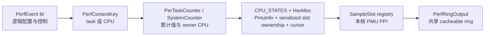
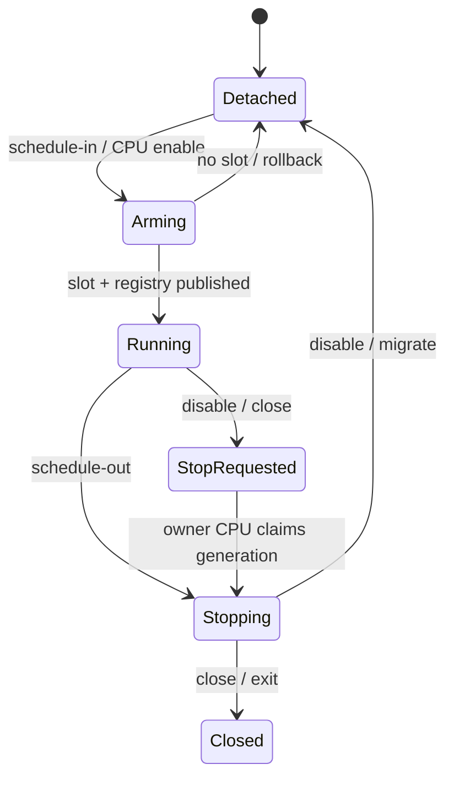

# StarryOS AArch64 Linux perf 设计

本文定义 StarryOS 在 AArch64 上兼容 Linux `perf_event_open(2)` 与 upstream `perf` 的实现边界。Linux 语义基线为 v7.1，当前整合的 TGOSKits `dev` 提交为 `e8c2e66466682528d64e4b8102d5940333beaabb`。来源实现为 JosephJoshua 的 PR #1577、#1601、#1602、#1603 及其间的调用链提交。来源分支只提供行为与测试参考，不直接合并；实现遵循当前 CPU-local、IRQ、timer、PID、地址空间和锁模型。

## 1. 兼容范围

本功能让 AArch64 StarryOS 用户态通过标准 perf ABI 创建 task、CPU 和 system-wide 事件，并让 upstream `perf stat`、`perf record` 与 `perf report` 完成控制流。QEMU TCG 用于验证 ABI、生命周期和 ring 协议，OrangePi 5 Plus 用于验证真实 PMUv3、big.LITTLE 与溢出中断。

### 1.1 Linux v7.1 对照

`sys_perf_event_open()` 先执行 flags 与 `perf_event_attr` 版本拷贝，再解析目标和 group。下表记录本分支必须保持的用户可见语义，错误码由 `perf::uapi` 的显式校验转换，不依赖 `kbpf` 当前结构体大小。

对照源码是本地 `~/linux-src` 的精确标签 v7.1（`8cd9520d35a6c38db6567e97dd93b1f11f185dc6`）：[`perf_copy_attr()`](https://github.com/torvalds/linux/blob/8cd9520d35a6c38db6567e97dd93b1f11f185dc6/kernel/events/core.c#L13544-L13611)、[`perf_event_open()`](https://github.com/torvalds/linux/blob/8cd9520d35a6c38db6567e97dd93b1f11f185dc6/kernel/events/core.c#L13844-L14172)、[`_perf_ioctl()`](https://github.com/torvalds/linux/blob/8cd9520d35a6c38db6567e97dd93b1f11f185dc6/kernel/events/core.c#L6598-L6704)、[`group_sched_in()`](https://github.com/torvalds/linux/blob/8cd9520d35a6c38db6567e97dd93b1f11f185dc6/kernel/events/core.c#L2859-L2897) 和 [`perf_output_read_group()`](https://github.com/torvalds/linux/blob/8cd9520d35a6c38db6567e97dd93b1f11f185dc6/kernel/events/core.c#L8128-L8175) 分别约束 attr、target、ioctl、组调度与采样读布局；ARM event 映射以 [`arm_pmuv3.c`](https://github.com/torvalds/linux/blob/8cd9520d35a6c38db6567e97dd93b1f11f185dc6/drivers/perf/arm_pmuv3.c#L1195-L1273) 为准。

| 能力 | Linux v7.1 语义 | StarryOS 实现锚点 |
| --- | --- | --- |
| `attr.size` | 0 视为 VER0；短结构零填充；超长未知尾部必须全零；非法大小 `E2BIG` 并回写内核大小 | `perf::uapi::copy_perf_event_attr()` |
| flags | 支持 `FD_NO_GROUP`、`FD_OUTPUT`、`FD_CLOEXEC`；`PID_CGROUP` 的合法组合返回 `EOPNOTSUPP`；未知位 `EINVAL` | `PerfOpenFlags`、`sys_perf_event_open()` |
| task target | `pid >= 0,cpu == -1` 跟随线程；`cpu >= 0` 时限定运行 CPU | `PerfTarget::Task` |
| CPU target | `pid == -1,cpu >= 0` 为 system-wide；`-1/-1` 返回 `EINVAL` | `PerfTarget::Cpu` |
| group | 默认 ioctl 只控制指定 event，`PERF_IOC_FLAG_GROUP` 才控制整组；读快照 leader-first；跨上下文 link 返回 `EINVAL` | `PerfEvent::{members,group_leader,read_group}`、`PerTaskCounter::link_group()`；缺少统一 coordinator 的 fixed-CPU hardware group、mixed software/hardware group 和 direct system-wide sampling group 在资源分配前返回 `EOPNOTSUPP` |
| output | `FD_OUTPUT` 与 `SET_OUTPUT` 只允许相同 perf context；`SET_OUTPUT(-1)` 解除重定向 | `PerfEvent::{redirect_to,set_output}`、`PerfEventOps::{redirect_output,detach_output}` |
| read | 支持 value、ID、`time_enabled`、`time_running`、LOST 与 GROUP | `PerfReadValues` |
| RESET | 清零事件值，保留累计 `time_enabled/time_running`；停止事务必须先完成 | `SystemFlexCounter::{finish_slice,reset}`、`SwEventState::reset()`、`SwClock` |
| sample | 支持 `PERF_SAMPLE_READ`、TID、CPU、period 和 kernel/user FP callchain；AArch64 `PERF_SAMPLE_REGS_USER` 接受零 mask 或 LR mask `1 << 30`，分别输出 ABI_NONE 或 ABI_64 与真实 LR | `sampling::{SampleSlot,SampleReadEntry,build_sample}`、`perf::unwind`、`perf::uapi::validate_perf_event_attr()` |
| mmap page | 沿用最新 dev 的授权边界：未建立逐事件用户直接读授权时，`index` 与用户读能力均为零，使用 read(2) | `PerfRdpmcPage::publish()`、`Pmu::disable_user_access()` |

硬件事件若事件编码合法但目标 CPU 的 `PMCEID` 未实现，返回 Linux ARM PMUv3 backend 对应的 unsupported 错误；格式错误返回 `EINVAL`，错误 fd 返回 `EBADF`，目标线程消失返回 `ESRCH`。不能把未知字段、未知事件或输出关系静默忽略。

`uapi::read_zero_extended()` 对截在字段中间的 `attr.size` 保留已传入字节，仅将缺失字节补零，和 `perf_copy_attr()` 的完整结构零填充一致。`perf-open-abi` 分别用 111、117 字节的属性检查部分 `reserved_2` 与 AUX 保留位返回 `EINVAL`，并保留部分字段全零时可以成功打开的对照。

### 1.2 来源提交映射

JosephJoshua 的提交是累积能力链。迁移按能力拆分，以便每个提交能独立审查，并在当前 `dev` 上保留明确的来源说明。

| 来源 | 迁移能力 | 本分支修正 |
| --- | --- | --- |
| PR #1577 | SMP per-CPU PMU、big.LITTLE、system-wide、multiplex、mmap 计数页 | 固定与 per-CPU flexible 槽统一分配事务；按真实 CPU 能力调度；TCG 与板卡断言分离 |
| 调用链提交 | kernel/user frame-pointer callchain | IRQ 边界只发布值快照；用户 SP 取自 `UserContext.sp`；no-fault walker 不保存裸 `TrapFrame *` |
| PR #1601 | 五类 software counter、HW_CACHE | 补齐 inherit、enable-on-exec、迁移与每核 PMCEID 校验 |
| PR #1602 | 精确 TGID/TID、LOST | 事件 arm 时固定 PID identity；LOST 在下一次成功提交前写入，IRQ 不等待消费者 |
| PR #1603 | group、`PERF_SAMPLE_READ`、`record -a` | leader 所有权、弱成员引用、预构建 IRQ 快照、跨线程与关闭顺序校验 |

原 PR 的文件和提交仅用于追溯。当前实现不恢复旧 `axtask` 函数指针 hook、不降级 `axbacktrace`，也不引入第二套 current-CPU 指针或裸 PID 所有权。

## 2. 所有权模型

PMU 寄存器、IRQ PPI 和计数器槽天然属于 CPU。task event 的 fd 只拥有逻辑配置与累计值，真正运行的一代由目标 CPU 的状态持有。`CpuPin` 保护本核读取，`ExclusiveCpu` 保护本核硬件修改；需要 task context 的远端控制通过 CPU worker 执行，fixed-CPU flexible 事件的 read/disable/reset 通过同步 IPI 执行。scheduler 与 IRQ 路径不等待任务完成、不分配。

寄存器操作通过 `hw_owner::on_pmu/on_counter` 进入 HAL 的局部排他会话并使用 `ax_cpu::pmu::Pmu`，不保留旧自由函数。Linux event/cache 编码和 cluster 选择归 `event_map`；硬件 `PmuInfo` 保留 MIDR 与完整 PMCEID。

首次初始化 reset 后选择 32 位 programmable overflow，保持 `SamplingCount` 和 `CounterExtender` 的算术契约，cycle 保持 64 位。`Pmu::disable_overflow_irq()` 同时清除 pending 标志，因此 counting 停止顺序为停表、结算 pending wrap、禁用 IRQ、注销。`system_flex::tests::stop_is_not_published_before_hardware_commit` 通过真实 PMU 溢出验证该顺序和停止状态的发布边界。

### 2.1 每核状态

`percpu::CPU_STATES` 按 CPU 缓存 `PmuInfo` 和复用游标；`PmuInfo` 包含 `MIDR_EL1`、counter 数量与宽度以及 `PMCEID0/1_EL0`。`hw_allocation::HwAlloc` 在同一个 `IrqMutex` 内维护可迁移 task-fixed 事件的全局保留 bitmap，以及 system event 与 flexible slice 共用的每 CPU bitmap。task-fixed 申请检查所有 CPU 的在用槽，CPU-local 申请只检查本核与全局保留，两者在锁内原子提交。system cycle counter 也逐 CPU 保留；全局 task cycle 保留与任何本核 cycle 保留互斥。system event 的分配、失败回滚与关闭都携带同一个 `PerfCpuId`，并从目标 CPU 的能力缓存校验事件，不再读取 opener CPU 的 PMU 能力。分配数量使用本次已验证目标的参数，不通过可被另一 opener 覆盖的全局数量传递。sysfs 从同一探测结果发布 event source 与 CPU mask。

`perf-hw-cpu-slots` 在四个 CPU 上各启用两个 system event，分别测试 sampling 与 counting。总数超过 QEMU 单核六个 programmable slot，但每核需求仍有余量。所有事件同时存在时读取非零计数，关闭后重复整个流程，验证独立容量与槽回收；旧全局 bitmap 在第七次 open 返回 `EBUSY`。



task event 用 `PmuRunState` 和携带 owner CPU、counter、registration 的 `PmuRunLease` 约束当前硬件代。RESET 先禁止重新调入并完成当前代停表，再清值和恢复原启用意图。disable、close 和线程退出先在 owner CPU 撤下 counter 与 `SampleSlot`，再释放保存 ring 生命周期的锚点，避免旧事件清除已经复用的槽或让 IRQ 看到失效指针。

### 2.2 调度与复用

task event 在 scheduler switch-in 时尝试进入本核运行队列，switch-out 时折叠计数并撤销 mmap `index`。对当前正在运行的目标线程，`attach()` 在禁止抢占的作用域内立即发布 active context，等价于 Linux `perf_install_in_context()` 对首个 disabled event 执行的 running-task 安装；后续 `PERF_EVENT_IOC_ENABLE` 不依赖额外的 `sched_yield()`。system-wide event 固定在指定 CPU。unpinned 事件以调度单元轮转，`time_enabled/time_running` 分别累计逻辑启用和真实占槽时间；`SystemFlexCounter::read_on_owner()` 在 owner CPU 同步合并当前 active slice，而不等待下一次轮转。task hardware group 只能整体装载或整体等待。硬件 pinned event 的优先放置和失败后的 ERROR/EOF 状态尚未实现，`perf_event_open()` 在分配 backend 前对 task/CPU pinned leader 返回 `EOPNOTSUPP`；group member 的非法 pinned 属性仍返回 `EINVAL`。直接 system-wide sampling 需要在 open 时保留物理槽，槽耗尽返回 `EBUSY`。

`perf_sched_in_counters()` 在 CPU/cluster placement 检查前开始 enabled context：任务在不匹配 CPU 上运行仍消耗 context time，但不取得硬件槽、不增加计数和 running time。`perf-hw-smp-migrate` 为仅在 CPU1 运行的子任务创建 CPU0-filtered 事件，验证退出后 `time_enabled > 0`、value 与 `time_running == 0`。



每核首次完成 perf 初始化时注册复用 tick。callback 只推进预先分配的队列和寄存器状态，不获取可睡眠锁、不分配内存，也不执行对象析构。跨 CPU 同步操作只提交短的寄存器事务；资源释放在 task context、所有硬件与 IRQ registry 引用撤销之后执行。

进程的 perf、CPU interval timer 和 RTTIME watchdog 需求共同驱动 `SchedulerTickGate`。`ProcessAccountingState::publish_scheduler_tick_gate()` 在一个短的 IRQ-safe 临界区内重新读取所有来源并发布 gate，避免最后一个 perf lease 释放时计算出的旧关闭值覆盖并发新 lease 的启用。来源计数仍先发布、再调用统一 refresh；临界区不获取 timer 或 scheduler task 锁，也不分配。kernel 回归在来源快照与 gate 写入之间尝试插入另一个发布，验证该事务边界不能被穿过。

`SystemFlexCounter::control_on_owner()` 对照 Linux v7.1 的 `event_function_call()` → `cpu_function_call()` → `smp_call_function_single(..., wait=1)`，通过同步 `run_on_cpu_sync()` 完成固定 CPU 事件的控制。本核直接执行，远端由 IPI 执行，不等待普通优先级的 `perf-flex` 或 `perf-cpu` worker，避免 FIFO 调用者或 owner CPU 上的 FIFO 负载阻止停表。调用方只禁止迁移，不屏蔽远端等待期间的本核 IPI，也不持 callback 所需的锁。

`SystemFlexCounter::finish_slice_observed()` 将 active 锁保持到停表、注销、累计值提交和槽释放全部完成，不能在取出 slice 时提前发布完成。`sampling::detach_counting()` 只撤销登记并转移引用；IPI 把取下的 `Arc` 写入调用方栈上的 `ControlRequest`，同步返回后由 task context 释放。传输失败沿 ioctl 调用链返回，不伪造完成。`reset_on_owner()` 在原槽上清零计数、溢出状态与扩展值，然后恢复该槽，保留 enabled 状态与累计 enabled/running 时间，对齐 Linux `_perf_event_reset()` 清值但不关闭事件的语义。

`ControlOperation::Read` 与 disable/reset 共用同步 IPI 传输，把 `read_on_owner()` 的标量快照写入调用方栈上的 `ControlRequest::snapshot`，不再排入普通 CPU worker。它保留活动切片，不释放计数器或等待下一次调度；对应 Linux `perf_event_read()` 的同步跨核读取。

`perf-hw-stat` 下的 `perf-hw-fifo-stop` 回归先以两次读之间增加的 `time_running` 确认活动切片，再验证 FIFO 调用者的 READ、DISABLE、RESET 和最后 FD close。本核与远端控制分别覆盖；远端场景由较低优先级的 FIFO 任务接管 owner CPU，保证普通 worker 无法执行。远端 READ 必须返回递增计数，DISABLE 后计数与时间必须稳定，RESET 后计数继续增加且累计时间不倒退；独立 CPU 的看门狗只用于报告失败。

RESET 的精确清零由 kernel PMU 回归在 `exclude_kernel` 的活动槽上验证，同时检查硬件 enable 位、slot 起点及累计时间保持不变。用户态远端 RESET 回归主动覆盖调用者延后读取的合法状态：目标继续计数后，首次读数可以大于 RESET 前读数，不能用这个跨时间比较判断是否清零；用户态只验证控制返回、连续计数与时间不倒退，不弱化内核的精确清零检查。

### 2.3 group 与继承

文件层 `PerfEvent::{members,group_leader}` 和硬件层 `PerTaskCounter` / `SystemCounter` 的双向 group link 都使用 `Weak`，避免关闭顺序形成引用环；fd 表、task 的 `perf_counters` 和 event backend 提供实际强所有权。link 时验证 task identity 或 CPU context 完全相同；控制传播先收集仍存活的成员，再逐一操作。与 Linux v7.1 一致，普通 ioctl 只作用于指定 event，只有 `PERF_IOC_FLAG_GROUP` 才从 leader 传播到 siblings；member 自己的 `attr.disabled` 状态不会在 link 时被改写。

文件层建组通过 `live_group_leader()` 判断候选是否仍属于活跃组，而非检查保存弱引用的 `Option` 是否非空；旧 leader 关闭后的独立成员可以重新作为 leader。软件事件关闭时持 `SwEventState::control` 标记 family 已关闭，取得所有存活 binding 后，在各自任务上下文内解链并恢复 enabled siblings 的运行与启用区间。`link_group_binding()` 也持同一 leader family control，使继承关系发布不能越过关闭事务；关闭后拒绝建链时不修改成员的独立状态。

software inherit 使用“每线程 slice + 共享 aggregate”结构。child 的调度起点、last CPU 和 enable-on-exec 独立，累计值通过 `Arc<SwEventState>` 汇入根事件。`SwEventState::bindings` 弱引用所有继承 binding，`control` 串行化父 FD 的启停与 clone；启停先取得 binding 快照，再逐个进入所属线程上下文，不能只改变根 binding。根 fd 关闭使共享状态失效，descendants 的 `Arc` 仅保持内存生命周期，不能继续计数或引用已释放 event。

`SwTaskContext::close()` 在相同的线程上下文锁内永久关闭安装入口并退休现有 binding；即使当前没有 software event，退出 hook 也必须发布这个状态。已取得线程引用但尚未安装的 open 随后由 `attach()` 返回 `ESRCH`，成功安装后才增加 `PERF_SW_ACTIVE`。内核状态边界回归执行空 context 的 close → attach，防止退出快路径遗漏最后一次安装检查，对齐 Linux `TASK_TOMBSTONE` 门禁。

`SwEventState::inherit_thread` 保留线程限定继承属性。`sw::on_clone_inherit()` 仅在 parent/child 共享同一个 `ProcessData` 时复制这种 binding；该共享关系由 `clone` 的 `CLONE_THREAD` 分支建立，普通 fork 即使随后 exec 也不会获得该软件事件。普通 `inherit` 仍覆盖两类子任务。

`PerfEvent::control_group()` 从实际 leader 执行 GROUP ioctl；不带 GROUP 的操作保留 siblings 各自的启用意图。`read_group()` 从实际 leader 取值，但编码格式采用被读取 fd 的 `read_format`。新 member 先以 disabled 状态建立 backend 和组关系，再按原始 attr 启用，避免 link 前独立计数。`perf_sched_in_counters()` 先为整个启用组保留槽，`prepare_counter()` 完成全部寄存器和 IRQ registry 准备后才启动硬件；准备失败回滚整组。

`PerfEvent::transaction` 是 leader 与成员共享的可睡眠事务锁，在最后一个成员释放前保持存在。GROUP ioctl 的整个成员遍历、普通启停/RESET、文件读取和新成员发布都经过此边界，不能在成员操作之间释放；backend 自有锁只作为内层锁，不反向获取文件事务锁。独立组不共享文件事务锁，CPU 软件 backend 的 `SYSTEM_CONTEXTS` 继续保护同 CPU 的计时状态。确定性 kernel 回归暂停“成员已启用、leader 尚未启用”的阶段，再从成员 FD 发起 GROUP DISABLE，验证它必须等待整次 ENABLE 完成，不能留下混合状态。

硬件 inherited child 使用独立的 flexible 资源，在每个 slice 从执行 CPU 取得物理槽，不复制 parent 的固定槽。`on_clone_inherit()` 在发布 child 前重建其 leader/sibling 关系。硬件与软件 binding 的 `enable_on_exec` 使用一次性原子状态；首次 exec 消费标志，后续 disable 不会被第二次 exec 撤销。fork 在 family ioctl 串行化边界内读取 parent 的实际启用状态，以保留 exec 对单个 binding 的影响。

per-task sampling group 由 `PerTaskCounter` 统一调度并预构建 `PERF_SAMPLE_READ` 表。fixed-CPU flexible hardware event 目前各自拥有 `SystemFlexCounter` worker，mixed software/hardware group 也没有 Linux 的 PMU-context migration coordinator；这两类组合与 direct system-wide sampling group 都在创建 member backend 前返回 `EOPNOTSUPP`。这项显式拒绝防止“文件层已成组、硬件层却各自运行”的静默错误，也保证失败路径不残留 PMU 槽、worker 或调度注册。后续若补齐 fixed-CPU group，必须用同一个 coordinator 事务式取得全部槽并生成一次 leader-first read snapshot，不能恢复当前被拒绝的 no-op link。

## 3. 中断与采样

采样路径必须在 PMU hard IRQ 中有确定的时间和空间上界。IRQ handler 只读取本核 registry，生成固定上限记录并尝试一次 ring 提交；它不得等待用户 tail、远端 CPU、内存分配器或可睡眠锁。

### 3.1 中断上下文快照

AArch64 kernel IRQ 和 user IRQ 入口按值构造 `InterruptedContext { pc, sp, fp, lr, privilege }`。用户 SP 必须来自进入汇编保存的 `UserContext.sp`，不能读取 Rust dispatch 时已恢复为线程头指针的 `SP_EL0`。LR 来自保存的 `x[30]`，用于 upstream perf 的 AArch64 FP unwinder 请求；只有用户 IRQ 且事件选择 LR 时才编码 ABI_64 和 LR，其他情况输出 ABI_NONE，不伪造用户寄存器。per-CPU snapshot 仅在一次 `dispatch_irq()` 动态作用域内可见，RAII guard 在返回和 unwind 路径清除旧值。

`perf::unwind::{kernel_callchain,user_callchain}` 调用 `axbacktrace::walk_fp()` 并注入 reader：内核栈使用 `nofault::read_kernel_word()`，用户栈使用 `nofault::read_user_word()`。walker 检查 8 字节对齐、地址单调递增、地址范围、checked arithmetic、合理 frame gap 与输出容量，且不在遍历过程中分配。

### 3.2 ring 与 LOST

`sampling::RingEndpoint` 同时拥有 cacheable `GlobalPage`、固定 mapping geometry 和 `IrqMutex` producer gate。VMA anchor 与 redirect source 对 endpoint 持 `Arc`；活动 `SampleSlot` 的裸 endpoint 指针只在 event 持有的强引用存续期内注册。所有 PMU、sideband 与 redirect writer 经过同一个串行化入口。

ring 无空间或 producer gate 竞争时增加 event 的 pending lost 数。下一次能够写入时先提交 `PERF_RECORD_LOST`，成功后才清零 pending 数，再尝试当前 record；任一步失败都保留累计值。该过程不等待消费者，因此满环测试能在有限时间内结束。

`SampleSlot::sample_id_all` 从 task 或 system-wide 事件一路传入，并在输出重定向替换注册时保留。LOST 与其他非采样记录共用 `sample_id::SampleId::encode()`，按 TID、TIME、ID、STREAM_ID、CPU、IDENTIFIER 的顺序编码选中的尾部字段；LOST 的 `header.size` 包含尾部。IRQ 路径只使用固定大小栈缓冲，身份、时间与随后同次提交的 SAMPLE 来自同一快照，未开启 `sample_id_all` 时仍为 24 字节。

`PerTaskCounter` 分别保存 primary `sample_id` 与具体实例的 `stream_id`。根事件两者相同；每个继承子事件保留父 ID，但通过同一 `allocate_event_id()` 分配独立 stream identity。`SampleSlot` 与 `SidebandTarget` 传递两者。对齐 Linux `primary_event_id()` 和 `__perf_event_header__init_id()`，普通 SAMPLE、COMM 的 ID/IDENTIFIER 使用 primary ID，STREAM_ID 使用具体事件 ID。LOST 则遵循 `__perf_output_begin()`：继承输出先转向父事件，再记账和生成记录，因此继承家族通过 `PerTaskConfig::loss` 共享父事件的 `LossState`，`SampleId::encode_lost()` 的固定头和尾部 STREAM_ID 都使用父 ID。`perf-hw-inherit-stream` 验证两次 fork/exec 的 SAMPLE 与 COMM 身份；`perf-hw-lost` 由子事件独占目标 CPU 填满共享 ring，验证父 FD 的丢样总数、LOST 父身份和普通 SAMPLE 子身份。

### 3.3 读取快照

`PERF_SAMPLE_READ` 在 arm 前构建有容量上限的 `[SampleReadEntry; MAX_SAMPLE_READ_EVENTS]` 并存入 `SampleSlot`。数组按 leader-first 保存稳定 callback context 和 event ID，IRQ 只做 owner-local PMU/原子读取与定长编码，不遍历可变 group 列表，也不进行分配。`build_sample()` 按 Linux 顺序先编码 `ID/STREAM_ID/CPU/PERIOD/READ`，再编码 callchain 和 `REGS_USER` ABI word；`SAMPLE_RECORD_MAX_LEN` 为每个支持字段保留固定上界。group member 保留自己的 `attr.disabled` 状态；仅 leader disabled、member enabled 的常见 perf 模式会在 leader 启用时整体装载。

task 的 `SampleReadEntry::owned()` 强持有回调对象，直到注册代被撤销。`ThreadPerfContext::attach()` 保留仍被 sampling slot 引用的已关闭 counter，使 scheduler 撤销 slot 时不会执行 counter 的最后析构；后续 task-context attach 或线程释放完成回收。非 GROUP 采样只读取 source；GROUP 采样保持 leader-first 顺序。各 event 的 `SamplingCount` 独立累计 raw delta，回调只读取累计快照，不通过数组位置推断 overflow 归属。

`SamplingCountState::remaining` 跟踪逻辑周期剩余事件数，每次 raw 更新扣除已观察的 delta。单次硬件装载由 `hardware_period()` 限制为 `u32::MAX >> 1`，为中断延迟留出余量。中间片段 IRQ 只重装计数器；仅 `period_complete()` 为真时输出样本，`PERF_SAMPLE_PERIOD` 仍是请求的逻辑周期。`rearm()` 保留溢出后的超额计数，避免丢失整个 32 位回绕或提前产生样本。

`SamplingCountState::period` 记录当前逻辑周期，首次 arm 才初始化 `remaining`。task 切片结束后只把该片段的 total 折叠到累计值；下次切入清零片段 total，但保留 remaining 与已调整的 period。system event 的 DISABLE/ENABLE 同样续接周期，RESET 只清事件值，不丢弃 `period_left`，对应 Linux `_perf_event_reset()` 与 `armpmu_event_set_period()`。`perf-hw-sliced-period` 强制同 CPU 管道往返或 system event 启停，并检查每段增量小于一个周期、总增量超过三个周期时仍输出样本。

PMU IRQ 按 Linux `armv8pmu_handle_irq()` 的顺序通过 `hw_owner::with_counters_paused()` 暂停整个 PMU，再生成组快照和重装计数器。该作用域用 `NoPreemptIrqSave` 保持 CPU 与 IRQ 排他边界，各次寄存器事务分别使用短 `Pmu` 会话，避免在持有一个会话时递归创建另一个会话。保留各槽的 enable 位，返回时恢复原全局 enable；恢复时不写回具有清零副作用的 PMCR P/C 位。

## 4. 事件语义

硬件与软件事件共享 target、group、output 和 fd 控制层，但计数来源不同。公共层不根据 backend 类型改变 Linux ABI 的错误优先级或 read/sample 布局。

### 4.1 硬件事件

generic hardware event 和 `PERF_TYPE_HW_CACHE` 最终转换为 ARM PMUv3 event code。每个目标 CPU 根据自身 `PMCEID` 决定可调度性；与 Linux v7.1 `__armv8_pmuv3_map_event_id()` 一致，branch event 优先选择 `BR_RETIRED`，不可用时回退到 `PC_WRITE_RETIRED`。A55/A76 均使用 Linux 的通用 PMUv3 map，sysfs source 的 type 和 cpumask 来自探测结果，测试只能从 sysfs 发现 type。

| Linux cache 事件 | ARM PMUv3 access | ARM PMUv3 miss |
| --- | --- | --- |
| L1D | `0x04` | `0x03` |
| L1I | `0x14` | `0x01` |
| LLC read | `0x36` | `0x37` |
| DTLB | `0x25` | `0x05` |
| ITLB | `0x26` | `0x02` |
| BPU | `0x12` | `0x10` |

Linux v7.1 的 A55/A76 初始化使用 `PMUV3_INIT_SIMPLE`，所以通用 map 只接受表中的 read 组合；L1/LL/TLB write、PREFETCH、NODE 和非法 op/result 组合返回明确错误。QEMU 上 cache、branch 或 raw event 的数值不是验收依据；合法拒绝也属于 TCG 门禁的预期结果。

### 4.2 软件事件

software backend 实现 `CPU_CLOCK`、`TASK_CLOCK`、`PAGE_FAULTS`、`CONTEXT_SWITCHES` 和 `CPU_MIGRATIONS`。调度 hook 更新 clock、switch 和 migration；用户 page fault 与 kernel-on-user-memory fault 分别在各自入口精确记一次；fork 根据 inherit 创建 child slice；exec 只启用带 `enable_on_exec` 的事件。

软件 task clock 的 `SwClock` 分别保存 lifetime running time 和可重置事件值。RESET 记录截止时间但保留 running/enabled 时间；跨越 RESET 的 slice 在结束时将完整时长计入 running time，仅将截止点之后的部分计入事件值。两者在同一 IRQ-safe 临界区提交。system clock 用 `SwSystemCounter::clock_offset_ns` 从累计 enabled time 派生重置后的值，不改变时间字段。

`SwPerTaskCounter::enabled_since_ns` 只在任务上下文正在执行且事件实际启用时开始，`sw::sched_out()` 同时提交 running 与 enabled 区间；睡眠或 SIGSTOP 不增加 task event 的 `time_enabled`。CPU filter 只限制 running 区间，不能把任务在其他 CPU 执行的 context time 一并丢掉。这与 Linux `perf_event_time()`、`ctx_sched_out()` 使用的任务 context clock 一致。`perf-sw-counters` 在子任务 SIGSTOP 已确认后创建事件，验证运行前时间为零，恢复并退出后软件 clock 的 enabled/running 时间一致。

`SwEventState::read_task_family()` 持 family control 固定继承关系，取得存活 binding 的强引用后，逐个在所属任务上下文锁下调用 `SwPerTaskCounter::checkpoint()`。checkpoint 将尚未结束的运行片段及启用区间结算到共享累计值，并推进本地起点；最终只读取一次累计值。因此读取包含仍在远端运行的继承子任务，而后续读取、切出、停表与退出不会重复累计已经结算的区间。锁顺序仍为 family control → task context → clock，读取不等待远端 CPU worker，也不在 IRQ-safe 临界区分配。

`SwTaskContext` 在同一 IRQ-safe 锁下保存线程 binding 列表和 scheduler hook 发布的 `running_cpu`。没有活动事件时仍更新运行状态；远端 open/enable 在此锁内读取状态并设置 slice 起点，不必等待目标线程下一次切换。锁顺序为 family control → task context → binding/group/clock；scheduler hook 不取得可睡眠的 family control。exec 只修改当前 binding，后续父 FD ioctl 仍遍历整个继承关系。

CPU-wide 软件事件通过 `SYSTEM_CONTEXTS` 共享每 CPU 一个可睡眠控制锁，不能只依赖各 FD 自己的锁。`SwSystemCounter` 的启停、RESET、snapshot、建组以及 leader 关闭解绑在同一控制事务内完成；成员检查 leader 状态到发布 `enabled_since_ns` 之间，leader 不能插入停表。锁顺序为 FD/family control → CPU context → group/clock，IRQ 与调度计数钩子不取得 CPU context 的可睡眠锁。真实 kernel axtest 用就绪通知暂停成员发布，再让同核更高优先级 FIFO 任务禁用 leader，验证禁用必须等待该事务完成，不依赖压力循环或随机时间窗。

缺页 hook 将用户异常和内核用户内存访问的来源传入 `sw::on_page_fault()`；`SwEventState::accepts_mode()` 对 task 与 CPU 事件应用 `exclude_user/exclude_kernel`，过滤依据是故障发生的特权级，而非被访问地址属于谁。

software event 同样参加 group 控制和 sample read。关闭 leader、先关闭成员或 child 先退出均不得留下悬空引用；退出路径先复制事件 `Arc` 列表并释放 thread lock，再执行可能等待 owner CPU 的 teardown。

## 5. 验证边界

验证分成确定性 host contract、Starry QEMU system case、upstream perf app 和真实板卡四层。每层证明不同事实，QEMU 绿色不能被解释成真实 PMU 性能正确。

### 5.1 QEMU TCG

AArch64 system suite 的 `perf-*` 子用例通过 `grouped_qemu_profiles` 独立运行，配置在 `perf-aarch64.toml`；它与 linux-perf app 显式使用 `-cpu cortex-a53,pmu=on -smp 4 -icount shift=auto,align=off,sleep=on`。其他 system 子用例保留默认 MTTCG 配置，不受 perf 模拟时钟影响。`qemu_profiles::expand()` 在已有选择结果上做互斥分组，未匹配项仍执行，原有定向入口不变。TCG 可验证 `perf_event_open`、计数器生命周期、溢出控制、mmap ring、group、LOST、callchain 编码和 upstream perf 控制流；cycle 是虚拟时间，多数 cache/branch/stall 事件不实现或为零。

CI run `34438510466` 证明不能将 icount 扩展到整个 system suite：四个 perf 固定大循环超时 120 秒，`poll`/`timerfd` 时间断言失败，最后套件超时 1800 秒。采样测试改为等到记录发布，LOST 测试先通过 read 确认累计丢样再释放环空间并核对 LOST 精确值；exec 子进程运行一秒 guest 时间的采样负载。保留原有超时与计数断言，不把宿主执行速度当作测试目标。

只撤销 icount 会重新暴露 PMU 计数跳变，维持全局 icount 又会改变非 perf 时间测试的环境；复制或搬迁整套 perf 源码则会引入双重维护或破坏现有选择路径。因此复用 `load_qemu_cases_for_selection()` 的选择结果，仅在准备 rootfs 前扩展成互斥 profile。原始 TOML 是配置所有者；每个 profile 使用独立工作目录、完整运行配置和同一构建包装目录，错误配置在启动前返回错误。没有 profile 的配置保持原行为，没有持久格式迁移；回滚时必须同时回滚分组配置与加载逻辑，不能只用旧工具忽略新增字段。

`icount` 让虚拟定时器与 vCPU 指令执行使用同一时间线，保留四个 guest CPU，但不使用 MTTCG 宿主并行。因此这些结果不能代替真实并行硬件验收。选择它是为了避免 QEMU PMU 的跨线程状态转换空窗：[QEMU v11.1.1 的异常返回](https://github.com/qemu/qemu/blob/v11.1.1/target/arm/tcg/helper-a64.c#L694-L763) 分别锁住前后 EL-change hook，中间释放 BQL；[PMU 定时器](https://github.com/qemu/qemu/blob/v11.1.1/target/arm/cpregs-pmu.c#L615-L639) 同样修改两阶段计数基线。定时器在空窗插入时可能丢掉 preload，表现为组成员突然增加约半个 32 位范围。原 CI 及 focused case 均观察到该原始值跳变；保留组计数断言，不在内核中裁剪异常增量。

```bash
cargo xtask starry test qemu --arch aarch64 -c qemu/system
cargo xtask starry test qemu --arch x86_64 -c qemu/system
cargo xtask starry test qemu --arch riscv64 -c qemu/system
cargo xtask starry test qemu --arch loongarch64 -c qemu/system
cargo xtask starry app qemu -t linux-perf --arch aarch64
```

system cases 覆盖 target 矩阵、SMP 迁移、超槽复用、group 生命周期、ring wrap/redirect、有限时长 LOST、四层用户 FP callchain、software inherit、enable-on-exec、HW_CACHE 支持矩阵以及 attr/flags 错误顺序。upstream perf smoke 只依赖 cycles 和 software events，不用默认 instructions 作为成功条件。

### 5.2 OrangePi 5 Plus

板卡 app 使用 8 核 Starry build，不复用 `max_cpu_num = 1` 的通用 board test wrapper。工具与 workload 通过 `session_files` 临时上传，不写入 Linux 或 Starry 持久根文件系统。

```bash
cargo xtask starry app board -t linux-perf -b OrangePi-5-Plus
```

验收脚本通过 `/proc/cpuinfo` 与 MIDR 检查 CPU0 的 A55 event-source mask，并要求 A76 mask 至少包含 CPU4 或 CPU6；实际 workload 固定在 CPU0 和 CPU4，迁移用例验证 CPU0 → CPU4。板卡验收真实 counter 数量、动态 PMU sysfs/cpumask、cycles/instructions/cache/branch 递增、overflow sampling、migration、multiplex、callchain 与 `record -a`；不设置跨 cluster 性能比阈值。

## 6. 非目标与交付

本分支只实现 Starry guest Linux perf。`tools/qperf` 是 QEMU TCG translation-block profiler，host `perf` 包装统计的是 QEMU 进程；两者不使用 guest PMUv3 ABI。Axvisor PMU 虚拟化、AArch64 qperf、容量感知调度以及 PR #1656、#1658、#2001、#2064 均不在范围内。

### 6.1 提交边界

交付按设计与 ABI、per-CPU PMU/SMP、sampling/callchain、software/cache/group、QEMU/board E2E 分提交。每个提交正文保留对应 Joseph PR 或提交引用，并在变基到最新 `origin/dev` 后运行 focused case、四架构 system suite、`cargo fmt`、`cargo xtask clippy --since origin/dev` 与 `cargo xtask test --since origin/dev`。

### 6.2 完成标准

Draft PR 在 CI 或板卡尚未完成时必须明确标记待验收，不关闭原 PR。只有 QEMU app 成功执行 `perf stat`、`perf record -a`、`perf report --stdio`，OrangePi 收据覆盖真实 PMU 项，且相关 GitHub Actions 到达绿色终态后，才能把实现描述为完成。
