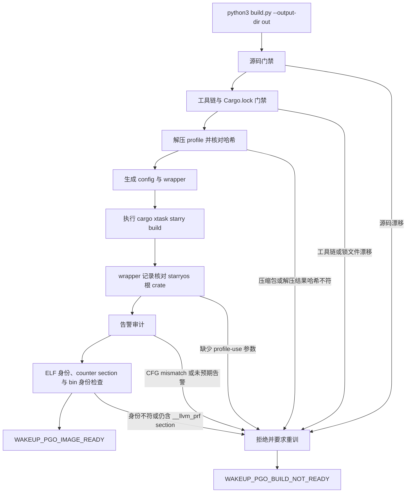
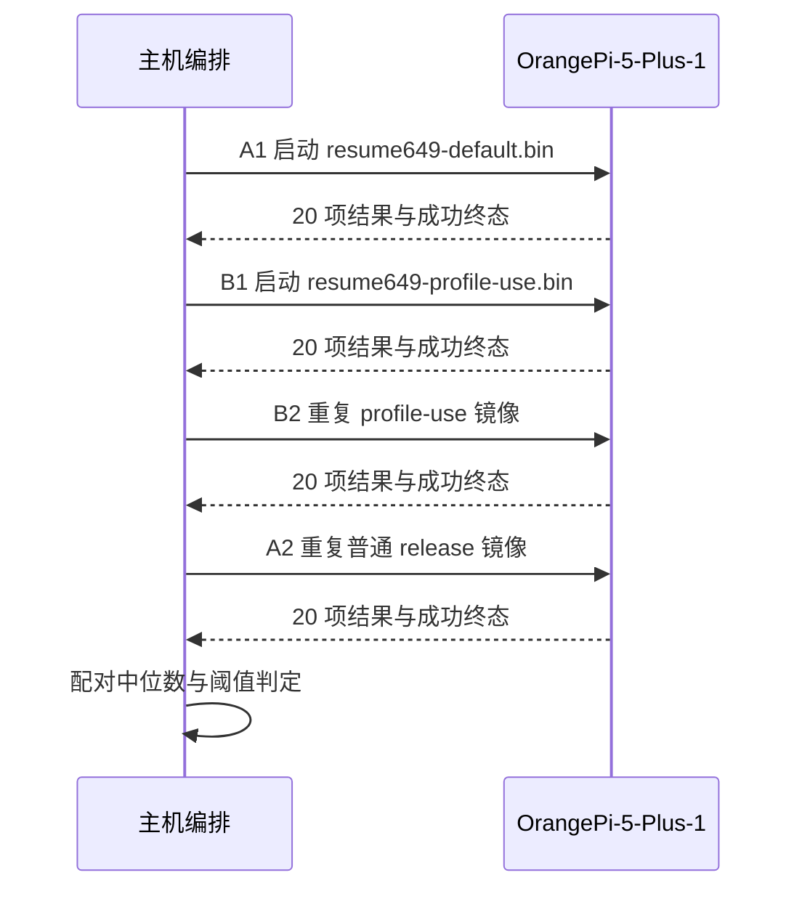

# StarryOS 唤醒延迟 profile-use 镜像入口

**历史快照（2026-09-21），非当前构建说明。** 下文的“最新 dev”特指当时的
`29f3fef885b273628e1f2d1d249e950e1b9184a5`，所有 A/B 与镜像身份只覆盖
五项 feature 的 benchmark 配置。普通 OrangePi release 有十项 feature；更新
`Cargo.lock` 及 `dev` 后旧 profile 已有 CFG 失配。当前入口状态和新板测失败证据见
`docs/design/starry-wakeup-pgo.md`；不得按本文将旧镜像视作当前 release 版本。

本文说明 issue #2308 在 OrangePi-5-Plus 上使用的 profile-use（PGO）镜像入口：它如何把一份在较早提交训练、经最新 dev 重编核对后仍与板测镜像等价的 profile 重新落地，如何在不改动 axbuild 的前提下把 PGO 参数只注入 aarch64 目标，哪些门禁失败即拒绝出镜像，以及同板 A-B-B-A 实测结果说明了什么。入口是 opt-in 的，普通 release 构建不受影响；结论只覆盖冻结的唤醒延迟负载，不代表其它负载的收益。

## 1. 交付物与公开入口

入口、配置与 profile 都收敛在 `scripts/perf/wakeup-pgo/`，该目录由 `build.py` 负责生成一次构建所需的全部文件；仓库内没有任何默认板卡配置、Cargo 配置或全局环境被改成 PGO 形态，因此是否使用 PGO 完全由调用者决定。

### 1.1 公开入口

唯一的公开入口是 `scripts/perf/wakeup-pgo/build.py`，它接收 `--output-dir` 与可选的 `--prepare-only`。给出的输出目录既可以是绝对路径，也可以是相对当前工作目录的路径；脚本在建立任何产物之前先做源码与工具链门禁，并用 `resolve_output_dir()` 拒绝位于受管源码树内、又没有命中 gitignore 的输出目录，避免构建产物被下一轮源码门禁误判成漂移。

```bash
python3 scripts/perf/wakeup-pgo/build.py --output-dir tmp/wakeup-pgo-out
python3 scripts/perf/wakeup-pgo/build.py --output-dir tmp/wakeup-pgo-out --prepare-only
```

`--prepare-only` 只执行门禁、解压 profile、写配置与 wrapper，不运行 `cargo xtask starry build`，适合先确认制品与配置正确再决定是否编译；它不会打印 `WAKEUP_PGO_IMAGE_READY`，因此不能当作构建成功的证据。

### 1.2 输出目录内容

`build.py` 把构建所需的一切写进输出目录，使一次 PGO 构建可以整体归档或整体删除。下表列出主要产物及其归属函数，便于在产物与代码之间互相定位。

| 产物 | 生成者 | 作用 |
| --- | --- | --- |
| `profile-use.profdata` | `unpack_profile()` | 由压缩包解压并核对 `PROFILE_SHA256` 后的训练 profile |
| `build-config.toml` | `write_config()` | 通过 axbuild `[env]` 注入 PGO 参数与 wrapper 的 StarryOS 构建配置 |
| `stdlib-wrapper.py` | `install_wrapper()` | 从模板 `stdlib-wrapper.py.in` 逐字拷贝并赋可执行位的 rustc wrapper |
| `stdlib-wrapper.jsonl` | `stdlib-wrapper.py.in` | 每次 aarch64 目标 rustc 调用的参数记录，供根 crate 证据核对 |
| `build.log` | `run_build()` | `cargo xtask starry build` 的完整输出，告警审计的唯一输入 |
| `target/` | `run_build()` | 本次构建独占的 `CARGO_TARGET_DIR`，避免覆盖仓库普通产物 |
| `target/aarch64-unknown-none-softfloat/release/starryos` 及其 `.bin` | `run_build()`、`ensure_binary()` | 构建结果：ELF 是审计对象，`.bin` 是可刷写镜像，两者哈希写入 `build-result.json` |
| `build-result.json` | `write_result()` | 门禁结论、profile 与镜像身份哈希、审计摘要、宿主环境透传项与失败原因 |

产物命名是固定值而不是调用者参数，因此归档目录、`build-result.json` 与文档中的哈希可以一一对应；只有输出目录本身是可变的。

### 1.3 与普通 release 构建的关系

普通构建走 `cargo xtask starry build -c os/StarryOS/configs/board/orangepi-5-plus.toml`，其 `[env]` 为空，既不加载 profile 也不设置 `RUSTC_WRAPPER`。本入口不改写该配置，而是另生成一份配置交给 `-c`，并把 `CARGO_TARGET_DIR` 指向输出目录内的 `target/`，所以它既不会污染仓库 `target/` 里的普通镜像，也不会因为残留缓存而跳过重编译。

## 2. profile 来源与训练口径

profile 的价值完全取决于它与被编译代码的对应关系。本入口使用一份 2026-09-21 训练并审计通过的 profile：训练 commit 是 `d051d572b76c9675b60b0c9442dd87c5fa1af8ba`（`PROFILE_TRAINING_COMMIT`），制品由 `resume649` 工作流产生，同板 A-B-B-A 性能证据也来自那时的镜像。入口的 checkout 基线已经前移到最新 dev `29f3fef885b273628e1f2d1d249e950e1b9184a5`（`BASELINE_COMMIT`）；profile 能从旧提交沿用到它，靠的是最新 dev 重建出的镜像在机器码与数据上与板测镜像逐字节相同，而不是因为 profile 在最新 dev 上重新训练过。

### 2.1 训练制品与哈希

原始 profile 位于宿主 artifacts 目录，交付时压缩进仓库，避免构建脚本依赖历史绝对路径。`build.py` 先核对压缩包 `PROFILE_ARCHIVE_SHA256`，再核对解压结果的 `PROFILE_SHA256`，两次校验都通过才允许进入编译。

| 项目 | 值 |
| --- | --- |
| 压缩包 | `scripts/perf/wakeup-pgo/profile-use.profdata.zst`（856771 字节） |
| 压缩包 sha256 | `817ea24326ada0f29a3166c4d377c8b047e34a2f1c2875c6de45b7d2c0a6d3ae` |
| 解压后 sha256 | `f08464508b9dc02911e9660ccfa0216795cc4b89e07f6723b147d8de6ea8d49f` |
| 解压后大小 | 7943048 字节 |
| 训练 commit | `d051d572b76c9675b60b0c9442dd87c5fa1af8ba` |
| 入口 checkout 基线 | `29f3fef885b273628e1f2d1d249e950e1b9184a5` |
| 工具链 | `nightly-2026-09-04`，rustc commit `a69a63265cfd9e006d43137f98301b8d274ad4c9`，LLVM 23.1.1 |
| profile 记录数 | 27146 |

压缩包哈希固定的是随仓库交付的字节，解压后哈希固定的是 profile 语义；重新压缩必须同步更新 `PROFILE_ARCHIVE_SHA256`，而解压结果不符则一律拒绝构建。

### 2.2 训练负载与定位

训练镜像用 `-Cprofile-generate` 构建后在 QEMU TCG 上运行冻结的唤醒延迟负载，覆盖 `thread_futex_same_cpu`、`thread_futex_cross_cpu`、`process_futex_cross_cpu`、`absolute_timer_same_cpu`、`sched_yield_handoff` 等场景，并在 OTHER 与 FIFO 两种调度策略下各执行一次。训练得到的 27146 条记录只描述这些场景的执行权重，因此 profile 的正确用法是给同一负载的镜像提供分支与内联权重，而不是宣称对任意工作负载都更快。

QEMU 训练环境为 2 vCPU 的 TCG 模型，与 8 核实体板的执行环境不同，两者不能互相替换：TCG 只用来产生权重来源，任何 QEMU 侧数字都不进入性能结论，实体板结论只来自同板四轮原始日志。

### 2.3 profile 复用前提

训练 commit 与入口 checkout 基线不是同一个提交，因此沿用 profile 需要额外证据。`29f3fef` 相对 `d051d572` 只修改了 `docs/docs/architecture/driver/runtime.md` 与 `os/arceos/modules/axinput/src/lib.rs`（#2296 删除已废弃的 evdev polling fallback 函数及其单元测试）。`ax-input` 确实参与 Starry 构建，所以主代理在最新 dev 上分别全量重建了无 PGO 镜像与 profile-use 镜像：两者与 d051d 板测镜像在 `.text` 以及 `.kallsyms` 之外的全部 bin 字节上仍逐字节相同，profile-use 侧的重建还通过了零 CFG mismatch、6087/5933 未训练计数与零未预期告警的完整审计（§3.4）。

核对明细记录在 `scripts/perf/wakeup-pgo/evidence/latest-dev-image-equivalence.json`：两个 commit、双方 old/new 的 bin 整文件哈希、`.text` 与去 `.kallsyms` 的 bin 哈希、profile sha256 和最新 dev 的警告审计摘要都在其中。`build.py` 并不信任这份记录本身——它每次运行都会重新计算 `.text` 与去 `.kallsyms` 的 bin 哈希，任何一项不符都会 fail closed 并要求重新板测。

## 3. 构建门禁与镜像身份

门禁按“先证明身份、再产生制品、最后审计产物”的顺序串联，任一环节不成立都直接停止，`build-result.json` 记录 `ready: false` 与失败原因。下面的流程说明 `build.py` 的判定链，以及哪些分支会以“必须重训”终止。



图中左侧失败分支都发生在产生镜像身份之前，只有走到 `WAKEUP_PGO_IMAGE_READY` 才表示镜像可交付；`WAKEUP_PGO_BUILD_NOT_READY` 输出到标准错误，同时保留已完成步骤的记录，便于判断是制品问题还是环境问题。

### 3.1 源码门禁

`source_gate()` 先确认 `BASELINE_COMMIT`（已审核的最新 dev：`29f3fef885b273628e1f2d1d249e950e1b9184a5`）在当前 git 对象库中确实存在，再比较该提交与当前 checkout 的全部 tracked 内容，并把工作树与暂存区的改动、以及未跟踪文件一并纳入判断；`docs/` 与 `scripts/perf/wakeup-pgo/` 通过 `EXCLUDED_PREFIXES` 排除，因为前者是说明性文档，后者是本入口自身。任何其它路径的差异都会导致拒绝，并提示先重新审核：只有证明新提交仍重建出板测镜像，或者在代码/数据确实变化时重训 profile，才能继续使用本入口；报告里 `BASELINE_COMMIT` 与 `PROFILE_TRAINING_COMMIT` 始终分开记录，避免把“在当前 checkout 构建”误读成“profile 在当前 checkout 训练”。

门禁比较的是内容而不是“工作树是否干净”，因此在 `dev` 上新增提交、检出别的分支、或手工修改任何非排除文件都会被拦下；反之，本目录新增脚本或文档不会触发误判。基线前移本身是一次审核动作，需要像 #2296 这样先完成镜像等价性核对，或者重训 profile，不能只改常量。

### 3.2 工具链与锁文件门禁

`toolchain_gate()` 读取 `rust-toolchain.toml` 的 channel 并要求它等于 `RUST_CHANNEL`，再执行 `rustc -vV` 校验 `commit-hash` 与 `LLVM version` 分别等于 `RUSTC_COMMIT_HASH` 与 `RUSTC_LLVM_VERSION`；`cargo_lock_gate()` 校验 `Cargo.lock` 的 sha256 等于 `CARGO_LOCK_SHA256`。这不只是形式检查：profile 记录的哈希由 LLVM 的源码哈希方案决定，工具链或依赖图变化都会让记录失效。

### 3.3 profile 注入与 wrapper 证据

`write_config()` 生成的配置与已验证的 `resume649-profile-use-build.toml` 在 `target`、`features`、`log`、`max_cpu_num` 上完全一致（`aarch64-unknown-none-softfloat`、`log = "Info"`、`max_cpu_num = 8`，以及 `ax-driver/rk3588-pcie`、`ax-driver/realtek-rtl8125`、`ax-driver/rockchip-soc`、`ax-driver/rockchip-sdhci`、`ax-driver/rockchip-dwmmc` 五个 feature），只把 profile 与 wrapper 路径换成绝对路径，保证 A/B 两组镜像的差别只有 PGO。

`[env]` 表内 `RUSTFLAGS_ENV` 给出 `-Cprofile-use=<绝对路径>` 与 `PGO_LLVM_ARGS` 中的 `-Cllvm-args=-disable-vp`、`-Cllvm-args=-pgo-warn-missing-function`，`RUSTC_WRAPPER` 指向输出目录内可执行的 Python wrapper；axbuild 会把这些键值原样写入内层 cargo 的环境，rustc 因此对 aarch64 目标收到 PGO 参数，而宿主机侧构建脚本与过程宏不受影响。

wrapper 只做参数转发与记录：对 `core`、`alloc`、`compiler_builtins`、`profiler_builtins` 剥离 PGO 参数（这些 crate 来自预编译 sysroot，从未插桩），其余 crate 原样保留；它同时拒绝任何不是本目录内 `profile-use.profdata` 的 `-Cprofile-use` 路径，使旧 profile 无法被静默复用。`check_wrapper_log()` 随后要求日志中至少存在一条 `starryos` 根 crate、且参数里带有当前解压路径的调用记录，否则本次构建不算应用了 profile。

### 3.4 告警审计与镜像身份

`audit_warnings()` 只解析 `build.log` 中 `STAGE_MARKER` 之后的段落，也就是 `[axbuild] starry build package=...` 起始的内核构建段：把 `no profile data available for function <符号> Hash = <哈希>` 这类“未训练函数”与 `function control flow change detected (hash mismatch)` 这类“失配”分开统计，前者是稀疏 profile 的正常现象，后者必须为 0。标记之前是宿主侧驱动自身的编译输出，与 profile 无关，只通过 `warning_summary()` 记录条数与样例，不参与判定。未失配但未训练的函数数量固定为 `REFERENCE_MISSING_WARNINGS` 与 `REFERENCE_MISSING_UNIQUE`（板测基线 6087 条、5933 条唯一），一旦偏离即判定源码、工具链、features 或 profile 已漂移；除 `partially ignored, possibly due to the lack of a return path` 与 future-incompatibility 汇总之外，其它告警一律视为未预期并终止。

实验阶段的 `resume649-warning-audit.py` 会把每条未训练记录逐条回查 profile 转储，确认它们确实不在 profile 中（`missing_but_exact_key_present` 与 `name_present_different_hash` 均为空）。本入口不再依赖那次转储，而是把板测镜像（训练 commit `d051d572`）在固定工具链、features 与该 profile 下的未训练计数固化成基线；当前基线前移到 29f 后仍复现同一计数，本身就是等价性核对的一部分，计数不同则可能是源码或工具链漂移，也可能是构建前提真的变了，两种情形都必须先查清再决定是否更新基线。

`elf_identity()` 自行解析 ELF64 section header table，要求最终镜像不含任何 `__llvm_prf` 前缀的插桩 section（counter 数据已随 profile-use 移除），并给出整文件 sha256、`.bin` sha256 与 `.text` 的地址、大小和 sha256。`require_board_text_identity()` 随后要求 `.text` 的大小与 sha256 同时等于板测候选值 `REFERENCE_TEXT_BYTES` 与 `REFERENCE_TEXT_SHA256`，只比大小不比内容是不够的：一份机器码不同的镜像同样可能凑出相同段长，一旦命中就直接 fail closed，并提示归档的 A-B-B-A 证据只覆盖板测镜像、必须重新板测。

ELF 整文件与 `.bin` 整文件哈希只作为身份记录，不参与判定：axbuild 每次构建都会重建 `.kallsyms`（§4.5），整文件哈希本来就会因符号映射而不同。真正作为门禁的是机器码，以及 `.kallsyms` 区间之外的整份 bin 字节。

`require_board_bin_identity()` 把同一判断落到可刷写的 `.bin` 上，并在 READY 之前执行：最终 `.bin` 必须存在、长度必须等于 `REFERENCE_BIN_BYTES`（16609280 字节），ELF 的 `.kallsyms` VMA 与大小必须等于 `REFERENCE_KALLSYMS_ADDRESS`（`0xffffffff80774000`）与 `REFERENCE_KALLSYMS_SIZE`（8388608），按 `REFERENCE_IMAGE_BASE`（`0xffffffff80000000`）算出的 bin 内偏移 `0x774000` 必须落在文件范围内，并且 `.kallsyms` 区间之外的整份 bin 字节的 sha256 必须等于 `REFERENCE_BIN_SHA256_EXCLUDING_KALLSYMS`（`f81c220cafc659cf050873f37cf35135a1c3a2e938bc62a5115e88be99ba583c`）。缺失 `.bin`、缺失 `.kallsyms`、位置或大小不符、区间越界、长度不符、哈希失配都会 fail closed 并提示重新板测；核对结果与两侧 reference 记录在 `build-result.json` 的 `image.bin_without_kallsyms`。

## 4. 板卡 A-B-B-A 判定

性能结论来自单块 `OrangePi-5-Plus-1` 上的四轮独立启动，A、B 两组镜像由 `d051d572` 的同一 head、同一 feature 集构建，唯一差别是 B 组启用了 profile-use。采集与比较都由冻结的板卡脚本完成，原始 guest 日志原样归档在 `scripts/perf/wakeup-pgo/evidence/`。

### 4.1 采集与逐轮门禁

四轮顺序固定为 A1-B1-B2-A2，每轮独立启动并完整执行一次冻结负载；同一镜像在同一轮内只测量一次，不做重试，避免把重试后的样本混进区间。下图说明主机编排者与板卡之间的交互，以及每轮都要复验的项目。



每轮的校验项包括：bench 二进制 sha256 等于冻结值、metadata 与冻结 Linux 基线一致、启动日志显示 8 个 CPU 全部在线、PLL 固定读数一致、20 个 `(policy, case)` 组合唯一且集合完整、每行 `samples == attempted` 且 `not_parked` 与 `missed_deadlines` 为 0、直方图计数求和等于样本数、终态为 `WAKEUP_LATENCY_PASSED`，以及 U-Boot 传输的内核字节数与本地镜像大小一致。任一项不成立即停并保留现场，不重试测量。

### 4.2 配对口径与阈值

比较阶段只读四份原始日志，对每个场景取 A 组两轮 p50 的配对中位数与 B 组两轮 p50 的配对中位数，再计算 `(A - B) / A` 作为 p50 改善率；p99 与 p999 用同样方式配对。判定条件为：至少一个场景的 p50 配对中位改善不低于 10%，且没有 p50 回退超过 3%，且没有 p99/p999 回退超过 3%。阈值在比较脚本里固定，不因结果调整。

### 4.3 实测结果

焦点场景为 OTHER 策略下的同核 futex 唤醒，其 p50 配对中位数从 26833 ns 降到 16625 ns，改善 38.04%；FIFO 策略下同一场景从 20270 ns 降到 11667 ns，改善 42.44%。20 个场景中有 16 个达到或超过 10% 的 p50 改善，且不存在超过 3% 的稳定 p50 或 p99/p999 回退，判定为 PASS。

| 场景 | 策略 | A p50（ns） | B p50（ns） | 改善 |
| --- | --- | --- | --- | --- |
| `thread_futex_same_cpu` | OTHER | 26833 | 16625 | 38.04% |
| `thread_futex_same_cpu` | FIFO | 20270 | 11667 | 42.44% |

与 Linux RT 基线相比，差距只被缩小而未消除：按“B 组配对中位数不高于 Linux p50 的 90%”统计，A 组配对下 20 项中 10 项达标，B 组配对下 11 项达标。因此本轮证据支持“profile-use 在该负载上是已证实超过 10% 的优化”，但不足以关闭 issue #2308。

### 4.4 温度与节流可观测性限制

四轮之间只核对了 PLL 固定读数来确认核心时钟与分频未变，没有采集芯片温度，也没有读取任何节流或降频状态寄存器。这意味着“轮次之间不存在热致降频”是未观测假设：如果先跑的轮次遇到更高温度并触发降频，配对中位数会同时受到热效应与 PGO 影响，而当前证据无法把两者分开。需要更强因果时，应在后续实验里补充温度与节流读数，或增加独立启动的轮次并把 A/B 顺序在轮次之间交替（例如 A1-B1-B2-A2-A3-B3）；交替发生在独立启动之间，不能在某一轮内部切换镜像，同一轮内切换会失去独立启动的边界，采到的样本也不再是同一份启动状态。

### 4.5 镜像身份与板测范围

归档的四轮证据来自 d051d 的两份镜像：B 组 `resume649-profile-use.bin`（sha256 `7f55ccaf01c68e4b6bfedbdd762d7e749ca48be78554a43e098e738462bc419c`）与 A 组 `resume649-default.bin`（sha256 `d96ee9cb999935e1347e673ceb447fa2820a80e91ebf7b9793de0bf7dc540469`）。在最新 dev 基线上重编后，两者的整文件 `.bin` 哈希都变了（PGO 为 `dc139f068fcd5ae28936561d43cb8d27ea5c3f1be397b54a86dddc85df2420ac`，无 PGO 为 `67e6cf4b6c36302ead8d286015459a30f25b18c6b8b6cc953bd73cad14c53a2f`），但变化有明确边界：长度不变，且 `.kallsyms` 之外的整份字节完全相同。

逐 section 的核对给出同样结论，但“逐字节相同”只适用于有文件内容的 section（以 profile-use 镜像为例）。该 ELF 共 24 个 section header，其中 `size>0` 的 21 个（含 NOBITS 的 `.bss`），排除 `.kallsyms` 后为 20 个；`.bss` 类型是 NOBITS，不占用文件字节，因此不参与文件字节比较。差异只落在 `.kallsyms` 收录的内核符号映射区。

| 对比项 | d051d 板测镜像 | 29f 重建镜像 | 结论 |
| --- | --- | --- | --- |
| PGO `.text` 大小与 sha256 | 6799040 / `38c0dcdb…a279a59` | 6799040 / `38c0dcdb…a279a59` | 相同，机器码一致 |
| PGO bin 去掉 `.kallsyms` 的 sha256 | `f81c220c…99ba583c` | `f81c220c…99ba583c` | 相同，作为 READY 前的门禁 |
| PGO bin 整文件 sha256 | `7f55ccaf…62bc419c` | `dc139f06…5df2420ac` | 因 `.kallsyms` 而不同，仅作记录 |
| 无 PGO `.text` 大小与 sha256 | 7076504 / `b0400227…8dfacf39` | 7076504 / `b0400227…8dfacf39` | 相同，A 组对照的机器码一致 |
| 无 PGO bin 去掉 `.kallsyms` 的 sha256 | `7c226208…849f5c03e97` | `7c226208…849f5c03e97` | 相同，A 组对照的数据一致 |
| 无 PGO bin 整文件 sha256 | `d96ee9cb…7dc540469` | `67e6cf4b…cad14c53a2f` | 因 `.kallsyms` 而不同，仅作记录 |
| 有文件内容的 section（不含 `.kallsyms`） | — | — | 逐字节相同；NOBITS 的 `.bss` 不参与文件字节比较 |
| `.kallsyms` | 板测时的符号映射 | 本次构建重新生成的符号映射 | 允许不同 |

`.kallsyms` 由 axbuild 在产物落地后重新生成（内核构建路径同样会调用 `generate_kallsyms()`），其内容来自本次构建的符号映射，两次构建之间不保证逐字节相同，也不参与执行路径；门禁把它作为唯一排除区间，排除之后剩余的字节就是代码与数据本身。正因如此，旧的板测结果属于“机器码、数据与主要装载内容相同”这一范围内的证据，可以用来支持 profile 优化结论，但不能被读成“新生成的 `.bin` 已经在板上实测过”：四轮原始日志仍然只属于 d051d 的镜像，29f 重编的 A/B 镜像没有在板上运行过，任何一次重建的整文件 bin 哈希也不能当作板测值。

若后续 `dev` 继续漂移，必须重新执行同样的核对：`.text` 与去 `.kallsyms` 的 bin 哈希两项都相同才允许沿用 profile 与旧板测证据；任一不同就要重训 profile 并在板上重新采集 A-B-B-A。这正是 `require_board_text_identity()` 与 `require_board_bin_identity()` 存在的原因，也是把这两个哈希而不是整文件哈希写进门禁的原因。

镜像身份哈希记录在 `build-result.json` 与本节，重建产物本身不入库：`.bin` 与 ELF 都位于构建者自己的输出目录内，仓库只保留可复现的入口、profile 与板测原始日志。

## 5. 回滚与失配重训

profile 只通过本次调用的输出目录生效，因此回滚是局部的：停止使用本入口、删除输出目录即可，仓库配置文件、板卡默认配置与全局环境都不需要还原。若实体板已经刷入 PGO 镜像，回滚方法是重新刷入普通 release 镜像（`resume649-default.bin`，sha256 `d96ee9cb999935e1347e673ceb447fa2820a80e91ebf7b9793de0bf7dc540469`），PGO 镜像身份为 `resume649-profile-use.bin`，sha256 `7f55ccaf01c68e4b6bfedbdd762d7e749ca48be78554a43e098e738462bc419c`。

### 5.1 何时必须重训

下列任一情况都使现有 profile 失效，必须重新执行“profgen 构建 → QEMU 训练 → 导出 profile”的流程，并同步更新 `PROFILE_SHA256`、`PROFILE_ARCHIVE_SHA256` 与审计基线常量：源码相对 `BASELINE_COMMIT` 出现非排除路径的变化（含 `dev` 上的新提交）、`Cargo.lock` 变化、工具链或 LLVM 版本变化、`FEATURES`/`LOG_LEVEL`/`MAX_CPU_NUM` 变化、CFG/hash mismatch 非 0、未训练函数计数偏离基线，或解压结果与 `PROFILE_SHA256` 不符。还要区分两种漂移：如果新提交重建后 `.text` 与去 `.kallsyms` 的 bin 哈希仍然相同，可以像 #2296 那样只做等价性核对并把 `BASELINE_COMMIT` 前移；只要这两个哈希中的任意一个变化，就必须重训 profile，并把 `PROFILE_TRAINING_COMMIT` 一并更新到新训练 commit。

### 5.2 重训后的门禁更新

重训产出新的 profile 后，需要在新训练 commit 与固定 pins 下重新记录 profile-use 构建的告警计数，把它们写回 `REFERENCE_MISSING_WARNINGS` 与 `REFERENCE_MISSING_UNIQUE`，同时更新 `.text`、去 `.kallsyms` 的 bin 哈希两个门禁常量与 `PROFILE_TRAINING_COMMIT`，并重新导出板卡 A-B-B-A 证据；在证据更新之前，旧的四轮日志不能与新 profile 拼接比较，因为它们对应不同镜像身份。

## 6. 证据清单与已知限制

本节列出随仓库归档的原始证据、它们的哈希，以及本入口在当前形态下明确不覆盖的范围，供验收时逐项核对。

### 6.1 证据与哈希

`scripts/perf/wakeup-pgo/evidence/` 保存四轮原始 guest 日志、比较输出、状态文件与最新 dev 的等价性记录，`SHA256SUMS` 记录这些文件的 sha256；四轮日志与状态文件全部原样复制，未做任何裁剪或重排，后续补充等价性记录时也没有改动它们。其中 `resume649-warning-audit.json` 是 profile 训练与 profile-use 构建当时的实验审计输出，说明的是板测镜像的告警基线，不是入口的运行记录。

| 文件 | 内容 | sha256 |
| --- | --- | --- |
| `resume650-A1-full.log` | A 组第一轮完整 guest 日志 | `7b53859af030c24feabbeb7fd4c8c9e3ce9795ea59bb9130b0d144fe0e5d2e22` |
| `resume650-B1-full.log` | B 组第一轮完整 guest 日志 | `8ee1f505b479c4560d07cc309a624e41459b02d9c0e3bdf37727400a1a4046eb` |
| `resume650-B2-full.log` | B 组第二轮完整 guest 日志 | `62be41a3a78838d972f2bee8de7090756cfc395f9455c70990ea0bb5307c4477` |
| `resume650-A2-full.log` | A 组第二轮完整 guest 日志 | `6c4560497436f30f35cbaf621ef61c8fcec5098b9e9480f15faee95152d0bfc2` |
| `resume650-abba-comparison.json` | 配对中位数、阈值与判定结果 | `23aa48d7a7b28b6f5e50c06f143168566b633e31cfd7b9c0e104beec394d8e7d` |
| `resume650-abba-status.json` | 四轮采集状态、镜像与 bench 身份 | `74ab2eaf294bb4768f48933b8e3acbd5ff2cf49201b4db0dc935b79a911bd97a` |
| `resume649-warning-audit.json` | 板测构建的告警审计输出 | `585cf543e49a0904797d865dacb15807fe32135ef3c87b24226900cdcc9e4d6a` |
| `latest-dev-image-equivalence.json` | profile 训练 commit 与最新 dev 基线的镜像等价性核对（§2.3、§4.5） | `5c1a5f183944c4dff9ebfdc52c800e1e428c36aa35560dbb4fd504e85dfecaee` |

### 6.2 已知限制

profile 只对本文覆盖的冻结唤醒延迟负载有实测收益，不能当成全局默认优化，也不能外推到未训练负载；把 PGO 参数写进仓库默认板卡配置会让所有使用者都承担一份与提交强绑定的权重，因此本入口坚持 opt-in。此外，未跟踪但被 gitignore 的文件（例如 `.cargo/.config-local.toml`）不参与源码门禁比较，构建依赖的 `zstd` 与 `rust-nm`、`gen_ksym` 等工具由宿主机提供，交付覆盖的最小单位是“在已审核的 dev 基线上重建出与板测镜像等价、且可审计的镜像”，而不是新的 profile 质量，也不是对最新 dev 镜像的板测结论。

输出目录必须是没有 `target/` 的新目录，这样 aarch64 目标 crate 一定会被完整重编译，未训练函数的统计与 wrapper 证据才具备可比性；重复构建请换目录，不要复用上一次的输出。宿主侧驱动本身也在该目录内重建，成本高于一次普通的增量构建。
