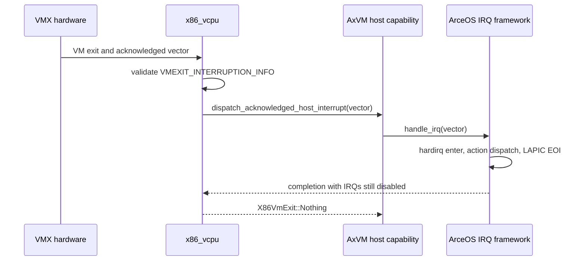

# Unified Host Timer Transport

## 1. Scope and design verdict

This document defines the host-deadline transport shared by ArceOS and AxVM.
It is based on Linux v7.1 KVM, hrtimer, and clockevents ownership, adapted to
TGOSKits crate boundaries. It does not merge guest architectural timer state,
APIC/VGIC pending state, or scheduler policy into one subsystem.

### 1.1 Failure chain

The failure is an interrupt-ownership error, not a timer-frequency error. The
VMX pin-based controls include `ACK_INTERRUPT_ON_EXIT`, so hardware consumes a
host interrupt and records its vector in `VMEXIT_INTERRUPTION_INFO`. The old
`handle_vmx_external_interrupt_exit()` discarded that vector and briefly
enabled host IRQs. Enabling IRQs can service a newer pending edge, but it cannot
recreate the edge that VMX already acknowledged. A local-APIC clockevent could
therefore disappear before `ax_task::on_clock_event()` promoted the due guest
timer.

The direct-ACPI and MP-fallback VMX timeouts reported by PR #1775 stop guest
time immediately after Linux installs its local-APIC timer, while the same
2095 MHz CPUID fallback appears in both passing and failing runs. The x86
LAPIC transport was the remaining semantic difference from KVM: expiry first
promoted a soft callback and depended on `ktimers/<cpu>` to publish the guest
interrupt. A continuously runnable guest could therefore delay the operation
that makes its own next scheduling interrupt visible.

The x86 LAPIC now follows KVM's split directly. Hard expiry accumulates an
atomic pending edge and invokes a pre-bound vCPU wake capability. VMX/SVM
consume and clear pending state immediately before guest entry. A VMX host
timer expiry is already delivered as the external-interrupt VM exit that
returns control to AxVM, so routing this local edge through the deferred
virtual-IRQ worker would re-enter scheduler wait-cell delivery inside the
clockevent IRQ transaction. The direct wake closes the blocked-vCPU race;
the VMX exit itself supplies the running-vCPU kick. Timer frequency discovery
remains independent and is not treated as the timeout fix. PIT routing stays
in task context because it traverses PIC/IOAPIC device state rather than
publishing a local architectural timer edge.

### 1.2 Backend boundary

The repair keeps the ownership transfer inside `x86_vcpu`, while the vCPU is
still pinned and local IRQs remain disabled. `vmcs::interrupt_exit_info()`
produces the acknowledged vector, `vmx_external_interrupt_exit()` validates
that it is a valid external interrupt, and
`X86HostOps::dispatch_acknowledged_host_interrupt()` synchronously invokes the
embedding host's normal IRQ action and EOI lifecycle. The helper then returns
`X86VmExit::Nothing`, so no compatibility exit or deferred vector remains in
AxVM.

SVM deliberately uses a different method,
`X86HostOps::service_pending_host_interrupt()`. AMD keeps the interrupt pending
instead of transferring an acknowledged vector, so AxVM briefly opens the host
IRQ window and restores the disabled state. Combining these operations behind
one enum or one generic “external interrupt” exit would erase the hardware
ownership difference. A prepared guard is also unnecessary: there is no legal
work between validation and dispatch, and `Drop` must not perform IRQ action or
EOI as hidden control flow.

## 2. Ownership model

The component boundary follows the resource that owns each invariant. Guest
devices own guest-visible state, the task runtime owns logical deadlines, and
the clockevent layer alone owns physical comparator programming.

### 2.1 Component ownership

The Linux mapping identifies which TGOSKits object may mutate each class of
state and prevents device code from taking over the physical timer.

| Linux v7.1 owner | TGOSKits owner | Invariant |
| --- | --- | --- |
| KVM LAPIC and architectural timer | AxVM and architecture vCPU crates | Own guest-visible registers, masking, periodic state, and interrupt level |
| hrtimer per-CPU bases | `components/ax-task::CpuDeadlineState` | Own typed task deadlines, kernel timers, generation, and callback lifecycle |
| clockevents | `axruntime::LocalClockEvent` | Exclusively own physical one-shot comparator programming |
| `kvm_vcpu_kick` and vCPU wait condition | AxVM generation and pre-bound wake capability (the VMX external-interrupt exit is the local kick) | Publish completion before waking and recheck after publishing wait state |

Linux KVM arms absolute hard hrtimers for both x86 LAPIC deadlines
(`arch/x86/kvm/lapic.c`) and the Arm virtual timer software fallback
(`arch/arm64/kvm/arch_timer.c`). The generic hrtimer layer arbitrates the next
per-CPU expiry, while `kernel/time/clockevents.c` alone translates an absolute
expiry into device cycles. The split matters: a KVM device owns what expiry
means, but does not own the host comparator.

### 2.2 Capability boundary

`X86HostOps` remains the single embedding capability already required by both
VMX and SVM. Splitting out another public host-interrupt trait would not create
a new owner or prevent an invalid call; the two backend-specific methods and
their immediate call sites express the distinction directly. Conversely,
returning an acknowledged vector as public `X86VmExit::ExternalInterrupt`
would move completion past backend unbinding and is therefore too high a
layer. The chosen boundary is the smallest one that retains the VMX token until
completion.

## 3. Logical timer base

Each online CPU owns one `CpuDeadlineState`. Its `TaskDeadlineQueue` and
`KernelTimerQueue` keep task wakeups, scheduler deadlines, soft callbacks, and
hard callbacks typed because their payloads and execution contexts differ.
They share:

- one owner-CPU deadline-activity lock and publication transaction;
- absolute `MonotonicDeadline` values with no zero or maximum-value sentinel;
- one non-reused `KernelTimerHandle { owner_cpu, identity }` namespace;
- a single earliest-deadline query and publication path;
- bounded IRQ promotion and worker draining controlled by the task-system batch limit.

The timer IRQ may expire task wakeups, promote soft work, and claim a bounded
hard callback while holding the base lock. It releases the lock before invoking
any callback. Ordinary kernel-timer callbacks, Future wakers, and payload
destruction run in the pinned `ktimers/<cpu>` worker. The separately retained
`register_timer_callback` scheduler-tick observers keep their existing timer-IRQ
context and are not deadline-queue entries. If a budget is exhausted, the owner
republishes work and keeps advancing with the platform minimum delta.

Soft expiry uses an explicit IRQ-to-worker ownership transition. Once the IRQ
sets `softirq_activated` and publishes due work to `ktimers/<cpu>`, that soft
head is hidden from the earliest-deadline query until the worker finishes its
bounded drain pass. The worker either republishes the next live deadline or
keeps its work notification pending. This prevents a callback that cannot run
in IRQ context from being fed back into the comparator as an immediate deadline
and starving the worker that must consume it.

Hard callbacks are constructed through an unsafe API. Their safety contract
requires bounded execution with no allocation, destruction, sleeping, registry
lookup, or sleepable lock acquisition. They may use only IRQ-safe atomics,
locks, and capabilities bound before the timer is armed.

## 4. Clockevent state machine

`axruntime::LocalClockEvent` is CPU-local and has five phases:

```text
Offline --online--> Armed --IRQ claim--> Firing --defer--> Deferred
               \                         \--finish--> Armed/Idle
                \--no deadline--> Idle       Deferred --IRQ return--> Armed/Idle
```

It carries a CPU epoch and the latest scheduler publication generation. CPU
online/offline changes the epoch; a firing token from an older epoch cannot
rearm the CPU, and stale scheduler publications cannot replace a newer logical
deadline. While `Firing` or `Deferred`, logical publications are accumulated
and merged with the post-IRQ or IRQ-return recomputation. Exactly one comparator
program is committed after the logical queues advance. Idle may stop the
periodic tick and later resume it without creating a second comparator owner.

The platform API currently has no portable cancel-pending primitive. Cancelling
or moving the logical head later therefore leaves at most one conservative
stale physical edge. That IRQ claims the current arm, observes no expired
logical timer, and recomputes the live minimum. Logical layers never infer a
hardware pending state and never rewrite another CPU's comparator.

The runtime merges the periodic scheduler tick with the earliest task deadline.
`register_timer_callback` remains a periodic scheduler-tick observer and is not
inserted into the deadline base.

## 5. Handle, cancellation, and migration rules

A registration is permanently owned by the calling CPU. Remote cancel or
disarm changes only that owner's logical queue. It never directly programs the
remote comparator. A callback already claimed may complete, but its tombstone
prevents a restartable action from becoming active again.

An AxVM vCPU migration performs these transitions in order:

1. publish a new vCPU timer generation so the old callback becomes stale;
2. cancel the old CPU registration and preserve one possible stale edge;
3. bind the `ThreadWakeHandle` and create a stable registration on the new CPU;
4. re-read guest timer state and arm the new registration if still required.

CPU offline invalidates its clockevent epoch before the comparator is disabled.
No new timer may register on an offline CPU. Remaining registrations must be
cancelled or migrated before the per-CPU area is reclaimed.

## 6. vCPU wait and interrupt publication

Host-interrupt forwarding and guest-timer publication are separate state
transitions. The former must finish the physical controller transaction; the
latter publishes a guest-visible pending edge and wakes the vCPU that will
consume it.

### 6.1 VMX acknowledged interrupts

Linux handles an acknowledged VMX vector in
`vmx_handle_exit_irqoff()` before opening a general local-IRQ window. TGOSKits
uses the same ordering through the host capability and the ArceOS IRQ entry.



On x86, `ax_hal::irq::handle_irq()` resolves the trap vector into a platform
`ActiveIrq`. Constructing that object does not acknowledge the LAPIC a second
time; dropping it performs the required EOI before the IRQ-return preemption
boundary. The callback is synchronous, so the vCPU cannot unbind or migrate
while the acknowledged vector is outstanding.

### 6.2 SVM pending interrupts

Linux documents SVM external-interrupt exits as a pending notification. Its
common vCPU loop enables local IRQs, executes one instruction to clear the
interrupt shadow, and disables IRQs again. `SvmVcpu` mirrors that contract with
`service_pending_host_interrupt()` and returns a normal poll point. It does not
read VMCB exit information as an acknowledged host-dispatch token.

### 6.3 Guest timer edges

The blocked-vCPU path follows the same lost-wakeup rule as KVM:

1. the timer callback publishes its completed generation with `Release`;
2. it invokes only a pre-bound `ThreadWakeHandle`, and never performs a VM
   lookup or calls task-context-only `WaitQueue::notify_*`. For VMX, the host
   timer interrupt has already forced the external-interrupt VM exit, so no
   second deferred kick is needed;
3. the waiter publishes its waiting state;
4. the waiter rechecks completion and architectural pending conditions with
   `Acquire` before sleeping.

The hard callback never takes a VGIC or vLAPIC register lock. Arm virtual-timer
PPI level is recomputed after the vCPU wakes and immediately before guest
entry. x86 LAPIC hard expiry similarly touches only atomic pending/deadline
state and a pre-bound wake capability; the target vCPU reads the LVT and
coalesces accumulated expirations before entry. Wired IOAPIC edges still use
the VM-owned deferred kick worker, because they do not arrive through the
local LAPIC timer's VMX exit. PIT, LoongArch architectural timers, and
emulated device timers continue to use soft kernel timers when their callbacks
require ordinary task context.

## 7. Lock ordering and failure handling

The required order is:

```text
guest timer/device state -> timer-base lock -> publish after unlock
clockevent local exclusive state -> platform comparator
```

Callbacks run with neither the guest state lock nor timer-base lock held. No
path holds `LocalClockEvent` state while acquiring a timer-base lock. Capacity,
unsafe context, offline CPU, owner mismatch, stale handle, and generation
exhaustion are typed errors. Identity or epoch exhaustion is never wrapped.

## 8. Migration and validation

The final tree has no temporary timer compatibility entry point. AxVM consumes
only `HostTimer`; `components/ax-task` owns every logical registration, and
`axruntime::LocalClockEvent` owns the only physical comparator. AxVM's old timer
wheel, timer worker, external deadline source, IRQ callback, direct
`ax-timer-list` dependency, and legacy ArceOS scheduler bridge are absent.

Required model coverage includes earlier/later rearm, head cancellation,
same-deadline ordering, stale handles and epochs, early/stale IRQ edges, budget
exhaustion, cancel-versus-rearm, and proof that soft callbacks run outside IRQ
and the base lock. x86 LAPIC coverage additionally proves that hard expiry
publishes one coalesced edge for the next vCPU entry and that cancellation
waits for a callback that already claimed the arm.
Runtime coverage includes
notify-versus-timeout, stale task timer rejection, Future poll/drop after CPU
migration, and clockevent idle.

Architecture validation includes Axvisor smoke tests on aarch64, riscv64,
loongarch64, and x86_64; Arm GICv2/GICv3 timer stress; and the x86 VMX sequence
`direct-acpi-vmx`, `mp-fallback-vmx`, and `ovmf-acpi-vmx`. Hardware-dependent
tests must be reported separately when the required KVM or LVZ capability is
not available.
