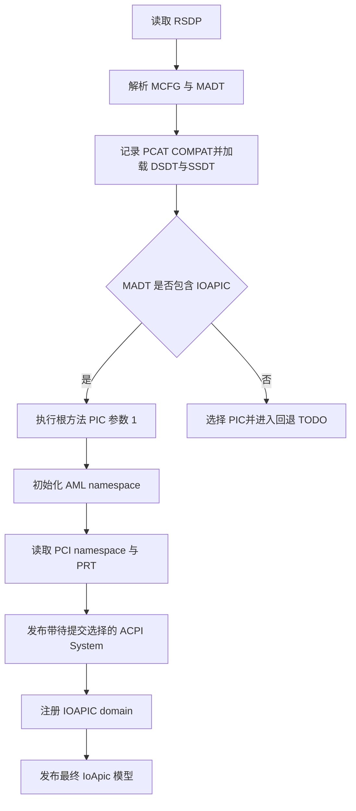

# x86 ACPI 中断模型

动态 x86 平台从 MADT 取得 `PCAT_COMPAT`、IOAPIC 和 Interrupt Source Override，并在加载 AML 后通过根方法 `\_PIC(1)` 告知固件使用 APIC 中断模型。`rdrive::probe::acpi::System` 负责固件选择和路由数据，`somehal` 注册匹配的 IOAPIC domain 后提交最终模型；板卡名称、Cargo feature 和环境变量都不参与中断模型选择。

## 1. 固件交接

中断模型来自 ACPI 表本身。`read_interrupt_routing()` 同时保存 MADT `PCAT_COMPAT`、IOAPIC 和 Interrupt Source Override。IOAPIC 优先于 PIC；没有 IOAPIC但声明 `PCAT_COMPAT` 时选择 PIC，并进入 `todo!()`，明确表示 8259 回退尚未实现。

### 1.1 选择依据

下表说明静态表、AML 方法和运行时控制器之间的关系。`\_PIC` 是可选方法，但参数值和调用时序由 ACPI 规范定义。

| 输入 | 固件调用 | 运行时结果 |
| --- | --- | --- |
| MADT 至少包含一个 IOAPIC | `\_PIC(1)` | GSI 和 ISA override 交给 IOAPIC 域 |
| `\_PIC` 不存在 | 不报错 | 保留 MADT 选择并继续初始化 |
| `\_PIC(1)` 执行失败 | 返回 `DriverError` | 不发布 ACPI `System` |
| MADT 没有 IOAPIC且设置 `PCAT_COMPAT` | 进入 `todo!()` | legacy 8259 PIC 回退尚未实现 |
| MADT 两种控制器都未声明 | 进入 `todo!()` | 平台没有可用的 x86 外部中断模型 |

NUC15CRH 的 COM1 来源继续使用 `PCI_INTX_VECTOR_BASE + 4` 表达 ACPI GSI4。`axplat-dyn::console_irq()` 经 `IrqSource::AcpiGsi(4)` 解析到普通 IOAPIC 域，不存在控制台专用重写或 8259 中断域。

### 1.2 初始化顺序

someboot 只由 BSP 在启动早期屏蔽一次 8259。`System::new_with_options()` 随后完成模型选择和固件交接；somehal 成功注册 IOAPIC domain 后才发布最终 `IoApic` 模型。

`Interpreter::new_from_platform()` 只负责装入 AML 表；`configure_interrupt_model()` 位于它与 `initialize_namespace()` 之间。这样 `_STA`、`_INI` 和 `_PRT` 看到的固件路由模式已经确定。

## 2. AML 兼容边界

NUC15CRH 的 DSDT 和 SSDT 使用了 `acpi` 6.1.1 原实现尚未覆盖的 AML 行为。兼容补丁放在解释器内部，避免由 rdrive 按板卡或 AML 名称跳过方法。

### 2.1 解释器修复

每项修复都对应实体板卡上的确定性停点，并有低成本组件测试保护核心语义。

| 行为 | 原问题 | 修复后的语义 |
| --- | --- | --- |
| `Store` 到 String | 目标类型未实现 | 使用源 String 替换目标值 |
| `Store` 到 `RefOf` | `todo!()` | 按被引用目标类型写回 Integer、String、Buffer 或未初始化对象 |
| `SizeOf(RefOf(Package))` | 只展开透明引用 | 展开引用后返回 Package 元素数 |
| `Match` | 裸 `MatchOpcode` 无法解析 | 解析交错参数并支持 Always、Equal、Less/Greater 关系 |
| 方法调用栈 | 错误返回遗留全局父帧 | 调用栈归单次 `do_execute_method()` 所有，错误时自然释放 |

调用栈局部化还消除了跨 `_STA` 和 `_INI` 求值污染。顶层方法进入时调用深度必须为零；一个设备方法失败不会改变下一个设备方法的 Return 目标。

### 2.2 全局锁限制

完整的 ACPI Global Lock 等待依赖 SCI 通知，目前平台尚未提供对应的等待与唤醒通道。`acquire_global_lock()` 首次发现固件持锁时释放 AML 侧互斥并返回 `MutexAcquireTimeout`，由 `initialize_namespace()` 隔离该设备方法失败后继续遍历。

该行为是失败封闭的临时兼容：解释器不会假装取得锁，也不会永久自旋。后续补齐 SCI Global Lock 事件后，应按 AML timeout 等待固件释放，并删除该提前失败分支。

## 3. 所有权与失败

固件模式、GSI 描述和控制器机制分别有单一所有者。`rdrive` 不编程 IOAPIC，`somehal` 不解释 `_PIC`，控制台和驱动也不重新判断固件类型。

### 3.1 代码边界

以下对象构成完整调用链，维护时应保持依赖方向不变。

| 对象 | 职责 |
| --- | --- |
| `AcpiRouting` | 保存 MADT `PCAT_COMPAT`、IOAPIC、PCH-PIC 和 ISA override 数据 |
| `configure_interrupt_model()` | 根据 x86 IOAPIC 枚举执行可选的 `\_PIC(1)` |
| `System::new_with_options()` | 保存待提交模型并排定固件交接、namespace 和 PCI 发现顺序 |
| `System::publish_selected_x86_interrupt_model()` | 仅在 somehal 完成匹配控制器注册后一次性发布预先选择的最终模型 |
| `axplat-dyn::console_irq()` | 把固件控制台的原始 GSI 来源交给平台解析 |
| `somehal::resolve_acpi_gsi()` | 把 `AcpiGsiRoute` 转换为已注册 IOAPIC 域的 `IrqId` |

这些边界不暴露新的公共 feature 或配置字段。`RDRIVE_ACPI_LOAD_AML=0` 仍可作为通用诊断入口存在于 somehal；该模式只按 MADT 选择并注册 IOAPIC，明确跳过 `_PIC` 固件交接，NUC 正式配置不再使用它。

### 3.2 失败传播

`\_PIC` 不存在与执行失败必须区分。方法不存在符合规范的可选语义；其他 `AmlError` 经 `AcpiError::Aml` 保留类型后映射为 `DriverError`，阻止发布与固件选择不一致的路由。

Global Lock 竞争仅使当前 `_STA` 或 `_INI` 返回 `MutexAcquireTimeout`，不会回退到 8259，也不会改变已经完成的 `\_PIC(1)` 选择。若未来某个必须初始化的设备依赖 Global Lock，应先补齐 SCI 等待能力，不能扩大静默跳过范围。

## 4. 验证要求

自动化测试验证纯语义和调用参数，实体板卡验证固件 AML、IOAPIC 初始化和 Axvisor 启动的完整装配。两层证据不能互相替代。

### 4.1 自动化测试

`x86_ioapic_selection_invokes_pic_with_apic_model` 构造带 IOAPIC 的 `AcpiRouting` 和本地 `\_PIC` 方法，断言方法收到整数 `1`。本地 acpi fork 还验证 String Store、RefOf Store、引用 Package 的 SizeOf、Match 成功和无匹配结果。

仓库验证使用 `cargo fmt`、`cargo xtask test` 和 `cargo xtask clippy --package rdrive`。不得用原生 Cargo 命令替代仓库已有入口；本地 acpi fork 因不属于工作区，单独运行其自身测试。

### 4.2 实体板卡

NUC15CRH 使用不含 `RDRIVE_ACPI_LOAD_AML=0` 的正式构建配置。成功日志必须同时包含 `ACPI interrupt model switched to IOAPIC through _PIC`、`ACPI initialized` 和 `I/O APIC initialized`；Axvisor 冒烟用例还应看到 Linux 客户机的 `test pass!`。

默认自动启动用例证明 ACPI 初始化和客户机启动链路。运行时控制台改动还需在实体板卡上向 Linux 客户机输入命令，验证输出结果，并验证 `Ctrl+X,h` 返回 Axvisor Shell 以及重新连接客户机。Raw HAL 输入以 IRQ 为主，在有界等待超时后轮询一次 UART，避免 vCPU 运行期间丢失 IRQ4 边沿后永久失去交互。
