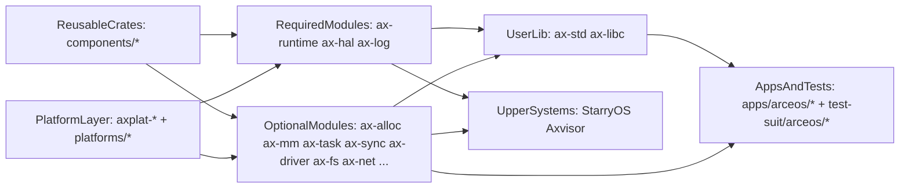
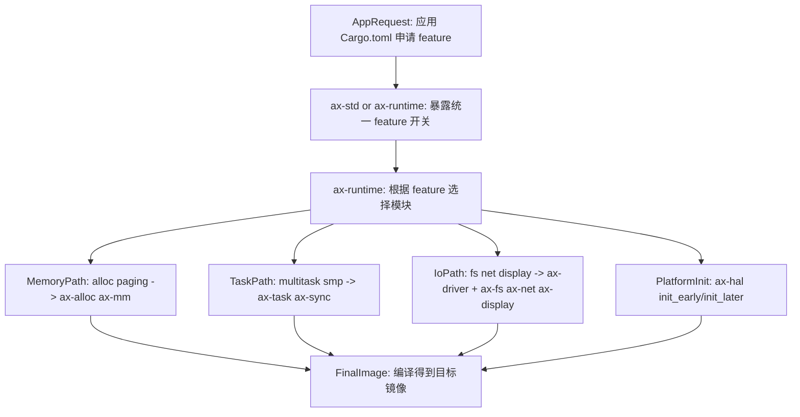
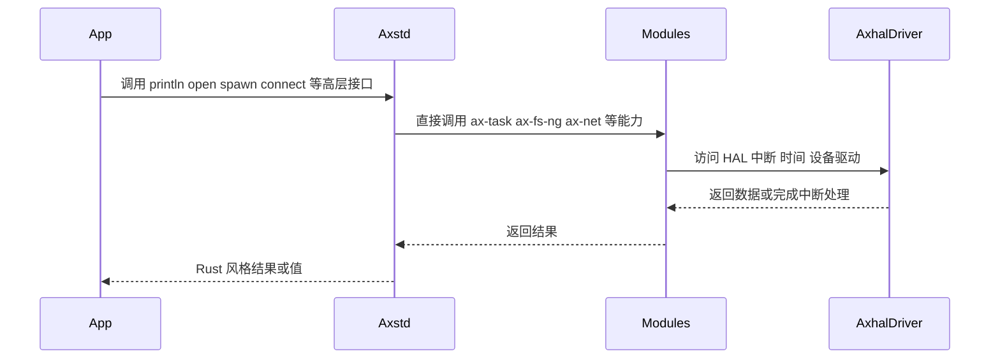
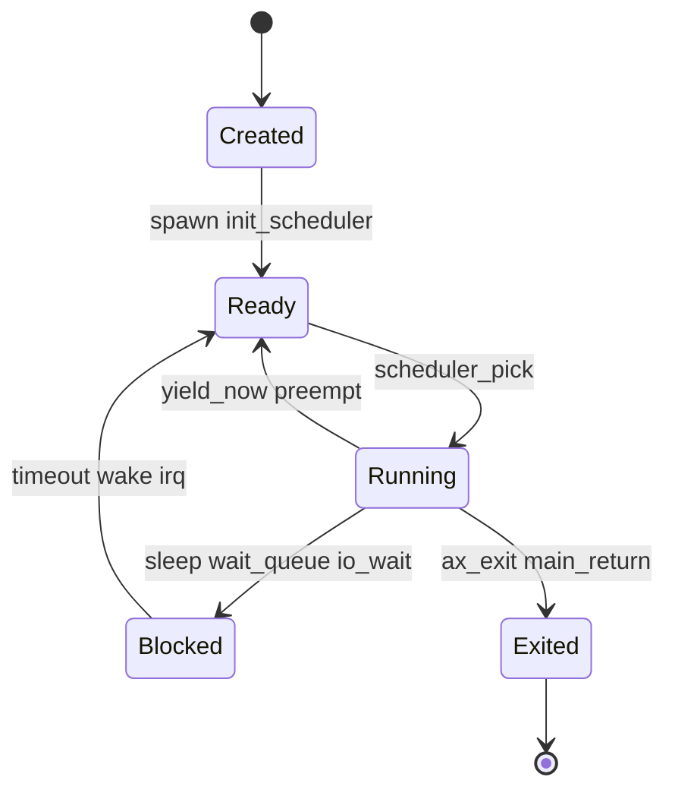
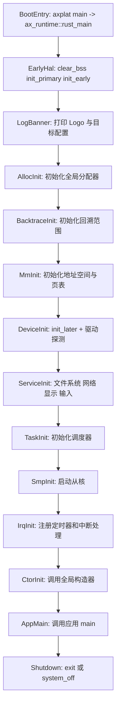

# ArceOS 架构

ArceOS 是 TGOSKits 中的组件化 Unikernel，通过 Rust crate 与 Cargo feature 做编译期装配。它在仓库中同时扮演三种角色：独立运行时、示例应用平台，以及 StarryOS 和 Axvisor 的共享能力提供者。

本文聚焦 ArceOS 的分层边界、Feature 装配机制、模块协作与启动流程。若仅需要运行示例，请先阅读 [ArceOS 快速上手](/docs/quickstart/arceos)。

## 系统定位

ArceOS 在仓库中同时扮演三种角色：独立运行的 Unikernel、示例应用的平台，以及 StarryOS 和 Axvisor 的共享能力提供者。这种多重定位决定了它的模块化程度和接口设计——既要自身可用，又要便于上游系统复用。

| 角色 | 含义 | 在仓库中的体现 |
| --- | --- | --- |
| 组件化单内核 | 通过 Cargo feature 做编译期装配，只链接被选中的能力 | `os/arceos/modules/*`、`ulib/*` |
| 基础系统平台 | 直接承载示例应用和测试包 | `apps/arceos/*`、`test-suit/arceos/*` |
| 共享能力提供者 | 为 StarryOS 和 Axvisor 复用 HAL、调度、内存、驱动等基础能力 | `ax-hal`、`ax-task`、`ax-mm`、`ax-driver` 等被上层直接依赖 |

ArceOS 的设计核心在于：**"功能是否存在"本质上是编译期装配问题，而非运行时开关问题。** 应用只需在 `Cargo.toml` 中声明所需的 feature，运行时自动按 feature 组装对应的模块链路。

## 架构概览

ArceOS 的 crate 按职责组织成一条从底层平台到上层应用的能力传递链。



理解此图可从两个方向入手：

- **自下而上**：应用最终经由 `user lib -> modules -> HAL/platform` 链路获取能力。
- **自右向左**：StarryOS 和 Axvisor 复用的是底层模块能力，修改 `ax-hal`、`ax-task`、`ax-driver` 等模块可能同时影响多个系统。

## 分层职责

ArceOS 从底部硬件平台到顶部应用，依次经过六层。每一层只依赖比自己更低的层，且尽量通过 Cargo feature 控制是否参与编译，而非在运行时做条件判断。

| 层次 | 主要目录 | 关注点 |
| --- | --- | --- |
| 可复用 crate 层 | `components/*` | 算法、同步、容器、地址空间、设备抽象等可被多个系统复用的基础构件 |
| 平台与 HAL 层 | `platforms/*`、`os/arceos/modules/axhal` | 架构相关启动、时钟、中断、内存映射、设备访问 |
| 内核服务模块层 | `os/arceos/modules/*` | 内存分配、页表、任务调度、驱动、文件系统、网络、图形等 OS 能力 |
| 用户库层 | `os/arceos/ulib/*` | `ax-std` 直接提供 Rust 标准库风格接口，`ax-libc` 直接提供 C/POSIX ABI |
| 应用与测试层 | `apps/arceos/*`（9 个）、`test-suit/arceos/*` | 场景化验证与系统回归 |

## 模块体系

ArceOS 的 17 个模块按重要性分为两类：四个必选模块构成最小可运行骨架，其余可选模块通过 Cargo feature 按需启用。这种"必选 + 可选"的结构使得最终镜像可以非常精简——一个 Hello World 示例只需四个必选模块加 `ax-alloc` 即可运行。

### 必选模块

无论应用选择哪些 feature，以下三个模块始终参与编译。它们构成了 ArceOS 的最小可运行骨架：能启动、能访问平台抽象、能输出日志。

- `ax-runtime`：启动与初始化总控。
- `ax-hal`：统一硬件抽象层。
- `ax-log`：日志输出与格式化。

### 可选模块

其余模块按 feature 启用：

| 模块 | 典型 feature | 作用 |
| --- | --- | --- |
| `ax-alloc` | `alloc` | 全局内存分配器（支持 TLSF、buddy-slab 等策略） |
| `ax-mm` | `paging` | 地址空间与页表管理 |
| `ax-task` | `multitask`、`smp` | 任务创建、调度（FIFO/RR/CFS）、sleep、wait queue |
| `ax-sync` | `multitask` | mutex、信号量等同步原语 |
| `ax-driver` | `ax-driver` | 设备探测与驱动初始化（virtio、AHCI、SDMMC 等） |
| `ax-fs` | `fs` | 文件系统（FAT、ramfs、ext4） |
| `ax-fs-ng` | `fs-ng` | 下一代文件系统（FAT、ext4，带 LRU 缓存） |
| `ax-net` | `net` | 统一网络栈（TCP/UDP/raw/Unix/vsock/DNS/DHCP，基于 smoltcp） |
| `ax-display` | `display` | 图形显示（帧缓冲） |
| `ax-input` | `input` | 输入设备管理 |
| `ax-dma` | `dma` | DMA 内存分配与管理（依赖 `paging`） |
| `ax-ipi` | `ipi` | 处理器间中断管理 |

### 模块总览

以下表格汇总了 ArceOS 全部 17 个模块的目录位置、职责及常见联动对象，可作为查阅各模块职责的快速参考。

| 组件 | 目录 | 关键职责 | 常见联动对象 |
| --- | --- | --- | --- |
| `ax-runtime` | `modules/axruntime` | 系统主入口、初始化顺序、主核/从核协同 | `ax-hal`、`ax-log`、`ax-alloc`、`ax-mm`、`ax-task`、`ax-driver` |
| `ax-hal` | `modules/axhal` | CPU、内存、时间、中断、页表、TLS、DTB 等硬件抽象 | 平台 crate、`ax-runtime` |
| `ax-alloc` | `modules/axalloc` | 全局堆分配、DMA 相关地址转换 | `ax-runtime`、`ax-mm` |
| `ax-mm` | `modules/axmm` | 地址空间、页表、映射后端 | `ax-runtime`、上层内存管理逻辑 |
| `ax-task` | `modules/axtask` | 调度器、任务创建、等待队列、定时器驱动的 sleep | `ax-runtime`、`ax-sync` |
| `ax-sync` | `modules/axsync` | mutex 等同步原语 | `ax-task`、任意并发模块 |
| `ax-driver` | `modules/axdriver` | 设备探测与驱动初始化 | `ax-fs`、`ax-net`、`ax-display` |
| `ax-fs` | `modules/axfs` | 文件系统挂载、文件/目录 API | `ax-driver` |
| `ax-net` | `net/ax-net` | 统一网络栈、socket 抽象 | `rd-net`、`rdif-vsock`、`smoltcp` |
| `ax-log` | `modules/axlog` | 多级日志与格式化输出 | 所有模块 |
| `ax-fs-ng` | `modules/axfs-ng` | 下一代文件系统 | `ax-driver` |
| `ax-dma` | `modules/axdma` | DMA 内存分配与管理 | `ax-runtime`、`ax-mm` |
| `ax-ipi` | `modules/axipi` | 处理器间中断管理 | `ax-hal` |
| `ax-input` | `modules/axinput` | 输入设备管理与事件分发 | `ax-driver` |
| `ax-display` | `modules/axdisplay` | 图形显示（帧缓冲） | `ax-driver` |

## 核心设计机制

ArceOS 的设计围绕三个核心机制展开：Feature 驱动的编译期装配、清晰的用户库边界，以及基于状态机的任务调度模型。理解这些机制是阅读和修改 ArceOS 代码的基础。

### Feature 驱动的系统装配

ArceOS 的装配逻辑分布在应用依赖、`ax-std/ax-runtime` feature 以及 `ax-runtime` 的 feature 依赖图中。



`ax-runtime` 的 feature 映射关系（来自 `axruntime/Cargo.toml`）：

```toml
[features]
alloc = ["dep:ax-alloc"]
paging = ["ax-hal/paging", "dep:ax-mm", "dep:axklib"]
dma = ["paging"]
multitask = ["ax-task/multitask"]
smp = ["alloc", "ax-hal/smp", "ax-task?/smp"]
irq = ["ax-hal/irq", "ax-task?/irq", "dep:ax-percpu"]
fs = ["ax-driver", "dep:ax-fs"]
net = ["ax-driver", "dep:ax-net"]
display = ["ax-driver", "dep:ax-display"]
```

### 用户库边界

ArceOS 的 Rust 与 C 用户库是独立边界：`ax-std` 直接提供 Rust 标准库风格接口，`ax-libc` 直接提供 C/POSIX ABI。二者都直接依赖 runtime 和内核模块，互不依赖，也不经由额外的 API 聚合 crate。

系统软件可使用 `ax-std` 的标准 Rust 接口；对任务、内存、平台和设备等系统专用能力，必须直接依赖对应模块。



### 任务与调度模型

`ax-task` 是 ArceOS 并发模型的核心。`multitask` 打开前后，模块会走完全不同的实现路径；调度算法由 `multitask`、`sched-rr`、`sched-cfs` 等 feature 选择。



## 启动流程

ArceOS 的主入口位于 `ax_runtime::rust_main()`，从平台引导代码跳入后，按固定顺序建立运行时环境：先初始化 HAL 和日志，再建立内存和设备，接着启动调度器和 SMP，最后调用应用 `main()`。流程虽然固定，但每一步是否实际执行取决于对应 feature 是否启用。



启动流程虽固定，但每一步是否执行取决于 feature：

- 没有 `alloc` → 不初始化全局堆
- 没有 `paging` → 不进入 `ax-mm::init_memory_management()`
- 没有 `multitask` → 不初始化调度器，`main()` 返回后直接 `system_off()`
- 没有 `fs`、`net`、`display` → 相应子系统不会初始化

## 模块交互主线

ArceOS 的模块间交互可归纳为四条主线：

1. **启动主线**：`ax-runtime → ax-hal → ax-alloc/ax-mm → ax-task → ax-driver → ax-fs/ax-net`
2. **用户库主线**：`ax-std 或 ax-libc → ax-runtime + ax-task/ax-fs-ng/ax-net/... → ax-hal`
3. **平台主线**：`axplat-* / platforms/* → ax-hal → ax-runtime`
4. **测试主线**：`examples/* / test-suit/* → ax-std 或 ax-libc → modules/*`
