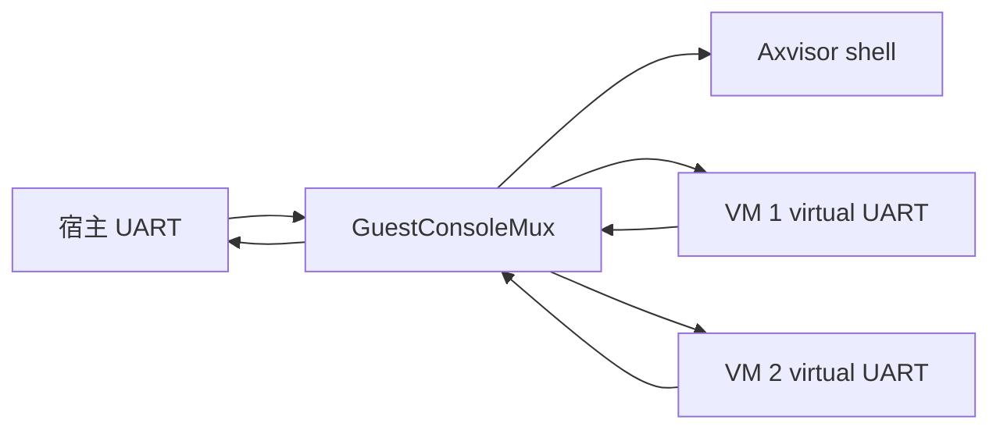

# Axvisor 客户机配置与 Machine 设备模型

本文定义 Axvisor 客户机配置、物理设备选择、虚拟平台设备和宿主控制台的所有权边界。
它是配置格式与虚拟硬件行为的设计依据，可以脱离具体实现 diff 独立评审。

## 问题与目标

旧客户机配置同时暴露了设备型号、客户机地址、宿主地址、IRQ、数字设备类型和
`cfg_list`。这些字段把 machine 固有资源、物理设备发现结果和用户策略混在一个
持久化格式中，导致同一种串口在不同配置里重复描述，也使默认透传很容易把宿主
控制台映射给客户机。

本设计的目标是：

- 用户描述客户机类型、需要选择或禁用的物理设备，以及开放式的虚拟设备语义选项。
- machine profile 独占虚拟串口、中断控制器、定时器和固件接口等平台事实。
- 普通虚拟设备只声明所需资源数量，地址和中断由设备图确定性自动分配。
- 全虚拟化客户机从空物理地址空间开始；设备直通客户机从可分配物理资源全集开始。
- 宿主物理 UART 永远由宿主持有；每个客户机总有一个虚拟串口。
- 所有虚拟设备只使用客户机本地 IRQ 线，不接收宿主裸 IRQ 编号。
- Axvisor 应用层是宿主控制台输入的唯一读取者，并按 VM ID 路由字符。

非目标包括 IRQ 直达、用户填写串口地址/IRQ、关闭默认串口、自动改写客户机内核命令行，
以及兼容旧客户机配置。用户可以通过普通 `devices.virtual` 请求覆盖 `console0` 的型号和
语义参数，或增加其他串口。

## 配置格式

持久化入口是 `GuestConfig`。所有配置类型直接派生 Serde 与 JSON Schema，并拒绝
未知字段。配置没有版本号，也不接受旧字段别名。

```toml
[base]
id = 1
name = "linux"
guest_type = "passthrough"
cpu_num = 1
phys_cpu_sets = [1]

[kernel]
entry_point = 0x4008_0000
kernel_path = "/guest/linux/Image"
kernel_load_addr = 0x4008_0000
image_location = "fs"
memory_regions = [
  [0x4000_0000, 0x4000_0000, 0x7, 0],
]

[devices]
passthrough = [
  { path = "/soc/virtio_mmio@10001000" },
]
disabled = [
  { path = "/pcie@10000000" },
]

[[devices.virtual]]
id = "sensor0"
model = "demo-mmio"
sample_rate = 1000
```

`GuestType` 只有两个值：

- `virtualized`：初始没有物理映射，只解析 `devices.passthrough` 中显式选择的设备。
- `passthrough`：初始选择平台发现的全部 guest-assignable 物理设备，再移除
  `devices.disabled`、宿主拥有的设备和 machine profile 的虚拟资源。

`PhysicalDeviceRef` 是物理设备身份，不是资源描述。第一阶段支持设备树路径；
后续增加 PCI BDF 或 ACPI 身份时必须继续由平台发现层解析，不能重新暴露裸地址或 IRQ。

`devices.virtual` 使用稳定 `id`、规范 `model` 和设备私有 options。配置 catalog 把
options 解析为类型化模型；未知 model 或未知字段明确失败。普通设备不能在 TOML 中
指定 MMIO、PIO、IRQ、MSI 或 LPI 数字。

以下字段被永久移除并应在解析时失败：

- `vm_type`、`address_space_policy`、`interrupt_mode`
- `emu_devices`、数字设备类型和 `cfg_list`
- `irq_id`、`kernel.disk_path` 及其他裸虚拟设备资源
- `passthrough_devices`、`excluded_devices`
- `passthrough_addresses`、`passthrough_ports`
- 顶层 `serial`、配置版本、串口裸地址/IRQ/controller 和 `enabled = false`

## Machine profile

machine profile 只提供 host 固件未选择控制台时的最后兜底。有效的 host FDT/ACPI
snapshot 优先；用户同 ID 请求随后覆盖 model/options。固定地址和 IRQ 始终是内部 binding，
不进入 TOML。

| 架构 | 虚拟串口 | 资源来源 |
| --- | --- | --- |
| x86_64 | SPCR 选择的 16550/PL011；否则 16550 COM1 | host ACPI 地址空间、range、GSI、clock 和 namespace；否则 PIO `0x3f8..=0x3ff`、GSI 4 |
| AArch64 | PL011 或 16550 | 复用 host FDT `stdout-path` 的地址、跨度、IRQ 与节点身份；QEMU `virt` 回退为 PL011 `0x0900_0000/0x1000`、INTID 33、24 MHz |
| RISC-V | host FDT 选择的 PL011/NS16550；否则 NS16550 | host `stdout-path`；否则 MMIO `0x1000_0000/0x100`、PLIC source 10、3.6864 MHz |
| LoongArch | SPCR 选择的 MMIO 16550/PL011；否则 NS16550 | host ACPI range、GSI、clock 和 namespace；否则 MMIO `0x1fe0_01e0/0x100`、PCH-PIC line 2、100 MHz |

在 FDT 固件平台上，machine 根据 host 控制台节点的 compatible 选择模型：
`arm,pl011` 创建虚拟 PL011，`ns16550(a)` 或 DW APB UART 创建虚拟 16550。虚拟节点
保留 host 的节点路径、phandle、`reg`、`interrupt-parent`、interrupt specifier、
`reg-shift` 和 `reg-io-width`；原硬件时钟依赖替换为虚拟 fixed-clock。ACPI 平台把
SPCR 先转为拥有所有权的结构化 snapshot，不复制任意 host AML。

默认请求规范化为稳定 ID `console0`。用户不提供该 ID 时行为不变；同 ID 请求完整替换
model/options，不做逐字段 TOML merge。model/transport 兼容时保留 host fixed binding 与
firmware identity，不兼容时自动分配新地址和 IRQ。其他 ID 表示新增串口。每 VM 只能有
一个 `host-console` backend owner。

stage-2 GPA 位宽同样由 machine plan 决定。若一个 VM 的 vCPU 可以运行在多个物理
CPU 上，规划器必须对这些 CPU 的真实能力取最小支持位宽，不能按启动 CPU 的能力
扩大地址空间。

地址规划顺序固定为：

1. 根据 `GuestType` 建立空映射或默认 identity-passthrough window。
2. 保留客户机 RAM 与启动描述区。
3. 保留宿主物理控制台 UART 等 host-owned 设备。
4. 解析完整设备图并保留 machine、host replacement 和配置虚拟设备资源。
5. 应用 `disabled` 设备形成的保留区。
6. 解析并加入最终允许的物理设备映射。

因此虚拟串口的陷入区总是 stage-2 hole；相同地址上的宿主 UART 不可能透传。
显式选择 host-owned UART 必须返回 `host-owned device` 错误，不能静默忽略。
x86 的 local APIC window `0xfee0_0000/0x1000` 同样由架构层永久保留：VMX 在该
hole 上安装 APIC-access backing page，SVM 保持未映射并通过 nested page fault
进入软件 vLAPIC，任何客户机类型都不能把宿主 LAPIC 恒等映射给客户机。

## 设备 runtime

普通设备遵循统一的 `ConfiguredModelRegistration -> Arc<dyn DeviceModel> ->
ResolvedDeviceGraph -> DeviceBundle -> DeviceRuntime` 路径。registration 的普通函数只负责把
options 转为类型化 model；同一个 model 实例执行纯 `requirements()`、`firmware()` 与受限 `build()`。
架构层创建中断控制器、host replacement 和不可变 machine plan，并决定自己的注册顺序。
bundle 注册资源、typed service、grant、controller 和 interrupt endpoint 是一个事务，
任一步失败都必须完整回滚。拓扑 seal 后不能再增加资源或服务，不保留设备类型 enum、
中心 factory lookup 或 legacy fallback。

## 串口与中断所有权

`axdevice` 拥有协议状态机：

- 可复用 16550 核心负责 FIFO、LSR/IIR/IER/FCR/LCR 和 DLAB。
- x86 使用 PIO adapter；RISC-V 与 LoongArch 使用 machine profile 指定的 MMIO layout。
- PL011 使用独立的寄存器模型，负责 FIFO、FR、CR、IMSC、RIS/MIS、ICR 和 PrimeCell ID。
- `SerialBackend` 只传递字节，不读取宿主硬件，也不知道 shell 状态。
- UART 只持有控制器签发的 `WiredIrqInput`，并根据当前未屏蔽中断条件断言或撤销
  level IRQ。

虚拟中断控制器拥有 pending/active/routing 状态。UART 保持中断条件时，客户机 EOI
之后控制器必须再次投递；UART 不直接向 vCPU 写入架构 IRQ 编号。

固件描述与 runtime 使用同一个 resolved graph：

- AArch64 FDT 按 host compatible 设置 PL011 或 16550 节点、fixed-clock 和
  `/chosen/stdout-path`。
- RISC-V FDT 设置 `ns16550a`、时钟和 PLIC source。
- LoongArch FDT、SPCR 与 DSDT 从最终 `console0` 节点解析资源，不在启动后重新选择 host UART。
- x86 MP table/ACPI 使用同一串口计划；无 host/用户覆盖时仍保持 COM1 与 GSI 4 的约定。

物理设备直通不等于 IRQ 直达。AArch64 SPI 由 vGIC 作为 backing source 分阶段管理：

1. prepare 只 claim host IRQ，VM start 前不接管设备；
2. start 激活固定的 host INTID 到同号 guest INTID binding；
3. host top half 只完成 acknowledge/priority drop，并把 pending 写入 vGIC 状态；
4. guest EOI/DIR 后，vGIC 在锁外完成 host deactivate 和 level resample；
5. VM stop/teardown 撤销 binding，并拒绝 stale generation 的迟到事件。

guest 始终只看到虚拟控制器，不能访问 host GIC 寄存器或修改物理 trigger/route。
缺少 deferred-deactivate 能力的平台返回 `Unsupported`，不采用 mask 延迟模拟。

跨层 channel 不保存 IRQ 事件或 pending 状态。hard IRQ 路径只向每 VM 预分配的原子
vCPU 位图发布 kick，并唤醒 `IrqNotify` worker；VM 查找、runtime notify/IPI 和其他
可能获取普通锁的工作都在 task context 执行。

## 宿主控制台复用

`GuestConsoleMux` 位于 Axvisor 应用层，是宿主控制台输入的唯一逻辑读取者。对于固件选定
的硬件 UART，`RuntimeHostConsole` 通过准确匹配的串口 runtime 独占 RX subscription，
启动中断驱动收发并接管日志输出；只有 SBI 等没有硬件 UART runtime 的控制台保留平台
轮询路径。设备层通过带 VM ID 和运行代次的后端接口访问各客户机 RX/TX 队列。



默认前台是 ID 最小的运行中客户机。`Ctrl+Alt+H` 返回 Axvisor shell，
`Ctrl+Alt+[` 与 `Ctrl+Alt+]` 按 VM ID 循环切换到前一个或后一个运行中客户机。
串口字节流分别以 `ESC Ctrl-H`、`ESC ESC` 与 `ESC Ctrl-]` 表示这些组合键；其他
`ESC` 序列保持原顺序交给当前客户机或 shell，因此方向键不会被快捷键解析吞掉。
`vm console <id>` 和 `vm start --console <id>` 只允许附着运行中客户机。前台 VM
停止或删除时自动返回 shell，并使旧虚拟串口 backend 代次失效；reset 重建设备图时
由 machine serial model 创建新代次，旧 backend 不能读写替代实例。

单 VM 输出不加前缀；多个 VM 同时运行时，复用器按完整行串行写出
`[VM <id>] ` 前缀。另一个 VM 在当前未换行片段后输出时，复用器先补换行再切换，
不会等待原 VM 的 prompt 结束。前缀是宿主显示信息，不进入任何客户机输入队列。

## 方案比较

| 方案 | 结果 |
| --- | --- |
| 独立顶层串口配置 | 重复 machine/host 事实，并允许地址/IRQ 不一致；不采用 |
| 普通 `devices.virtual` 覆盖 `console0` | 只覆盖型号和语义参数，数字资源仍由内部 binding/规划器决定；采用 |
| 每架构直接读写宿主 console | 多 VM 竞争输入，设备层反向拥有 UI；不采用 |
| 为普通串口选择 `host-console`/`null` 后端 | 后端作为设备语义选项，且每 VM 强制单 owner；采用 |
| machine profile + 字节后端 + 应用层 mux | 资源只有一个来源，依赖方向稳定；采用 |
| IRQ 直达 | 破坏虚拟控制器 level/EOI 语义，本阶段明确不实现 |

## 风险与验证

主要风险是串口寄存器兼容、level IRQ 重投递、默认透传打洞、固件资源不一致和控制台
并发输出。对应证据必须包括：

- 新配置 round-trip、未知/旧字段拒绝及 menuconfig schema 测试。
- 四种 machine profile 的串口资源与 host-owned UART 地址规划测试。
- 16550/PL011 FIFO、状态、屏蔽、清除及 level IRQ 测试。
- AArch64/RISC-V/LoongArch FDT 与 LoongArch ACPI 串口资源测试。
- controller-owned shared level/edge、enable gate、EOI/DIR、物理 deactivate/resample、
  teardown 和 stale generation 测试。
- 控制台前台路由、转义、停止/删除、并发输出和多 VM 行前缀测试。
- 四架构 Axvisor QEMU smoke；LoongArch 使用仓库规定的 LVZ 容器。

这是一条破坏性配置边界，不支持运行时回退旧 descriptor。需要回退提交时必须同时
恢复配置、设备图、固件与 runtime，不能保留两套事实来源。
