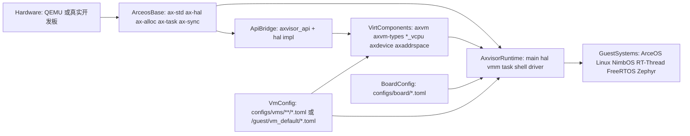
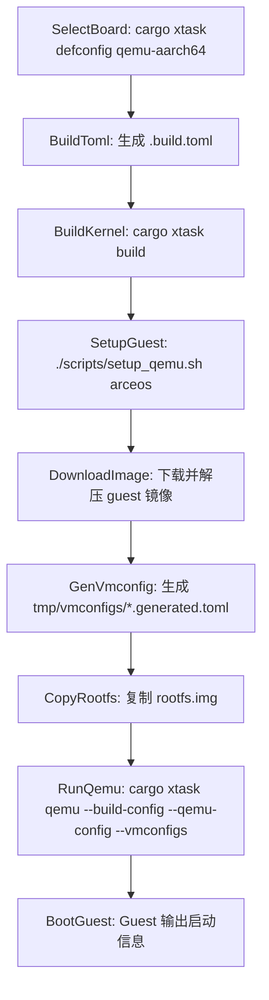
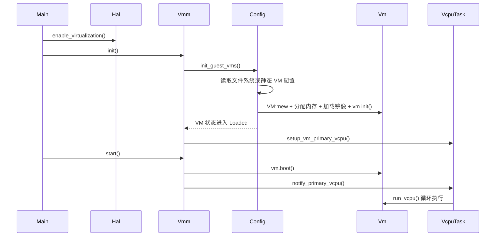
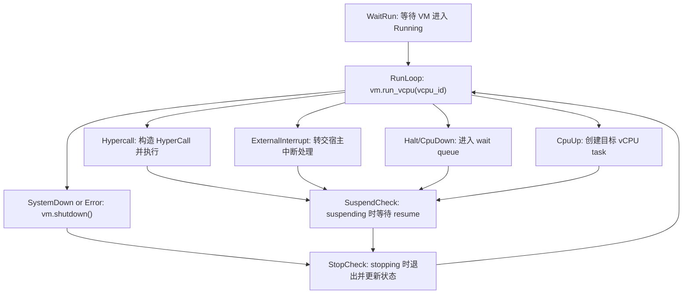
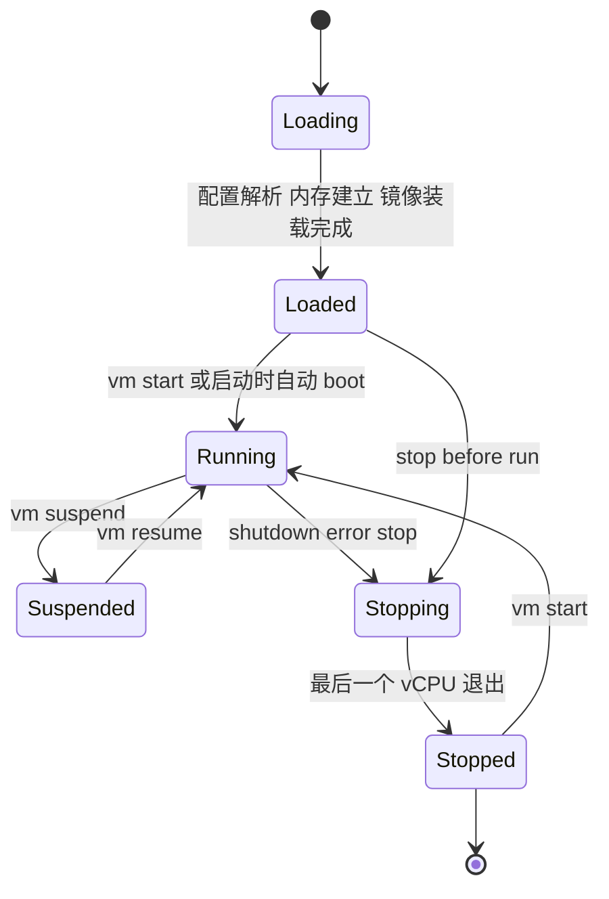

# Axvisor 架构

Axvisor 是基于 ArceOS 的统一组件化 Type-I Hypervisor。它既非直接包裹 KVM 的用户态工具，也非单体式虚拟机管理程序，而是建立在 ArceOS 运行时、虚拟化组件库与分层配置系统之上的 Hypervisor 软件栈。

本文聚焦 Axvisor 的组织原理、配置体系与关键执行路径。若需要先运行 QEMU 示例，请先阅读 [Axvisor 快速上手](/docs/quickstart/axvisor)。

## 系统定位

Axvisor 与 ArceOS/StarryOS 的最大差异在于：**代码、配置和 Guest 镜像同等重要**。许多"看起来像代码 bug"的问题，根因通常是 `.build.toml`、`vm_configs`、`kernel_path` 或 `tmp/rootfs.img` 未对齐。

| 目标 | 含义 | 典型落点 |
| --- | --- | --- |
| 统一 | 尽可能用同一套代码覆盖多架构平台 | `hal/arch/*`、`configs/board/*` |
| 组件化 | 将 VM、vCPU、虚拟设备、地址空间、API 注入等能力拆成独立组件 | `virtualization/axvm`、`axvm-types`、各架构 `*_vcpu`、`axdevice`、`axaddrspace`、`axvisor_api` |
| 可配置 | 通过板级配置与 VM 配置控制构建与运行行为 | `configs/board/*.toml`、`configs/vms/**/*.toml` |
| 可验证 | 通过 xtask、QEMU workflow 和统一测试入口形成闭环 | `cargo xtask axvisor test qemu ...` |

## 架构概览

Axvisor 的运行结构可概括为"ArceOS 作为宿主运行时 + 虚拟化组件作为能力核 + Axvisor 运行时负责编排 + Guest 作为最终负载"。



此图可从两条主线理解：

- **运行主线**：`hardware → ArceOS base → virt components → Axvisor runtime → guests`
- **配置主线**：`board config + vm config → Axvisor runtime / virt components`

## 分层职责

Axvisor 从底部宿主运行时到顶部 Guest 系统，依次经过五层。每一层的职责边界清晰：宿主运行时提供调度和内存，虚拟化能力层提供 VM/vCPU/设备抽象，API 注入层桥接两者，编排层负责初始化和生命周期管理，配置与镜像层决定构建产物和运行负载。

| 层次 | 目录 | 职责 |
| --- | --- | --- |
| 宿主运行时层 | `ax-std`、`ax-hal`、`ax-alloc`、`ax-task` | 提供宿主机上的调度、内存、时间、控制台与硬件抽象 |
| 虚拟化能力层 | `virtualization/axvm`、`axvm-types`、各架构 `*_vcpu`、`axdevice`、`axaddrspace` | 抽象 VM、vCPU、设备模拟/直通与客户机地址空间 |
| API 注入层 | `virtualization/axvisor_api`、`src/hal` 中的 `api_mod_impl` | 将 ArceOS 的能力注入到更底层虚拟化组件 |
| Axvisor 编排层 | `os/axvisor/src/*` | 初始化、VMM、shell、任务组织、Guest 启停 |
| 配置与镜像层 | `configs/board/*`、`configs/vms/*`、`tmp/*`、镜像仓库 | 控制"构建什么"和"启动哪个 Guest" |

## 运行时模块

Axvisor 运行时由 6 个模块组成，均位于 `os/axvisor/src/` 下。`main.rs` 负责总控，`hal` 和 `vmm` 承担大部分核心逻辑，`shell` 和 `driver` 提供交互和设备支持。

| 模块 | 目录 | 职责 |
| --- | --- | --- |
| 入口与编排 | `src/main.rs` | 按顺序触发硬件虚拟化、VMM 初始化、VM 启动与 shell |
| `hal` | `src/hal/*` | 适配 aarch64/riscv64/loongarch64/x86_64 架构，提供虚拟化启用、中断注入、`axvisor_api` 实现 |
| `vmm` | `src/vmm/*` | 配置解析、VM 列表、镜像加载、vCPU 管理、虚拟 timer、hypercall、IVC 通信、FDT 处理 |
| `task` | `src/task.rs` | `VCpuTask` 结构体，将 vCPU 与宿主 task 关联 |
| `shell` | `src/shell/*` | 交互式命令行，支持文件系统操作与 VM 生命周期管理命令 |
| `driver` | `src/driver/*` | 宿主侧设备驱动（块设备 DMA、SoC 专用驱动） |

## 核心设计机制

Axvisor 的核心设计围绕四个机制展开：简洁的运行时主线与复杂的 VMM 层次之间的分离、配置驱动的 VM 实例化、vCPU 作为 ArceOS task 的调度模型，以及 `axvisor_api` 的宿主能力注入。这些机制共同决定了 Axvisor 的运行时行为和扩展方式。

### 运行时主线

`os/axvisor/src/main.rs` 实现非常简洁：

```rust
fn main() {
    logo::print_logo();
    info!("Starting virtualization...");
    ensure_hardware_support();
    hal::enable_virtualization();
    vmm::init();
    vmm::start();
    info!("[OK] Default guest initialized");
    shell::console_init();
}
```

运行时主线可概括为五步：检查硬件支持 → 使能虚拟化 → 初始化 VMM → 启动 VM → 进入 shell。真正的复杂度集中在 `hal`、`vmm` 和配置解析中。

### 架构适配

`hal/arch/` 提供四套架构适配，每套实现各自架构的虚拟化启用、中断注入和上下文切换。aarch64 和 riscv64 是当前最成熟的两条路径，loongarch64 处于可用状态，x86_64 仍为 stub 占位。

| 架构 | 虚拟化方式 | 中断注入 |
| --- | --- | --- |
| aarch64 | EL2 虚拟化 | GIC 中断注入 |
| riscv64 | H 扩展 | PLIC 中断注入 |
| loongarch64 | LVZ 虚拟化 | 中断注入 |
| x86_64 | stub 占位 | — |

### 配置驱动的 VM 实例化

`vmm::init()` 会先调用 `config::init_guest_vms()`，优先从文件系统读取 `/guest/vm_default/*.toml`，若无则回退到静态内置配置。随后对每份配置执行：解析 TOML → 构造 VM 配置 → 创建 VM 实例 → 分配内存 → 加载镜像 → 初始化 VM。

Guest 的存在方式是"配置驱动的 VM 实例化过程"，而非代码中写死的默认 VM。

### vCPU 作为 ArceOS task

每个 vCPU 最终被包装成 ArceOS task，进入独立的等待队列与运行循环。主 vCPU 在 `setup_vm_primary_vcpu()` 中首先被分配 task，初始为阻塞状态，直到 `notify_primary_vcpu()` 唤醒。`vcpu_run()` 中不断调用 `vm.run_vcpu()` 并处理不同的 `VmExit`。

AxVisor 的并发模型可理解为：

- 宿主侧由 ArceOS task 负责调度。
- 客户机侧由 VMM 抽象出的 vCPU 状态机负责执行。
- 二者通过 `vcpu_run()` 桥接循环耦合。

### axvisor_api：宿主能力注入

`axvisor_api` 的设计目标是替代大量泛型 trait 传递，将底层组件所需的宿主能力按模块分类暴露为统一 API。底层组件无需直接依赖整个 ArceOS，调用方看到的是普通函数风格而非 trait 泛型。

API 按功能域分组：`arch`、`memory`、`time`、`vmm`、`host`。AxVisor 本体在 `src/hal/mod.rs` 中通过 `#[axvisor_api::api_mod_impl(...)]` 提供这些 API 的真实实现。

## 配置体系

AxVisor 的配置体系分为两层：板级配置控制 Hypervisor 本身的构建行为；VM 配置定义每个 Guest 的资源与运行参数。二者缺一不可。

### 板级配置

板级配置控制 Hypervisor 自身的构建目标、feature 组合和日志级别。每份配置对应一种硬件平台（QEMU 虚拟机或物理开发板），决定最终编译出的 Hypervisor 镜像适配哪个目标。

`configs/board/` 中当前包含 10 份板级配置文件（9 份 TOML 配置 + 1 份 DTB）：

| 配置文件 | 目标 |
| --- | --- |
| `qemu-aarch64.toml` | AArch64 QEMU（默认推荐） |
| `qemu-riscv64.toml` | RISC-V 64 QEMU |
| `qemu-x86_64.toml` | x86_64 QEMU（stub） |
| `qemu-loongarch64.toml` | LoongArch64 QEMU |
| `orangepi-5-plus.toml` | Orange Pi 5 Plus (RK3588) |
| `phytiumpi.toml` | 飞腾派 (E2000) |
| `roc-rk3568-pc.toml` | RK3568 PC |
| `rdk-s100.toml` | RDK-S100 |
| `tac-e400.toml` | TAC-E400 |
| `orangepi-5-plus.dtb` | Orange Pi 5 Plus 设备树 |

### VM 配置

VM 配置定义每个 Guest 的资源分配与运行参数，包括 CPU 数量、内存区域、内核镜像路径和设备直通规则。配置按平台优先组织：QEMU 配置放在 `configs/vms/qemu/<arch>/`，实体板卡配置放在 `configs/vms/<board>/`，文件名保留 Guest 和变体。

`configs/vms/` 中包含 50 余份 Guest VM 配置，覆盖 ArceOS、Linux、NimbOS、RT-Thread、FreeRTOS、Zephyr 等 Guest。

单个 VM 配置通常包含三段：

| 配置段 | 说明 |
| --- | --- |
| `[base]` | VM id、name、vm_type、CPU 数和物理 CPU 绑定 |
| `[kernel]` | entry point、image location、kernel path、load address、memory regions |
| `[devices]` | passthrough devices、excluded devices、emu devices、interrupt mode |

## 关键执行流程

本节通过流程图和时序图描述 Axvisor 从配置加载到 Guest 启动、vCPU 运行循环和 VM 生命周期的完整执行路径。这些图可用于定位"Guest 无响应"、"VM 启动失败"等常见问题的发生阶段。

### 从配置到 Guest 启动

从选择板级配置到最终看到 Guest 输出，需要经过一系列步骤：生成构建配置、编译 Hypervisor、准备 Guest 镜像和 VM 配置，最后启动 QEMU。以下流程图展示了完整的链路。



此链路有两个常见问题点：

- `.build.toml` 仅控制"Hypervisor 如何构建"，不会自动准备 Guest 镜像。
- `qemu-aarch64.toml` 默认 `vm_configs = []`，若未额外传入生成的 VM config，无法确定启动哪个 Guest。

### VMM 初始化与 VM 启动

当 Hypervisor 进入 `vmm::init()` 后，会读取 VM 配置、创建 VM 实例、分配内存并加载镜像。`vmm::start()` 随后唤醒主 vCPU 开始执行。以下时序图描述了这一过程的关键步骤。



### vCPU 运行循环

`vcpu_run()` 是 AxVisor 动态行为最密集的入口，不断处理不同的 `VmExit`：



### VM 生命周期

VM 从创建到退出经历多个离散状态：



Shell 命令的状态约束：

- `Loaded` 不能直接 `resume`，只能 `start`。
- `Suspended` 不能重复 `suspend`。
- `Stopping` 期间通常需等待 vCPU 真正退出。

## VM 间通信（IVC）

AxVisor 通过 Hypercall 机制提供 VM 间通信（Inter-VM Communication）能力。`src/vmm/ivc.rs` 维护全局 `IVC_CHANNELS` 映射表，支持发布/订阅模式的共享内存通道：

- `publish_channel()`：发布者分配共享内存通道。
- `subscribe_to_channel()`：订阅者获取通道访问权限。
- `unpublish_channel()`：清理已发布的通道。

此机制允许不同 Guest 之间通过 Hypervisor 中转的高效共享内存进行数据交换。
