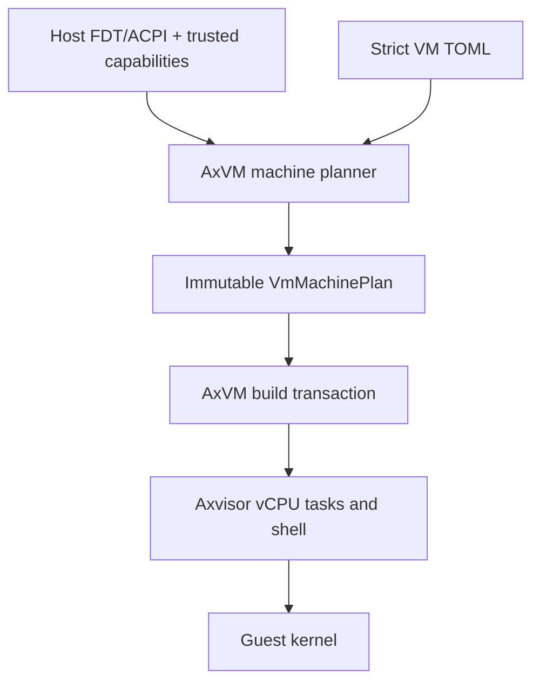

# Axvisor 架构

Axvisor 是运行在 ArceOS 上的组件化 Type-I Hypervisor。ArceOS 提供调度、内存、IRQ、
timer、console 和驱动；`virtualization/` 中的领域 crate 提供 VM、vCPU、controller 与
device core；`os/axvisor` 负责文件加载、创建事务和运行时编排。

## 分层



| 层 | 主要目录 | 职责 |
| --- | --- | --- |
| Host runtime | `os/arceos` | task、memory、IRQ、timer、console、driver |
| VM domain | `virtualization/axvm` | machine plan、VM lifecycle、address space、firmware |
| Device domain | `virtualization/axdevice*` | device model、bus、interrupt topology |
| Architecture | `virtualization/*_vcpu`、`arm_vgic` | hardware-neutral core 与受检 backend |
| Orchestration | `os/axvisor/src` | config/image I/O、manager、vCPU task、shell |

架构 cfg 和平台硬件 glue 保留在 `axvm/src/arch/<arch>`。共享 VM、device 和 machine
模块不 include 架构源码，也不暴露 controller 操作给共享 vCPU protocol。

## 配置到机型计划

Guest TOML 先由 `axvmconfig` 严格解析为不可变请求。核心机型字段：

```toml
[machine]
mode = "passthrough"       # 或 "virtual"
firmware = "auto"
interrupts_passthrough = false
```

`interrupts_passthrough` 只属于 passthrough variant，默认 `false`；Virtual variant 出现
该字段即报错。解析后归一化为 `InterruptDelivery::{Mediated, Direct}`。

内存和设备采用结构化声明：

```toml
[[memory.regions]]
guest_base = 0x8000_0000
size = 0x4000_0000
permissions = "rwx"
backing = { kind = "allocate" }

[devices]
disable_defaults = []
deny = []

[[devices.virtual]]
id = "console0"
model = "arm-pl011"
source = { kind = "auto" }
backend = { kind = "host-console", rx = "exclusive", tx = "shared" }
```

旧裸地址/IRQ/类型编号配置已删除。AxVM 配置不会被 FDT parser 动态修改。
Passthrough 的 `identity-allocate` RAM 可用于 x86_64/AArch64：`guest_base = 0` 仅表示
最终 GPA 由 allocator 选择并等于 HPA，不会在 machine plan 中占用 `[0, size)`。

## HostPlatformSnapshot

Passthrough 机型从 host FDT/ACPI 和可信平台 capability 生成快照。快照保留稳定 device
identity、MMIO/PIO、完整 IRQ route、PCI aperture 和 ownership：

- `HostExclusive`：host/hypervisor 永久保护；
- `Transferable`：创建事务中可以交接；
- `Assignable`：可直接分配；
- `Structural`：总线、clock 或拓扑结构；
- `Unrepresentable`：无法安全隔离/描述。

处理优先级为：强制保护、配置 deny、虚拟替换、剩余设备 passthrough。带资源但没有
可生成 identity 的 ACPI object 不会默认授权。

## 地址空间语义

Passthrough 非 RAM I/O aperture 默认 identity-map，但始终对以下资源打洞：host 独占和
reserved、Guest RAM、boot blobs、deny、virtual replacement、虚拟 device/controller
window。RAM 显式分配，未分配 host RAM 永不映射。

Virtual 不映射任何 host MMIO/PIO/PCI，只映射显式 RAM/shared/backing。虚拟 MMIO/PIO
只占用 Guest 地址并注册 bus，stage-2 保持 unmapped 以触发模拟。

## 设备与中断拓扑

`VirtualDeviceModel` 先声明具名资源需求，planner 使用 rust-vmm `vm-allocator` 分配，
再调用 model build。设备通过 `DeviceBuildContext::irq(slot)` 或 `msi(slot)` 获取 endpoint，
不接触 vCPU、controller ID、Guest INTID 或 host IRQ。

`InterruptTopology` 注册 controller input capability、controller cascade 和 vCPU port。
设备连接 controller input，controller 连接 vCPU 或上级 controller；共享 public API 不再
提供按 vector 的手动 inject。

Mediated 模式允许 host IRQ adapter 和软件 IRQ。Direct 模式只允许已取得 host ownership
的物理 source，不与 LR 软件注入混用。

## 固件

- AArch64/RISC-V Virtual：`vm-fdt` 生成全新 FDT；
- AArch64/RISC-V Passthrough：从 machine plan 过滤并重建 host FDT 节点/引用；
- x86_64/LoongArch64：`acpi_tables` 生成标准表和 device AML；
- LoongArch64 ACPI 文件通过 fw_cfg 提供。

host AML 不复制到 Guest。FDT/ACPI 描述的地址、IRQ 与 runtime device resources 来自同一
plan，避免固件和 bus 不一致。

## 创建事务

Axvisor 先读 kernel、ramdisk 和外部 firmware，随后一次性 claim 所有 passthrough
device。`HostDeviceLease` 保存需要恢复的 ownership；snapshot generation 变化、claim
竞争或后续失败会释放全部 lease。

构建顺序固定为 RAM → vCPU → controller/binding → device/topology → bus/mapping →
FDT/ACPI → boot state → commit。只有 commit 后 VM 才对 manager 可见。

## vCPU 运行

每个 vCPU 由 ArceOS task 驱动。一次 VM exit 先完成架构 side effect，再同步 controller
binding 和 pending delivery，最后返回调度动作。中断 wake 不会无条件 kick 当前正在
运行的 vCPU。

AArch64 binding load/save 同时切换 GIC CPU interface 与 direct 模式私有 IRQ ownership。
timer adapter 每 vCPU 持有自己的 PPI line，并以 generation token 取消过期回调。

## 架构 profile

| 架构 | Controller topology | 默认 console | Firmware |
| --- | --- | --- | --- |
| AArch64 | GICv3 → vCPU | PL011 | FDT |
| RISC-V | PLIC context → hart/vCPU | NS16550 | FDT |
| x86_64 | IOAPIC → LAPIC | COM1 | ACPI |
| LoongArch64 | PCH-PIC → EIOINTC → vCPU | NS16550 | ACPI/fw_cfg |

controller、timer、power/reset 为 profile 强制基础设施。console 可关闭；block、net、RNG
必须显式配置。

## 验证

先运行领域测试和四架构 build，再做有镜像的 QEMU smoke：

```bash
cargo test -p axvm --lib --tests
cargo xtask clippy --package axvm
cargo xtask axvisor build -c os/axvisor/configs/board/qemu-aarch64.toml --debug
cargo xtask axvisor build -c os/axvisor/configs/board/qemu-riscv64.toml --debug
cargo xtask axvisor build -c os/axvisor/configs/board/qemu-x86_64.toml --debug
cargo xtask axvisor build -c os/axvisor/configs/board/qemu-loongarch64.toml --debug
```
