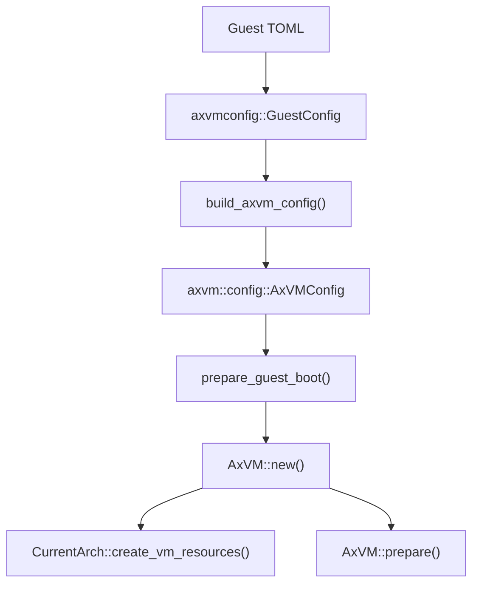
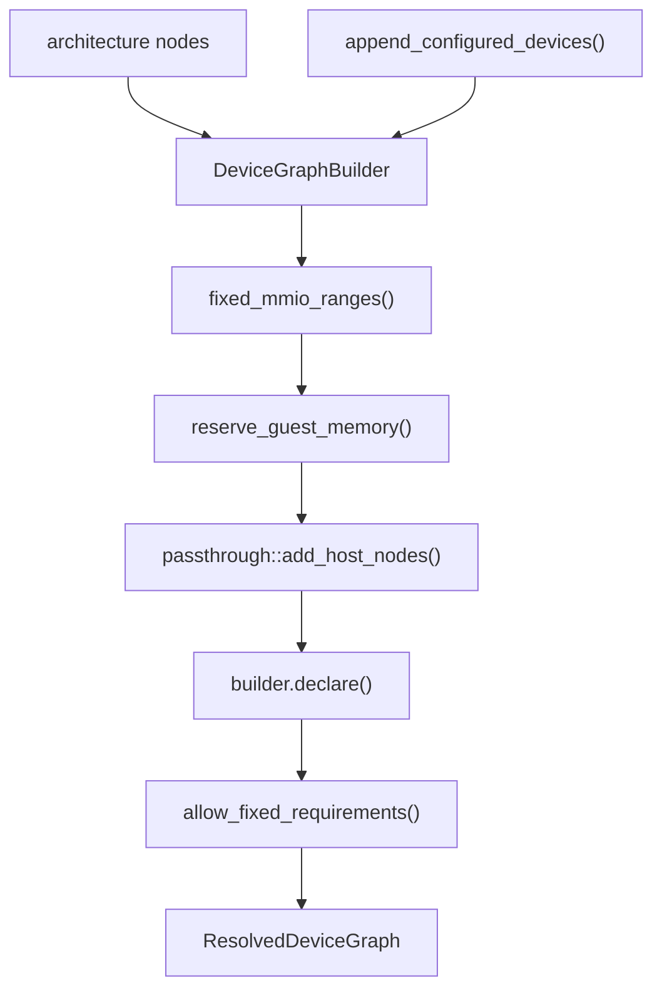

# Axvisor 客户机配置与 Machine 设计

Axvisor 客户机 Machine 设计把用户可持久化的 VM 配置、架构固定的平台设备、物理设备直通、虚拟设备图和宿主控制台复用拆成几个明确边界。用户 TOML 只描述客户机身份、启动镜像、内存、物理设备选择器和虚拟设备语义参数；地址、端口、中断控制器输入、固件节点和运行时设备注册由 `axvmconfig`、`os/axvisor/src/config.rs`、`virtualization/axvm` 与 `virtualization/axdevice` 在 VM 创建路径中解析和规划。

这个设计的核心约束是单一事实来源。`GuestConfig` 是持久化输入，`AxVMConfig` 是 AxVM 内部运行配置，`MachineProfile` 提供架构默认平台资源，`ResolvedDeviceGraph` 是设备地址和中断规划结果，`DeviceRuntime` 是 VM 运行时唯一的设备派发表。

## 1. 设计范围

客户机 Machine 不等同于某个架构的 QEMU machine type，也不等同于一份 VM TOML。它是 Axvisor 在创建一个 VM 时形成的 guest-visible 平台契约，覆盖 vCPU 拓扑、stage-2 地址空间策略、machine-owned 控制器、默认虚拟串口、普通虚拟设备、物理设备直通和 guest firmware 描述。

### 1.1 入口边界

当前入口从 `os/axvisor/src/config.rs::init_guest_vm()` 开始，配置先经 `axvmconfig::GuestConfig::from_toml()` 解析，再由 `build_axvm_config()` 转为 `AxVMConfig`。随后 `prepare_guest_boot()` 补齐镜像、DTB/FDT 或 ACPI 相关资源，`AxVM::new()` 创建 VM 对象，`vm.prepare()` 进入各架构的 VM 资源准备路径。



这条链路把“解析配置”和“构造硬件平台”分开。`axvmconfig` 不知道具体架构的 GIC、PLIC、IOAPIC 或 PCH-PIC；架构 VM plan 不重新解析 TOML，只读取 `AxVMConfig` 中已经规范化的字段。

### 1.2 所有权原则

Machine 设计中的每一类信息只有一个 owner。文档、配置和代码维护时应先判断要改的是持久化 schema、AxVM 内部配置、架构 machine profile、设备模型，还是宿主应用层控制台策略。

| 信息 | Owner | 主要代码锚点 |
| --- | --- | --- |
| 用户 TOML schema | `axvmconfig` | `GuestConfig`、`VMBaseConfig`、`VMKernelConfig`、`GuestDevices` |
| VM 内部运行配置 | `axvm` | `AxVMConfig`、`AxVMConfigParams`、`PhysCpuList` |
| 架构固定平台资源 | `axvm::machine` | `MachineProfile`、`GuestSerialProfile`、`GuestGicProfile`、`GuestPlicProfile` |
| 虚拟设备声明和资源规划 | `axdevice` / `axvm::configured` | `DeviceModel`、`ConfiguredDeviceCatalog`、`VmDevicePlan` |
| 物理设备选择与 FDT 解析 | `axvm::boot::fdt` | `find_all_passthrough_devices()`、`parse_passthrough_devices_address()`、`parse_vm_interrupt()` |
| VM 设备运行时 | `axdevice` | `DeviceRuntimeBuilder`、`DeviceBundle`、`DeviceRuntime` |
| 宿主控制台输入复用 | Axvisor app | `GuestConsoleMux`、`serial_backend_factory()` |

这个拆分避免用户配置直接携带裸 MMIO、PIO 或 IRQ 数字。数字资源可以存在于 machine profile 或设备模型的 `requirements()` 里，但普通 TOML 只保留稳定 ID、model 和设备语义参数。

## 2. 配置模型

Axvisor VM 配置由 `GuestConfig` 承载，包含 `[base]`、`[kernel]` 和 `[devices]` 三个段落。所有公开配置结构都使用 Serde 解析并开启 `deny_unknown_fields`，因此新字段必须先进入 schema，旧字段或拼写错误不会被静默忽略。

### 2.1 基础配置

`VMBaseConfig` 定义 VM 身份和 CPU 拓扑。`id` 和 `name` 用于 VM 管理与日志；`cpu_num` 决定 vCPU 数量；`phys_cpu_ids` 表示暴露给 guest 的物理 CPU ID；`phys_cpu_sets` 表示每个 vCPU 可运行的 host CPU mask。

| 字段 | 语义 | 转换目标 |
| --- | --- | --- |
| `id` | VM ID | `AxVMConfig::id` |
| `name` | VM 名称 | `AxVMConfig::name` |
| `guest_type` | 地址空间和物理设备分配策略 | `AddressSpacePolicy` |
| `cpu_num` | vCPU 数量 | `PhysCpuList::cpu_num` |
| `phys_cpu_ids` | guest 看到的 CPU 硬件 ID | `PhysCpuList::phys_cpu_ids` |
| `phys_cpu_sets` | vCPU 到 host CPU 的亲和性 mask | `PhysCpuList::phys_cpu_sets` |

`VMBaseConfig` 仍接受 `vm_type` 作为反序列化 alias，并把旧数值 `0`、`1` 映射到 `GuestType::Passthrough`，把 `2` 映射到 `GuestType::Virtualized`。序列化和 schema 只暴露 `guest_type`，因此新配置不应继续写旧 `vm_type`。

### 2.2 启动配置

`VMKernelConfig` 保存入口地址、镜像路径、加载地址、DTB、ramdisk、命令行和内存区域。`effective_boot_protocol()` 以 `boot_protocol` 为优先级，缺省时根据 `enable_bios` 选择 `VMBootProtocol::Multiboot` 或 `Direct`。

| boot protocol | 支持架构 | 固件输入规则 |
| --- | --- | --- |
| `direct` | `x86_64`、`aarch64`、`riscv64`、`loongarch64` | 不需要 firmware path 或 firmware load address |
| `multiboot` | `x86_64` | `bios_path` 可选；若提供则必须提供 `bios_load_addr` |
| `uefi` | `x86_64`、`loongarch64` | 必须提供 `uefi_firmware_path` 或兼容的 `bios_path`，并提供 `bios_load_addr` |

`validate_boot_config()` 在配置解析阶段检查协议和 `enable_bios` 是否冲突。`os/axvisor/src/config.rs::boot_firmware_load_gpa()` 和 boot preparation 路径再把这些字段转为 `VMImageConfig` 和 `GuestBootPolicy`，必要时会调整 kernel load address 以容纳 firmware boot 所需区域。

### 2.3 内存配置

`kernel.memory_regions` 使用 `VmMemConfig` 表示 guest RAM 或保留区。每个条目携带 `gpa`、`size`、`flags` 和 `map_type`，其中 `map_type` 经 `VmMemMappingTypeSerde` 从 TOML 数字映射到 `MapAlloc`、`MapIdentical` 或 `MapReserved`。

| map type | 数值 | 运行时含义 |
| --- | ---: | --- |
| `MapAlloc` | `0` | VM monitor 分配 host 内存并映射到 guest GPA |
| `MapIdentical` | `1` | guest GPA 与 host PA 做 identity mapping，常用于直通 DMA 场景 |
| `MapReserved` | `2` | 作为 guest-owned/reserved 区域参与地址空间打洞，不作为普通 guest RAM |

FDT boot 路径还会通过 `parse_reserved_memory_regions()` 把 DTB `/reserved-memory` 中未与显式 memory region 重叠的区域追加为 `MapReserved`。`sync_axvm_config_from_crate_config()` 随后把补齐后的 memory list 写回 `AxVMConfig`，避免 AxVM 准备阶段仍看到旧快照。

### 2.4 设备配置

`GuestDevices` 把物理设备选择和虚拟设备请求分开。`passthrough` 与 `disabled` 只接受 `PhysicalDeviceRef { path }`，当前 selector 必须是绝对 FDT 路径且不能是 `/`；`virtual` 则解析为 `VirtualDeviceRequest { id, model, options }`。

```toml
[devices]
passthrough = [
  { path = "/soc/virtio_mmio@10001000" },
]
disabled = [
  { path = "/pcie@10000000" },
]

[[devices.virtual]]
id = "net0"
model = "virtio-net"
guest_mac = [2, 0, 0, 0, 0, 1]
```

`VirtualDeviceRequest::validate()` 限制 ID 和 model 的字符集，并拒绝 `irq_id`、`mmio_base`、`pio_base`、`msi_device_id`、`lpi_id` 等 framework-owned 数字资源字段。设备可以在 `options` 中定义容量、MAC、backend 等语义参数，但不能绕过资源规划器指定地址或中断线。

## 3. 配置转换

配置转换由 Axvisor app 层完成，目标是把持久化 schema 转成 AxVM 能直接消费的 `AxVMConfig`。这个阶段不会构建设备，也不会注册 VM；它只选择 machine 默认值、注册 app 侧 virtual-device catalog，并把 guest type 映射到地址空间策略。

### 3.1 AxVM 配置生成

`build_axvm_config()` 是 TOML schema 和 AxVM runtime config 之间的主要边界。它从 `GuestConfig` 提取 VM ID、CPU 列表、entry point、镜像加载地址、memory regions、物理设备 selector 和 virtual device requests，同时注入 machine serial profile 和 Axvisor 的串口 backend factory。

| `GuestConfig` 来源 | `AxVMConfigParams` 目标 | 说明 |
| --- | --- | --- |
| `base.id` / `base.name` | `id` / `name` | 保持用户配置身份 |
| `base.cpu_num`、`phys_cpu_ids`、`phys_cpu_sets` | `PhysCpuList::new()` | 架构后续按该列表创建 vCPU |
| `kernel.entry_point` | `AxVCpuConfig` | BSP/AP 入口当前都取同一 entry |
| `kernel.kernel_load_addr` | `VMImageConfig::kernel_load_gpa` | boot preparation 可能后续 relocation |
| `devices.passthrough` | `pass_through_devices` | 先保存 unresolved FDT path |
| `devices.disabled` | `excluded_devices` | 后续 FDT parser 用于打洞和 IRQ 排除 |
| `base.guest_type` | `address_space_policy` | `Virtualized` 或 `Passthrough` |
| `devices.virtual` | `virtual_device_requests` | 交给 configured catalog 实例化 |

当 `guest_type = "passthrough"` 且用户没有显式 `devices.passthrough` 时，`build_axvm_config()` 会使用当前 `MachineProfile::default_passthrough_device_path`。AArch64、RISC-V 和 LoongArch 的默认值是 `/`，表示后续 FDT 发现路径负责展开可直通设备；x86_64 当前为 `None`。

### 3.2 Catalog 装配

`ConfiguredDeviceCatalog::new()` 内置串口 model 和 `ivc-channel` model。Axvisor app 额外在 `build_axvm_config()` 注册 `os/axvisor/src/virtio_blk.rs::REGISTRATION` 和 `os/axvisor/src/virtio_net.rs::REGISTRATION`，因此当前可由 TOML 请求的普通 model 包括串口、IVC、virtio-blk 和 virtio-net。

| model | 注册位置 | 当前资源策略 |
| --- | --- | --- |
| `pl011-mmio` | `axvm::machine::factory` | 默认 `console0` 可使用 machine fixed binding；额外实例可自动分配 |
| `uart16550-mmio` | `axvm::machine::factory` | 默认 `console0` 可使用 machine fixed binding；额外实例可自动分配 |
| `uart16550-pio` | `axvm::machine::factory` | x86 默认 COM1 使用 fixed PIO；额外实例可自动分配 |
| `ivc-channel` | `axvm::configured::ivc` | MMIO aperture 和 notify IRQ 默认自动规划 |
| `virtio-net` | `os/axvisor/src/virtio_net.rs` | 当前固定 MMIO `0x0a00_0000/0x200`、wired IRQ input `48` |
| `virtio-blk` | `os/axvisor/src/virtio_blk.rs` | 当前固定 MMIO `0x0a00_0200/0x200`、wired IRQ input `49` |

这里的“固定”是设备模型对资源规划器的请求，不是用户 TOML 字段。`VmDevicePlan` 会把 fixed requirements 加入 allowlist，并仍然检查它们不能与 guest RAM、host replacement 或其他固定范围冲突。

### 3.3 Boot 补齐

`init_guest_vm()` 在 `build_axvm_config()` 后调用 `prepare_guest_boot()`，让 boot pipeline 根据架构和镜像来源补齐配置。FDT 路径会解析 host DTB、保留 excluded device range、展开 passthrough device 地址和 IRQ；UEFI 或 multiboot 路径会处理 firmware image 与 boot policy。

这一步会修改 `AxVMConfig` 和 `GuestConfig` 的派生字段，因此 `sync_axvm_config_from_crate_config()` 必须在 boot preparation 后再次同步 memory regions。典型例子是 DTB `/reserved-memory` 追加了 `MapReserved` 区域，如果不写回 AxVMConfig，后续 stage-2 地址规划会把这些保留区当作可直通窗口。

## 4. Machine Profile

`MachineProfile` 是架构默认 guest-visible 平台资源。它包含强制虚拟串口、FDT interrupt encoding、AArch64 timer、AArch64 GIC、RISC-V PLIC 和默认 passthrough discovery root。`AxVMConfig::new()` 会根据 `CurrentArch::MACHINE_ARCHITECTURE` 和 vCPU 数调用 `current_machine_profile()`。

### 4.1 架构默认资源

各架构 profile 的默认串口和控制器是 VM 没有 host firmware replacement 时的兜底。AArch64 的 GIC redistributor 大小会随 `cpu_num` 扩展；RISC-V 的 PLIC profile 固定描述 `/soc/plic@c000000`；x86_64 和 LoongArch 由各自架构 plan 创建 IOAPIC/PCH-PIC 等控制器。

| 架构 | 默认串口 | 默认控制器资源 | 默认 passthrough root |
| --- | --- | --- | --- |
| `x86_64` | 16550 PIO `0x3f8..0x400`，IRQ `4`，`1_843_200` Hz | `plan_devices()` 创建 IOAPIC、PIC、PIT、CMOS、fw-cfg、PCI config、ACPI PM timer | `None` |
| `aarch64` | PL011 MMIO `0x0900_0000/0x1000`，SPI input `33`，`24_000_000` Hz | `GuestGicProfile` 描述 GICv3 distributor 和 redistributor；`GuestTimerProfile` 描述 arch timer | `/` |
| `riscv64` | NS16550 MMIO `0x1000_0000/0x100`，PLIC source `10`，`3_686_400` Hz | `GuestPlicProfile` 描述 PLIC window `0x0c00_0000/0x60_0000` | `/` |
| `loongarch64` | NS16550 MMIO `0x1fe0_01e0/0x100`，PCH-PIC input `2`，`100_000_000` Hz | `plan_devices()` 创建 host replacement PCH-PIC 和 fw-cfg | `/` |

Profile 不暴露给 TOML 逐字段配置。需要更改默认平台资源时，应改 `virtualization/axvm/src/machine/mod.rs` 和对应架构的 `plan_devices()`，并同步固件 composer 和资源池。

### 4.2 Host Firmware 替换

FDT 和 ACPI 平台可以用 host firmware 选择的 console UART 替换默认串口 profile。FDT 路径由 `host_selected_serial()` 从 `/chosen/stdout-path` 找到 UART 节点并解析 compatible、`reg`、interrupt、`reg-shift`、`reg-io-width` 和 clock；ACPI 路径由 `host_serial_from_acpi()` 解析 SPCR 中的接口类型、地址空间、寄存器范围、IRQ 和 clock。

替换结果存入 `AxVMConfig::replace_machine_serial(profile, identity)`。后续 `append_configured_devices()` 创建默认 `console0` 时，如果用户没有覆盖 model，或者覆盖 model 与默认 model 兼容，就会保留 fixed binding 和 `GuestSerialFirmwareIdentity`，从而在 guest firmware 中替换同一个 FDT node 或 ACPI device。

### 4.3 默认串口

`console0` 是每个 VM 的强制默认虚拟串口 ID。`append_configured_devices()` 先生成 machine-derived default intent，再查找用户是否提供同 ID 请求；如果没有，默认请求会按 machine profile 创建 `pl011-mmio`、`uart16550-mmio` 或 `uart16550-pio`。

```toml
[[devices.virtual]]
id = "console0"
model = "uart16550-mmio"
backend = { type = "host-console" }

[[devices.virtual]]
id = "serial1"
model = "pl011-mmio"
backend = { type = "null" }
```

如果用户用 `console0` 覆盖默认串口，model 必须仍是已注册串口 model。model 与 machine default 相同则继承 fixed binding 和 firmware identity；model 不同则变成普通 virtual node，由资源池自动规划地址和 IRQ，也不再绑定 host firmware identity。

## 5. 设备图

AxVM 使用 `DeviceNodeSpec`、`DeviceModel` 和 `ResolvedDeviceGraph` 管理普通虚拟设备、host replacement 和 host passthrough mapping。架构先把控制器和内部设备放入 graph，再调用 `append_configured_devices()` 合并默认串口和用户配置设备。

### 5.1 Model 注册

`ConfiguredModelRegistration` 是 model catalog 的显式注册单元，包含 model 名称、构造函数和可选的默认 fixed resources 函数。构造函数只负责把 `VirtualDeviceRequest` 解析成类型化 model，并返回携带 `Arc<dyn DeviceModel>` 的 `DeviceNodeSpec`。

| 接口 | 责任 |
| --- | --- |
| `ConfiguredDeviceCatalog::register()` | 校验 model 名称并拒绝重复注册 |
| `instantiate_node()` | 按 `request.model` 查找 registration，并创建 graph node |
| `DeviceModel::requirements()` | 声明 MMIO、PIO、wired IRQ、host IRQ 或 MSI slot |
| `DeviceModel::firmware()` | 声明普通设备的 guest firmware 元数据 |
| `DeviceModel::build()` | 消费规划后的 slot，并返回 `DeviceBundle` |

`DeviceInstantiationContext` 只向 model 暴露 VM ID、默认 wired controller、fixed bindings、firmware binding 和串口 backend factory。普通设备不接触架构 enum，也不直接访问 GIC/PLIC/IOAPIC/PCH-PIC 的内部对象。

### 5.2 资源规划

`VmDevicePlan::with_pools_for_vm()` 把 architecture nodes、configured virtual nodes 和 passthrough host nodes 放进同一个 `DeviceGraphBuilder`。它先收集 fixed MMIO ranges，保留 guest memory，再加入 host passthrough mapping，最后 declare/resolve 设备图。



`ResourcePools` 负责判断 fixed 请求是否允许、auto 请求是否有可用窗口、不同 device 的 slot 是否冲突。host passthrough mapping 会扣除 replacement ranges 和 fixed internal ranges，确保被虚拟设备占用的 GPA 不再被默认 passthrough identity map 覆盖。

### 5.3 Runtime 封装

VM prepare 阶段调用 `PreparedDevices::build_planned()`，按 resolved graph 的节点顺序构建 `DeviceRuntime`。每个 model 的 `build()` 通过 `DeviceBuildContext` 消费规划好的 slot；`DeviceRuntimeBuilder::finish()` 会检查所有 claim 被消费，然后 seal runtime。

`DeviceBundle` 是原子注册单元。一个 bundle 可以贡献 `Device`、pollable capability、DMA pollable capability、lifecycle capability、interrupt controller、typed service 和 planned endpoint/lease。`DeviceRuntime::register_bundle()` 若在同一 bundle 内注册失败，会回滚本次 bundle 已插入的 device index 和资源索引。

## 6. 地址空间

客户机 stage-2 地址空间由 `AxVMResources::prepare_guest_address_space()` 构建。它读取 memory regions、boot description 占用区、reserved ranges、architecture-owned regions、resolved virtual MMIO ranges 和 resolved host passthrough mappings，再调用 `build_address_layout()` 生成最终映射。

### 6.1 Guest Type 策略

`GuestType::address_space_policy()` 把用户配置映射成 `AddressSpacePolicy`。`Virtualized` 从空 GPA 空间开始，只加入 guest memory、boot description 和显式 passthrough；`Passthrough` 从 host-physical identity mapping 开始，再为 guest-owned region、虚拟设备 MMIO 和 reserved range 打洞。

| `guest_type` | 初始地址空间 | 物理设备来源 |
| --- | --- | --- |
| `virtualized` | 空地址空间 | 只使用 `devices.passthrough` 显式选择的设备 |
| `passthrough` | identity passthrough 地址空间 | 默认 discovery root 加 `devices.passthrough`，再移除 `disabled` 和 host-owned 资源 |

stage-2 可映射 GPA 上限由各架构的 nested paging config 决定。AArch64、RISC-V、x86 和 LoongArch 都会根据目标 CPU 能力选择页表层级；`stage2_guest_address_space_size()` 再用 `nested_paging.gpa_bits` 限制地址布局大小。

### 6.2 FDT 直通解析

FDT 平台上的物理设备 selector 不是最终地址映射。`find_all_passthrough_devices()` 会从初始 path 出发加入 descendant node 和 phandle dependency，再应用 `disabled` 集合；`parse_passthrough_devices_address()` 才把节点 `reg` 或 PCI `ranges` 转为 `HostDeviceAssignment`。

`parse_vm_interrupt()` 使用当前 guest FDT policy 解码 interrupt specifier，并把物理 interrupt source 记录到 `AxVMConfig::pass_through_irqs()`。被 `disabled`、host-owned serial、machine interrupt controller 或 timer 保护的节点不会进入最终 passthrough IRQ 列表。

### 6.3 Host-Owned 资源

`protect_machine_owned_firmware_devices()` 会把 host 物理串口、machine interrupt controller 和 machine timer 加入 excluded paths。如果用户显式选择这些 host-owned path，代码返回 `AxVmError::HostOwnedDevice`，而不是静默忽略。

x86_64 还有独立的 architecture-owned reserved region：`ARCH_OWNED_REGIONS` 保留 local APIC window `0xfee0_0000/0x1000`。VMX 后端可在该 hole 上安装 APIC-access backing page，SVM 路径保持未映射并通过 nested page fault 进入软件 vLAPIC；任何 `guest_type` 都不能把 host LAPIC identity-map 给 guest。

## 7. 固件描述

guest firmware 由 boot pipeline 从 resolved graph 和 machine profile 生成或 patch。普通设备通过 `DeviceFirmwareSpec` 描述节点名、compatible、ACPI HID、register slots、interrupt slots 和简单属性；架构控制器、timer 和 firmware 特殊表仍由对应架构 composer 处理。

### 7.1 FDT 路径

FDT 直通路径先用 `create_guest_fdt()` 从 host FDT 过滤出 guest 需要的 CPU、interrupt provider、PSCI 和 passthrough dependency。运行时再由 `patch_guest_fdt_for_runtime()` 重建 memory node、`/chosen`、machine interrupt controller、IVC nodes、configured virtio nodes、timer 和 serial nodes。

| FDT 内容 | 主要函数 | 数据来源 |
| --- | --- | --- |
| `/memory` | `FdtTree::rebuild_memory_nodes()` | VM memory layout |
| `/chosen` | `FdtTree::patch_chosen()` | cmdline、initrd、create_chosen policy |
| GIC / PLIC | `install_machine_interrupt_controller()` | `GuestGicProfile` / `GuestPlicProfile` |
| timer | `install_machine_timer()` | `GuestTimerProfile` |
| `console0` | `install_machine_serial()` | resolved serial profile 和 firmware identity |
| extra serial | `install_additional_serial()` | resolved graph 中非 `console0` 串口 |
| `ivc-channel` | `add_ivc_channel_nodes()` | resolved IVC channel resources |
| virtio nodes | `install_configured_virtio_net()`、`install_configured_virtio_blk()` | 当前固定 virtio MMIO/IRQ 约定 |

当前 virtio FDT composer 按 model 是否出现在 `config.devices.virtual_devices` 中安装 `virtio,mmio` 节点。它使用代码中的固定 base 和 controller input，而不是通用读取 resolved graph；如果未来把 virtio 改为全自动资源规划，FDT composer 也必须同步改成从 resolved graph 取资源。

### 7.2 ACPI 路径

ACPI 相关代码位于 `virtualization/axvm/src/boot/acpi` 和 x86_64 架构 plan。x86_64 `plan_devices()` 创建 IOAPIC、fw-cfg、PIT、PIC、CMOS、PCI config 和 ACPI PM timer，并用 `DeviceFirmwareBinding::AcpiDevice` 绑定 IOAPIC 和 fw-cfg 的 ACPI identity。

ACPI serial replacement 通过 SPCR 形成 `GuestSerialAcpiIdentity`，不会复制任意 host AML。当前代码已经具备 ACPI table image 和 loader 的基础设施，但普通 configured device 的 ACPI 生成能力仍主要受架构 composer 覆盖范围约束，维护时不能假设 `DeviceFirmwareSpec::acpi_hid()` 已经自动覆盖所有架构。

## 8. 控制台复用

每个 VM 的默认串口 backend 由 Axvisor app 层提供。`build_axvm_config()` 把 `crate::guest_console::serial_backend_factory(vm_id)` 写入 `AxVMConfig`，`append_configured_devices()` 创建 `console0` 时默认使用 host-console backend；其他串口未显式配置 `backend = { type = "host-console" }` 时使用 null backend。

### 8.1 Backend 代次

`GuestConsoleMux` 为每个 VM 创建带 generation 的 `GuestSerialBackend`。VM reset 或 device graph 重建时会生成新的 backend generation；旧 backend 读写时会因为 generation 不匹配而失效，避免旧虚拟串口实例继续操作新 VM 的输入输出队列。

`GuestConsoleMux` 内部有 `state` 和 `output_lock` 两把锁。需要同时访问输出和状态的路径先拿 `output_lock` 再拿 `state`，这个顺序写在 `ConsoleCore` 注释里，用于避免 backend replacement、输出格式化和 attach/detach 之间形成锁顺序反转。

### 8.2 输入路由

宿主控制台输入只由 `GuestConsoleMux` 读取。`route_host_byte()` 根据当前 attached VM 和快捷键前缀把字节分发给 Axvisor shell 或某个 VM 的 bounded RX queue，队列容量由 `INPUT_QUEUE_CAPACITY = 4096` 固定。

| 输入 | 行为 |
| --- | --- |
| 普通字节且无 attached VM | 返回 `ConsoleInputEvent::ShellByte` |
| 普通字节且有 attached VM | 写入该 VM RX queue，并请求唤醒 VM |
| `Ctrl-X h` | 从当前 VM detach 回 shell |
| `Ctrl-X [` | 切到前一个 running VM |
| `Ctrl-X ]` | 切到后一个 running VM |
| `Ctrl-X Ctrl-X` | 向当前目标发送字面 `Ctrl-X` |

输出由 `GuestOutputMux` 串行化。单 VM 运行时不加前缀；多个 VM 同时运行时按完整行加 `[VM <id>] ` 前缀，并在不同 VM 输出交错时补换行，避免两个 guest 的片段混成同一行。

### 8.3 Host Reader

`configure_host_console_reader()` 会先禁用 host console input IRQ，然后根据 VM vCPU affinity 选择一个没有被任何 vCPU mask 覆盖的 host CPU 放置 polling reader。找不到明确 host-only CPU 时，它不猜测，也不改写 vCPU mask。

这个策略是当前 cooperative FIFO scheduler 下的隔离措施。注释中明确说明：在 host UART IRQ 能把 RX 字节交给 mux-owned queue 并唤醒唯一 reader 之前，input IRQ 保持禁用，避免物理 UART 有第二个 reader 或 level IRQ 长时间保持 asserted。

## 9. 扩展规则

扩展客户机 Machine 时要保持“配置语义”和“资源事实”分离。新增字段前先判断它是否属于用户策略；如果它只是地址、中断、controller、firmware identity 或 host resource ownership，就应该进入 machine profile、设备 model requirements、资源池或架构 composer，而不是进入 `GuestConfig`。

### 9.1 新虚拟设备

新增普通虚拟设备时，设备模块需要提供类型化 options、`DeviceModel` 实现和一个 `ConfiguredModelRegistration`。`requirements()` 声明资源，`firmware()` 描述 guest firmware，`build()` 只能通过 `DeviceBuildContext` 消费规划后的 slot。

注册点取决于 model 所属层级。通用虚拟化 model 应进入 `axvm::ConfiguredDeviceCatalog::new()` 的内置集合；Axvisor app 私有 model 像 `virtio-blk`、`virtio-net` 一样在 `os/axvisor/src/config.rs::build_axvm_config()` 装配。

### 9.2 新架构资源

新增或修改架构 machine 资源时，需要同步三处：`MachineProfile` 中的默认资源、对应架构的 `plan_devices()` 或 VM plan、以及 FDT/ACPI composer。只改 profile 会让 runtime device graph 和 guest firmware 脱节；只改 composer 会让 guest 看见没有 runtime backing 的设备。

物理直通相关变更还必须检查 `find_all_passthrough_devices()`、`reserve_excluded_device_ranges()`、`parse_passthrough_devices_address()` 和 `parse_vm_interrupt()`。这些函数共同决定 guest FDT 里保留什么节点、stage-2 映射什么 HPA、以及哪些 physical interrupt source 可以送入虚拟控制器。

### 9.3 兼容约束

当前 schema 对未知字段严格失败，但仍对旧 `vm_type` 做有限 alias 映射。除此之外，旧 `emu_devices`、`cfg_list`、裸 `irq_id`、裸地址字段、`passthrough_addresses` 和 `passthrough_ports` 都不属于用户配置入口。

如果确实需要保留旧配置兼容，应在 `axvmconfig` 层显式实现解析和错误语义，并同步 JSON schema、模板和测试。不能在 Axvisor app 或架构 plan 中通过猜默认地址、猜 IRQ 或 fallback 到旧 device enum 的方式绕过配置边界。
