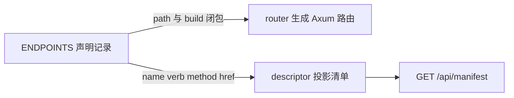
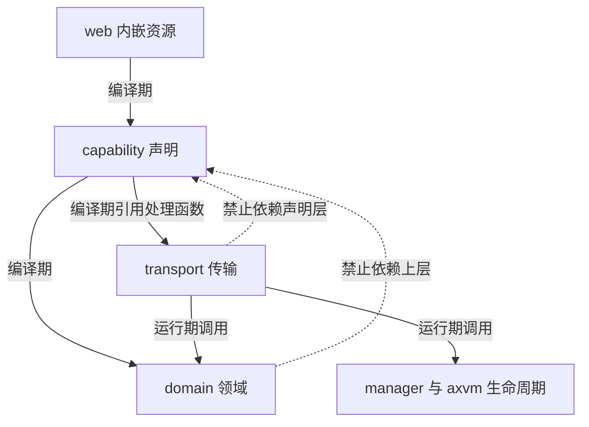
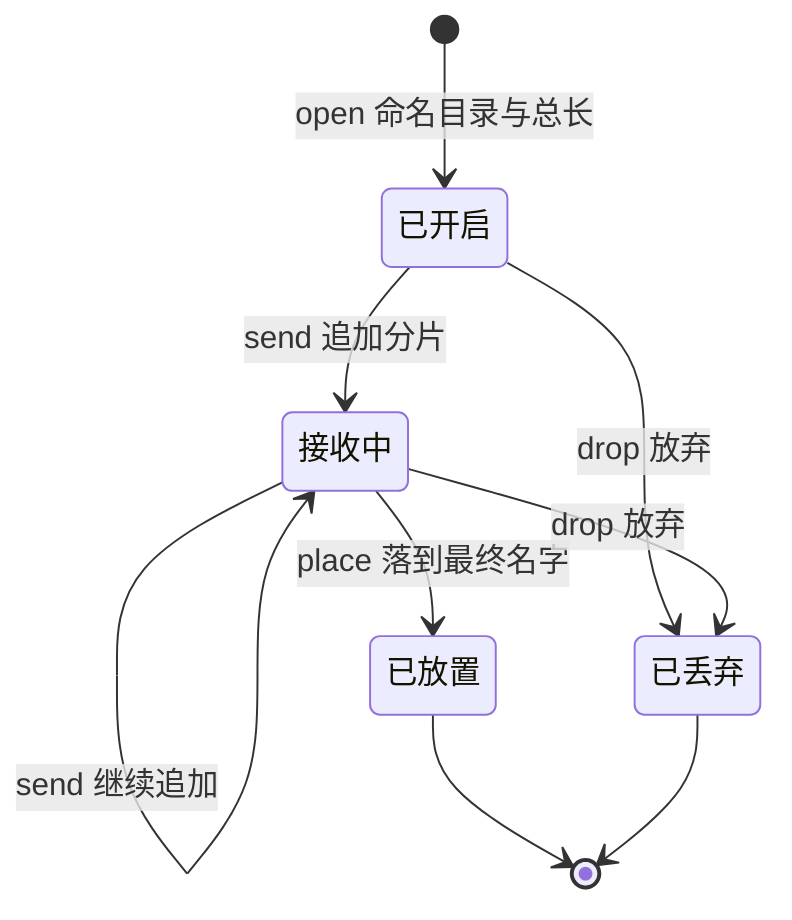
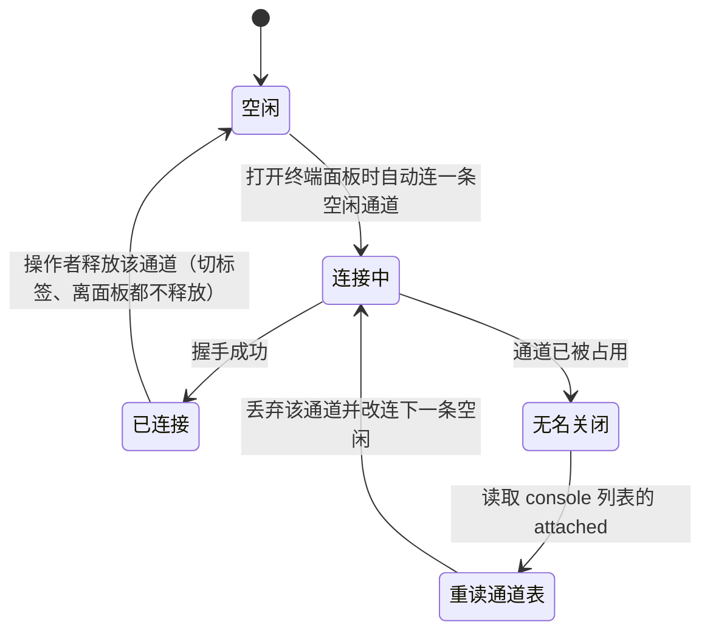
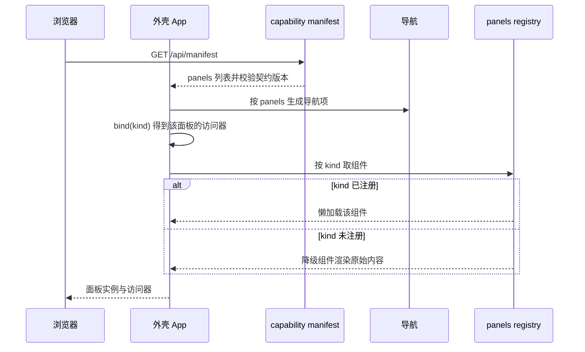
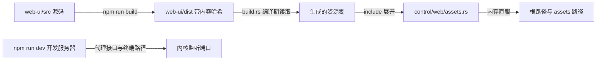

# Axvisor 控制面架构

控制面是 Axvisor 面向操作者的那一层：它把客户机登记表、配置池、生命周期动作与终端通道暴露成 HTTP 和 WebSocket 接口，并把一个由能力声明驱动的网页界面编译进内核二进制。它按 local-host 信任模型设计，没有账号与令牌，安全边界由回环绑定和来源校验承担。本文说明这套接口的分层、声明机制、状态所有权与失败处理；端点的方法、路径与状态码由 `capability/table.rs` 的声明记录定义，本文只在解释机制时引用其中的动作名。

## 1. 定位与信任模型

控制面取代了原先嵌在 `src/http/` 里的实验性单页页面。旧实现把路由、鉴权、页面模板和 VM 操作放在同一组模块里，改动任何一处都要同时理解这四件事，且页面上的导航与后端真实路由没有共同的来源。新实现把职责切开，并把信任前提写成显式约定：控制面只服务本机操作者，跨主机访问是构建配置的刻意选择而不是默认行为。

### 1.1 分层与职责

控制面按职责切成四层，每层只认识自己那一层的概念。声明层是唯一允许出现路由字面量的地方；领域层不认识 HTTP，也不产生状态码，因此同一份领域逻辑可以被 HTTP 之外的入口复用。

| 层 | 目录 | 职责 |
| :-- | :-- | :-- |
| 声明 | `control/capability/` | 路由表与清单描述符，路径字面量的唯一出现处 |
| 传输 | `control/transport/` | Axum 服务、WebSocket 升级、各资源的请求处理函数 |
| 领域 | `control/domain/` | 配置池扫描、文件暂存、登记表差分 |
| 内嵌前端 | `control/web/` | 直服 `build.rs` 生成的静态资源表 |

前端源码 `web-ui/` 位于这四层之外。它不进内核二进制，只在构建期产出 `dist/`，由 `build.rs` 读取后变成资源表。装配根 `control/mod.rs` 的 `serve()` 把声明层产出的路由表当**数据**交给传输层，因此传输层不需要引用声明层，路径也只在声明层出现一次。

### 1.2 构建特性组合

控制面的可用面由 Cargo feature 决定，同一个二进制在不同构建下应答的接口并不相同。下表列出各 feature 打开后新增的能力，用于判断一个现象是不是「这个构建本来就没有这个能力」。

| feature | 打开后新增 |
| :-- | :-- |
| `web` | `vms`、`files`、`host`、`console`、`shell` 面板，HTTP API、WebSocket 网关、事件流与配置池 |
| `web-ui` | 内嵌仪表盘 `/` 与 `/assets/*`，隐含依赖 `web` |

`web-ui` 不在默认特性里，所以干净检出上 `cargo build` 不受前端产物影响；只有显式打开它时，`build.rs` 才会要求 `web-ui/dist` 存在。`web` 统一提供 API、事件流和终端通道，`web-ui` 只增加静态资源。

## 2. 能力声明

控制面最核心的结构选择是「路径只声明一次」。所有路由在 `capability/table.rs` 的资源声明中登记，`VMS_RESOURCE`、`FILES_RESOURCE`、`CONSOLE_RESOURCE`、`SHELL_RESOURCE` 四个资源各自持有自己的动作表，路由表与前端清单都从这批记录派生，任何一方都不复制另一方的清单。这解决了旧实现的一个具体缺陷：页面曾经列出过一条后端根本不存在的路由。

### 2.1 单一声明点

一条 `Endpoint` 记录同时携带动作名 `name`、能力分类 `verb`、HTTP 方法 `method`、路径模板 `path` 和构造处理函数的闭包 `build`。`verb` 是面板级的能力摘要，取值是 `Verb` 枚举的 `Read`、`Write`、`Stream` 三个变体，其中流式变体只在终端特性打开时才存在；`build` 是编译期引用，声明里直接点名处理函数，例如 `build: || get(vm::list_vms)`。

把方法同时写在 `method` 字段和 `build` 闭包里看起来重复，但两个字段服务不同的消费者：`method` 供清单描述符投影成前端可读的链接，构造闭包供路由生成使用。路径模板中形如 `{id}`、`{endpoint}` 的段在挂载时由框架解析，声明本身不关心实参。

### 2.2 路由与清单投影

同一批声明派生出两个消费者。`router()` 遍历声明，把 `path` 与 `(build)()` 组成 Axum 路由；`descriptor::panels()` 把声明按资源分组，投影成 `GET /api/manifest` 返回的 `panels` 数组。下图说明这两个投影共用同一份记录，它们之间没有第二份清单。

路由生成时用 `BTreeSet` 对「路径与方法」去重：同一个组合出现两次只挂载一次。这一步是必需的 —— `console` 与 `shell` 两个资源声明的是同一个路径模板 `/ws/{endpoint}`，只是参数取值不同，重复挂载会让框架直接 panic，无法正常服务。清单侧保留两条独立记录，因为前端需要知道管理终端和客户机终端是两个面板。

### 2.3 面板与动作

清单的 `panels` 数组是前端导航的唯一来源，每一项包含 `kind`、`title`、`root`、`verbs` 与 `links`。`links` 的每一项是 `{ name, verb, method, href }`，`href` 是模板而不是实例路径。

清单有一个刻意的性质：**面板存在当且仅当它的路由存在**，因此声明不出本构建答不出的面板。与之配套的是 `PROTO` 契约版本，客户端读到不为 1 的版本会直接报错而不是按当前字段猜测。

链接列表**不按客户机状态收窄**：一台已停止的客户机同样会列出 `start`。可用性判断留给客户端，因为收窄需要后端在每次状态变化时重算清单，而那等于把状态也搬进声明层。代价是前端必须在动作失败时正确区分「非法状态转移」和「服务不可达」，这一点在状态所有权一节展开。

## 3. 传输与领域边界

控制面内部只有四条依赖边，且都单向：`web → capability`、`capability → transport`、`capability → domain`、`transport → domain`。除此之外还有一条跨出控制面的边，它决定了领域层到底覆盖多少职责。

### 3.1 依赖方向

`capability → transport` 这条边的方向在两个时刻是相反的。编译期由声明引用处理函数；运行期反过来，路由表作为数据交给 `transport::server::serve()`，传输层对声明层零依赖。下图说明这一点，并标出门禁脚本实际检查的范围。

`transport` 直接调用 `manager` 与 `axvm`，这不违反门禁：规则只写了四条允许边和两条禁止边，从没有规定传输层只能依赖领域层。控制面里的 `domain` 指的是「控制面新增的领域」—— 配置池、文件暂存、登记表差分，而「客户机是什么、这个状态下能否启动」属于 `axvm` 的状态机与 `manager` 的编排，它的家不在控制面内。这条边界由 `scripts/test/check_axvisor_control_layers.py` 作为静态门禁常驻 CI，它同时扫描 Rust 侧的路径字面量和前端的引导路径常量。

### 3.2 控制面新增的领域

`domain` 的三个模块各自围绕一个控制面新引入的概念，它们的共同点是都不产生 HTTP 概念。`pool.rs` 负责扫描客户机配置来源并回报诊断问题，`files.rs` 维护分片传输的会话与暂存目录，`events.rs` 计算登记表的差量。

三个模块对外部世界的依赖只有身份与配置级别的两种：配置池使用 `axvmconfig::GuestConfig` 表达候选配置，事件差分使用 `axvm::VMId` 作为键。领域层知道客户机的身份，但不碰它的生命周期 —— 生命周期动作的处理函数在传输层，通过 `manager()` 取得 `VmManager` 并翻译 `axvm` 的错误。

### 3.3 错误映射

状态码只出现在传输层，由处理函数在返回处决定。领域层以类型化错误向上报告，`axvm` 的错误由 `map_axvm_error` 一类函数翻译；配置池和创建前置检查会在引用文件缺失时直接返回 409，而不会把可修复的输入问题伪装成 500。

| 状态码 | 出现位置 | 含义 |
| :-- | :-- | :-- |
| 400 | 文件传输 | 会话标识、文件名或目录非法 |
| 404 | 客户机、文件、终端 | 未知客户机、未知会话、未注册端点 |
| 409 | 客户机、文件、终端 | 缺引用文件、重复标识、非法状态转移、目标已存在、通道被占 |
| 413 | 文件传输 | 分片超过上限 |
| 500 | 文件传输 | 写盘失败 |
| 503 | 客户机 | 资源耗尽或 lane 已满 |
| 507 | 文件传输 | 存储空间不足 |

状态码选择中有两处刻意的不对称：缺少引用文件返回 409 而不是 404，因为请求指向的资源存在、只是前置条件未满足；存储空间不足使用 507 这一 WebDAV 语义码，以便客户端沿用既有的空间不足处理分支。

## 4. 客户机配置池

配置池把「有哪些客户机可以启动」从编译期常量变成文件系统上的事实。内核启动时不再内嵌一份客户机清单，而是扫描配置目录，把找到的候选、读不懂的文件和缺少依赖的条目一起呈现给操作者。

### 4.1 来源与扫描限制

扫描来源在编译期确定：`AXVISOR_VM_POOL` 优先，其次是 `AXVISOR_VM_DIRS` 的每一项，最后是默认根目录 `DEFAULT_VM_ROOT`。目录递归但有三条限制：深度上限由 `MAX_SCAN_DEPTH` 决定，不跟随符号链接，同一个客户机标识在多个来源出现时按 `IssueKind::DuplicateId` 记录并保留首个。

只有顶层含 `base` 或 `kernel` 字段的 TOML 才被当成客户机配置，其余文件静默跳过。这个判定刻意保守 —— 池目录里通常还放着内核镜像、根文件系统和其他配置片段，把任何 TOML 都当候选会产生大量误报。

### 4.2 诊断问题上报

被跳过的文件不会消失，而是作为问题项随候选清单一并返回。问题分类覆盖读不到的配置、无效 TOML、重复 id，以及引用的内核或虚拟设备 backing 文件不存在等情况。

这个设计把「为什么这台客户机没出现在列表里」变成可回答的问题。旧实现依赖操作者自己比对目录内容与界面显示，缺文件时只表现为创建失败，而失败信息出现在操作之后，因果被时间隔离开。

### 4.3 写入约束

池支持写入，落盘位置就是扫描源之一，因此重启后写入的配置仍然出现在候选列表里。写入前校验内容能否解析成 TOML，文件名必须是普通的 `*.toml`。

目录创建只允许单层。这一限制来自客户机文件系统：它不支持递归创建目录，控制面因此不能提供「自动补齐路径」的语义，否则同一段代码在宿主侧和客户机侧会有不同的成功条件。

## 5. 文件传输

把文件放进正在运行的客户机是控制面里唯一会写客户机文件系统的操作，它被拆成若干独立请求而不是一个大请求。拆分的目的是让被中断的传输有明确的重启点：每个请求的副作用都能单独观察和重放。

### 5.1 五步传输

一次传输由 `open`、`send`、`place` 三个必要动作，加上可选的 `resume` 与 `drop` 组成。`open` 声明目标目录与总长度并得到一个会话标识，`send` 追加一个分片，`place` 把暂存内容落到最终文件名。下图说明会话在这几步之间的状态变化，以及哪些状态对客户端可见。

`resume` 用 `HEAD` 方法读取当前进度，通过响应头 `Upload-Offset` 回报。它不改变会话状态，只回答「现在从哪个字节继续」。客户端在重连后先调它，再决定下一个分片的起始位置。

### 5.2 续传与冲突

续传进度以暂存文件在磁盘上的实际长度为唯一依据，会话表只记录目标目录、总长度与状态，不记录已写字节数。这样做的直接后果是：会话表丢失（例如进程重启）不会让已写入的数据失效，客户端仍可从 `resume` 得到真实偏移量继续发送。

两类请求被显式拒绝而不是容错处理。同一会话标识换目标目录或换总长度会返回冲突，并在响应头里回报真实偏移量 —— 这防止一个会话被复用到另一台客户机。放置时若最终文件名已存在则拒绝，不覆盖已有文件，因为那可能正是某台运行中的客户机正在使用的磁盘映像。

传输会话保存在内存里，进程重启后对未知标识的 `resume` 返回 404。这是「这个会话已经不存在」的准确回答，把它当作从头开始重新 `open` 的信号即可。

### 5.3 路径校验

会话标识与目标目录都要过校验。标识限长 64 字符、限定字符集，且不允许以点开头；目录必须是绝对路径，拒绝包含 `..`、包含 `//` 或以暂存目录名结尾的写法。

分片请求的处理顺序值得单独记住：先校验 `Content-Type` 与 `Content-Range` 的形状，再读取请求体，且声明长度必须与范围相符。超限请求在读完请求体之前就能被拒绝，不必为了判断是否超限而先把数据收进内存。

## 6. 状态一致性

控制面同时提供请求响应接口和事件流，两者对同一份客户机状态给出不同时间尺度的视图。区分它们各自是什么，决定了客户端在网络抖动和丢帧之后应该做什么。

### 6.1 登记表与差量投影

`GET /api/vms` 返回的客户机登记表是状态的唯一权威。事件流是登记表的差量投影，不保存独立状态：它以 250 毫秒为间隔轮询登记表，把前一次快照与当前快照比对，产出 `created`、`removed`、`status` 三类事件。

事件通道的容量是 64，队列满时丢弃新事件而不是阻塞生产者。空闲 5 秒后轮询线程休眠，有订阅者时再唤醒；重新开始推送时的第一帧只发全量快照而不发差量，因为此时保留的基准快照已经过期。这些取舍共同决定了客户端的一条义务：丢帧不是致命错误，重读一次 `GET /api/vms` 就能重新收敛。

### 6.2 状态所有权

前端在这套分工下不拥有任何后端状态，它只维护与呈现有关的东西。下表列出一份数据在两侧各自的角色，用于判断某个字段该由谁更新。

| 状态 | 拥有者 | 前端角色 |
| :-- | :-- | :-- |
| 客户机列表与状态 | 内核登记表 | 只读；事件流是提示，请求响应接口才是权威 |
| 生命周期动作能否执行 | 内核返回的状态与错误码 | 只做按钮可用性提示，规则实现只有一处 |
| 上传进度 | 磁盘上的实际长度 | 只维护在途阶段，续传以 `Upload-Offset` 为准 |
| 终端通道是否被占 | 内核通道表 | 只读；标签集合由通道表推导 |
| 当前打开的标签与布局 | 前端 | 改布局只影响渲染，不改变已占用的通道集合 |

上传那条最能说明边界：前端有一个本地状态机表达「已开启、发送中、放置中、需要命名」，但后端不发布「上传中」这类状态。前端的在途态只是进度显示，权威偏移来自 `resume`，终态以后端清单为准。

## 7. 网页控制台

浏览器控制台把物理宿主控制台的复用边界从「一台机器一个终端」扩展到多个独立通道，同时不改变物理串口的行为。它的核心约束是通道独占：一条通道同时只接受一个会话。

### 7.1 通道与独占

通道编号在 `control/network_console/layout.rs` 里固定：0 号是管理台自身的通道，1 到 8 号分配给客户机，上限由 `MAX_GUEST_CONSOLES` 决定。通道表通过 `GET /api/consoles` 暴露，每一项都带 `attached` 字段表示当前是否被占用。

通道在客户机登记时分配，取最小空槽；移除时释放。分配失败意味着同时打开的客户机终端已达上限，此时登记请求整体失败而不是退化成「没有终端也能用」。

### 7.2 抢输与回退

打开第二个浏览器页面去连同一条通道时，内核返回冲突，前端需要把这次失败翻译成可恢复的重试。这里有一个只有靠协议行为才能发现的细节：浏览器在 WebSocket 被拒绝时只报告一次不带原因的无名关闭，因此前端无法从关闭事件本身判断「是被别人占了」还是「网络不通」。

判定的方式是**重新读取通道表**：若该通道的 `attached` 为真，说明它确实被别的页面拿走了，前端丢弃这条通道并改连下一条空闲通道，而不是在原通道上重试。

通道表只说明某条通道被占用，不说明谁占用着它，因此**已建立的连接不靠重读表来判定**：连接只由操作者对标签的动作产生，非活动标签的终端以隐藏方式常驻挂载，切换标签、离开面板、重读通道表都不会释放已经持有的通道，释放只发生在操作者点「释放」、抢输判定为真、或通道随客户机消失时。前端因此不必在每次重读表后重新决定“哪些通道属于我”，也就不会把自己持有的通道误判成别人的。

### 7.3 帧语义

终端 WebSocket 不做帧分类：二进制帧表示输出，文本帧和二进制帧都可以作为输入。连接建立时内核先发一帧欢迎信息，前端把收到的所有帧一律当终端输出，于是不需要为第一帧做特殊处理。

单帧上限为 4096 字节。这个阶段没有引入 hello、ping 之类的控制帧协议，因为终端会话栈尚未需要它们；等到需要区分控制流与数据流时再引入，代价是客户端要同时兼容两种帧语义。

## 8. 前端装配

前端是这套机制的另一半：内核只提供数据和动作接口，界面形态、导航结构和面板划分全部由清单决定。前端因此不持有任何请求路径字面量，唯一的例外是读取清单本身的引导路径。

### 8.1 绑定链

装配从一个清单请求开始，到面板实例收到访问器为止。下图的每一步都对应一个可以被单独测试的环节，其中 `bind(kind)` 产出的访问器只绑定该面板自身的动作。

三个角色的边界是理解这套设计的关键。清单由后端生成，决定有哪些面板、每个面板能调哪些动作；注册表是前端代码，把 `kind` 映射到组件；访问器是前端纯函数，把动作名映射到 URL。三者互不复制对方的清单，所以新增一个面板只需要在前端加目录、在注册表加一行、在后端加一条资源声明，外壳与导航都不用改。

### 8.2 面板隔离

外壳不引用任何面板的实现，它只引用注册表这个接缝，按键取组件。面板之间也互不引用，共享逻辑只允许下沉到 `lib/`；共享的部分是纯函数，包括状态文案、生命周期规则和通道分组。

这条约束的收益是面板可以单独删除而不影响其余部分。它的实现方式是有限的：仓库没有配置 lint 脚本，也没有断言引用方向的测试，当前的合规状态来自代码现状而非机械门禁。

### 8.3 契约缺失的降级

前端区分三种「拿不到」并给它们不同的表现。清单里声明了某个 `kind` 但前端没有对应组件时，导航照常显示，面板区域渲染原始内容而不报错，因此后端可以先于前端增加能力。

访问器找不到动作名时则抛出错误，经面板错误边界显示成错误卡片。这是刻意的选择：动词缺失说明契约与实现不一致，发一个必然返回 404 的请求只会把契约缺陷伪装成网络问题。只在部分构建存在的动作另有出路，调用点用可选方式取 URL，取不到时渲染「这个构建没有配置池」这类说明。

面板级隔离由错误边界承担：某个面板渲染失败只降级成一张卡片，外壳、导航和其他面板继续工作。卡片按失败性质给出不同说明，把「取不回分片」和「契约字段不符」区分为两类问题。

## 9. 构建与内嵌

前端产物在内核构建期变成一张静态资源表，运行期没有任何文件系统依赖。这条链路的代价是构建顺序有要求，收益是设备端不需要携带资源目录，也不依赖外部内容分发网络。

### 9.1 产物管线

下图说明从源码到 HTTP 响应的完整路径，以及开发服务器旁路这条管线的方式。

产物文件名带内容哈希，内核以不可变策略提供它们，因此同一次构建内不会有文件被替换。资源表把整份产物嵌进二进制，服务时直接从内存返回，不读磁盘。

### 9.2 失败模式

构建链路上有三处刻意让构建失败而不是静默降级。产物目录缺失、内容超出大小限制、或类型与预期不符时，`build.rs` 写出 `compile_error!` 并提示先手工构建前端。这背后的前提是内核构建不调用包管理器，因此构建系统无法替操作者补上这一步。

对应的一个已知短板是重编触发条件不完整：`cargo:rerun-if-changed` 只登记了生成资源表时存在的文件，产物目录内新增或删除的文件不一定触发重新编译。修改前端后如果只增删文件而不改内容，需要显式触发一次重建。

## 10. 不变量与已知边界

这套接口的约束按有没有机械兜底分成两类。区分它们的意义在于判断一次改动需要多少人工复核：有门禁的约束改坏会被构建拦住，只有约定的约束改坏要靠评审发现。

### 10.1 有门禁的不变量

三条约束有工具兜底。请求路径不出现在前端的面板与外壳里，由静态检查脚本扫描前端源码，引导路径还与内核侧常量成对比较。产物缺失时构建必须失败，由 `build.rs` 的条件编译错误保证。测试用例引用的资源与产物保持一致，由用例按产物引用递归抓取，抓取结果缩水即判失败。

静态检查脚本同时负责分层约束：它拒绝 Rust 侧在声明层之外出现路径字面量，拒绝传输层与内嵌资源层引用声明层，也拒绝领域层引用上层。

### 10.2 只有约定的不变量

若干约束没有机械门禁，只能靠评审和单测兜底。外壳不出现面板 `kind` 字面量、面板互不引用，这两条没有引用边断言也没有 lint 脚本。状态到可执行动作的判断只有一处实现，靠单测覆盖而非路径门禁。终端按需占用、抢输回退、裸换行处理、错误边界分类文案都是行为约束，由单测与代码评审共同兜底。

### 10.3 已知取舍

有三处取舍值得在使用和扩展时记住，它们是在当前需求下选定的边界。

| 取舍 | 影响 |
| :-- | :-- |
| 鉴权整体移除 | 安全边界只由回环绑定与来源校验承担，来源校验对非浏览器客户端不构成拦阻 |
| 绑定地址是编译期常量 | 非回环绑定在构建时确定，无法在运行期收回；跨主机访问必须在构建配置里显式放宽 |
| 清单链接不按状态收窄 | 客户端必须自行判断动作可用性，并在失败时区分状态冲突与服务不可达 |

绑定地址取自编译期环境变量，默认值为回环地址。这意味着某个构建配置一旦写入非回环地址，那个二进制就永久对外提供客户机的创建、销毁和文件写入能力。需要跨主机访问时，应当同时评估该宿主网络的可达范围，并在构建配置里留下注释说明这是刻意的暴露。终端 WebSocket 的升级过程会校验请求来源与主机是否同源，这是除绑定之外唯一的准入检查。

清单里的方法字段目前没有前端消费者，各调用点自带方法；终端 WebSocket 不自动重连，而事件流使用指数退避重连，两处可靠性策略不一致，属已知差异。
