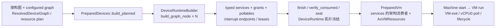
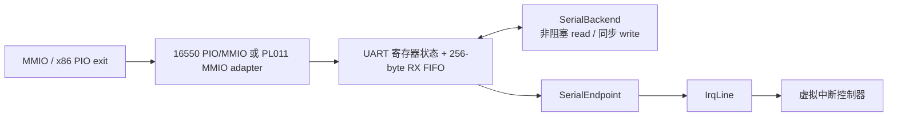
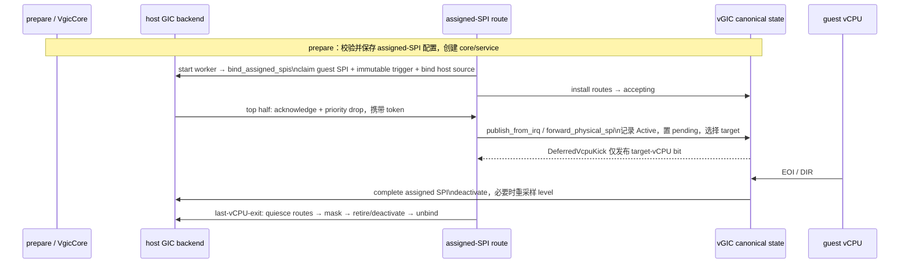

# Axvisor 设备运行时与中断架构

本文说明 AxVM Machine 怎样把已解析的设备图接入一台 VM：prepare 阶段怎样得到并封存 `DeviceRuntime`，vCPU 运行期怎样分派四种架构的退出，串口怎样连接宿主控制台，以及虚拟和物理中断怎样从设备状态走到 vCPU。设备 model、资源规划、`DeviceBuildContext`、`DeviceBundle`、索引和 grant API 的完整定义见[模拟设备框架第 4～6 章](./emulated-devices.md#4-运行时构建与注册)；本文只在 AxVM 接线需要时摘要这些机制。

设备声明来自[客户机配置架构](./guest-configuration.md)，地址、中断和 machine 固定资源来自 [Machine 与资源规划架构](./machine-profile.md)，宿主串口复用和 backend generation 的所有权见[客户机控制台架构](./guest-console.md)。

## 1. 代码边界与运行阶段

设备运行时由一组各有 owner 的对象组成。通用 crate 负责设备协议和注册不变量，AxVM 把这些对象接入 Machine 生命周期并从 VM-exit 调用它们，架构中断控制器管理 pending、active 和 routing。应用层控制台只通过字节 backend 与串口相连。

| 位置 | owner 与职责 | 主要阶段 |
| --- | --- | --- |
| `virtualization/axdevice_base` | 通用 `Device`、`DeviceAccess`、`DeviceContext` 契约，grant token、`IrqLine`、`WiredIrqInput` 和中断控制器能力 | build、访问热路径、中断电平变化 |
| `virtualization/axdevice` | `DeviceRuntime`、bundle 注册、MMIO/PIO/SysReg 索引、串口寄存器核心、pollable/lifecycle/typed services | build、seal、VM-exit、vCPU0 poll |
| `virtualization/axvm/src/vm/prepare` | 消费 `AxVMResources` 中的 resolved graph，构建设备和 vCPU，并把 sealed runtime 放回 Machine resources | VM prepare |
| `virtualization/axvm/src/runtime`、`architecture`、`arch/*` | DMA/定时器/唤醒/停止接线，vCPU 轮询，四架构 exit 解码，架构 service 消费和设备 activate/deactivate | VM start、run、pause/reset/stop |
| `virtualization/arm_vgic` | AArch64 虚拟 GIC 的 distributor/redistributor/ITS 状态，以及物理 SPI backing 的规范状态 | build、vCPU attach、IRQ、EOI、teardown |
| `os/axvisor/src/guest_console` | 唯一宿主控制台 reader、VM 选择、输入队列、输出仲裁，以及 backend generation 的创建和显式失效 | configured device 实例化、应用层 `mark_stopped()`/`remove()` |

依赖方向仍是 `axvm -> axdevice -> axdevice_base`。`arm_vgic` 实现通用中断控制器边界；`guest_console` 实现 `SerialBackendFactory`，但不进入 UART 寄存器状态机，也不拥有虚拟 IRQ。

## 2. 从设备图到 Machine runtime

`AxVMResources` 在创建时持有架构生成的 device plan。`PreparedDevices::build_planned()` 读取 plan 中的 resolved graph，为当前 VM 创建 `DeviceRuntimeBuilder`，按图的确定性节点顺序逐个 `build_graph_node()`，最后用同一份 resource plan 调用 `finish()`。成功结果与 prepared vCPU、默认 `VirtualInterruptController` 一起装入 `PreparedVm`，再由 `prepare_resources_with()` 原子写回 Machine resources。



构建和封存两个阶段各有一个不变量，违反任何一个都会让 prepare 失败，不会推迟到运行期才暴露：

- `DeviceRuntimeBuilder` 只消费规划结果，不重新选择地址或 IRQ。所有 one-shot claim 必须在 `finish()` 前转为 lease；漏消费 slot 或 bundle 与计划不一致都会让 prepare 失败。
- `DeviceRuntime` 封存后才进入 VM run。seal 之后注册设备、service 或资源返回 `InvalidState`，不会在 vCPU 运行时改变索引拓扑。

`DeviceBundle` 的事务注册、三张地址索引、`DeviceBuildContext` 的资源消费接口以及 grant 的设备 ID/token 双重校验都属于通用框架，详见[模拟设备框架第 4 章](./emulated-devices.md#4-运行时构建与注册)、[第 5 章](./emulated-devices.md#5-设备与访问模型)和[第 6 章](./emulated-devices.md#6-访问上下文与运行时能力)。注册时的 `Arc::ptr_eq` 用来拒绝重复注册同一个 pollable、DMA-pollable 或 lifecycle capability，普通 `bundle.devices` 不按指针合并去重。普通设备对象仍按 bundle 顺序取得稳定的 `DeviceId`，地址冲突由资源注册检查处理。

## 3. AxVM 能力接线

AxVM 不把 `AxVM` 整体暴露给设备。设备在 bundle 中声明 grant；runtime 在一次访问或一次 DMA poll 的短生命周期内验证 grant，并接入对应 VM capability。

### 3.1 DMA、定时器、唤醒与停止

四类 grant 覆盖设备运行期需要的全部 VM 能力：访问 guest 内存、注册定时器、唤醒 vCPU 和请求停止。接线在 prepare 阶段一次完成；grant 校验则在单次访问或单次 DMA poll 的生命周期内进行：

| 能力 | AxVM 接线 | 调用结果 |
| --- | --- | --- |
| DMA / guest memory | `VmGuestMemoryAccess` 实现独立的 `GuestMemoryAccess` 端口；runtime 校验当前设备的 `DmaGrant` 后，才通过短生命周期 `DeviceContext` 转发 `read_guest_memory`、`write_guest_memory` | grant 或当前设备不匹配、无 memory port、GPA 访问失败都显式返回错误 |
| timer | `AxVmDeviceAccessPorts::schedule_timer` 注册宿主 timer；到期回调只唤醒该 VM 的 vCPU | 未授权或缺少 timer port 返回 `Unsupported` |
| wake | 校验目标 vCPU 存在，再通过当前 `VmRuntimeHandle` 发布通知 | 不存在的 vCPU 为 `InvalidInput`，VM 没有运行期 handle 为 `InvalidState` |
| stop | 以包含设备 ID 和原因的 `StopReason::Fault` 请求 Machine stop，并唤醒等待中的 vCPU | stop 状态转换失败向设备返回 `InvalidState` |

`RuntimeAccessPorts` 在 prepare 时装入 timer/wake/stop adapter。DMA 有意不成为可长期保存的 runtime port：`AxVM::try_write_device()` 等需要 guest memory 的入口以及 `poll_dma_devices()` 才创建 `VmGuestMemoryAccess`，调用返回后端口即失效。读访问不隐式注入 guest-memory port；写访问也只有同时具备临时 port 和匹配 grant 才能访问 guest memory。完整 grant API 和失败条件见[模拟设备框架第 6 章](./emulated-devices.md#6-访问上下文与运行时能力)。

### 3.2 PCI routed endpoint 与生命周期屏障

PCI host、resolved topology 和 endpoint bundle 共享同一个 `PciRootState`。endpoint 的 `PciRootBinding` lease 只在 endpoint object、validated contract、routed grant、`DmaGrant` 和 `IrqLine` 全部准备完成后发布；route 发布前，PCI BDF、BAR 和 capability metadata 对 guest 不可达。BAR/config callback 取得带 endpoint final `DeviceId` 的 `DeviceContext`，并在锁外使用 endpoint-owned `DmaGrant`，不会退回 root grant 或 `NoopDeviceContext`。

每个 token 同时校验 `EndpointBindingGeneration`、`RoutedAdmissionEpoch` 和 admission-open 状态。普通 callback 的 IRQ 电平变化必须取得同一 binding generation 作用域的 `EndpointIrqTransitionPermit`；root registration、full reset 和 teardown 的 owner-side line cleanup 通过 lifecycle owner gate 串行执行。teardown 先撤回 route、关闭 admission、drain scoped leases/permits，再失效 binding generation，最后撤销物理 line。full reset 在向 guest 发布 status 0 前推进 `VirtioQueueGeneration`、等待所有 `ActivityPermit`，并重新应用 root 的最新 Command snapshot；任一阶段失败都保持 fail-closed，不能恢复 guest 或 IRQ admission。

VirtIO PCI block 的 queue notify 只有在 `queue_enable && DRIVER_OK && BME && endpoint DmaGrant` 同时成立时才消费 guest descriptor。`ActivityPermit` 覆盖 backend、guest-memory、used/status 和 ISR/INTx publication/suppression 的完整 terminal path；reset 不持有 root、transport、router 或 ramdisk 锁等待 permit。BME 清除或 admission close 后新 operation 必须停止，已升级的旧 operation 依 captured snapshot 完成并在 permit drop 后才允许 reset 完成。

每次 MMIO、PIO 或 SysReg 请求都构造成不可变的 `DeviceAccess`，其中包含总线、地址、宽度以及发起访问的 VM-local `DeviceVcpuId`。源 vCPU 必须由 exit handler 显式传入，不能从宿主 CPU 或当前执行上下文推断；它描述“谁发起了访问”，也不等同于设备随后选择的中断目标。runtime 按地址找到设备后，为这一次 `Device::read()` 或 `Device::write()` 创建 `DeviceContext`，回调返回后立即丢弃。

### 3.3 typed services 的架构消费者

`DeviceServices` 保存类型化的 VM-local capability。AxVM 在 prepare、exit 或 IRQ 路径中按 key 取出所需 service，无需用字符串或向下转换查找 `Device`。

| 架构或子系统 | service / consumer | 用途 |
| --- | --- | --- |
| AArch64 | `Aarch64VgicRuntimeKey` | prepare 时给每个 vCPU attach vGIC 与 timer PPI；start/last-vCPU-exit 时 activate/deactivate assigned SPI 路径 |
| RISC-V | `RiscvPlicRuntimeKey` | start/last-vCPU-exit 激活或停用物理 IRQ backing；guest run 前同步 vPLIC 的可投递状态到 `VSEIP`，MMIO 访问后的同步由 vPLIC `Device` 自身完成 |
| x86_64 | PIC、PIT、IOAPIC/interrupt-domain services | legacy PIC 查询、PIT 到期注入、IOAPIC 路由与 EOI 后重投递；设备图仍提供默认 `VirtualInterruptController` |
| LoongArch64 | `PchPicOutputPortKey` | 外部 IRQ 路径操作 PCH-PIC 输入；PCH-PIC `Device` 通过构建时注入的 typed output sink 发布寄存器访问产生的 controller event |
| IVC | `IvcApertureAllocatorKey`、`IvcNotifyEndpointKey` | runtime IVC API 分配 guest aperture、建立/撤销共享绑定并通知 subscriber；IVC service 不要求存在一个可直接访问的 `Device` |

AArch64 的默认 controller 从 vGIC service 的 core 取得；其他三种架构从 sealed runtime 中按 controller ID 取得。Machine resources 单独保存这个 trait object，供通用 `pulse_interrupt()` 等 VM API 使用，而架构专属路径仍从 typed service 读取更丰富的能力。

### 3.3 poll 与 lifecycle

vCPU0 是唯一的设备 poll owner，在主运行循环每轮调用 `poll_vm_devices()`：先轮询普通 pollables，再为 DMA-pollables 创建一次性的 `VmGuestMemoryAccess`。宿主控制台把输入入队后调用 `notify_vm()`，但其唤醒语义取决于 vCPU 数量。单 vCPU VM 走 `notify_device_poll()`，先设置可跨 WFI 保留的 pending poll request，再 `notify_one()`；vCPU0 下次进入循环时消费该 flag 并执行 poll。SMP VM 当前只对所有 vCPU 共享的 wait queue 调用 `notify_one()`，不发布 poll flag，也无法指定唤醒 vCPU0；如果被唤醒的是 secondary vCPU，空闲的 vCPU0 可能仍不运行，控制台输入会延迟到 vCPU0 因其他事件再次进入循环。无论哪条分支，控制台上下文都不直接调用 UART 或 vGIC。

lifecycle capability 的调用顺序由通用 runtime 固定：

1. reset 按注册顺序；重建前先撤销 IVC binding，再 reset 旧 runtime，随后清空并重建 transient resources；
2. suspend 按注册逆序，并且先完成设备 suspend，Machine 才进入 `Paused`；
3. resume 按注册顺序，并且先恢复设备，Machine 才从 `Paused` 返回 `Running`；
4. destroy 清理仍会 reset 尚存 runtime，防止设备后端状态越过 VM 生命周期。

这三组循环都在第一个错误处停止，并阻止相应 Machine 状态转换。runtime 不补偿已经成功执行的前序回调，因此失败返回时设备集合可能处于“前一部分已 reset/resume”或“后一部分已 suspend”的部分完成状态；调用方必须把它当作 lifecycle 失败处理，不能假定所有设备仍处于转换前状态。

## 4. 四架构 VM-exit 分派

公共 MMIO handler 位于 `virtualization/axvm/src/architecture/exit.rs`。它根据当前 vCPU、总线、地址和宽度构造 `DeviceAccess`，读路径调用 runtime 的 `try_read()`，写路径经 `AxVM::try_write_device()` 调用 `try_write()`。strict 入口 `handle_mmio_read/write()` 若地址未命中，会构造：

```text
DeviceManagerError::Access {
    operation: "read" 或 "write",
    bus: BusKind::Mmio,
    addr,
    width,
    source: DeviceError::NotFound,
}
```

该错误再由 `AxVmError::device("access guest MMIO", ...)` 包装。设备已命中但访问宽度、范围或 backend 出错，则保留原 `DeviceError`/`DeviceManagerError`，不会伪装成未命中。公共 helper 的 try 形式只把真正的地址 miss 表示为 `false`，供 nested fault 路径尝试 stage-2 fallback。

SysReg 共用 `architecture/sysreg.rs` 的 strict handler。它没有 `try` 入口：MSR 或系统寄存器 miss 直接成为设备错误，不能落到 nested mapping。

### 4.1 AArch64

AArch64 backend 已解码的 `MmioRead`/`MmioWrite` 直接走公共 strict MMIO handler；`SysRegRead`/`SysRegWrite` 以 Qword 宽度进入 SysReg runtime。GIC CPU interface、外部中断、WFI、PSCI/CPU 状态等退出有各自的架构路径。未列入 match 的退出明确返回 `Unsupported`，不会当作已完成。

AArch64 这里没有“MMIO miss 再映射 stage-2”的分支：收到 direct MMIO exit 就意味着应由设备模型处理，miss 是 VM 错误。vGIC distributor/redistributor/ITS 的 MMIO frontend 与普通设备使用同一 runtime 索引，而 ICC CPU-interface 操作由 vCPU/vGIC binding 单独处理。

### 4.2 x86_64

x86 进入设备 runtime 的退出分为 scalar/string PIO、direct MMIO 和 MSR 三类。关键差异是对未命中地址的处理：PIO 把 miss 当作正常情况处理，direct MMIO 与 MSR 的 miss 则构成错误。

| 退出 | 行为 |
| --- | --- |
| scalar PIO IN | `handle_io_read()` 构造 Port `DeviceAccess` 并调用 `try_read()`；未映射端口按访问宽度返回全 1 |
| scalar PIO OUT | `handle_io_write()` 经 `try_write_device()` 调用 runtime；未映射写被忽略 |
| string PIO IN | 先读端口，miss 按宽度得到全 1；再把低字节序值写入 guest memory，成功后完成 string-I/O exit |
| string PIO OUT | 先从 guest memory 读取一个元素；成功后才经 `try_write_device()` 访问端口，端口 miss 被忽略，最后完成 string-I/O exit。guest-memory fault 时不会执行端口写 |
| direct MMIO | 公共 strict handler；miss 为 `DeviceManagerError::Access { source: NotFound }` |
| MSR | 把 MSR 编码转换为 SysReg 地址，走 strict SysReg handler；miss 为错误 |

`NestedPageFault` 不尝试设备 runtime。它只调用 `handle_nested_page_fault()` 处理已有 stage-2 映射策略；若仍未处理，记录 warning 并返回一个无 stop 原因的 `Complete`。因此 x86 的设备 MMIO 必须由 backend 解码成 direct `MmioRead/Write`，nested fault 本身只是 stage-2 fallback，不能吞掉 MMIO/SysReg miss。

### 4.3 RISC-V

backend 直接报告的 `MmioRead/Write` 使用通用 strict handler；handler 只调用 `DeviceRuntime::try_read/try_write`。vPLIC 的 `Device::read/write` 在成功访问后通过自身 runtime 发布 `VSEIP`，架构 exit 不识别设备类型，也不执行第二段具体设备后处理。同步通过 `set_vseip_level()` 同时更新 vCPU 的保存状态；vCPU 暂未 bound 时状态仍会保留，下一次载入前无需依赖当时的宿主执行上下文重新推断。

对 `NestedPageFault`，AxVM 依次执行：

1. 请 vCPU backend 解码这次 fault；若得到 MMIO 读写，调用 `try_handle_mmio_*()`；
2. 命中设备时由 dyn `Device::read/write` 完成寄存器访问及设备内部发布动作，然后 `Continue`；
3. 未解码或设备 miss 时尝试 `handle_nested_page_fault()` 的 stage-2 路径；
4. stage-2 仍未处理时记录地址和 access flags 的 warning，返回无 stop 原因的 `Complete`。

因此只有 nested fault 可以把 MMIO miss 交给 stage-2；direct MMIO exit 不能 fallback。

### 4.4 LoongArch64

LoongArch64 的 direct MMIO 也只使用通用 strict handler。PCH-PIC 构建结果包装了同一个 `Arc<dyn Device>` 接口，并在其成功读写后通过 typed output sink 排出 controller event；exit handler 不再调用 PCH-PIC 具体函数。未命中即报错。

`NestedPageFault` 的顺序与 RISC-V 相同：先让 backend 解码并用 `try_handle_mmio_*()` 尝试设备，再尝试 stage-2，最后 warning + `Complete`。LoongArch 不在 miss 时伪造读值，也不把 direct MMIO 写静默丢弃。未知的其他 VM-exit 返回明确的 `Unsupported`。

## 5. 串口完整路径

虚拟串口分成状态、transport、backend、endpoint 和 controller 五个边界：



### 5.1 16550 状态与 transport

`Uart16550` 保存 RBR/THR/DLL、IER/DLM、IIR/FCR、LCR、MCR、LSR、MSR、SCR、除数锁存器、overrun、TX-empty pending 和 256 字节 RX FIFO。DLAB 决定前两个寄存器是数据/IER 还是 DLL/DLM；FCR 可清 RX/TX 状态；loopback 将 THR 字节送回 RX FIFO。RX available 和 THR empty 按 IER 生成优先级正确的 IIR，LSR 读取会消费 overrun 标志。

同一核心有两种 transport：

- x86 PIO adapter 只接受单字节访问，端口偏移直接选择 8 个寄存器；
- MMIO adapter 用 `register_shift` 把字节偏移换算成寄存器编号。与常见 serial-mm 行为一致，外层访问宽度只用于选址，核心始终交换低 8 位。

THR 写先消费原有 TX-empty 状态，把字节同步写给 backend（或 loopback），再把 backend 返回视为 transmit-complete。显式的低/高 IRQ 更新使 edge 配置的 IOAPIC 也能观察连续 THRE 周期，而不依赖下一次 poll。

### 5.2 PL011 状态与 transport

`Pl011` 实现 DR、RSR/ECR、FR、IBRD、FBRD、LCRH、CR、IFLS、IMSC、RIS、MIS、ICR、DMACR 和 peripheral ID 区域，同样使用 256 字节 RX FIFO。`RIS` 来自 RX 非空、RX timeout 和 TX pending；`MIS = RIS & IMSC`，只有 masked pending 非零才拉高 IRQ。DR 读弹出一个 RX 字节，写 RSR/ECR 无条件清 `receive_error`。ICR 的 TX 位可直接清 `tx_interrupt_pending`；RX 和 RX-timeout 是由 FIFO 非空派生的 level，FIFO 仍非空时写 ICR 不会清掉它们，相关 ICR 位只在 FIFO 已空时清 `receive_error`。

PL011 只通过固定 `0x1000` MMIO 寄存器块暴露，支持 Byte/Word/Dword，Qword 明确返回宽度错误。当前模型对 enable 位采用简化语义：写 DR 只有在 `UARTEN | TXE` 同时置位时才把字节送到 backend；backend poll 始终可以把输入压入 RX FIFO，读 DR 也始终可以弹出 FIFO 字节。`RXE` 只门控由 FIFO 非空派生的 RX/RX-timeout raw interrupt，`TXE` 门控 TX raw interrupt，而 `UARTEN` 不参与 `raw_interrupts()`。这些规则描述的是当前实现，不能外推为完整 PL011 硬件的收发 gating 语义。未知但落在寄存器块内的保留地址按寄存器语义读零或忽略写，块外访问报 `OutOfRange`。

### 5.3 backend、poll 与 endpoint

`SerialBackend` 只定义非阻塞 `read()` 和同步 `write()`，不保存寄存器、FIFO 或 IRQ 状态。`NullSerialBackend` 丢弃输出并始终返回零输入。每次 vCPU0 poll 时，`SerialEndpoint` 最多读取 64 字节送入核心 FIFO，再根据新的 UART 状态更新 `IrqLine`；guest 写 TX 时则同步送给 backend。

`SerialEndpoint` 把 `IrqLine::assert/deassert` 的错误翻译成带操作名的 `DeviceError::Backend`。UART 只发布“当前中断条件是否成立”，不直接注入 vCPU，也不拥有控制器的 pending/active 状态。

### 5.4 factory 的精确创建条件

串口 model 在 configured request 转为 graph node 时选择 backend。`SerialBackendFactory::create()` 只在以下两种条件之一成立时调用：

1. request 显式配置 `backend = { type = "host-console" }`；
2. request 没有 `backend`，且该实例的 `host_console_by_default` 为 `true`。

显式 `null`，以及未指定 backend 且 `host_console_by_default == false` 的额外串口，都直接构造 `NullSerialBackend`，不会请求 host-console factory。配置层保证每台 VM 最多一个 host-console owner。

factory 调用发生在 configured request 转成 `DeviceNodeSpec` 时。`SerialDeviceModel` 随即持有返回的同一个 `Arc<dyn SerialBackend>`，之后每次 `build()` 只是把这个 `Arc` clone 给新 UART。AxVM reset 会复用 `AxVMResources` 中已有的 device plan；runtime 虽然重建，但不会重新把 request 送进 factory，所以当前实现中 reset 前后的 UART backend 仍是同一 generation。若应用此前已经显式使该 generation 失效，单纯 rebuild runtime 也不会创建或发布一个新 generation。

generation 数值的分配和当前 generation 的校验属于应用层 `GuestConsoleMux`。失效也不是任意 VM stop/remove 自动触发的设备层行为：只有 Axvisor 应用显式调用 mux 的 `mark_stopped()` 或 `remove()`，相应 guest state 才会清除或删除当前 generation，旧 backend 的输入输出随后被拒绝。设备层既不创建、解释 generation，也不决定何时调用这些应用接口。详见[客户机控制台架构](./guest-console.md)。

## 6. 虚拟 IRQ 与物理 IRQ backing

### 6.1 wired-OR 与控制器状态

设备通过 `DeviceBuildContext::irq()` 消费规划好的 endpoint，得到 controller-owned `WiredIrqInput` 的一个 `IrqLine` connection。每个 connection 有独立 source ID 和 asserted 位；input 维护 asserted source 计数：

- 第一个 source assert 时，aggregate level 从 0 变 1，才调用 sink `set_level(true)`；
- 中间 source 的 assert/deassert 只改变计数；
- 最后一个 source 显式 deassert 时调用 `set_level(false)`；asserted connection 的 drop 路径也会在移除最后一个 source 后尝试该调用；
- 显式 `assert()`/`deassert()` 中的 sink 更新失败会回滚 aggregate 计数，line 本地状态不提交；edge input 则只允许 `pulse()`；
- asserted connection 的最后一个 handle 被 drop 时，`disconnect_asserted_source()` 先提交 source 移除。若它恰好移除最后一个 source，`set_level(false)` 只是 best-effort，错误被忽略，无法向 drop 调用方报告，也不会把 source 计数加回去。

这就是共享 level IRQ 的 wired-OR。UART、IVC 等设备不拥有 pending、active、priority、target 或 routing；这些规范状态属于 vGIC、vPLIC、IOAPIC/PIC 或 PCH-PIC。只要设备仍保持电平，控制器在 guest EOI/complete 后可以按本架构规则重新投递。

### 6.2 AArch64 assigned physical SPI 生命周期

物理 SPI 不直接绕过 vGIC 注入 vCPU。正常运行生命周期分为 prepare、start、硬中断、guest EOI 和 last-vCPU-exit 五个阶段。



prepare 时，machine/profile 中的 assigned SPI 被校验后写入不可变 `ArmVgicConfig`，vGIC core 和 typed service 随设备 runtime 构建；此时不取得宿主 IRQ ownership。start 时 `Aarch64VgicRuntime::activate()` 先确认 host timer PPI，再启动 `DeferredVcpuKick` worker，然后由 `bind_assigned_spis()` 逐项调用 `bind_physical_spi_with_trigger()`：校验 guest SPI、host IRQ、target vCPU 和 immutable trigger，claim distributor SPI，并调用 backend 取得物理源所有权。任一 binding 失败会逆序释放本轮已取得的 binding；静态 host INTID route 全部安装后才允许 ingress。route 安装失败也会撤销 binding 并停止 worker。

硬 IRQ top half 已完成宿主 acknowledge 和 priority drop。静态 route 不做 VM 查找或分配，`AssignedSpiDelivery` 用 `Idle/Active/Completing` 防止 completion 与新投递交叉；`forward_physical_spi()` 把 pending/target 写入 vGIC 规范状态。vGIC wake callback 不携带 IRQ 状态，只调用 `DeferredVcpuKick::publish_from_irq(vcpu_id)`：一个预分配的原子位图合并目标 vCPU，`IrqNotify::notify_irq()` 唤醒预创建 worker，worker 在任务上下文真正通知 vCPU。

guest EOI/DIR 使 vGIC 完成当前物理 activation。backend deactivate 在控制器锁外执行；level source 仍有效时由 backend/控制器重采样并形成下一次投递。`AssignedSpiDelivery::Completing` 失败会恢复为 `Active`，使 completion 可重试而不会丢失 ownership。

最后一个 vCPU 退出时，架构 `on_last_vcpu_exit()` 调用 vGIC runtime deactivate：先拒绝新 route ingress 并等待在途 publication，确认没有 loaded vCPU 后 mask 物理源；有 activation 才 deactivate，然后在规范状态中提交 delivery 已清除，最后 unbind 和释放 distributor claim。若 unbind 失败，完整 binding 与 claim 仍归 VM，route 恢复后可重试；由于“delivery 已清除”先于 unbind 提交，重试不会对同一次 activation 再发一次 deactivate。只有 teardown 成功，才删除静态 route、停止并 join deferred-kick worker。

不支持物理 bind、mask、deactivate 或 trapped completion 的 backend 必须返回 `Unsupported`。框架不以延迟 mask 或静默软件注入模拟缺失的物理 backing 能力。

## 7. 故障语义与验证

故障按发生位置分为三类：注册冲突与封存后的再注册出现在 prepare，访问分派错误出现在 VM-exit 热路径，中断和 lifecycle 错误跨越两个阶段。下表的“恢复边界”列说明失败后系统所处的状态和仍然可用的操作。

| 故障位置 | 可观察结果 | 恢复边界 |
| --- | --- | --- |
| bundle/controller/service registration 冲突 | prepare 返回 `ResourceConflict` 或相应 typed error；当前 bundle 不会半注册 | 已提交的旧 bundle 保持不变，可修正 graph 后重建 |
| sealed runtime 再注册 | `InvalidState`，detail 为 topology sealed | 运行期不解封；必须构建新 runtime |
| direct MMIO/SysReg 地址 miss | strict 路径形成带 bus/address/width 的 `Access { source: NotFound }` 并转为 `AxVmError` | 只有 RISC-V/LoongArch nested 的 try-MMIO miss 可继续 stage-2；SysReg 无 fallback |
| 设备回调返回宽度、范围、backend 或 capability 错误 | `try_read()` / `try_write()` 保留具体 `DeviceError`，并包装为带 operation、bus、address、width 的访问错误 | 不把设备错误改写为地址 miss；按错误类型修复设备实现或能力接线 |
| grant/token/device ID 或临时 port 不匹配 | `Access { source: Unsupported }` 或底层 memory error | 不扩大权限；必须由 bundle 和 AxVM 入口正确接线 |
| wired trigger 与 assert/pulse 操作不匹配 | `IrqError::InvalidTriggerMode` | 保持原 line/controller 状态 |
| 显式 wired assert/deassert 的 sink 更新失败 | 返回 `IrqError`，aggregate 计数和 line 本地 asserted 状态回滚 | 调用方可重试 |
| asserted `IrqLine` drop 时最后一次 sink deassert 失败 | 错误被忽略；source 移除已经提交，无法回滚或报告 | runtime 无法重试这次 drop 通知，sink 可能仍观察到旧电平 |
| reset/suspend/resume 中 lifecycle 回调失败 | 立即停止后续回调并阻止 Machine 状态转换 | 不补偿已完成的前序回调；设备集合可能部分完成 |
| 空闲 SMP guest 收到控制台输入 | `notify_vm()` 只 `notify_one()` 共享 wait queue，不设置 poll flag，可能唤醒 secondary vCPU | 不能保证 vCPU0 立即 poll；输入可能延迟到 vCPU0 的下一次退出或其他唤醒 |
| backend 不支持物理 backing | `Unsupported`，VM prepare/start 失败 | 不静默降级为近似语义 |
| physical teardown 中 mask/deactivate/unbind 失败 | 保留可识别的 binding/claim；delivery state 按已完成阶段提交 | 允许重试；不会双重 deactivate 或提前归还 host ownership |

测试覆盖按边界分层：

- `axdevice` 单元测试覆盖 MMIO/PIO/SysReg 查找、跨界访问、响应类型、grant/port 限制、pollable/DMA-pollable/lifecycle 去重与顺序、seal；
- `axdevice/tests/resource_planning.rs` 和 `runtime_controllers.rs` 覆盖资源冲突、trigger/sharing、controller endpoint 与注册回滚；
- `axdevice_base/tests/wired_irq.rs` 覆盖 wired-OR、多 source、失败回滚和 asserted line drop；
- `arm_vgic/tests/physical_backing.rs` 覆盖物理 SPI immutable trigger、in-flight retire、unbind ownership 保留和 retry 不重复 deactivate；其余 vGIC 测试覆盖 level EOI 后重投递及 routing 状态。

本地 host 验证命令：

```bash
cargo test -p axdevice
cargo test -p arm_vgic
```

AArch64 端到端 smoke 可用于验证 machine prepare、vGIC 激活和 guest 运行路径，但它依赖相应目标环境，不属于上述两项 host 测试：

```bash
cargo xtask axvisor test qemu --arch aarch64 --test-group normal --test-case smoke
```
