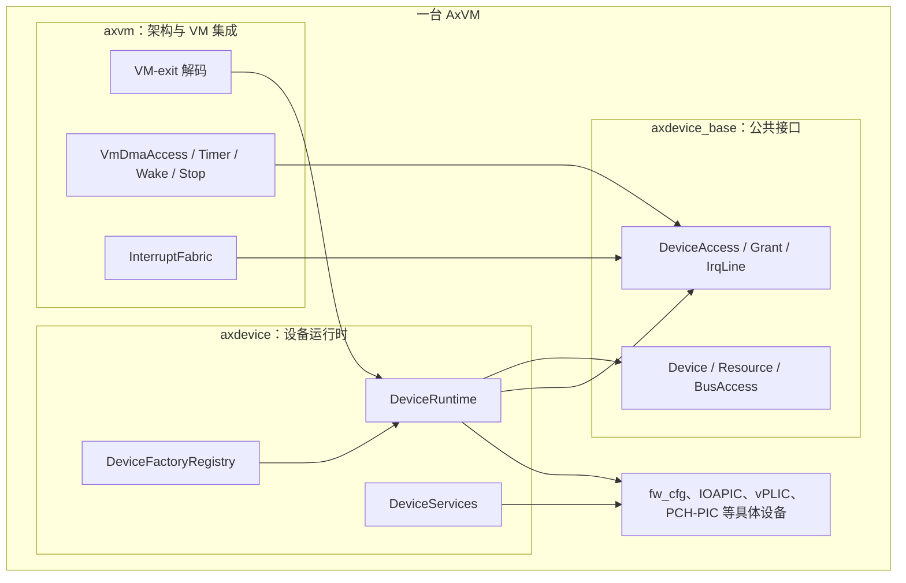
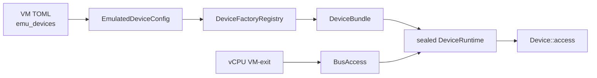
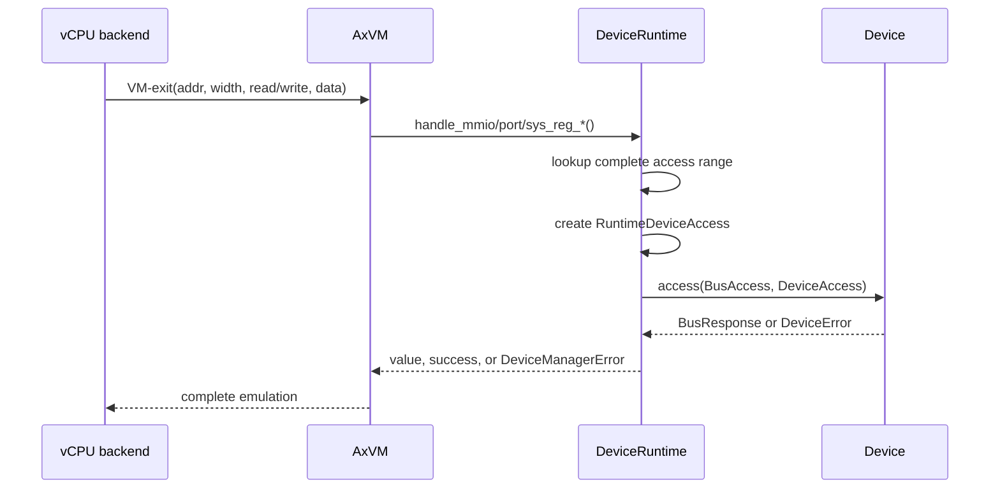
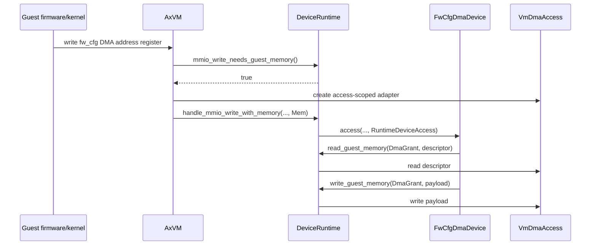

# 模拟设备框架

模拟设备由 Hypervisor 在软件中实现，客户机通过 MMIO、x86 Port I/O 或架构系统寄存器访问这些设备。Axvisor 使用 `DeviceRuntime` 保存一台 VM 的模拟设备、地址资源和运行时能力：VM 创建时根据 `emu_devices` 构建设备，vCPU 运行后再由各架构的 VM-exit 处理代码把访问交给同一个运行时分派入口。

这套框架位于 `virtualization/axdevice_base`、`virtualization/axdevice` 和 `virtualization/axvm` 三个 crate 中。本文以现有代码为准，说明配置解析、设备构建、资源注册、访问分派、DMA 授权、中断连接以及各架构设备的具体实现。

## 1. 代码组成

模拟设备代码没有集中在单一目录。公共接口与运行时实现保持架构无关，GIC、PLIC、IOAPIC 等平台设备则由对应架构在 VM prepare 阶段接入。

### 1.1 核心 crate

三个核心 crate 分别处理接口、运行时和 VM 集成，依赖方向为 `axvm → axdevice → axdevice_base`。

| 位置 | 主要内容 | 运行阶段 |
| --- | --- | --- |
| `virtualization/axdevice_base/src/lib.rs` | `Device`、`DeviceAccess`、`Resource`、`BusAccess`、grant 和 IRQ 基础接口 | 注册与访问热路径 |
| `virtualization/axdevice/src/device.rs` | `DeviceRuntime`、资源索引、事务注册、总线分派 | VM prepare 与 VM-exit |
| `virtualization/axdevice/src/factory.rs` | `DeviceFactory`、`DeviceFactoryRegistry`、内置 factory | VM prepare |
| `virtualization/axdevice/src/registration.rs` | `DeviceBundle`、pollable 与 lifecycle 能力 | VM prepare 与 VM 生命周期 |
| `virtualization/axdevice/src/service.rs` | VM 内的类型化设备服务 | VM prepare 与架构协作 |
| `virtualization/axdevice/src/fw_cfg.rs` | QEMU 兼容的 `fw_cfg` 传输和 DMA | 启动与 VM-exit |
| `virtualization/axvm/src/vm/prepare/devices.rs` | 汇总设备配置并生成 `DeviceRuntime` | VM prepare |
| `virtualization/axvm/src/arch/*` | 注册架构 factory、准备中断控制器、处理架构 VM-exit | VM prepare 与 vCPU 运行期 |

`axdevice_base` 不持有 VM 对象，设备实现只依赖稳定的总线和能力接口。`axdevice` 负责把这些接口组织成一台 VM 的设备拓扑；`axvm` 再提供客户机内存、定时器、vCPU 唤醒和生命周期等 VM 级实现。

下图以 VM 边界划分各层的归属。箭头表示运行时调用或构建期注入，而不是 Rust crate 的全部依赖关系。



具体设备只依赖公共契约；它们不会直接取得 `AxVM`。VM 侧资源通过 `DeviceAccess` 和 `IrqLine` 在构建或单次访问时接入，这也是 `axdevice` 能承载多架构设备实现的边界。

### 1.2 运行时对象

一台完成 prepare 的 VM 保存一个 `Arc<DeviceRuntime>`。`DeviceRuntime` 中的 `devices` 是按注册顺序追加的 `Arc<dyn Device>` 数组，数组下标同时用于生成 `DeviceId`；三棵地址索引和一张 IRQ line 索引负责把访问或资源定位到设备。

| `DeviceRuntime` 字段 | 数据结构 | 保存的内容 |
| --- | --- | --- |
| `devices` | `Vec<Arc<dyn Device>>` | 已注册设备；下标是设备的运行时身份 |
| `mmio_index` | `BTreeMap<u64, RangeEntry>` | MMIO 起始 GPA、长度和设备下标 |
| `port_index` | `BTreeMap<u16, RangeEntry>` | x86 I/O port 起始端口、长度和设备下标 |
| `sysreg_index` | `BTreeMap<u32, RangeEntry>` | 系统寄存器编码、数量和设备下标 |
| `irq_line_index` | `BTreeMap<u32, DeviceId>` | 虚拟中断控制器输入线的独占归属 |
| `dma_grants` 等 | `Vec<(DeviceId, Grant)>` | 设备与敏感运行时能力的绑定 |
| `services` | `DeviceServices` | 设备向 VM 内其他组件提供的类型化服务 |
| `pollable_devices` | `Vec<Arc<dyn PollableDeviceOps>>` | 可由运行时轮询的设备能力 |
| `lifecycle_devices` | `Vec<Arc<dyn DeviceLifecycle>>` | reset、suspend、resume 能力 |

地址索引仅在 prepare 阶段写入。构建完成后 `sealed` 被置为 `true`，运行期可以修改设备寄存器和队列状态，但不能再向这个 runtime 注册设备或资源。

### 1.3 总体流程

从 TOML 配置到一次设备访问，主路径分为 prepare 和 VM-exit 两段。prepare 负责生成静态拓扑，VM-exit 路径只做地址查找、访问上下文创建和设备调用。



直通 MMIO 映射由 `passthrough_devices`、`passthrough_addresses` 等路径管理，不经过这里的寄存器模拟。x86 的 `passthrough_ports` 是一个特例：架构代码会把每段端口范围转换为 `X86PortPassthrough` 配置，再通过 `DeviceRuntime` 分派到宿主 `in`/`out` 指令适配器。

## 2. 设备配置与构建

模拟设备在 VM prepare 阶段一次性构建。配置中的每一项先匹配一个 `DeviceFactory`，factory 返回完整的 `DeviceBundle`，随后 runtime 校验并注册 bundle 内的所有资源和能力。

### 2.1 `EmulatedDeviceConfig`

`AxVMConfig` 将 TOML 中的一项 `emu_devices` 解析为 `EmulatedDeviceConfig`。数组内六个字段的位置固定，最后一个 `cfg_list` 由具体设备解释。

```toml
# Name, Base-GPA, Length, IRQ-ID, Emu-Type, EmuConfig
emu_devices = [
  ["x86-com1",   0x3f8,      0x8,    0, 0x2,  []],
  ["x86-ioapic", 0xfec00000, 0x1000, 0, 0x23, []],
  ["x86-pit",    0x40,       0x22,   0, 0x24, []],
]
```

配置字段在公共类型中的含义如下。

| 字段 | Rust 字段 | 含义 |
| --- | --- | --- |
| Name | `name` | 日志和错误信息使用的设备名；不作为 factory 查找键 |
| Base-GPA | `base_gpa` | MMIO 基地址；对 Port 设备表示起始端口；无地址资源的配置可填 0 |
| Length | `length` | MMIO 或 Port 窗口长度；部分固定布局设备由实现自身确定资源 |
| IRQ-ID | `irq_id` | 配置携带的中断号；现有生产 factory 没有直接读取该字段 |
| Emu-Type | `emu_type` | `EmulatedDeviceType` 的数值，直接用于查找 factory |
| EmuConfig | `cfg_list` | 设备专用参数，如 vPLIC context 数量或 GIC redistributor 布局 |

`EmulatedDeviceType` 能够从配置解析某个数值，不等于该架构已经注册相应 factory。例如类型枚举中包含 Virtio block、net 和 console，而当前默认模拟设备 registry 没有为这些类型注册 factory；若配置命中未注册类型，prepare 会返回 `DeviceManagerError::Unsupported`。

### 2.2 Factory registry

`DeviceFactoryRegistry` 维护 `EmulatedDeviceType → Arc<dyn DeviceFactory>` 映射。一个类型最多只能注册一个 factory；重复注册返回 `ResourceConflict`，构建时找不到对应 factory 则返回 `Unsupported`，不会尝试另一条隐式构建路径。

公共 prepare 先调用 `register_builtin_factories()` 注册 `Dummy` 和 `IVCChannel`。各架构随后补充自己的平台设备。LoongArch64 的默认 bootstrap 还会在 VM 保存了 `fw_cfg` 启动载荷时注册捕获该载荷的 `FwCfgPayloadFactory`。

| 架构 | prepare 阶段注册的主要 factory |
| --- | --- |
| 公共 | `MetaDeviceFactory`、`IvcChannelFactory` |
| x86_64 | `X86SerialFactory`、`X86IoApicFactory`、`X86PitFactory`、`HostPortPassthroughDeviceFactory` |
| AArch64 | `Aarch64VgicFactory`、GIC redistributor/distributor/ITS factory、`Aarch64VtimerFactory` |
| RISC-V | `RiscvPlicFactory`，由 `RiscvDeviceBootstrap` 根据 PPPT 配置创建 |
| LoongArch64 | `LoongArchPchPicFactory`；存在启动载荷时再注册 `FwCfgPayloadFactory` |

registry 属于单台 VM 的构建过程。RISC-V 的 factory 捕获该 VM 已创建的 `VPlicGlobal`，`FwCfgPayloadFactory` 捕获该 VM 的 kernel、initrd、cmdline 和固件表数据，因此不会在不同 VM 之间共享可变设备状态。

### 2.3 Factory 与 `DeviceBundle`

`DeviceFactory::build()` 接收一项配置和 `DeviceBuildContext`，返回 `DeviceBundle`，不直接修改 runtime。`DeviceBuildContext` 当前提供 `IrqResolver`，factory 可以据此把配置中的虚拟中断线解析成连接到本 VM `InterruptFabric` 的 `IrqLine`。

一个 bundle 可以同时包含多个设备对象、grant、lifecycle、pollable 能力和类型化服务。grant 使用 bundle 内设备下标记录归属，直到注册成功后才换算成最终 `DeviceId`。

| Bundle 内容 | 典型实例 |
| --- | --- |
| 一个 `Device` | x86 PIT、LoongArch PCH-PIC |
| 多个 `Device` | AArch64 vtimer 的三个系统寄存器设备；每 vCPU 一个 GIC redistributor |
| 设备与 grant | `FwCfgDmaDevice` 与 `DmaGrant` |
| 设备与 service | x86 IOAPIC 与中断域 service；GICD 与 SPI 分配 service |
| 仅 service | IVC 配置生成的 `GuestRangeAllocatorKey` |
| lifecycle | AArch64 vtimer 的 reset、suspend、resume 处理器 |

这种返回值允许 factory 把同一功能需要的对象作为一个注册单元提交。例如 AArch64 vtimer 的三个寄存器共享同一个 `VtimerState` 和 backend，注册时还会同时加入 lifecycle，而不是在 VM 初始化代码中分别保存这些对象。

factory 的公共签名很小：它只读取配置和构建上下文，产物由 runtime 统一登记。

```rust
pub trait DeviceFactory: Send + Sync {
    fn device_type(&self) -> EmulatedDeviceType;

    fn build(
        &self,
        config: &EmulatedDeviceConfig,
        context: &DeviceBuildContext<'_>,
    ) -> DeviceManagerResult<DeviceBundle>;
}
```

`fw_cfg` factory 展示了 grant 如何与设备一起加入 bundle。grant 在这里创建，但没有内存权限；只有 runtime 注册并在一次 MMIO 写中注入 memory port 后，它才能用于 DMA。

```rust
let fw_cfg = Arc::new(FwCfg::new(/* boot payload */));
let dma_grant = DmaGrant::new();

DeviceBundle::new().with_guest_memory_device_grant(
    Arc::new(FwCfgDmaDevice::from_arc(fw_cfg, dma_grant.clone())),
    dma_grant,
)
```

这段构建代码不接触 `DeviceRuntime` 的内部字段，资源冲突、`DeviceId` 分配和 grant 归属校验均在后续注册阶段完成。

### 2.4 公共构建路径

`PreparedDevices::build_common_with_extra()` 是各架构共同使用的设备构建入口。它复制 `resources.config.emu_devices()`，追加架构生成的 `extra_configs`，再以当前 VM 的 `InterruptFabric` 创建 `DeviceBuildContext`。

```text
VM 配置 emu_devices
        + 架构 extra_configs
        ↓
DeviceRuntime::build_with_factories_and_ports()
        ↓ 逐项调用
DeviceFactoryRegistry::build()
        ↓
DeviceRuntime::register_bundle()
        ↓ 全部成功
DeviceRuntime::seal()
```

`extra_configs` 用于本来就由架构配置派生的设备。x86 将 `passthrough_ports` 转为 `X86PortPassthrough` 项；AArch64 在非 passthrough 中断模式下加入 vtimer 项。它们与 TOML 中的普通模拟设备走相同的 factory 和资源注册逻辑。

### 2.5 事务注册与封存

`register_bundle()` 先验证所有 bundle-local 关系，再开始写 runtime。验证包括 grant 下标越界或重复、同一 pollable/lifecycle 对象重复注册以及单例 service 冲突。

设备对象按 bundle 中的顺序注册。若中途出现地址或 IRQ 冲突，runtime 会把本 bundle 已追加的设备弹出，并按每个设备的 `resources()` 删除刚插入的索引；之前已经成功注册的 bundle 不受影响。只有全部设备成功后，grant、pollable、lifecycle 和 service 才会并入 runtime。

所有配置构建完成后，`build_with_factories_and_ports()` 调用 `seal()`。此后调用 `register()`、`register_bundle()` 或 factory 注册入口都会得到 `InvalidState`，从而保证 VM 运行期间的设备数组和分派索引不再变化。

## 3. 设备与资源模型

运行时只认识统一的 `Device` trait。设备的协议状态保存在具体实现内部，框架通过 `resources()` 知道它占用哪些入口，通过 `access()` 处理一次已经解码的客户机访问。

### 3.1 `Device` trait

`Device` 要求实现 `Send + Sync`，因为一台 VM 的设备 runtime 可能被不同 vCPU 访问。接口只有设备名、静态资源快照和访问函数三个部分。

```rust
pub trait Device: Send + Sync {
    fn name(&self) -> &str;
    fn resources(&self) -> &[Resource];
    fn access(
        &self,
        access: &BusAccess,
        context: &mut dyn DeviceAccess,
    ) -> Result<BusResponse, DeviceError>;
}
```

`resources()` 返回的 slice 在设备构造时生成，此后保持稳定。注册路径用它检查冲突并建立索引；访问热路径不重新分配资源列表。设备内部需要修改的寄存器、队列和状态机通常使用各实现自己的锁或原子变量保护。

### 3.2 `BusAccess` 与 `BusResponse`

架构 VM-exit 被归一化为 `BusAccess`。`kind` 区分 MMIO、Port 和 SysReg，`is_read` 表示方向，`addr` 保存原始总线地址，`width` 表示 1、2、4 或 8 字节访问，写入数据放在 `data` 的低位。

| 字段或类型 | 可取值 | 说明 |
| --- | --- | --- |
| `BusKind` | `Mmio`、`Port`、`SysReg` | 三类索引彼此独立 |
| `AccessWidth` | `Byte`、`Word`、`Dword`、`Qword` | `size()` 分别返回 1、2、4、8 |
| `BusResponse::Read` | `{ value: u64 }` | 读操作返回的数据 |
| `BusResponse::Write` | 无数据 | 写操作的完成确认 |

MMIO 写入口会检查设备是否返回 `BusResponse::Write`，MMIO、Port 和 SysReg 的读入口都会拒绝 `BusResponse::Write`。现有 `handle_port_write()` 与 `handle_sys_reg_write()` 只传播 `dispatch()` 错误，没有再次检查响应 variant；这是阅读访问错误时需要注意的现行行为。

### 3.3 资源类型

每个设备通过 `Resource` 声明自己占用的地址或中断输入线。地址范围采用左闭右开区间，`size` 或 `count` 不能为零。

| Resource | 地址含义 | 索引与检查 |
| --- | --- | --- |
| `MmioRange { base, size }` | 客户机物理地址 `[base, base + size)` | 检查 `u64` 加法溢出和 MMIO 重叠 |
| `PortRange { base, size }` | x86 端口 `[base, base + size)` | 结果不能超过 `0x10000`，检查 Port 重叠 |
| `SysReg { addr, count }` | 架构寄存器编码范围 | 结果不能超过 `u32` 编码空间，检查 SysReg 重叠 |
| `IrqLine { line, trigger }` | 虚拟中断控制器输入线 | 同一 runtime 内独占，记录触发模式 |

MMIO、Port 和 SysReg 是不同的地址域，所以数值相同不会冲突。例如 MMIO 地址 `0x40` 与 x86 port `0x40` 可以分别属于不同设备。`IrqLine.line` 表示 GSI、GIC INTID 或 PLIC source 一类虚拟控制器输入标识，不是宿主物理 IRQ、CPU trap vector 或 vCPU 注入向量。

### 3.4 注册校验

`DeviceRuntime::validate_resources()` 在修改索引前检查一个设备的完整资源列表。它既检查新设备内部的资源是否互相重叠，也检查与已注册设备的冲突。

对地址资源，冲突查找会同时检查起始地址之前最近的区间和起始地址之后的第一个区间，因此能够识别相交、包含和被包含三种情况。IRQ line 则检查同一设备重复声明以及跨设备重复占用。

注册成功后，`insert_resources()` 才把所有入口写入相应 `BTreeMap`。设备随后追加到 `devices`，其数组下标被封装为 `DeviceId`。由于 runtime 封存后不再删除设备，这个身份在本次 VM prepare 的整个运行期内保持稳定。

### 3.5 地址查找

一次地址查找先在对应 `BTreeMap` 中获取不大于访问地址的最后一个起点，再检查完整访问宽度是否落在该区间内。MMIO 和 Port 使用 `range_contains_access()`；SysReg 以寄存器编码和 `count` 判断。

完整宽度检查能够拒绝跨边界访问。假设设备声明 `[0x1000, 0x1004)`，从 `0x1002` 发起 4 字节访问虽然起始地址位于窗口内，但结束地址越过 `0x1004`，runtime 不会调用设备，而是按未命中处理。地址加访问宽度发生溢出时同样不会命中。

MMIO 查找实现正是“找前驱区间，再验证完整访问”的两步；Port 查找采用相同模式。

```rust
fn lookup_mmio(&self, addr: u64, width: AccessWidth) -> Option<usize> {
    let (&base, entry) = self.mmio_index.range(..=addr).next_back()?;
    range_contains_access(base, entry.size, addr, width).then_some(entry.slot)
}
```

因此索引按区间起点排序，而不是按每个字节或每个寄存器展开。设备资源窗口越大，索引项数也不会随窗口大小增长。

## 4. 运行时访问路径

VM prepare 完成后，模拟设备的主要入口来自 vCPU VM-exit。架构代码负责把退出信息中的地址、宽度、方向和数据转换为公共类型，设备 runtime 不解析架构专用退出原因。

### 4.1 从 VM-exit 到 `dispatch()`

AArch64、RISC-V、x86_64 和 LoongArch64 的 MMIO 路径最终调用 `AxVM::handle_mmio_read()` 或 `AxVM::handle_mmio_write()`。x86 I/O instruction 进入 Port handler，AArch64 vtimer 一类寄存器退出进入 SysReg handler。



`BusRouter::dispatch()` 根据 `BusKind` 选择索引。Port 地址必须能转换成 `u16`，SysReg 地址必须能转换成 `u32`；转换失败返回 `OutOfRange`。索引未命中返回 `DeviceError::NotFound`，命中后才创建 `RuntimeDeviceAccess` 并调用目标设备。

分派函数在总线查找完成后按如下方式创建上下文。`RuntimeDeviceAccess` 在栈上创建，生命周期严格限制在这一次 `Device::access()` 调用内。

```rust
let device = &self.devices[idx];
let mut context = RuntimeDeviceAccess {
    device_id: DeviceId::new(idx as u32),
    memory: None,
    dma_grants: &self.dma_grants,
    timer_grants: &self.timer_grants,
    wake_grants: &self.wake_grants,
    stop_grants: &self.stop_grants,
    access_ports: &self.access_ports,
};
device.access(access, &mut context)
```

普通 `dispatch()` 中的 `memory` 固定为 `None`；带客户机内存的 MMIO 写入口才会用同一组字段创建 `memory: Some(memory)` 的上下文。

### 4.2 MMIO 访问

`handle_mmio_read()` 和 `handle_mmio_write()` 构造公共访问对象并调用 `dispatch()`。读操作取得 `BusResponse::Read.value`，写操作用 `expect_write_response()` 确认设备返回写完成。

MMIO 通常对应 nested page fault 或架构提供的 MMIO exit。设备窗口不会作为普通客户机 RAM 映射；地址空间准备代码可以用 `find_mmio_dev()` 判断一个 GPA 是否属于模拟设备，从而把访问留给设备模拟路径。

### 4.3 Port 与系统寄存器访问

x86 串口、PIT 和 host port passthrough 使用 Port 索引。`handle_port_read()`/`write()` 把 `Port(u16)` 转为 `BusAccess`，设备实现再根据 `AccessWidth` 调用对应宽度的后端操作。

AArch64 vtimer 使用 SysReg 索引。一个 `Aarch64Vtimer` bundle 注册 `SysCntpCtlEl0`、`SysCntpctEl0` 和 `SysCntpTvalEl0` 三个 `Device`，各自声明自己的寄存器编码。系统寄存器退出因此不需要在 `DeviceRuntime` 中硬编码 CNT* 寄存器语义。

### 4.4 错误语义

设备自己的访问错误使用 `DeviceError`，runtime 对外则使用 `DeviceManagerError` 补充操作、总线、地址和宽度。日志中看到 `DeviceManagerError::Access` 时，`source` 才是底层设备给出的直接原因。

| 错误类型 | 常见触发位置 | 含义 |
| --- | --- | --- |
| `InvalidConfig` | factory 构建设备 | `cfg_list` 数量错误、配置范围与预建对象不一致 |
| `ResourceConflict` / `RegistryError` | 注册设备或 service | 地址重叠、IRQ line 重复、单例 service 重复 |
| `InvalidState` | runtime 已 sealed 后注册 | prepare 结束后又尝试修改拓扑 |
| `Unsupported` | factory 或运行时能力查找 | 未注册设备类型，或设备没有所请求的端口 |
| `UnexpectedResponse` | facade 校验响应 | 读请求收到写确认，或 MMIO 写收到读数据 |
| `Access` | MMIO、Port、SysReg facade | 包装一次具体总线访问失败的上下文 |

资源未命中与设备主动返回 `OutOfRange` 的位置不同：前者发生在 runtime 索引查找阶段，后者说明索引已选择设备但设备自己的寄存器检查拒绝了访问。这个区别对定位配置窗口和设备寄存器布局问题很有用。

## 5. 访问上下文与运行时能力

设备处理寄存器时有时还要读写客户机内存、安排定时器或请求 VM 动作。框架不把 `AxVM` 直接交给设备，而是在一次 `Device::access()` 调用期间提供 `DeviceAccess`。

### 5.1 `DeviceAccess` 与 grant

`DeviceAccess` 暴露四类受控操作。每类操作都有独立 grant，bundle 注册时把 grant token 与最终 `DeviceId` 绑定。

| 能力 | Grant | `DeviceAccess` 方法 |
| --- | --- | --- |
| 客户机内存 | `DmaGrant` | `read_guest_memory()`、`write_guest_memory()` |
| 定时器 | `TimerGrant` | `schedule_timer()` |
| vCPU 唤醒 | `WakeGrant` | `wake_vcpu()` |
| VM 停止请求 | `StopGrant` | `request_vm_stop()` |

grant 内部用一个 `Arc<()>` 作为不可伪造的 token。`RuntimeDeviceAccess` 同时检查当前处理访问的 `DeviceId` 和 token 是否与注册记录相同；仅持有另一个设备的 grant，或临时创建同类型 grant，都不能获得能力。检查通过后还必须存在相应 VM runtime port，否则仍返回 `DeviceError::Unsupported`。

### 5.2 `fw_cfg` DMA 路径

客户机内存端口目前只在 MMIO 写路径按需注入。`AxVM::handle_mmio_write()` 先调用 `mmio_write_needs_guest_memory()`，根据完整 MMIO 范围找到设备，并检查该 `DeviceId` 是否注册过 `DmaGrant`。只有需要时才创建 `VmDmaAccess`，然后进入 `handle_mmio_write_with_memory()`。



普通 `dispatch()` 创建的上下文没有 memory port，即使设备注册了 `DmaGrant`，也只能在带 memory 的 MMIO 写入口中使用它。`FwCfgDmaDevice` 因此保存的是 grant 和 `Arc<FwCfg>`，不是客户机地址空间对象。

`FwCfgDmaDevice::access()` 先区分普通寄存器写与 DMA address 写。只有完整 DMA 地址写入后，才读取 descriptor 并用 grant 调用客户机内存接口。

```rust
let Some(descriptor) = self.inner.write_dma_address(addr, access.width, access.data as usize)?
else {
    return Ok(BusResponse::Write); // 例如仅写入 64 位地址的高 32 位
};

self.inner.process_dma(
    descriptor,
    |gpa, data| context.read_guest_memory(&self.dma_grant, gpa, data),
    |gpa, data| context.write_guest_memory(&self.dma_grant, gpa, data),
)?;
```

descriptor 处理的具体协议仍留在 `FwCfg` 内部；`DeviceAccess` 只负责把已经通过授权的读写请求转交给 VM，避免设备层依赖客户机内存实现。

### 5.3 Timer、wake 与 stop port

`RuntimeAccessPorts` 保存 timer、wake 和 stop 的 VM 侧适配器，并在 prepare 时安装到 `DeviceRuntime`。设备调用相应 `DeviceAccess` 方法后，runtime 先验证 grant，再把请求转发到窄接口。

`TimerAccessPort` 接收目标 `DeviceId` 和纳秒 deadline；`WakeAccessPort` 接收目标 vCPU ID；`StopAccessPort` 接收设备给出的原因字符串。设备只知道这些操作的语义，不需要持有 VM 锁、vCPU 列表或全局定时器实现。

### 5.4 中断线

设备中断使用 `IrqLine`，不通过 `DeviceAccess`。factory 在构建设备时可调用 `DeviceBuildContext::resolve_irq()`，由本 VM 的 `InterruptFabric` 返回连接到架构 `IrqSink` 的 line 对象；设备随后可以执行 `raise`、`lower` 或 `pulse`。

`Resource::IrqLine` 负责登记虚拟输入线的归属和触发模式，避免两台设备意外占用同一 line。实际投递由架构 sink 完成：RISC-V sink 修改 vPLIC pending 状态，其他架构使用各自的中断控制器后端。资源索引本身不参与 MMIO/Port/SysReg 地址分派。

## 6. 设备间服务与生命周期

并非所有设备协作都表现为寄存器访问。中断域、地址分配器和架构后端需要被 VM 内其他组件取得，这些对象通过 `DeviceServices` 随 bundle 注册。

### 6.1 类型化 service registry

每类 service 用一个实现 `ServiceKey` 的零大小 key 标识。key 声明 service trait、诊断名称和 `Single`/`Multiple` 基数，调用方必须使用同一个 key 类型查询，registry 内部的 `Any` 擦除不会暴露给业务代码。

| API | 行为 |
| --- | --- |
| `DeviceBundle::with_service::<K>()` | 将 provider 加入本次 bundle |
| `DeviceServices::provide::<K>()` | 注册 provider，并检查单例重复 |
| `DeviceServices::require::<K>()` | 取得唯一 provider；缺失或 key 为多例时返回错误 |
| `DeviceServices::all::<K>()` | 返回多例 key 的 provider 快照 |

现有 service 包括 IVC 的 `GuestRangeAllocatorKey`、x86 IOAPIC 与 interrupt domain、x86 PIT/串口、AArch64 GIC distributor、AArch64 vtimer backend 以及 LoongArch PCH-PIC output port。调用方依赖 service trait，不需要把 `Arc<dyn Device>` 向下转换成具体设备类型。

### 6.2 IVC 地址分配

`IVCChannel` 配置不会创建可被 guest 读写的 `Device`。`IvcChannelFactory` 使用 `base_gpa` 和 `length` 创建 `IvcGuestRangeAllocator`，再以单例 `GuestRangeAllocatorKey` 注册到 runtime。

IVC 保留窗口的起点和长度必须非零且 4 KiB 对齐。`alloc_ivc_channel()` 要求请求大小非零并按 4 KiB 对齐，内部 best-fit allocator 从保留窗口分配连续 GPA；`release_ivc_channel()` 只接受仍处于已分配状态、完全位于初始窗口内的区间，并在释放后合并相邻空闲段。

### 6.3 生命周期

需要参与 VM 状态转换的设备额外实现 `DeviceLifecycle`，接口包含 `reset()`、`suspend()` 和 `resume()`。它与 `Device` 分开保存，因此总线热路径不需要为没有生命周期操作的设备付出额外分派。

调用顺序与注册顺序有关：reset 和 resume 按注册顺序执行，suspend 按逆序执行。`AxVM::pause()` 进入暂停状态前调用 suspend，恢复时调用 resume；重置 transient resources 时调用 reset。AArch64 vtimer 的 lifecycle 会同步处理 `VtimerState` 和 host backend，drop 时也会复位状态。

### 6.4 轮询能力

需要按单调时间推进的设备可以实现 `PollableDeviceOps::poll(now_ns)`，并作为 bundle 的 pollable 能力注册。runtime 会拒绝同一个 `Arc` 指针被重复加入，无论重复项来自既有 runtime 还是同一 bundle。

`DeviceRuntime::iter_pollable_dev()` 提供已注册 pollable 的迭代器。该接口只负责保存和暴露能力；调用频率、时间来源和执行上下文由使用它的 VM runtime 决定，不属于总线 `dispatch()` 路径。

## 7. 现有设备实现

不同设备虽然共享注册和分派框架，但资源布局与状态机仍由各自实现负责。本节按现有 factory 展开实际构建结果。

### 7.1 `fw_cfg`

`fw_cfg` 是 QEMU 兼容的 MMIO 启动配置通道。VM 的启动加载代码先保存 kernel、可选 initrd、cmdline、CPU 数量和平台固件数据；prepare 时 `FwCfgPayloadFactory` 要求 TOML 中的 base/length 与载荷中记录的范围完全一致，再构建 `FwCfgDmaDevice`。

MMIO 窗口使用三个寄存器区域：数据寄存器位于 offset `0x00`，selector 位于 `0x08`，窗口至少覆盖到 `0x18` 时启用 offset `0x10` 的 64 位 DMA address。selector 选择 signature、RAM size、CPU 数量、kernel/initrd、cmdline、文件目录、SMBIOS 和 ACPI 等 entry；数据读取会推进当前 entry 的 offset。

DMA descriptor 为 16 字节大端结构，依次包含 control、length 和 guest buffer address。客户机可用 `SELECT` 切换 entry，用 `SKIP` 推进 offset，用 `READ` 把 entry 内容写入客户机内存；`WRITE` 路径会读入并丢弃客户机数据。处理结束后设备把 descriptor 的 control 写为 0，失败时写入 error bit。

DMA 地址可以用一次 Qword 写入，也可以用两次 Dword 写入。Dword 模式先写高 32 位只更新 latch，写低 32 位时才启动传输。descriptor 和 payload 的客户机内存访问都经过 bundle 绑定的 `DmaGrant`。

### 7.2 x86_64 平台设备

x86 默认 factory 覆盖串口、IOAPIC、PIT 和 host port passthrough。它们都实现公共 `Device`，但串口、PIT 和端口透传使用 `Resource::PortRange`，IOAPIC 使用 `Resource::MmioRange`。

| 类型 | 构建结果 | 配置使用情况 |
| --- | --- | --- |
| `Console` (`0x2`) | `X86SerialPortDevice<AxvmX86HostOps>`，同时发布 serial service | factory 使用设备实现的固定 COM1 布局 |
| `X86IoApic` (`0x23`) | `X86IoApicDevice`，发布 IOAPIC、interrupt domain 和 runtime domain service | 使用 `base_gpa` 与 `length` |
| `X86Pit` (`0x24`) | `X86PitDevice<AxvmX86HostOps>`，发布 PIT service | factory 使用 8254 的固定 Port 布局 |
| `X86PortPassthrough` (`0x26`) | `HostPortPassthrough` | `base_gpa`、`length` 必须能转换为非空 `u16` 端口范围 |

`HostPortPassthrough` 并不是 MMIO passthrough mapping。设备收到 Port read/write 后，按 Byte、Word 或 Dword 宽度执行宿主 x86 `inb/inw/inl` 或 `outb/outw/outl`；Qword Port 访问不在这个适配器支持的宽度内。VM 配置中的 `passthrough_ports` 会在架构 prepare 中自动变成这种设备配置。

### 7.3 AArch64 平台设备

AArch64 注册通用 vGIC、GIC partial-passthrough 组件和架构 vtimer。GIC redistributor、distributor 和 ITS 的 MMIO 语义来自 `arm_vgic`，`axvm` 侧 factory 负责解释配置并把相关 service 接入 VM。

| 类型 | `cfg_list` | 构建结果 |
| --- | --- | --- |
| `InterruptController` (`0x1`) | 未使用 | 一个 `arm_vgic::Vgic` |
| `GPPTRedistributor` (`0x20`) | `[cpu_num, stride, pcpu_id]` | 按 `base_gpa + index × stride` 创建 `cpu_num` 个 `VGicR` |
| `GPPTDistributor` (`0x21`) | 未使用 | 一个 `VGicD`，并发布 GIC distributor service |
| `GPPTITS` (`0x22`) | `[host_gits_base]` | 一个使用 guest range 和 host ITS 基址的 `Gits` |
| `Aarch64Vtimer` (`0x27`) | 未使用 | 三个 CNT* SysReg 设备、一个 backend service 和一个 lifecycle |

redistributor factory 要求 `cfg_list` 恰好包含三个参数，并对 `index × stride` 和基地址加法做溢出检查。vtimer 配置由非 passthrough 中断模式的架构初始化自动追加，不占用 MMIO 地址。

### 7.4 RISC-V vPLIC

RISC-V 的 `PPPTGlobal` (`0x30`) 由 `RiscvDeviceBootstrap` 预处理。每台 VM 最多允许一项该配置，`cfg_list` 必须恰好是 `[contexts_num]`，配置的 MMIO 长度必须覆盖所有 context 的控制和 claim/complete 区域。

bootstrap 使用配置创建一个 `VPlicGlobal`，同时用它构造 `RiscvPlicIrqSink` 和 `RiscvPlicFactory`。之后公共设备构建路径再次处理该配置时，factory 会核对 base、length 和 context 数量，再把同一个 `Arc<VPlicGlobal>` 作为 `Device` 注册。这样寄存器模拟和中断 pending 状态使用的是同一个控制器实例。

### 7.5 LoongArch PCH-PIC

`LoongArchPchPicFactory` 根据 `LoongArchPchPic` (`0x25`) 配置创建 MMIO 设备。设备内部保存 mask、edge、polarity、route entry、ISR 等 PCH-PIC 状态，并按 Byte、Word、Dword、Qword 访问拆分或组合寄存器数据。

同一个 PCH-PIC 对象还以 `PchPicOutputPortKey` 发布 output port service，架构中断路径可以设置输入电平并读取输出事件。寄存器访问通过 `DeviceRuntime`，控制器输出连接则通过 service，二者共享同一份锁保护状态。

### 7.6 Dummy 与 IVC 配置

`Dummy` (`0x0`) 的 `MetaDeviceFactory` 返回空 bundle，因此它不会增加设备、资源或 service。它主要表现为一项可被正常解析和构建、但不产生客户机访问入口的配置。

`IVCChannel` (`0xA`) 同样不注册 `Device`，但会增加一项有效 service。判断一项配置是否生效不能只看 `device_count()`：应同时检查 `DeviceServices`，IVC 地址分配就是由 service 提供的运行时功能。

## 8. 配置、测试与故障定位

模拟设备错误大多在 VM prepare 阶段暴露，地址未命中和协议错误则出现在 vCPU 运行期。排查时先区分 factory、资源注册和总线访问三个阶段，可以快速缩小范围。

### 8.1 配置示例

仓库中的 QEMU VM 配置给出了各架构正在使用的格式。下面三个例子分别展示带专用参数的 vPLIC、带 DMA 的 `fw_cfg` 和 LoongArch PCH-PIC。

```toml
# RISC-V: cfg_list 中的 2 是 context 数量
emu_devices = [
  ["plic", 0x0c00_0000, 0x60_0000, 0, 0x30, [2]],
]
```

LoongArch 配置中的 `fw_cfg` 长度为 `0x18`，覆盖 DMA address register；PCH-PIC 则占用独立的 4 KiB MMIO 窗口。

```toml
emu_devices = [
  ["fw_cfg",       0x1e02_0000, 0x18,   0, 0x3,  []],
  ["ls7a_pch_pic", 0x1000_0000, 0x1000, 0, 0x25, []],
]
```

配置被接受前还要满足架构 factory 的存在条件。尤其是 `fw_cfg`，除了 TOML 项以外还必须由启动加载路径向 VM 提供 payload，且两处记录的 MMIO 范围一致。

### 8.2 Prepare 阶段错误

出现 “no factory is registered” 时，先检查 `emu_type` 是否属于当前架构注册集合；不要只依据 `EmulatedDeviceType` 枚举判断支持情况。出现地址冲突时，错误会携带新资源、既有资源和已有 `DeviceId`，可据此对照所有 `emu_devices` 以及架构追加项。

`cfg_list` 错误通常由具体 factory 直接返回 `InvalidConfig`。AArch64 redistributor 需要三个参数，ITS 需要一个 host base，RISC-V vPLIC 需要一个 context 数量。单例 service 重复、同一类型 factory 重复和 IRQ line 重复都会在设备开始运行前终止 prepare。

### 8.3 运行期访问错误

运行期日志中的 bus、addr 和 width 来自 `DeviceManagerError::Access`。若 source 为 `NotFound`，应检查访问是否落入配置窗口、完整宽度是否跨越窗口末端，以及访问是否走了正确的 BusKind。若 source 为 `OutOfRange`，则重点检查设备自身支持的寄存器 offset 和宽度。

DMA 失败还应检查此次访问是否走 `handle_mmio_write_with_memory()`，以及 bundle 是否把同一个 `DmaGrant` 同时交给设备并绑定到该 bundle-local 设备。token 或 `DeviceId` 任一不匹配都会被拒绝；没有安装 VM memory port 时也不会退化为不受控内存访问。

### 8.4 测试覆盖

`virtualization/axdevice/src/device.rs` 的单元测试覆盖 runtime 内部语义，`virtualization/test_crates/virtualization-tests/tests/axdevice.rs` 则从公共接口验证设备注册行为。测试重点如下。

| 测试范围 | 代表性检查 |
| --- | --- |
| 地址与分派 | MMIO/Port/SysReg 命中、未命中、相邻区间、跨边界访问 |
| 资源校验 | 零长度、地址溢出、同设备重叠、跨设备冲突、IRQ line 冲突 |
| Bundle 原子性 | 内部冲突、与既有资源冲突、IRQ 冲突后的完整回滚 |
| Factory | 查找、重复类型、缺失类型、配置验证、sealed 后拒绝注册 |
| 访问能力 | DMA grant、timer/wake/stop 的 DeviceId 与 token 校验 |
| 扩展能力 | typed service、pollable 去重、lifecycle 调用顺序、IVC allocator |

设备框架相关测试可从 crate 单元测试和 virtualization test crate 两层运行。修改资源索引、bundle 注册或 grant 校验后，至少应同时覆盖成功路径和“失败后 runtime 未被部分修改”的断言；修改具体设备时还应运行该设备所在 crate 或架构模块的测试。
