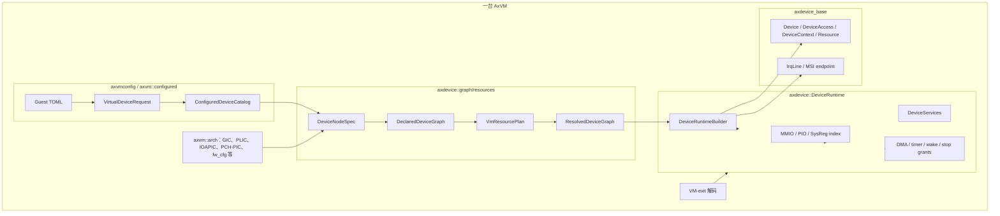
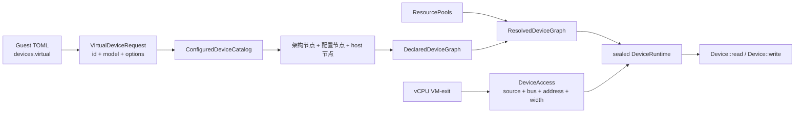
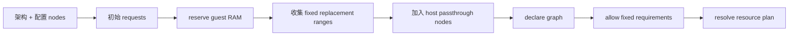
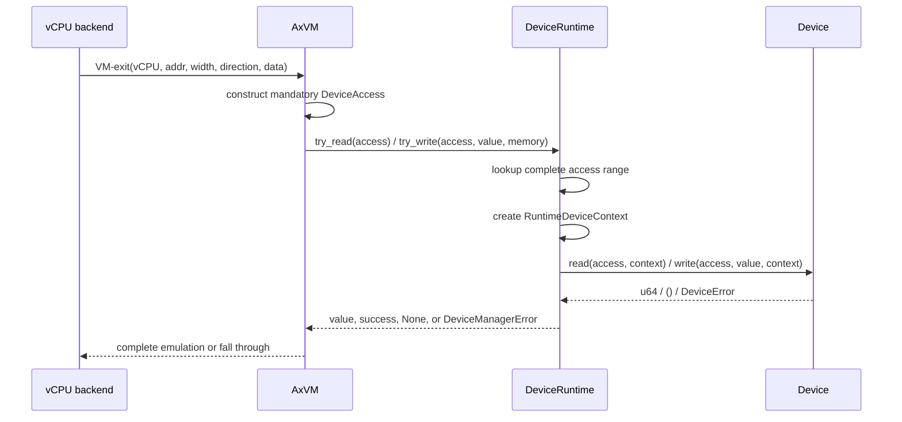
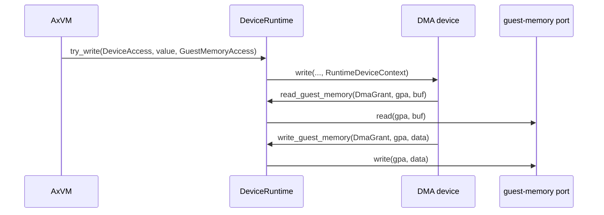

# Axvisor 模拟设备框架

Axvisor 的模拟设备由 Hypervisor 在软件中实现，客户机通过 MMIO、x86 Port I/O 或架构系统寄存器访问这些设备。用户配置只描述稳定 ID、model 名和设备语义参数，地址、中断、MSI、host IRQ 与固件 identity 均由 machine profile、host snapshot 和设备图统一规划。

这套框架主要分布在 `virtualization/axdevice_base`、`virtualization/axdevice`、`virtualization/axvmconfig` 和 `virtualization/axvm` 中。本文以现有代码为准，说明配置解析、model 注册、设备图构建、资源规划、运行时注册、访问分派、DMA 授权、中断连接、固件生成以及各架构现有设备实现。

## 1. 代码组成

模拟设备没有集中在单一目录。公共访问接口与运行时保持架构无关；GIC、PLIC、IOAPIC、PCH-PIC、fw_cfg、串口和 host replacement 等设备由 AxVM 的架构 prepare 阶段加入同一张设备图。

### 1.1 核心 crate

核心依赖方向可以概括为 `axvm -> axdevice -> axdevice_base`；`axvmconfig` 位于配置边界，负责把 TOML 解析为不含数字硬件资源的请求。

| 位置 | 主要内容 | 运行阶段 |
| --- | --- | --- |
| `virtualization/axdevice_base/src/lib.rs` | `Device`、`DeviceAccess`、`DeviceContext`、`GuestMemoryAccess`、`Resource`、grant、IRQ 与 MSI 基础接口 | 注册与访问热路径 |
| `virtualization/axdevice/src/model.rs` | `DeviceModel`、`DeviceFirmwareSpec` | 设备声明与构建 |
| `virtualization/axdevice/src/graph/*` | `DeviceNodeSpec`、`DeviceGraphBuilder`、`ResolvedDeviceGraph` | VM prepare |
| `virtualization/axdevice/src/resources/*` | `DeviceRequirements`、`ResourcePools`、`VmResourcePlanner`、claim/lease | 资源规划与构建校验 |
| `virtualization/axdevice/src/device.rs` | `DeviceRuntime`、资源索引、总线分派、grant 校验 | VM prepare 与 VM-exit |
| `virtualization/axdevice/src/registration.rs` | `DeviceBundle`、pollable、DMA pollable、lifecycle、interrupt-controller 能力 | 设备构建与 VM 生命周期 |
| `virtualization/axdevice/src/fw_cfg/*`、`serial/*`、`x86/*` | 通用和 x86 设备实现 | 设备构建与访问 |
| `virtualization/axvmconfig/src/lib.rs` | `GuestDevices`、`VirtualDeviceRequest` 配置入口 | TOML 解析 |
| `virtualization/axvm/src/configured*` | `ConfiguredDeviceCatalog`、默认串口、IVC model 构造 | 配置请求转设备图节点 |
| `virtualization/axvm/src/vm/prepare/device_plan/*` | 设备图合成、guest RAM 保留、host passthrough 节点、资源池接入 | VM prepare |
| `virtualization/axvm/src/arch/*` | 架构默认节点、资源池、固件 plan、VM-exit 接入 | VM prepare 与 vCPU 运行期 |

下图按 VM 边界划分各层职责。箭头表示构建期注入或运行时调用，不表示完整 Rust 依赖图。



设备实现仍只依赖公共契约。VM 内存、定时器、vCPU 唤醒、VM 停止请求和中断控制器等能力通过窄接口注入，而不是把 `AxVM` 对象交给设备。

### 1.2 配置入口与内置 model

`GuestConfig` 使用 `[devices]` 下的三类设备选择：`passthrough`、`disabled` 和 `virtual`。普通虚拟设备通过 `[[devices.virtual]]` 声明，配置项由稳定 ID、model 名和 model 自己解释的 options 组成。

```toml
[[devices.virtual]]
id = "console0"
model = "pl011-mmio"
clock_hz = 48000000
backend = { type = "host-console" }

[[devices.virtual]]
id = "ivc0"
model = "ivc-channel"
```

普通虚拟设备配置不得填写 `base_gpa`、`mmio_base`、`pio_base`、`irq_id`、`msi_device_id`、`msi_event_id`、`lpi_id` 等框架资源字段。这些值如果来自用户，会在 `VirtualDeviceRequest::validate()` 中被拒绝；如果确实需要固定资源，必须由 machine profile、host firmware snapshot 或架构内部节点产生 `FixedDeviceBindings` 或 fixed `DeviceRequirement`。

默认 catalog 注册的用户可选 model 如下。

| model | 设备语义 | 资源声明 |
| --- | --- | --- |
| `pl011-mmio` | PL011 串口 | MMIO `registers` + wired IRQ `irq` |
| `uart16550-mmio` | MMIO 16550 串口 | MMIO `registers` + wired IRQ `irq` |
| `uart16550-pio` | x86 PIO 16550 串口 | PIO `registers` + wired IRQ `irq` |
| `ivc-channel` | Axvisor IVC 共享窗口与通知端点 | MMIO `registers` + wired IRQ `notify` |

`ConfiguredDeviceCatalog` 是开放边界，外部可以通过 `ConfiguredModelRegistration` 注册更多 model。未注册 model 返回 `UnknownVirtualDeviceModel`，prepare 阶段会明确失败。

### 1.3 总体流程

从 TOML 到一次设备访问，主路径分为 prepare 和 VM-exit 两段。prepare 生成静态设备图和资源计划；VM-exit 热路径只构造包含 source vCPU 的不可变请求、查找索引、创建能力上下文，并调用 `Device::read()` 或 `Device::write()`。



host MMIO passthrough 不是模拟设备访问路径。`passthrough` 和 `passthrough_addresses` 会被规范化成 `HostPassthroughMapping` 节点，参与资源冲突规划，然后在地址空间准备阶段映射。x86 的 `passthrough_ports` 是例外：端口访问不能用 stage-2 映射表达，因此会创建 `HostPortPassthroughDeviceModel`，最终仍由 `DeviceRuntime` 分派到宿主 `in`/`out` 适配器。

## 2. 配置与 model 注册

设备框架把“用户想要什么设备”和“这个设备落在哪个地址/中断”分成两个阶段。用户只提交 `VirtualDeviceRequest`；catalog 把 request 变成持有 `Arc<dyn DeviceModel>` 的 `DeviceNodeSpec`；资源规划器再根据 model 的 slot 声明分配资源。

### 2.1 `VirtualDeviceRequest`

`VirtualDeviceRequest` 的 TOML 边界只有两个框架字段：`id` 和 `model`。其余字段全部保存在 `options: toml::Table` 中，由具体 model 自己用 `serde(deny_unknown_fields)` 解析。

| 字段 | 含义 | 校验 |
| --- | --- | --- |
| `id` | VM 内稳定设备身份，用于 graph 排序、资源计划和诊断 | 非空；ASCII 字母数字或 `-`、`_`、`.`、`@` |
| `model` | catalog 中注册的模型名 | 非空；小写字母数字或 `-`、`.` |
| options | 设备语义参数，例如串口 clock、backend、寄存器布局 | 由 model 类型化解析；未知字段通常失败 |

同一 VM 中 `devices.virtual` 的 ID 必须唯一。`console0` 是保留的默认串口 ID，但它不是不可变设备：用户可以用同 ID 完整替换默认串口的 model/options。

### 2.2 默认串口

每台 VM 始终有一个 `console0`。如果用户没有显式配置，AxVM 根据 machine profile 和 host firmware snapshot 创建默认请求。

| 架构 | 默认来源 |
| --- | --- |
| AArch64 / RISC-V | 优先使用 host FDT 选择的 UART 与固件 identity |
| x86_64 / LoongArch64 | 优先使用 host ACPI SPCR；否则使用 machine fallback |

当用户配置的 `console0` 与默认 model/transport 兼容时，保留 host 或 machine 提供的固定地址、IRQ 和固件 identity；当 model 不兼容时，它变成普通自动分配的虚拟串口。同 ID 不做逐字段 TOML merge，而是完整替换请求。每台 VM 最多只能有一个 `host-console` backend owner；额外串口默认使用 `null` backend，除非显式声明。

```toml
[[devices.virtual]]
id = "console0"
model = "uart16550-mmio"
backend = { type = "host-console" }

[[devices.virtual]]
id = "serial1"
model = "uart16550-pio"
backend = { type = "null" }
```

### 2.3 `ConfiguredDeviceCatalog`

`ConfiguredDeviceCatalog` 保存 `model -> ConfiguredModelRegistration`。注册项包含普通构造函数和一个可选的 `default_fixed_resources` 回调。默认 catalog 会注册串口和 IVC；其他 model 需要由使用方显式扩展 catalog。

```rust
pub struct ConfiguredModelRegistration {
    pub model: &'static str,
    pub create: ConfiguredModelConstructor,
    pub default_fixed_resources: Option<ConfiguredDefaultFixedResources>,
}
```

构造函数接收已验证的 `DeviceNodeId`、原始 request 和 `DeviceInstantiationContext`。它负责解析 options、选择默认 wired/MSI 域、接入固定资源绑定，并返回一个 `DeviceNodeSpec`。普通构造函数不直接分配地址或中断，也不接触 `DeviceRuntime`。

### 2.4 `DeviceInstantiationContext`

`DeviceInstantiationContext` 是配置实例化阶段能看到的 VM 侧信息。它只暴露必要的稳定能力，避免普通设备依赖架构 enum 或裸 IRQ。

| 方法或字段 | 含义 |
| --- | --- |
| `vm_id()` | 本 VM ID；供需要 VM 本地 backend 的设备使用 |
| `default_wired_controller()` | 默认 wired interrupt controller ID |
| `default_wired_controller_node()` | 需要作为 graph 依赖的控制器节点 ID |
| `fixed_bindings()` | machine/host 生成的固定 MMIO/PIO/IRQ 绑定 |
| `firmware_binding()` | host replacement 需要保留的 FDT/ACPI identity |
| `serial_profile()` | 默认串口模型、transport、clock 与寄存器布局 |
| `serial_backend_factory()` | 创建 host-console backend |
| `host_console_by_default()` | 该串口在无显式 backend 时是否拥有 host-console |

`console0` 的默认固定资源和固件 identity 就是通过这个 context 交给串口 model 的。普通额外串口通常拿到空 `FixedDeviceBindings`，因此资源来自自动池。

## 3. 设备图与资源规划

设备图是模拟设备框架的中心。它把架构内部设备、用户配置设备、host replacement、firmware-only 节点和 host passthrough 保留统一放入一个拓扑，再一次性规划资源。

### 3.1 `DeviceNodeSpec`

`DeviceNodeSpec` 是未封存的设备图节点。节点 ID 是 VM 内稳定身份；节点 kind 表示运行时所有权和固件语义。

| kind | 含义 | 是否构建 runtime 设备 |
| --- | --- | --- |
| `Virtual` | 完全由 VMM 实现的普通虚拟设备 | 是 |
| `HostReplacement` | 保留 host 固件 identity 和资源，但 runtime 是虚拟状态机 | 是 |
| `HostPassthrough` | 真实 host MMIO 被映射给 guest | 否 |
| `FirmwareOnly` | 只进入固件图，或作为 dependency/container | 否 |

runtime-backed 节点持有 `Arc<dyn DeviceModel>`。`HostPassthrough` 节点只持有固定资源声明和 `HostPassthroughMapping`；`FirmwareOnly` 节点持有空 requirements。

节点可记录两个拓扑关系。

| 字段 | 用途 |
| --- | --- |
| `parent` | 固件层级父节点 |
| `dependencies` | 构建顺序依赖，例如普通设备依赖默认中断控制器 |

`DeviceGraphBuilder::declare()` 会校验依赖存在性、重复依赖和环，然后按确定性拓扑序调用每个 runtime model 的 `requirements()`。

### 3.2 `DeviceModel`

`DeviceModel` 是设备声明、固件描述和运行时构建的唯一对象。资源计划不能在 build 阶段换成另一个配置，因为同一个 `Arc<dyn DeviceModel>` 从声明阶段保留到构建阶段。

```rust
pub trait DeviceModel: Send + Sync {
    fn requirements(&self) -> DeviceManagerResult<DeviceRequirements>;

    fn firmware(&self) -> DeviceFirmwareSpec {
        DeviceFirmwareSpec::default()
    }

    fn build(&self, context: &mut DeviceBuildContext<'_>) -> DeviceManagerResult<DeviceBundle>;
}
```

`requirements()` 只声明命名 slot 和资源需求；`firmware()` 用同一批 slot 描述常规 FDT/ACPI 绑定；`build()` 只能通过 `DeviceBuildContext` 消费规划好的资源，然后返回原子 `DeviceBundle`。

### 3.3 资源需求类型

每个 model 用 `ResourceSlot` 给自己的资源命名。slot 是 model 内部稳定 ABI，同一 model 的 `requirements()` 中不能重复声明。

| `DeviceRequirement` | 资源含义 | 分配请求 |
| --- | --- | --- |
| `Mmio` | 客户机物理地址窗口 | `Auto` 或固定 base |
| `Pio` | x86 Port I/O 范围 | `Auto` 或固定 base |
| `WiredIrq` | 某个虚拟中断控制器的输入线 | `Auto` 或固定 controller input |
| `HostIrq` | 物理 IRQ 身份，供 passthrough/replacement 路径使用 | `Auto` 或固定 host IRQ |
| `Msi` | ITS/message controller 中连续 MSI event/LPI 范围 | DeviceID/EventID/LPI 可分别固定或自动 |

MMIO 和 PIO 要求非零长度和 2 的幂对齐；MSI count 必须非零。资源 slot 错误会在 prepare 阶段失败，而不是运行期猜测默认值。

### 3.4 资源池与规划顺序

每个架构提供自己的 `ResourcePools`。资源池包含自动范围、固定范围 allowlist，以及被 guest RAM 或物理中断占用的保留项。

| 架构 | 自动 MMIO | 自动 PIO | 自动 wired 输入 | MSI |
| --- | --- | --- | --- | --- |
| x86_64 | `0x8000_0000..0xc000_0000` | `0x1000..0x5000` | GSI `5..16` | 无默认 MSI 池 |
| AArch64 | `0x0b00_0000..0x1000_0000` | 无 | SPI `32..32+spi_count` | GICv3 ITS 存在时提供 DeviceID/EventID/LPI 池 |
| RISC-V | `0x1100_0000..0x2000_0000` | 无 | PLIC source `1..1024` | 无默认 MSI 池 |
| LoongArch64 | `0x3000_0000..0x4000_0000` | 无 | PCH-PIC input `20..32` | 无默认 MSI 池 |

`VmResourcePlanner` 的规划是确定性的：

1. 收集所有 `DevicePlanRequest`；
2. 按 device ID 排序并拒绝重复 ID；
3. 将 fixed 需求排在 auto 需求之前；
4. 在同类需求内按 device ID 和 slot 名排序；
5. fixed 资源必须落在 allowlist 内且不冲突；
6. auto 资源从对应自动池中 lowest-first 分配；
7. 全部成功后才发布 `VmResourcePlan`。

这个顺序保证调整 TOML 中普通设备的顺序不会改变稳定 ID 对应的资源结果。失败时规划状态不会泄露到 runtime。

### 3.5 Guest RAM、host passthrough 与 replacement

`VmDevicePlan::build()` 会先把 guest RAM 作为 MMIO 保留项加入资源池，避免虚拟设备自动分配到 RAM 区间。随后将架构/配置节点中固定 MMIO 范围收集为 replacement ranges，再把 host passthrough 设备切成不覆盖 replacement 的 `HostPassthrough` 节点。



这种顺序有两个重要结果：

- 普通虚拟设备和 host passthrough 使用同一套冲突检查，MMIO 重叠会在 prepare 阶段失败。
- host replacement 覆盖的 host MMIO 不会再被映射成 passthrough，避免同一地址既由设备模拟又直通给客户机。

## 4. 运行时构建与注册

资源规划完成后，`ResolvedDeviceGraph` 同时服务固件生成和 runtime 构建。非 runtime 节点的 fixed 资源会被转换为 VM 生命周期内的 lease；runtime 节点则在构建设备时消费自己的 one-shot claim。

### 4.1 `DeviceBuildContext`

`DeviceRuntimeBuilder::build_graph_node()` 对每个 runtime 节点执行以下步骤：

1. `plan.claim_device(node.id())` 发出该设备的所有 slot claim；
2. 创建 `DeviceBuildContext::planned(interrupt_registry, claims)`；
3. 调用原 model 的 `build(&mut context)`；
4. `context.finish(bundle)` 要求所有 slot 都已消费，并把 lease/endpoint 放进 bundle；
5. `DeviceRuntime::register_bundle()` 原子注册 bundle。

`DeviceBuildContext` 提供的消费接口如下。

| 方法 | 消费资源 | 返回值 |
| --- | --- | --- |
| `mmio(slot)` | MMIO claim | `(base, size)` |
| `pio(slot)` | PIO claim | `(base, size)` |
| `host_irq(slot)` | host IRQ claim | `HostIrqId` |
| `irq(slot)` | wired IRQ claim | 已连接到控制器 input 的 `IrqLine` |
| `msi(slot)` | count 为 1 的 MSI claim | `MsiEndpoint` |
| `msi_range(slot)` | 连续 MSI range claim | `MsiEndpointRange` |

如果 model 声明了某个 slot 却没有在 build 中消费，`finish planned device build` 会失败；如果 build 尝试读取未声明或种类不匹配的 slot，也会失败。

### 4.2 `DeviceBundle`

`DeviceBundle` 是一个原子注册单元，可以同时包含设备对象、敏感能力授权、pollable、DMA pollable、lifecycle、typed service 和 interrupt-controller 能力。

| Bundle 内容 | 典型实例 |
| --- | --- |
| 一个 `Device` | x86 CMOS、PCI config、LoongArch PCH-PIC |
| 多个 `Device` | AArch64 VGIC distributor/redistributor/ITS frontends |
| 设备与 DMA grant | `fw_cfg` MMIO/PIO 设备 |
| 设备与 stop grant | x86 ACPI PM timer 发起 VM stop 请求 |
| 设备与 interrupt controller | IOAPIC、VGIC、vPLIC、PCH-PIC |
| 设备与 service | x86 PIC/PIT/IOAPIC、AArch64 VGIC runtime、PCH-PIC output port |
| 仅 service | IVC aperture allocator 与 notify endpoint |
| DMA pollable | 需要在 VM 轮询中临时访问 guest memory 的异步设备 |

grant 使用 bundle-local 设备下标记录归属，直到注册成功后才换算为最终 `DeviceId`。这允许一个 model 一次性提交完整能力组合，而不暴露 `DeviceRuntime` 内部字段。

### 4.3 `DeviceRuntime`

一台 prepare 完成的 VM 保存一个 sealed `DeviceRuntime`。核心字段如下。

| 字段 | 数据结构 | 保存的内容 |
| --- | --- | --- |
| `devices` | `Vec<Arc<dyn Device>>` | 已注册设备；下标是最终 `DeviceId` |
| `mmio_index` | `BTreeMap<u64, RangeEntry>` | MMIO 起始 GPA、长度和设备下标 |
| `port_index` | `BTreeMap<u16, RangeEntry>` | x86 I/O port 起始端口、长度和设备下标 |
| `sysreg_index` | `BTreeMap<u32, RangeEntry>` | 系统寄存器编码、数量和设备下标 |
| `pollable_devices` | `Vec<Arc<dyn PollableDeviceOps>>` | 普通周期轮询能力 |
| `dma_pollable_devices` | `Vec<(DeviceId, Arc<dyn DmaPollableDeviceOps>, DmaGrant)>` | 带临时 guest-memory 端口的轮询能力 |
| `lifecycle_devices` | `Vec<Arc<dyn DeviceLifecycle>>` | reset、suspend、resume 能力 |
| `services` | `DeviceServices` | VM 内类型化服务 |
| `planned` | `PlannedRuntimeResources` | interrupt controller、endpoint 和 lease 状态 |
| `dma_grants` 等 | `Vec<(DeviceId, Grant)>` | 设备与敏感运行时能力的绑定 |
| `access_ports` | `RuntimeAccessPorts` | VM 侧 timer/wake/stop 适配器 |
| `sealed` | `bool` | 拓扑是否已冻结 |

注册成功后调用 `finish()` 会先 `verify_consumed()`，确保所有规划资源都处于 leased 状态，然后 `seal()` runtime。运行期可以修改设备内部寄存器、队列或状态机，但不能再注册设备或资源。

### 4.4 事务注册与回滚

`register_bundle()` 在写入 runtime 前先校验 bundle 内部关系：grant 下标不能越界或重复、pollable/DMA pollable/lifecycle 不能重复注册、service 不能违反基数约束、planned controller/endpoint/lease 不能冲突。

设备对象按 bundle 内顺序注册。若中途出现地址资源冲突，runtime 会把本 bundle 已追加的设备弹出，并按每个设备的 `resources()` 删除刚插入的索引；之前已经成功注册的 bundle 不受影响。只有所有设备注册成功后，grant、pollable、lifecycle、service 和 planned 资源才并入 runtime。

## 5. 设备与访问模型

运行时只认识统一的 `Device` trait。设备协议状态保存在具体实现内部，框架通过静态 `resources()` 建立分派索引，通过 `read()` 或 `write()` 处理一次已经解码的客户机访问。

### 5.1 `Device` trait

`Device` 要求实现 `Send + Sync`，因为同一 VM 的设备 runtime 可能被多个 vCPU 访问。

```rust
pub trait Device: Send + Sync {
    fn name(&self) -> &str;
    fn resources(&self) -> &[Resource];
    fn read(
        &self,
        access: &DeviceAccess,
        context: &mut dyn DeviceContext,
    ) -> Result<u64, DeviceError>;
    fn write(
        &self,
        access: &DeviceAccess,
        value: u64,
        context: &mut dyn DeviceContext,
    ) -> Result<(), DeviceError>;
}
```

`resources()` 返回的 slice 在设备构造时确定，注册后不再变化。设备内部需要修改的寄存器、FIFO、队列或 pending 状态由实现自己的锁、原子变量或后端状态机保护。

### 5.2 `DeviceAccess` 请求

架构 VM-exit 被归一化为不可变的 `DeviceAccess`。runtime 不解析 VMCS、ESR、trap frame 或具体指令格式。构造函数要求四个字段完整给出，字段保持私有，因此 guest MMIO、PIO 和 SysReg 请求不存在“缺少 source vCPU”的可表示状态。

| 字段或类型 | 可取值 | 说明 |
| --- | --- | --- |
| `DeviceAccess.source_vcpu()` | `DeviceVcpuId` | 发起本次访问的 VM-local vCPU，不能从 host CPU、任务或 TLS 推导 |
| `BusKind` | `Mmio`、`Port`、`SysReg` | 三类地址域彼此独立 |
| `AccessWidth` | `Byte`、`Word`、`Dword`、`Qword` | 1、2、4、8 字节 |
| `DeviceAccess.address()` | `u64` | 原始总线地址；Port/SysReg 会再收窄校验 |
| `DeviceAccess.width()` | `AccessWidth` | 本次 transaction 的访问宽度 |

读写方向不再是请求中的布尔字段。`read()` 只能返回 `u64`，`write()` 接收独立的 `value: u64` 并只能返回 `()`；不存在运行时响应 variant 混淆，也不存在读写复用数据槽。

`source_vcpu` 只描述 architectural accessor。中断路由中的 target vCPU 由 GIC/PLIC/APIC 的路由状态决定，两者即使数值相同也不能复用为一个概念。例如 vCPU 0 写 GIC distributor 将 SPI 路由给 vCPU 1 时，请求 source 仍是 0，IRQ target 是 1。

### 5.3 `Resource`

注册到 runtime 的实际资源仍是 `axdevice_base::Resource`。地址范围采用左闭右开区间，`size` 或 `count` 不能为零。

| Resource | 地址含义 | 索引与检查 |
| --- | --- | --- |
| `MmioRange { base, size }` | GPA `[base, base + size)` | 检查 `u64` 加法溢出和 MMIO 重叠 |
| `PortRange { base, size }` | x86 port `[base, base + size)` | 结果不能超过 `0x10000`，检查 PIO 重叠 |
| `SysReg { addr, count }` | 架构寄存器编码范围 | 结果不能超过 `u32` 编码空间，检查 SysReg 重叠 |
| `IrqLine { line, trigger }` | 虚拟中断输入线资源 | 由设备资源和 planned interrupt endpoint/lease 共同维持归属 |

MMIO、Port 和 SysReg 是不同地址域，数值相同不会冲突。`IrqLine.line` 表示虚拟控制器输入，不是宿主物理 IRQ、CPU trap vector 或 vCPU 注入向量。

### 5.4 地址查找

一次地址查找先在对应 `BTreeMap` 中获取不大于访问地址的最后一个起点，再检查完整访问宽度是否落在该区间内。跨边界访问不会调用设备。

```rust
fn lookup_mmio(&self, addr: u64, width: AccessWidth) -> Option<usize> {
    let (&base, entry) = self.mmio_index.range(..=addr).next_back()?;
    range_contains_access(base, entry.size, addr, width).then_some(entry.slot)
}
```

如果设备声明 `[0x1000, 0x1004)`，从 `0x1002` 发起 4 字节访问虽然起始地址位于窗口内，但结束地址越过 `0x1004`，runtime 会按未命中处理。地址加访问宽度溢出时同样不会命中。

### 5.5 VM-exit 到 `try_read()` / `try_write()`

四个架构的 MMIO fault、x86 I/O instruction 和 AArch64 系统寄存器退出最终都会构造公共访问对象并进入 `DeviceRuntime`。



`DeviceRuntime` 只暴露 `try_read()` 与 `try_write()` 两个路由入口。未命中分别返回 `None` 和 `false`，便于架构 fault handler 继续 stage-2 或未映射总线策略。MMIO、PIO、SysReg 的差异只体现在 `DeviceAccess.bus()` 和架构退出完成方式，不形成无 source 的旁路 helper。

## 6. 访问上下文与运行时能力

设备访问寄存器时可能需要读写 guest memory、设置定时器、唤醒 vCPU 或请求停止 VM。这些运行能力通过一次回调期间的 `DeviceContext` 和不可伪造 grant 控制；它们不属于描述请求事实的 `DeviceAccess`。

### 6.1 `DeviceContext`、`GuestMemoryAccess` 与 grant

`RuntimeDeviceContext` 在栈上创建，生命周期严格限制在一次 `Device::read()`、`Device::write()` 或 `DmaPollableDeviceOps::poll_dma()` 调用内。它同时检查正在访问的 `DeviceId` 和 grant token 是否与 runtime 注册记录匹配。

| 能力 | Grant | 使用路径 |
| --- | --- | --- |
| guest memory | `DmaGrant` | `read_guest_memory()`、`write_guest_memory()` |
| 定时器 | `TimerGrant` | `schedule_timer()` |
| vCPU 唤醒 | `WakeGrant` | `wake_vcpu()` |
| VM 停止请求 | `StopGrant` | `request_vm_stop()` |

仅持有另一个设备的 grant，或临时创建同类型 grant，都不能获得能力。检查通过后还必须存在相应 VM runtime port，否则仍返回 `DeviceError::Unsupported`。

### 6.2 DMA 与 DMA pollable

VM 内存由独立的 `GuestMemoryAccess` capability 实现。该 trait 不携带 device identity 或 grant；`DeviceRuntime` 在委托前已经用 `DeviceContext` 验证当前设备和 `DmaGrant`。设备不能从 `DeviceAccess`、source vCPU 或 `DeviceContext` 反向取得 `AxVM`。

guest-memory 端口不会长期保存在设备中。guest 写路径可以给 runtime 注入临时 memory port；读路径没有隐式 VM 内存能力。VM 主动调用 `poll_dma_devices()` 时也会创建一次性 `RuntimeDeviceContext`。



`DmaPollableDeviceOps` 使用同样的授权模型，只是入口不是总线访问，而是 VM runtime 的周期轮询。实现必须在 `poll_dma()` 返回前完成 guest-memory 操作，不能保存临时端口。

### 6.3 中断控制器与 IRQ 线

中断控制器本身作为 `DeviceRegistration::InterruptController` 注册到 bundle。runtime 把 controller 保存在 planned resource 状态中，`DeviceBuildContext::irq()` 根据已规划的 controller/input/trigger 打开 `WiredIrqInput` 并 `connect()` 成设备可持有的 `IrqLine`。

这意味着普通设备只知道“我的 completion/notify IRQ line”，不知道裸 GSI、INTID、PLIC source 的来源。共享 level 语义也由 interrupt controller 的 input 注册逻辑维护。

### 6.4 Service、lifecycle 与 pollable

设备间协作不都表现为寄存器访问。`DeviceServices` 以强类型 key 保存 VM 内 capability，调用方通过 key 获取 trait 对象，不需要向下转换 `Arc<dyn Device>`。

| 能力 | 现有用途 |
| --- | --- |
| typed service | IVC aperture/notify、x86 PIC/PIT/IOAPIC、AArch64 VGIC runtime、LoongArch PCH-PIC output |
| lifecycle | VM reset/suspend/resume 时按注册顺序或逆序调用 |
| pollable | 需要按单调时间推进的设备 |
| DMA pollable | 周期推进时还需要临时 guest-memory 访问的设备 |

reset 和 resume 按注册顺序执行，suspend 按逆序执行。pollable 去重按 `Arc::ptr_eq` 检查，避免同一 capability 被重复加入。

## 7. 固件生成

`ResolvedDeviceGraph` 是固件和 runtime 的共同输入。普通 model 的 `firmware()` 返回 `DeviceFirmwareSpec`，其中只引用 slot 名；固件 composer 再用同一份 resolved resources 生成 `reg`、`interrupts`、ACPI `_CRS` 或 SPCR 等数据。

| 固件信息 | 来源 |
| --- | --- |
| 节点名、compatible、ACPI HID | `DeviceFirmwareSpec` |
| MMIO/PIO 地址与大小 | `ResolvedDeviceResources` 中的 register slots |
| IRQ/MSI 信息 | `ResolvedDeviceResources` 中的 interrupt slots |
| host FDT/ACPI identity | `DeviceFirmwareBinding` |
| 架构特殊表 | 架构 firmware plan，例如 GIC、MADT、IOAPIC、SPCR |

GIC、PLIC、IOAPIC、PCI root、MADT、`_PRT` 等不是普通 catalog 的特殊字符串分支。它们由架构 plan 创建专用 model 或 composer，但仍尽量读取 resolved graph，而不是维护第二套地址/IRQ 表。

## 8. 现有设备实现

本节按默认构建路径列出现有模拟设备。用户可配置 model 和架构内部节点是两类入口，但最终都注册到同一个 sealed `DeviceRuntime`。

### 8.1 用户可配置设备

| model | 构建结果 | 关键 options |
| --- | --- | --- |
| `pl011-mmio` | PL011 MMIO 设备，wired IRQ，FDT/ACPI 串口元数据 | `clock_hz`、`register_shift`、`register_width`、`backend` |
| `uart16550-mmio` | 16550 MMIO 设备，wired IRQ，串口 service/固件元数据 | 同上 |
| `uart16550-pio` | 16550 PIO 设备，wired IRQ，x86 端口访问 | `clock_hz`、`backend` |
| `ivc-channel` | IVC aperture allocator service + wired notify endpoint service | options 为空且拒绝未知字段 |

串口 backend 目前支持 `{ type = "host-console" }` 和 `{ type = "null" }`。`host-console` 每台 VM 只能有一个 owner。

`ivc-channel` 不注册可直接读写的 `Device`；它通过 service 提供共享 MMIO aperture 分配器和 notify endpoint。判断 IVC 是否生效不能只看 `device_count()`。

### 8.2 `fw_cfg`

`fw_cfg` 是 QEMU 兼容的启动配置通道。它由架构内部节点创建，payload 来自 boot loader 安装的 `FwCfgPayloadSlot`，包含 kernel、initrd、cmdline、CPU 数量和平台固件数据。

| 架构 | transport | 固定资源 |
| --- | --- | --- |
| x86_64 | PIO | selector/data `0x510..0x512`，DMA `0x514..0x51c` |
| LoongArch64 | MMIO | `0x1e02_0000..0x1e02_0018` |

MMIO transport 使用 selector、data 和 DMA address 寄存器。PIO transport 使用 2 字节 selector/data 窗口和 8 字节 DMA port 窗口。两种 transport 都通过 `DmaGrant` 访问 guest memory，DMA descriptor 和 payload 读写均受 access-scoped memory port 控制。

### 8.3 x86_64 平台设备

x86 默认 graph 包含 IOAPIC、fw_cfg、PIT、legacy PIC、CMOS、PCI config、ACPI PM timer、默认/配置串口，以及由 `passthrough_ports` 派生的 host port 设备。

| 节点 | 资源 | 构建结果 |
| --- | --- | --- |
| `ioapic` | MMIO `0xfec0_0000..0xfec0_1000` | `X86IoApicDevice` + interrupt controller + interrupt domain service |
| `fw-cfg` | PIO `0x510..0x512`、`0x514..0x51c` | `FwCfgPioDevice` + DMA grant |
| `pit` | PIO `0x40..0x44`、`0x61` | `X86PitDevice` + PIT service |
| `pic` | PIO `0x20..0x22`、`0xa0..0xa2` | legacy PIC device + PIC service |
| `cmos` | PIO `0x70..0x72` | CMOS device，记录低端内存大小 |
| `pci-config` | PIO `0xcf8..0xd00` | PCI config port window |
| `acpi-pm-timer` | PIO `0x600..0x680` + GSI 9 | ACPI PM timer，带 `StopGrant` |
| `host-port-*` | 配置中的固定 PIO range | 宿主 `inb/inw/inl`、`outb/outw/outl` 适配器 |

host port passthrough 不支持 Qword 端口访问。`passthrough_irqs` 会在资源池中保留对应 GSI/host IRQ，避免普通虚拟设备自动占用同一输入。

### 8.4 AArch64 平台设备

AArch64 以 host replacement 方式创建 VGIC。它保留 host FDT 中 GIC 的固件 identity 和 MMIO 范围，但 runtime 是 `arm_vgic` 虚拟状态机。

| 节点 | 资源 | 构建结果 |
| --- | --- | --- |
| `vgic` | GICv2 distributor/cpu-interface，或 GICv3 distributor/redistributor/ITS MMIO | `VgicDeviceSet` frontends + wired/message interrupt controller + VGIC runtime service |
| `shared-clock-provider@...` | host clock provider MMIO | 受保护的 shared MMIO replacement |
| `console0` 等串口 | fixed 或 auto MMIO + SPI | PL011/16550 虚拟串口 |
| `ivc-channel` | auto MMIO + SPI | IVC service |

VGIC 的 SPI 数量、ITS、LPI 范围、assigned physical SPI 等来自 host GIC backend 和 machine profile。GIC replacement ranges 会从 host passthrough 映射中扣除。passthrough 地址空间中如果串口依赖共享 clock provider，AxVM 会创建 `SharedMmioDevice` 代理，对受保护寄存器执行 deny 或 masked-write 规则。

### 8.5 RISC-V 平台设备

RISC-V 使用 machine profile 中的 PLIC 创建 host replacement 节点。

| 节点 | 资源 | 构建结果 |
| --- | --- | --- |
| `plic` | host FDT PLIC MMIO fixed range | `VPlicGlobal` MMIO device + interrupt controller + runtime service |
| `console0` 等串口 | fixed 或 auto MMIO + PLIC source | 虚拟串口 |
| `ivc-channel` | auto MMIO + PLIC source | IVC service |

vPLIC context 数量由 vCPU 数量推导为 `vcpu_count * 2`，并在 plan 阶段校验 MMIO 长度是否覆盖所有 context 控制和 claim/complete 区域。`passthrough_irqs` 会保留相应 PLIC source 和 host IRQ 绑定。

### 8.6 LoongArch64 平台设备

LoongArch64 默认节点包括 PCH-PIC 和 MMIO `fw_cfg`。

| 节点 | 资源 | 构建结果 |
| --- | --- | --- |
| `pch-pic` | MMIO `0x1000_0000..0x1000_1000` | `LoongArchPchPic` + interrupt controller + output port service |
| `fw-cfg` | MMIO `0x1e02_0000..0x1e02_0018` | `FwCfgDmaDevice` + DMA grant |
| `console0` 等串口 | fixed 或 auto MMIO + PCH input | 虚拟串口 |
| `ivc-channel` | auto MMIO + PCH input | IVC service |

PCH-PIC 内部保存 mask、edge、polarity、route entry、ISR 等状态；寄存器访问通过 `DeviceRuntime`，控制器输出通过 `PchPicOutputPortKey` service 供架构中断路径使用。

## 9. 配置、测试与故障定位

设备框架的大多数错误会在 VM prepare 阶段暴露。运行期错误通常说明 VM-exit 地址、访问宽度或具体设备协议不匹配。

### 9.1 配置错误

| 错误现象 | 常见原因 |
| --- | --- |
| `unknown virtual device model` | catalog 没有注册该 `model` |
| `DuplicateVirtualDeviceId` | 两个 `[[devices.virtual]]` 使用同一 ID |
| forbidden resource option | 普通设备配置填写了 `base_gpa`、`irq_id`、`mmio_base` 等框架资源 |
| invalid options | model 的 `serde(deny_unknown_fields)` 拒绝未知或类型错误字段 |
| `console0 must use a registered virtual serial model` | `console0` 被配置成非串口 model |
| 多个 host-console owner | `console0` 和额外串口都选择了 `host-console` backend |

### 9.2 规划与构建错误

| 阶段 | 常见错误 | 定位方法 |
| --- | --- | --- |
| graph declare | 依赖缺失、重复节点、依赖环 | 检查架构节点和 configured 节点 ID |
| resource plan | 自动池耗尽、fixed 不在 allowlist、与 guest RAM 或 passthrough 冲突 | 看错误中的 namespace、resource、owner、requester |
| claim/build | build 未消费 slot，或消费了错误类型 slot | 对照 model `requirements()` 与 `build()` |
| bundle register | MMIO/PIO/SysReg 重叠，service 单例重复，grant 下标错误 | 检查 bundle 内设备资源和 service key |
| runtime finish | 仍有 planned slot 未 leased | 某个 runtime 或 non-runtime 节点没有正确保留资源 |

fixed MMIO inside guest RAM 会被资源池报告为与 `guest-memory-*` 冲突；host replacement 覆盖的 passthrough range 会先被扣除，不应再出现同一区间的 host mapping。

### 9.3 运行期访问错误

`DeviceManagerError::Access` 会携带 operation、bus、addr、width 和底层 `DeviceError`。

| source | 含义 |
| --- | --- |
| `NotFound` | runtime 索引未命中；检查地址窗口、完整访问宽度和 BusKind |
| `OutOfRange` | 已命中设备，但设备内部 offset/宽度检查拒绝访问 |
| `Unsupported` | 设备或 access port 不支持该操作，例如 Qword x86 port I/O |

DMA 失败时应额外检查：设备是否注册了同一个 `DmaGrant`，本次入口是否带 memory port，以及 poll_dma/access 回调是否在作用域内完成 guest-memory 操作。

### 9.4 测试覆盖

设备框架相关测试分布在 `virtualization/axdevice`、`virtualization/axdevice_base`、`virtualization/axvm` 和具体架构/设备 crate 中。测试重点覆盖如下。

| 测试范围 | 代表性检查 |
| --- | --- |
| 配置解析 | `devices.virtual`、重复 ID、禁止资源字段、backend options |
| 资源规划 | fixed-first、lowest-first、guest RAM 保留、自动池耗尽、host passthrough 合并/扣除 |
| graph | 拓扑排序、缺失依赖、重复节点、非 runtime 节点 lease |
| runtime 注册 | MMIO/PIO/SysReg 命中、跨边界访问、bundle 回滚、sealed 后拒绝修改 |
| grant | DMA、timer、wake、stop 的 DeviceId 与 token 校验 |
| 中断 | wired input 注册、trigger 冲突、controller service |
| 设备 | fw_cfg DMA/PIO、串口、x86 平台设备、VGIC/vPLIC/PCH-PIC |

修改配置边界、资源规划或 graph 构建后，应优先运行对应 `axvmconfig`、`axdevice` 和 `axvm` 测试；修改具体设备时还应覆盖该设备 crate 或架构模块，并按项目要求运行目标 crate 的 `cargo xtask clippy --package <crate>`。
