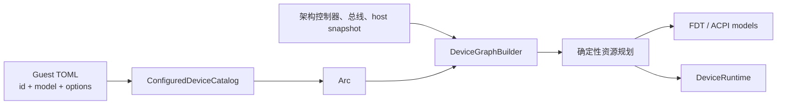

# Axvisor 虚拟设备模型与新增设备教程

Axvisor 使用开放式配置 catalog、`Arc<dyn DeviceModel>`、解析后设备图和确定性资源规划管理虚拟设备。新增普通设备不需要增加设备类型枚举，不需要修改四个架构的中心 `match`，也不需要在配置里填写地址或中断号。

## 整体流程



完整生命周期是：

1. `axvmconfig` 解析 `[[devices.virtual]]`，只校验 ID 与 model 名；
2. `ConfiguredDeviceCatalog` 找到代码内显式注册的配置 factory；
3. factory 把 options 解析为设备自己的类型化配置，创建一个 dyn model 实例；
4. 架构把控制器、总线、host replacement 和配置设备加入自己的设备图；
5. 所有 model 执行 `declare()`，规划器 fixed-first、lowest-first 分配资源；
6. 固件模型读取解析后的资源，生成 FDT/ACPI 片段；
7. 架构按自己的顺序构建节点，model 在 `build()` 中消费 claim；
8. bundle 全部提交后 seal runtime，VM 才能运行。

## 用户配置

开放式配置格式为：

```toml
[[devices.virtual]]
id = "sensor0"
model = "demo-mmio"
sample_rate = 1000
channels = 4

[[devices.virtual]]
id = "sensor1"
model = "demo-mmio"
sample_rate = 2000
channels = 8
```

`id` 在 VM 内唯一并参与确定性排序。`model` 只能包含小写字母、数字、`-` 和 `.`。其余字段全部进入该设备的 options table。

用户配置不能填写 MMIO、PIO、IRQ、MSI、LPI 或 host IRQ 数字。旧 `emu_devices`、`irq_id`、`cfg_list`、`interrupt_mode` 与 `kernel.disk_path` 都会被 `deny_unknown_fields` 明确拒绝。

## 第一步：定义类型化配置

设备模块自己定义配置，不把 option 解释逻辑放进通用框架：

```rust
#[derive(serde::Deserialize)]
#[serde(deny_unknown_fields)]
struct DemoOptions {
    sample_rate: u32,
    channels: u8,
}
```

factory 可将 `request.options` 转为该结构。错误应映射为 `ConfiguredDeviceError::InvalidOptions`，并带设备 ID 与 model 名。这样拼错字段不会被忽略。

类型化配置只表达设备语义，例如容量、队列数、后端类型和文件路径；数字硬件资源由 model 声明。

## 第二步：实现配置 factory

```rust
struct DemoFactory;

impl ConfiguredDeviceFactory for DemoFactory {
    fn model_name(&self) -> &'static str {
        "demo-mmio"
    }

    fn instantiate(
        &self,
        request: &VirtualDeviceRequest,
        context: &DeviceInstantiationContext,
    ) -> Result<ConfiguredDeviceInstance, ConfiguredDeviceError> {
        let options = request.deserialize_options::<DemoOptions>().map_err(|error| {
            ConfiguredDeviceError::InvalidOptions {
                device: request.id.clone(),
                model: request.model.clone(),
                detail: error.to_string(),
            }
        })?;
        let controller = context.default_wired_controller().ok_or_else(|| {
            ConfiguredDeviceError::Instantiation {
                device: request.id.clone(),
                model: request.model.clone(),
                detail: "architecture has no default wired interrupt domain".into(),
            }
        })?;
        let controller_node = context.default_wired_controller_node().ok_or_else(|| {
            ConfiguredDeviceError::Instantiation {
                device: request.id.clone(),
                model: request.model.clone(),
                detail: "wired interrupt domain has no graph dependency".into(),
            }
        })?;

        let model = Arc::new(DemoModel { options, controller });
        Ok(ConfiguredDeviceInstance::new(model.clone())
            .with_firmware(FirmwareModels {
                fdt: Some(model.clone()),
                acpi: Some(model),
            })
            .with_dependency(controller_node.clone()))
    }
}
```

`deserialize_options()` 只做通用 TOML 到类型的转换；未知字段仍由设备自己的 `deny_unknown_fields` 决定。不要把所有设备选项合并成中心 enum。

`DeviceInstantiationContext` 只用于查询小型平台能力，例如默认 wired/MSI 域。若设备要求某架构不具备的能力，返回明确的 unsupported/instantiation 错误，不猜测 controller。

## 第三步：实现 dyn `DeviceModel`

同一个模型实例完成声明和构建：

```rust
struct DemoModel {
    options: DemoOptions,
    controller: InterruptControllerId,
}

impl DeviceModel for DemoModel {
    fn declare(&self) -> DeviceManagerResult<DeviceDeclaration> {
        DeviceRequirements::new()
            .with_mmio(
                ResourceSlot::new("control")?,
                0x1000,
                0x1000,
                ResourceRequest::Auto,
            )?
            .with_mmio(
                ResourceSlot::new("queue")?,
                0x2000,
                0x1000,
                ResourceRequest::Auto,
            )?
            .with_wired_irq(
                ResourceSlot::new("completion")?,
                self.controller,
                InterruptTrigger::LevelTriggered,
                InterruptSharing::Exclusive,
                ResourceRequest::Auto,
            )
            .map(DeviceDeclaration::with_requirements)
    }

    fn build(
        &self,
        context: &mut DeviceBuildContext<'_>,
    ) -> DeviceManagerResult<DeviceBundle> {
        let (control_base, control_size) =
            context.mmio(&ResourceSlot::new("control")?)?;
        let (queue_base, queue_size) =
            context.mmio(&ResourceSlot::new("queue")?)?;
        let completion = context.irq(&ResourceSlot::new("completion")?)?;

        let device = DemoDevice::new(
            self.options.sample_rate,
            self.options.channels,
            control_base,
            queue_base,
            completion,
        );
        Ok(device.into_bundle(control_size, queue_size))
    }
}
```

slot 名是 model 的稳定内部 ABI。同一个 slot 不能重复声明或重复消费。`build()` 不得读取用户配置中的地址/IRQ，也不得自行调用 controller 分配中断。

`context.irq()` 返回该设备独有的 `IrqLine`：edge 设备调用 `pulse()`；level 设备在条件有效期间 `assert()`，清除条件时 `deassert()`。shared-level 的每个生产者仍有独立 line，drop 时会自动撤销该 source。

## 第四步：声明 MSI

需要多个 MSI vector 的设备可声明一个连续范围：

```rust
let msi = MsiResourceRequest::new(
    controller,
    its,
    8,
    ResourceRequest::Auto,
    ResourceRequest::Auto,
    ResourceRequest::Auto,
)?;

let requirements = requirements.with_msi(ResourceSlot::new("vectors")?, msi)?;
```

构建阶段使用：

```rust
let vectors = context.msi_range(&ResourceSlot::new("vectors")?)?;
```

DeviceID/EventID 在 ITS 内隔离，LPI 在 controller 内全局占用。平台没有 message controller 或 ITS 时会明确失败；不能静默改成 wired IRQ 或未经声明的软件路径。

## 第五步：实现固件模型

简单设备可让 model 同时实现 FDT/ACPI 能力：

```rust
impl FdtNodeModel for DemoModel {
    fn render(
        &self,
        resources: &ResolvedDeviceResources,
    ) -> Result<FdtNodeSpec, FirmwareBuildError> {
        let control = ResourceSlot::new("control").map_err(firmware_error)?;
        let completion = ResourceSlot::new("completion").map_err(firmware_error)?;
        let (base, size) = resources.mmio(&control).map_err(firmware_error)?;
        let irq = resources.wired_irq(&completion).map_err(firmware_error)?;
        Ok(demo_fdt_node(base, size, irq.input()))
    }
}
```

ACPI 模型同理返回拥有所有权的 `AcpiDeviceSpec`。`render_device_firmware()` 按解析后图顺序运行这些能力。固件代码只能读取 resolved slots，不能再次分配、按 model 字符串分支或 downcast runtime device。

MMIO+IRQ 设备应优先使用公共默认 firmware helper；GIC、ITS、PCI、IOAPIC 等特殊拓扑再实现专用模型。最终 FDT/ACPI composer 仍由架构拥有，因为 phandle、总线层级、MADT 和 PCI `_PRT` 等是架构事实。

## 第六步：注册一次

标准设备 catalog 在代码中显式注册：

```rust
let mut catalog = ConfiguredDeviceCatalog::new();
catalog.register(Arc::new(DemoFactory))?;
```

同名 factory 会失败。不要使用全局静态注册、linker section 或外部动态插件。注册完成后，任意数量的 `demo-mmio` 实例都复用同一个 factory，但每次 `instantiate()` 都创建隔离的 model 实例。

本 PR 只打通框架，没有注册真正的 `virtio-blk-mmio`。配置一个未注册 model 会返回 `UnknownVirtualDeviceModel`；实现 block backend、20GiB 容量和 Linux 驱动识别需要单独交付。

## 第七步：验证确定性分配

至少配置两个实例，并故意调换 TOML 顺序。只要稳定 ID 不变，解析后的地址和中断号就不应变化。验证链路必须覆盖：

```text
VirtualDeviceRequest
  -> ConfiguredDeviceCatalog
  -> DeviceGraphBuilder
  -> ResolvedDeviceGraph
  -> FDT/ACPI fragment
  -> DeviceRuntime
```

固件和 runtime 应观察到相同地址与 IRQ。构建中途失败后重试，应再次获得相同最低资源。无需为每个 getter 或错误分支重复写测试。

## 普通虚拟设备与 host replacement

普通虚拟设备使用 `DeviceNodeSpec::virtual_device()`，资源通常为 `Auto`。GIC、host-selected UART、共享 clock provider 等 replacement 使用 `host_replacement()`，地址、中断和固件身份来自规范化 host snapshot，声明为内部 `Fixed` 请求。

replacement 仍运行虚拟实现：例如客户机访问 VGIC 的虚拟状态，不能写 host GICD/GICR；物理 SPI 的 host IRQ、trigger 和 route 在 VM 创建前固定。固定资源不从用户 TOML 取得。

透传设备不是伪造的普通虚拟 model。它保留 host 固件节点、资源和 assignment 生命周期；最终设备图负责从 identity map 扣除虚拟与 replacement 捕获区。

## 架构初始化边界

各架构在自己的 `init_vm`/plan 中显式创建 controller 节点，再调用通用配置设备装配：

- AArch64：VGIC → 普通设备 → vCPU binding → 物理 SPI；
- RISC-V：vPLIC hart/context 顺序保持不变；
- x86：LAPIC、IOAPIC、PIT、APIC access 与 ACPI 顺序保持不变；
- LoongArch：IOCSR、EXTIOI/PCH-PIC/PCH-MSI 级联保持不变。

平台差异通过小型 capability 和 arch impl 表达，不在通用主路径按架构名、机型或测试名特判。

## 常见错误

- `UnknownVirtualDeviceModel`：model 没有在当前应用 catalog 注册；
- `InvalidOptions`：options 拼写或类型不符合设备的 `deny_unknown_fields` 配置；
- controller missing：架构没有先注册依赖的控制器，或设备请求了不支持的域；
- resource conflict/exhausted：查看错误中的 namespace、已有 owner 和 requester；
- unconsumed claim：`declare()` 的某个 slot 没有在 `build()` 中消费；
- firmware mismatch：固件模型绕过了 `ResolvedDeviceResources`，这是实现错误，不应增加 fallback。

新增普通设备时，禁止恢复设备类型 enum、裸 descriptor、旧 factory registry 或“无控制器时猜一个 IRQ”的兼容路径。
