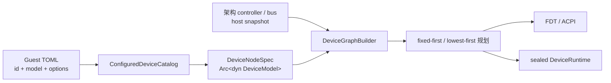

# Axvisor 虚拟设备模型与新增设备教程

Axvisor 使用显式 model registration、`Arc<dyn DeviceModel>`、解析后设备图和确定性资源规划管理普通虚拟设备。新增设备不增加中心设备 enum，不修改四个架构的设备类型 `match`，用户也不填写地址或中断号。

## 从配置到运行时



完整流程如下：

1. `axvmconfig` 将每个 `[[devices.virtual]]` 解析为 `VirtualDeviceRequest`；
2. catalog 按 model 找到一个显式 `ConfiguredModelRegistration`；
3. registration 的构造函数解析类型化 options，直接创建持有 `Arc<dyn DeviceModel>` 的图节点；
4. 架构先加入中断控制器、总线、host replacement，再加入普通配置设备；
5. 图只调用一次每个 model 的 `requirements()`，资源统一 fixed-first、lowest-first 分配；
6. `DeviceFirmwareSpec` 与 resolved slots 驱动 FDT/ACPI；
7. model 的 `build()` 消费同一批 slots，返回原子 `DeviceBundle`；
8. 所有 claim 变为 lease 后 seal runtime，VM 才能运行。

## 用户配置与默认串口

普通设备配置只包含稳定 ID、model 和设备语义参数：

```toml
[[devices.virtual]]
id = "sensor0"
model = "demo-mmio"
sample_rate = 1000
channels = 4
```

配置不能填写 MMIO、PIO、IRQ、MSI、LPI、host IRQ 或 controller ID。旧 `emu_devices`、`irq_id`、`cfg_list`、`interrupt_mode` 与 `kernel.disk_path` 会被明确拒绝。

`console0` 是默认串口的稳定 ID。未配置时，AArch64/RISC-V 优先使用 host FDT 选择的 UART，x86/LoongArch 在可用时优先使用 host ACPI SPCR，否则使用 machine fallback。用户可完整覆盖其 model/options：

```toml
[[devices.virtual]]
id = "console0"
model = "pl011-mmio"
clock_hz = 48000000
backend = { type = "host-console" }

[[devices.virtual]]
id = "serial1"
model = "uart16550-mmio"
backend = { type = "null" }
```

同 ID 不做逐字段 TOML merge。model/transport 与 host snapshot 兼容时保留 host fixed 地址、IRQ 和固件 identity；不兼容时成为自动分配资源的纯虚拟设备。当前不能关闭 `console0`，每个 VM 最多一个 `host-console` backend owner。

## 第一步：定义类型化 options

设备模块自己解释 options：

```rust
#[derive(Clone, serde::Deserialize)]
#[serde(deny_unknown_fields)]
struct DemoOptions {
    sample_rate: u32,
    channels: u8,
}
```

未知字段必须失败。options 只描述容量、队列、后端等设备语义，不保存数字硬件资源。

## 第二步：实现唯一的 model

同一个对象完成需求、固件元数据和运行时构建：

```rust
struct DemoModel {
    options: DemoOptions,
    controller: InterruptControllerId,
}

impl DeviceModel for DemoModel {
    fn requirements(&self) -> DeviceManagerResult<DeviceRequirements> {
        DeviceRequirements::new()
            .with_mmio(
                ResourceSlot::new("control")?,
                0x1000,
                0x1000,
                ResourceRequest::Auto,
            )?
            .with_mmio(
                ResourceSlot::new("queue")?,
                0x2000,
                0x1000,
                ResourceRequest::Auto,
            )?
            .with_wired_irq(
                ResourceSlot::new("completion")?,
                self.controller,
                InterruptTrigger::LevelTriggered,
                InterruptSharing::Exclusive,
                ResourceRequest::Auto,
            )
    }

    fn firmware(&self) -> DeviceFirmwareSpec {
        DeviceFirmwareSpec::new("demo")
            .with_compatible("vendor,demo-mmio")
            .with_acpi_hid("VNDR0001")
            .with_register(ResourceSlot::new("control").unwrap())
            .with_register(ResourceSlot::new("queue").unwrap())
            .with_interrupt(ResourceSlot::new("completion").unwrap())
    }

    fn build(
        &self,
        context: &mut DeviceBuildContext<'_>,
    ) -> DeviceManagerResult<DeviceBundle> {
        let (control_base, control_size) = context.mmio("control")?;
        let (queue_base, queue_size) = context.mmio("queue")?;
        let completion = context.irq("completion")?;
        let device: Arc<dyn Device> = Arc::new(DemoDevice::new(
            self.options.clone(),
            control_base,
            queue_base,
            queue_size,
            completion,
        ));
        Ok(DeviceBundle::from_registration(DeviceRegistration::Device(device)))
    }
}
```

slot 名是 model 的稳定内部 ABI。同一个 slot 不能重复声明或重复消费。`build()` 不读用户地址/IRQ，也不自行调用 controller 分配资源。

`context.irq()` 返回当前设备独有的 `IrqLine`。edge 设备调用 `pulse()`；level 设备在条件有效期间 `assert()`，清除后 `deassert()`。shared-level 的每个生产者仍有独立 line，drop 自动撤销该 source。

需要 MSI 范围时在 `requirements()` 中声明 `MsiResourceRequest`，构建时调用 `context.msi_range("vectors")`。平台缺少 ITS/message controller 时明确失败，不静默改成 wired IRQ。

## 第三步：写一个普通构造函数

不再实现配置 factory trait，也不创建额外 instance 包装：

```rust
fn create_demo(
    id: DeviceNodeId,
    request: &VirtualDeviceRequest,
    context: &DeviceInstantiationContext,
) -> Result<DeviceNodeSpec, ConfiguredDeviceError> {
    let options = request.deserialize_options::<DemoOptions>().map_err(|error| {
        ConfiguredDeviceError::InvalidOptions {
            device: request.id.clone(),
            model: request.model.clone(),
            detail: error.to_string(),
        }
    })?;
    let controller = context.default_wired_controller().ok_or_else(|| {
        ConfiguredDeviceError::Instantiation {
            device: request.id.clone(),
            model: request.model.clone(),
            detail: "architecture has no default wired interrupt domain".into(),
        }
    })?;
    let mut node = DeviceNodeSpec::virtual_device(
        id,
        Arc::new(DemoModel { options, controller }),
    );
    if let Some(controller_node) = context.default_wired_controller_node() {
        node = node.with_dependency(controller_node.clone());
    }
    Ok(node)
}
```

`DeviceInstantiationContext` 只暴露默认 wired/MSI 域、backend service 和 machine/host 产生的内部 fixed binding。普通设备不能看到 architecture enum、裸 IRQ 或架构内部对象。

## 第四步：catalog 注册一次

```rust
catalog.register(ConfiguredModelRegistration {
    model: "demo-mmio",
    create: create_demo,
})?;
```

这通常是设备模块之外唯一需要修改的位置。不使用 linker section、注册宏、全局构造器或动态插件。任意数量实例共享这条 registration，但每次构造独立 model。

本次框架未实现真正的 `virtio-blk-mmio`；未注册 model 返回 `UnknownVirtualDeviceModel`，不会伪装成功。

## 固件与特殊架构设备

`DeviceFirmwareSpec` 适合 MMIO/PIO + IRQ 等普通节点。架构 composer 用 resolved slots 生成 `reg`/`_CRS`、`interrupts` 和 SPCR；固件侧不再持有第二套地址/IRQ。

GIC、ITS、IOAPIC、PCI、MADT、`_PRT` 等不是普通 catalog 特例。它们由架构计划创建小型专用 model 或 composer，并且同样只读取 resolved graph。AArch64 的 VGIC 是典型 host replacement：沿用 host GIC 地址和固件 identity，但运行时是虚拟状态机，用户不能配置或改写 host INTID。

VGIC、串口和其他模拟设备最终都注册到同一个 sealed `DeviceRuntime`。MMIO/PIO exit 只做一次区间查询后调用 `Arc<dyn Device>::access`；没有地址特判、downcast、`find_*` 后二次 dispatch 或旧路由 fallback。VGICv3 ICC 是 vCPU system-register binding，仍由 AArch64 保存恢复。

## 最小验证

为新设备保留能守住跨层边界的测试即可：

- 两个稳定 ID 在调换 TOML 顺序后得到相同地址和 IRQ；
- resolved graph、FDT/ACPI 与 runtime 看到同一资源；
- 构建失败后同一最低资源可再次分配；
- 未知 options 和缺失架构能力明确失败。

不要为每个 getter 或序列化字段重复加测试。新增普通设备时也不要恢复设备类型 enum、独立固件 dyn trait、裸 descriptor 或“无控制器时猜 IRQ”的兼容路径。
