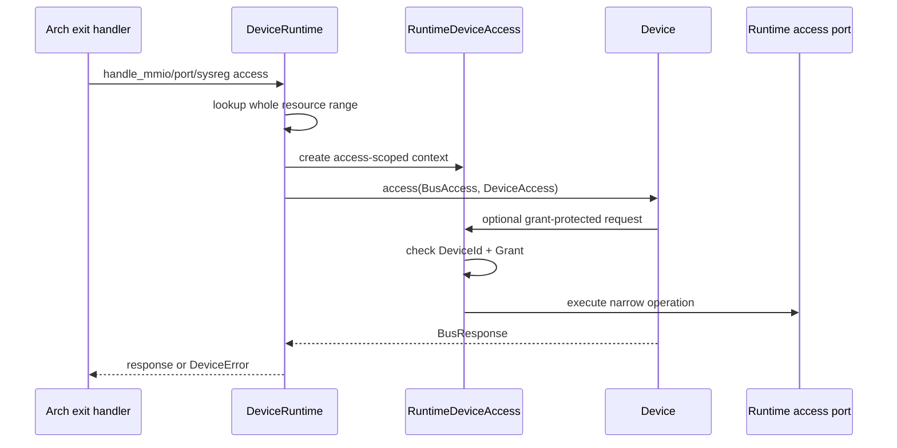
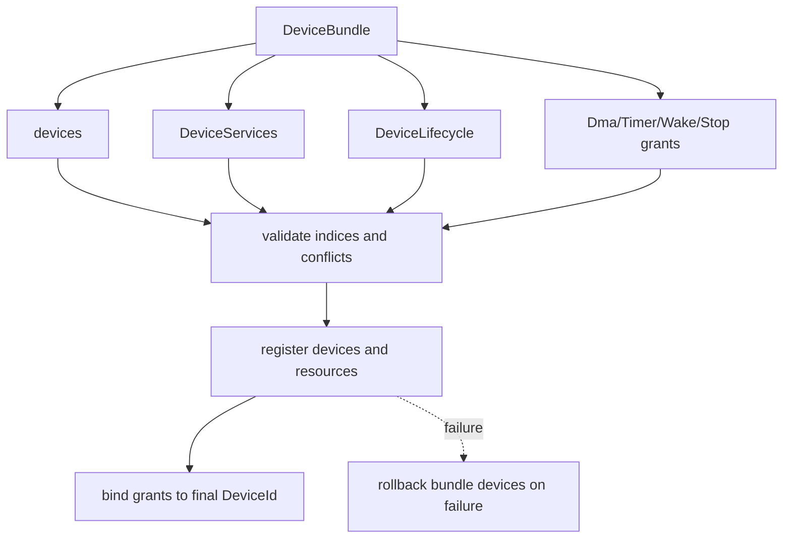
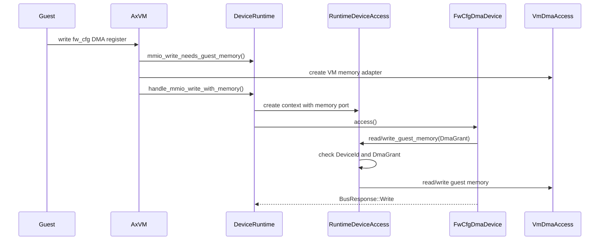
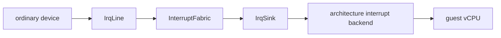

# 模拟设备框架

Axvisor 的模拟设备框架负责把 VM 配置中的客户机可见设备构造成可拦截、可调度、可授权的运行时拓扑。当前框架的核心目标是“单路径、能力受限、按访问注入”：设备统一通过 `EmulatedDeviceConfig → DeviceFactory → DeviceBundle → DeviceRuntime` 构建，运行期由 `DeviceRuntime` 分派 MMIO、PIO 和系统寄存器访问，敏感能力只通过本次访问的 `DeviceAccess` 临时开放。

## 设计目标

模拟设备框架不是单纯的设备对象列表，而是 VM 设备拓扑、资源索引、设备间协作服务、生命周期能力和敏感授权边界的共同所有者。这个定位决定了设备不能随意保存 `AxVM`、vCPU 或客户机内存对象，也不能由架构层和 VM 层绕过统一构建路径私自加入客户机可见设备。

### 单路径拓扑

单路径拓扑要求所有客户机可见模拟设备都从配置进入 factory，再由 factory 产生 `DeviceBundle`，最后由 `DeviceRuntime` 事务化注册。这个约束的维护价值在于：VM prepare 完成后，设备集合、资源窗口、IRQ line、service 和 grant 绑定关系来自同一份拓扑，而不是散落在架构初始化、VM 特判和设备管理器的不同路径中。


这条路径由 `virtualization/axvm/src/vm/prepare/devices.rs` 中的 `PreparedDevices::build_common_with_extra()` 发起。它把 VM 配置里的 `emu_devices()` 与架构补充的 `extra_configs` 合并，然后调用 `DeviceRuntime::build_with_factories_and_ports()`，因此普通设备不需要也不应该修改架构 exit handler 或 `AxVM` 的设备特判。

### 能力受限

能力受限要求设备只得到协议真正需要的运行时能力。普通寄存器设备只实现 `Device::access()` 并声明 `Resource`；需要访问客户机内存的设备必须由 bundle 绑定 `DmaGrant`；需要调度定时器、唤醒 vCPU 或请求停止 VM 的设备则分别绑定 `TimerGrant`、`WakeGrant` 或 `StopGrant`。

| 能力 | 授权令牌 | 运行时入口 | 典型用途 |
| --- | --- | --- | --- |
| 客户机内存读写 | `DmaGrant` | `DeviceAccess::read_guest_memory()`、`DeviceAccess::write_guest_memory()` | `fw_cfg` DMA descriptor 和数据搬运 |
| 定时器调度 | `TimerGrant` | `DeviceAccess::schedule_timer()` | 可编程虚拟 timer 或需要延迟事件的设备 |
| vCPU 唤醒 | `WakeGrant` | `DeviceAccess::wake_vcpu()` | 设备事件唤醒 VM-local vCPU |
| VM 停止请求 | `StopGrant` | `DeviceAccess::request_vm_stop()` | 管理类设备请求受控停止 VM |

这些 grant 定义在 `virtualization/axdevice_base/src/lib.rs`，运行时校验实现在 `virtualization/axdevice/src/device.rs` 的 `RuntimeDeviceAccess`。grant 本身只是注册期创建的不可伪造令牌；只有当它与当前 `DeviceId` 的注册记录匹配，并且当前访问上下文提供对应端口时，敏感操作才会执行。

### 按访问注入

按访问注入要求敏感能力只在一次设备访问期间有效。`DeviceRuntime` 在分派一次 MMIO、PIO 或 SysReg 访问时创建 `RuntimeDeviceAccess`，把当前 `DeviceId`、grant 绑定表和 VM 运行时窄端口放入上下文；设备访问返回后，这个上下文随调用栈失效。



这使设备协议实现仍然内聚，但高风险操作被集中在 `DeviceAccess` 的校验点上。对于维护者来说，审计 DMA、timer、wake 和 stop 的使用不需要搜索所有 VM 内部对象引用，而是重点检查 bundle 是否授予 grant，以及设备是否只在 `Device::access()` 的调用边界内使用它。

## 构建流程

构建流程发生在 VM prepare 阶段，目标是在 vCPU 开始运行前完成所有客户机可见设备的创建、校验和拓扑封存。这个阶段可以做配置解析、资源冲突检查和权限绑定等“重工作”，因为这些成本不应该进入每一次 MMIO 或 PIO 热路径。

### 工厂注册

`DeviceFactoryRegistry` 是设备类型到 factory 的唯一映射表，定义在 `virtualization/axdevice/src/factory.rs`。`DeviceFactoryRegistry::register()` 会拒绝重复的 `EmulatedDeviceType`，`DeviceFactoryRegistry::build()` 在找不到 factory 时返回明确的 unsupported 错误，从而避免“factory 失败后再尝试另一条 legacy fallback”的隐式行为。

| 代码对象 | 位置 | 职责 |
| --- | --- | --- |
| `DeviceFactory` | `virtualization/axdevice/src/factory.rs` | 将一个 `EmulatedDeviceConfig` 构造成 `DeviceBundle`，不直接修改目标 runtime |
| `DeviceFactoryRegistry` | `virtualization/axdevice/src/factory.rs` | 保存设备类型到 factory 的唯一映射，并拒绝重复注册 |
| `register_builtin_factories()` | `virtualization/axdevice/src/factory.rs` | 注册不依赖架构后端的内置 factory，例如 dummy 和 IVC allocator |
| `FwCfgPayloadFactory` | `virtualization/axdevice/src/fw_cfg.rs` | 把 boot payload 与 fw_cfg 配置结合，生成 fw_cfg 设备 bundle |

架构相关设备会在各自架构 prepare 路径中注册 factory。例如 RISC-V 的 vPLIC、x86 的 IOAPIC/PIT/串口/port passthrough、AArch64 的 vGIC/vtimer、LoongArch 的 PCH-PIC 都应通过架构侧 factory 或 bootstrap 产物进入同一 registry，而不是在 exit handler 中做设备类型分支。

### 贡献包注册

`DeviceBundle` 是 factory 对 `DeviceRuntime` 的“一整包贡献”。它可以包含设备对象、pollable 能力、lifecycle 能力、typed service，以及与 bundle-local 设备索引绑定的 grant。`DeviceRuntime::register_bundle()` 会先校验 grant 索引、重复 pollable/lifecycle 和 service 合并冲突，然后再注册设备资源。



bundle 的关键点是原子性和归属清晰。比如 `fw_cfg` factory 不只是创建一个 MMIO 设备，还要同时声明该设备拥有 `DmaGrant`；IVC factory 不产生 MMIO 设备，但会贡献 `GuestRangeAllocatorKey` 服务。两者都可以通过同一个 bundle 注册流程进入 runtime。

### 资源索引

`DeviceRuntime` 当前维护 MMIO、PIO、SysReg 和 IRQ line 四类索引，核心字段在 `virtualization/axdevice/src/device.rs` 中。注册时 `validate_resources()` 会拒绝零长度、地址溢出、同 bundle 内重叠、与既有设备重叠以及 IRQ line 冲突；运行时 lookup 会校验完整访问范围，而不只是匹配访问起始地址。

| 资源类型 | 代码表示 | 索引字段 | 运行期访问 |
| --- | --- | --- | --- |
| MMIO | `Resource::MmioRange` | `mmio_index` | `handle_mmio_read()`、`handle_mmio_write()` |
| Port I/O | `Resource::PortRange` | `port_index` | `handle_port_read()`、`handle_port_write()` |
| 系统寄存器 | `Resource::SysReg` | `sysreg_index` | `handle_sys_reg_read()`、`handle_sys_reg_write()` |
| 中断线 | `Resource::IrqLine` | `irq_line_index` | 注册期冲突检查，运行期由 `IrqLine` 操作 |

完整范围校验由 `range_contains_access()` 和各类 lookup 辅助函数支撑。这个细节很重要：一个 4 字节 MMIO 访问如果从资源窗口最后 2 字节开始，起始地址可能命中设备，但完整访问跨出资源边界，runtime 必须拒绝而不能把半个访问交给设备。

### 拓扑封存

`DeviceRuntime::build_with_factories_and_ports()` 在所有配置项注册完成后调用 `seal()`，将 runtime 置为 sealed 状态。sealed 后，`DeviceRegistry::register()` 和 `register_bundle()` 都会通过 `ensure_unsealed()` 拒绝继续修改拓扑。

这种封存不是为了禁止所有运行期状态变化，而是为了禁止运行期新增或删除客户机可见设备。设备内部寄存器、队列、timer、IVC 地址分配都可以变化；但设备集合、bus resource、service registry 和 grant 绑定关系必须在 VM prepare 后稳定，避免 guest 发现信息、二阶段 trap 布局和 runtime dispatch 索引不一致。

## 运行期访问

运行期访问从架构 VM exit 开始，最后回到架构无关的 `BusResponse` 或结构化错误。框架的原则是：架构层负责把 exit 解码成统一访问，`DeviceRuntime` 负责查找和授权，具体设备负责协议语义。

### 总线分派

四个架构的 exit handler 最终都会调用公共的 MMIO 访问辅助，例如 `virtualization/axvm/src/arch/riscv64/mod.rs`、`aarch64/mod.rs`、`x86_64/mod.rs` 和 `loongarch64/mod.rs` 中的 MMIO read/write 分支。架构层不需要知道目标设备类型，只需要把地址、宽度和读写方向交给 `AxVM::handle_mmio_write()` 或对应 read 路径。


`DeviceRuntime` 对外保留 `handle_mmio_read()`、`handle_mmio_write()`、`handle_port_read()`、`handle_port_write()`、`handle_sys_reg_read()` 和 `handle_sys_reg_write()` 这些 facade。它们构造 `BusAccess` 后调用 `BusRouter::dispatch()`，因此设备热路径集中在一个地方，错误也能统一包装成带 bus、地址和宽度的 `DeviceManagerError::Access`。

### 普通访问

普通设备访问不需要 DMA memory port，因此 `DeviceRuntime::dispatch()` 会创建一个 `RuntimeDeviceAccess`，其中 `memory` 字段为 `None`，但仍带有 timer/wake/stop 端口和 grant 绑定表。没有授权的设备调用敏感方法会得到 `DeviceError::Unsupported`，不会 panic，也不会静默成功。

| 步骤 | 代码锚点 | 行为 |
| --- | --- | --- |
| 构造访问 | `BusAccess` | 保存 bus 类型、地址、宽度、方向和写入值 |
| 查找设备 | `lookup_mmio()`、`lookup_port()`、`lookup_sysreg()` | 选择命中的设备索引并校验访问范围 |
| 创建上下文 | `RuntimeDeviceAccess` | 绑定当前 `DeviceId` 和 grant 表 |
| 调用设备 | `Device::access()` | 设备处理协议寄存器并返回 `BusResponse` |
| 校验响应 | `expect_write_response()` | 读写方向与响应类型不匹配时报错 |

普通访问路径不重新解析配置，不扫描所有设备，也不构造通用 effect 容器。后续如果需要优化索引实现，应只替换 `DeviceRuntime` 内部索引结构，不能改变设备接口和架构 exit handler 的分层。

### DMA 访问

DMA 访问当前通过 MMIO write 路径显式注入客户机内存端口。`AxVM::handle_mmio_write()` 会先调用 `DeviceRuntime::mmio_write_needs_guest_memory()` 判断本次完整 MMIO 写是否命中拥有 `DmaGrant` 的设备；只有命中时才创建 `VmDmaAccess`，并调用 `handle_mmio_write_with_memory()`。



这个路径的代表设备是 `virtualization/axdevice/src/fw_cfg.rs` 中的 `FwCfgDmaDevice`。它在处理 DMA register 写入时解析 descriptor，然后通过 `DeviceAccess::read_guest_memory()` 和 `write_guest_memory()` 完成 descriptor 和数据搬运；设备自身保存的是 `DmaGrant`，不是 `AxVM` 或客户机地址空间对象。

### 运行时端口

`RuntimeAccessPorts` 是 VM 运行时注入给 sealed `DeviceRuntime` 的窄端口集合，当前包含 timer、wake 和 stop 三类端口。`AxVM::device_access_ports()` 由 `AxVmDeviceAccessPorts` 构造这些端口，并通过 `PreparedDevices::build_common_with_extra()` 传入设备构建流程。

| 端口 trait | 当前实现 | 运行时效果 |
| --- | --- | --- |
| `TimerAccessPort` | `AxVmDeviceAccessPorts` | 调用 `crate::timer::register_timer()`，到期后唤醒该 VM 的 vCPU |
| `WakeAccessPort` | `AxVmDeviceAccessPorts` | 校验目标 vCPU 存在后通知 VM runtime |
| `StopAccessPort` | `AxVmDeviceAccessPorts` | 将请求转换为 `StopReason::Fault` 并进入 VM 生命周期状态机 |

这些端口是框架能力，不代表每个设备都能使用。设备必须在 `DeviceBundle` 中绑定对应 grant，运行期还要通过 `RuntimeDeviceAccess` 的 DeviceId+Grant 校验，才能调用对应端口。

## 中断与服务

中断和 typed service 是模拟设备框架与多架构后端之间的主要协作方式。普通设备不直接认识 PLIC、IOAPIC、vGIC 或 PCH-PIC，而是通过构建期获得的 `IrqLine` 和服务 key 与后端连接。

### 中断布线

`InterruptFabric` 是每个 VM 的中断布线层，位于 `virtualization/axvm/src/irq`。设备 factory 通过 `DeviceBuildContext` 请求 `IrqLine`，`IrqLine` 背后连接到当前 VM 的 `IrqSink`，再由架构中断后端完成实际投递。



这种模型刻意不把 IRQ 做成 `DeviceAccess` 上的通用 effect。普通设备在状态变化后直接 `raise/lower/pulse` 自己的 `IrqLine`，而控制器到 vCPU 的注入路径由架构 bootstrap 或架构 factory 提供专用后端，避免一个中心 executor 同时理解 IRQ、DMA、timer 和 VM 生命周期。

### 服务注册

`DeviceServices` 是设备贡献协作能力的类型化 registry，定义在 `virtualization/axdevice/src/services.rs` 并由 `DeviceBundle::with_service()` 写入。调用方通过 `ServiceKey` 查询明确的 trait service，而不是在生产路径中对 `Arc<dyn Device>` 做 downcast。

| 服务机制 | 代码锚点 | 作用 |
| --- | --- | --- |
| `ServiceKey` | `virtualization/axdevice/src/services.rs` | 声明 service 类型、名称和基数 |
| `DeviceServices::require()` | `virtualization/axdevice/src/services.rs` | 获取单例必需服务，不存在时报错 |
| `DeviceServices::all()` | `virtualization/axdevice/src/services.rs` | 获取多例服务快照 |
| `DeviceBundle::with_service()` | `virtualization/axdevice/src/registration.rs` | 由 factory 将服务贡献给 runtime |

typed service 的维护收益是减少架构层对具体设备类型的认识。例如 IVC 只需要 `GuestRangeAllocatorKey`，不需要 `DeviceRuntime` 保存一个具名 `ivc_channel` 字段；后续 vPCI 或中断域服务也可以按相同方式扩展，而不是向中心 enum 增加分支。

### IVC 边界

当前 IVC 仍是 hypercall 控制面的共享内存通道，不是 Linux 可枚举的 PCI 设备。设备框架中 `IvcChannelFactory` 不创建 MMIO 设备，而是在 `virtualization/axdevice/src/range_alloc.rs` 中创建 `IvcGuestRangeAllocator`，并以 `GuestRangeAllocatorKey` 服务注册给 `DeviceRuntime`。

IVC 的运行期分配不破坏静态拓扑，因为它只在 VM prepare 时声明好的保留 GPA 窗口内分配和释放 channel 地址。也就是说，变化的是共享内存地址资源的占用状态，不是客户机可见设备集合、bus resource 或 stage-2 trap 布局。

## 多架构接入

多架构接入遵循“两阶段”思想：架构 prepare 先建立中断域和必要后端，再把所有客户机可见设备交给 factory 和 `PreparedDevices` 统一构建。这个分层让架构差异留在 bootstrap/backend 中，让普通设备保持同一套 `Device` 和 `DeviceAccess` 接口。

### 准备入口

各架构 VM prepare 代码会创建 `DeviceFactoryRegistry`、注册内置和架构相关 factory、构造 `InterruptFabric`，然后调用 `PreparedDevices::build_common_with_extra()`。这个函数是设备构建的公共入口，负责把配置设备和架构额外设备统一送入 `DeviceRuntime::build_with_factories_and_ports()`。

| 架构 | 代表入口 | 设备构建特点 |
| --- | --- | --- |
| RISC-V | `virtualization/axvm/src/arch/riscv64/vm.rs` | vPLIC 通过架构 IRQ 配置注册 factory，并向 fabric 提供 sink |
| x86_64 | `virtualization/axvm/src/arch/x86_64/vm.rs` | IOAPIC、PIT、串口和 port passthrough 通过 x86 factory 接入 |
| AArch64 | `virtualization/axvm/src/arch/aarch64/vm.rs` | vGIC、GIC redistributor 和 CNT* SysReg vtimer 由架构 factory 贡献 |
| LoongArch64 | `virtualization/axvm/src/arch/loongarch64/vm.rs` | PCH-PIC 等架构设备通过 factory 和 output port 接入 |

架构仍然可以提供后端能力，例如中断注入、timer 后端或平台特定 output port；但这些能力应作为 factory context、fabric、typed service 或窄端口进入设备构建，而不是直接修改 `DeviceRuntime` 的具体字段。

### 启动载荷

fw_cfg 是启动期 payload 与模拟设备结合的典型例子。`AxVM::add_fw_cfg_device()` 当前把内核、initrd、cmdline、CPU 数量和平台 blob 暂存为 `pending_fw_cfg_payload`，随后 prepare 阶段通过 `FwCfgPayloadFactory` 把这些 payload 变成标准 fw_cfg 设备 bundle。

这个路径的边界是：`pending_fw_cfg_payload` 只是 boot payload staging，不是运行期设备特判。真正的 fw_cfg 设备仍由 factory 构建，最终以 `FwCfgDmaDevice` 注册到 `DeviceRuntime`，并通过 `DmaGrant` 受控访问客户机内存。

### 未来 vPCI

当前 `BusKind` 和 `Resource` 已覆盖 MMIO、PIO 和 SysReg，PCI config 和 PCI function/BAR 仍属于后续扩展方向。当前框架的原则是未来 vPCI 也应复用同一套模型：PCI function、config space、BAR、MSI-X table 和 shared memory window 都作为同一个 `DeviceId` 的资源集合注册，而不是另开 vPCI 旁路。

对 IVC 改造成 Jailhouse 或 rust-shyper 风格 ivshmem/vPCI 设备时，首先需要补 PCI host bridge、PCI config dispatch、BAR 分配、MSI/MSI-X 和 guest DTB/ACPI 描述。完成这些基础设施后，ivshmem 设备应仍然通过 `EmulatedDeviceConfig → DeviceFactory → DeviceBundle → DeviceRuntime` 进入框架。

## 新增设备

新增一个普通模拟设备的目标路径很短：写私有参数解析，注册一个 factory，实现一个 `Device`，补测试。只要设备不需要新增架构后端或新 bus 类型，就不应该修改架构 exit switch、`AxVM` 的具体设备字段或 `DeviceRuntime` 的设备类型分支。

### 最小步骤

新增普通 MMIO 设备时，建议先确认设备是否只需要寄存器读写。如果是，设备实现只需要声明 `Resource::MmioRange` 并在 `Device::access()` 中处理读写；factory 解析 `EmulatedDeviceConfig` 后把设备放入 `DeviceBundle::from_registration()` 或 `DeviceBundle::new().with_registration()`。

```text
1. 定义设备私有参数解析，拒绝非法 base/length/irq 参数。
2. 实现 Device::name/resources/access。
3. 实现 DeviceFactory::device_type/build。
4. 在对应内置或架构 factory 注册函数中注册 factory。
5. 增加配置到 runtime dispatch 的单元测试或集成测试。
```

如果设备需要 IRQ，应通过 `DeviceBuildContext` 和 `InterruptFabric` 获取 `IrqLine`，并在设备状态更新后触发中断。设备不应直接调用架构中断控制器，也不应保存 VM/vCPU 对象。

### 权限申请

需要敏感能力的设备必须把 grant 放进 `DeviceBundle`。例如需要 DMA 的设备可以使用 `with_guest_memory_device_grant()` 或先 `add_device()` 再 `grant_guest_memory_to_device()`；timer、wake 和 stop 也有对应的 bundle 方法。

| 设备需求 | Bundle 方法 | 设备侧调用 |
| --- | --- | --- |
| DMA | `add_guest_memory_device_with_grant()`、`with_guest_memory_device_grant()` | `DeviceAccess::read_guest_memory()`、`write_guest_memory()` |
| Timer | `add_timer_device_with_grant()`、`with_timer_device_grant()` | `DeviceAccess::schedule_timer()` |
| Wake | `add_wake_device_with_grant()`、`with_wake_device_grant()` | `DeviceAccess::wake_vcpu()` |
| Stop | `add_stop_device_with_grant()`、`with_stop_device_grant()` | `DeviceAccess::request_vm_stop()` |

grant 的生命周期应由设备对象保存，但能力调用必须发生在 `Device::access()` 的上下文内。设备不应把 `&mut dyn DeviceAccess` 存入自身状态，也不应在设备状态锁内执行可能阻塞的 guest memory copy、timer 调度或 VM stop 请求。

### 测试要求

新增设备至少应覆盖资源注册、dispatch 读写和错误响应。若设备使用 grant，还应覆盖未授权、错误 grant、错误 `DeviceId` 或缺少 runtime port 的拒绝路径，防止权限模型只在 happy path 中生效。

| 测试类别 | 验证目标 |
| --- | --- |
| factory 构建 | 合法配置能生成 bundle，非法配置返回结构化错误 |
| 资源冲突 | MMIO/PIO/SysReg/IRQ 冲突会阻止注册并无残留 |
| bus dispatch | 完整访问范围命中设备，跨界访问被拒绝 |
| grant 拒绝 | 未申请能力或 grant 不匹配时返回 unsupported/permission 错误 |
| 生命周期 | 有 lifecycle 的设备在 reset/suspend/resume 中按顺序调用 |

测试位置可以放在具体设备 crate 的单元测试，也可以放在 `virtualization/test_crates/virtualization-tests/tests/axdevice.rs` 这类跨 crate 集成测试中。对于架构设备，还需要保留对应架构的 QEMU smoke 或行为等价测试，特别是中断控制器、timer 和 port passthrough。

## 维护边界

模拟设备框架的长期可维护性来自边界稳定：prepare 阶段可以复杂，访问热路径必须短；设备可以表达协议，不能拿到不必要的宿主对象；架构可以提供后端，不能绕开统一 runtime。维护时应优先检查这些边界是否被新设备打破。

### 关键源码

维护模拟设备框架时，最常看的不是某一个具体设备，而是接口、注册、运行时和 VM prepare 四组文件。接口文件决定设备能看到什么，注册文件决定设备如何贡献资源和能力，运行时文件决定访问如何分派，prepare 文件决定拓扑如何形成。

| 文件 | 维护关注点 |
| --- | --- |
| `virtualization/axdevice_base/src/lib.rs` | `Device`、`DeviceAccess`、`DeviceId`、`Resource`、grant 和 bus 类型 |
| `virtualization/axdevice/src/device.rs` | `DeviceRuntime`、resource index、dispatch、grant 校验、sealed topology |
| `virtualization/axdevice/src/registration.rs` | `DeviceBundle`、lifecycle、pollable、service 和 grant 贡献 |
| `virtualization/axdevice/src/factory.rs` | `DeviceFactory`、`DeviceFactoryRegistry` 和内置 factory |
| `virtualization/axdevice/src/fw_cfg.rs` | fw_cfg 设备、DMA descriptor 和 `DmaGrant` 使用样板 |
| `virtualization/axdevice/src/range_alloc.rs` | IVC guest range allocator typed service |
| `virtualization/axvm/src/vm/prepare/devices.rs` | 设备 prepare 公共入口和 access ports 注入 |
| `virtualization/axvm/src/vm/mod.rs` | `VmDmaAccess`、`AxVmDeviceAccessPorts`、MMIO write DMA 注入 |

这些代码锚点也说明了框架分层：`axdevice_base` 只定义设备可见契约，`axdevice` 实现 per-VM runtime 和注册逻辑，`axvm` 提供 VM 运行时能力端口，具体架构提供中断与平台后端。

### 性能约束

当前框架引入 factory、bundle、service 和 grant 是为了把复杂性挪到 prepare 阶段，而不是让每一次 MMIO/PIO/SysReg 访问承担额外重成本。普通访问路径应保持“索引查找、创建轻量上下文、调用设备、校验响应”的短链路。

| 约束 | 维护要求 |
| --- | --- |
| prepare 期做重工作 | 配置解析、权限决策、资源冲突和 service 合并不得放入 dispatch |
| 热路径无全局写锁 | `dispatch()` 不应获取会串行化所有设备访问的全局可写锁 |
| 热路径无全设备扫描 | 新索引实现可以替换内部结构，但不应退化为每次扫描全部设备 |
| 默认日志轻量 | 高频 trace 默认关闭，诊断信息应可按设备或错误路径开启 |
| 锁外执行回调 | guest memory copy、IRQ、timer、wake 和 stop 不应在设备状态锁内调用 |

如果重构导致性能退化，应优先优化 `DeviceRuntime` 的索引、上下文构造或具体设备锁粒度，而不是恢复 `AxVM` 中的具体设备特判。框架边界一旦被特判绕开，后续设备扩展会重新回到多路径构建和权限不清晰的问题。

### 已知边界

当前框架采用静态拓扑，不支持运行期热插拔普通客户机可见设备。IVC 的运行期 channel 分配属于已声明窗口内的地址资源管理，不是新增或删除设备；未来 vPCI、ivshmem 或 PCI hotplug 需要独立定义 vCPU quiesce、地址空间 unmap、IRQ release、service 引用计数和 `DeviceId` 复用策略。

另一个边界是 PCI 尚未成为当前 `BusKind` 的正式成员。文档中提到的 PCI function、BAR 和 MSI-X 是当前框架对未来扩展的设计方向，不代表当前框架已经能让 Linux 枚举 vPCI 设备；实现 vPCI 前应先补 PCI host bridge、guest 描述、config space dispatch 和 MSI/MSI-X 中断路径。
