# Axvisor 客户机配置架构

客户机 TOML 是 VM 需求的持久化格式。`axvmconfig` 定义 schema，负责反序列化和配置内校验；`os/axvisor` 把它转换成 `AxVMConfigParams`，再由 AxVM 的 boot prepare 和设备 prepare 阶段补齐运行时事实。配置只表达客户机身份、启动输入、内存和设备选择，不允许用户填写设备地址、IRQ、MSI 或 LPI 等框架资源。

平台固定资源和分配算法见 [Machine 与资源规划架构](./machine-profile.md)，设备图之后的注册与中断路径见 [设备运行时与中断架构](./device-runtime.md)。model 的实现、注册和资源声明见 [Axvisor 模拟设备框架](./emulated-devices.md)。

## 1. 代码组成与运行阶段

客户机 TOML 从读取到变成设备图要经过四个阶段：`axvmconfig` 负责解析和校验，Axvisor 应用层完成参数转换，boot prepare 补齐启动资源，device prepare 把虚拟设备请求实例化为图节点。下表列出各阶段的代码位置与职责；修改配置行为时应先确定改动属于哪个阶段，再定位对应的模块。

| 位置 | 主要类型或入口 | 职责 | 运行阶段 |
| --- | --- | --- | --- |
| `virtualization/axvmconfig/src/lib.rs` | `GuestConfig`、`VMBaseConfig`、`VMKernelConfig`、`GuestDevices`、`VirtualDeviceRequest` | 定义持久化 schema，完成 Serde 解析、boot/device 校验和兼容字段读取 | 配置读取 |
| `virtualization/axvmconfig/src/error.rs` | `AxVmConfigError` | 区分 TOML 形状错误、启动组合错误和设备选择错误 | 配置读取与校验 |
| `os/axvisor/src/config.rs:183` | `build_axvm_config` | 把配置字段转换为 AxVM 参数，注入应用拥有的串口后端，并在默认 catalog 上注册 `virtio-blk`、`virtio-net` | 应用层转换 |
| `virtualization/axvm/src/config.rs:115` | `AxVMConfigParams`、`AxVMConfig` | 承接 CPU、镜像、地址空间策略、内存、物理设备 selector、虚拟设备请求和 catalog | VM 创建前 |
| `virtualization/axvm/src/boot/prepared.rs:45` | `prepare_guest_boot`、`PreparedGuestBoot` | 按架构处理 DTB、固件和启动资源，返回准备后的 `GuestConfig` 与客户机 DTB | boot prepare |
| `os/axvisor/src/config.rs:132-134` | `sync_axvm_config_from_crate_config`、`set_boot_policy` | 把准备阶段新增的内存区域同步到 draft `AxVMConfig`，并设置 boot policy | 应用层同步 |
| `virtualization/axvm/src/configured.rs:184` | `ConfiguredDeviceCatalog`、`instantiate_node` | 按 model 查找构造器，把 `VirtualDeviceRequest` 的 model/options 转成 `DeviceNodeSpec` | device prepare |
| `virtualization/axvm/src/configured/append.rs:13` | `append_configured_devices` | 合并默认串口请求和用户请求，逐项调用 catalog，加入待规划设备图 | device prepare |
| `scripts/axbuild/src/axvisor/mod.rs:320` | `jkconfig::run::<GuestConfig>` | 通过 `schemars::JsonSchema` 生成 menuconfig 所需 schema 并编辑 TOML | 构建工具运行期 |

`axvmconfig` 不依赖具体 Machine，也不分配硬件资源。`ConfiguredDeviceCatalog` 是请求进入设备图的转换点；catalog 的内置 model 和应用扩展项不是持久化 schema 的枚举。

## 2. 从 TOML 到设备图

`GuestConfig::from_toml()` 的顺序固定在 `axvmconfig/src/lib.rs:691`：先调用 `toml::from_str`，再执行 `validate_boot_config()` 和 `GuestDevices::validate()`，最后记录用户提供的 `memory_regions` 数量。这个计数不序列化，用于 boot prepare 区分用户内存和准备阶段追加的区域。

```mermaid
flowchart LR
    TOML["guest TOML<br/>base / kernel / devices"]
    SERDE["Serde 反序列化<br/>GuestConfig"]
    VALIDATE["boot/device validation<br/>启动矩阵、selector、ID、资源键"]
    CONVERT["os/axvisor::build_axvm_config<br/>应用层转换与 catalog 扩展"]
    DRAFT["draft AxVMConfig"]
    BOOT["prepare_guest_boot<br/>固件、DTB、镜像准备"]
    PREPARED_BOOT["PreparedGuestBoot<br/>prepared GuestConfig + guest DTB"]
    SYNC["os/axvisor sync<br/>同步新增内存、设置 boot policy"]
    AXCFG["prepared AxVMConfig"]
    REQUESTS["configured requests<br/>id + model + options"]
    CATALOG["ConfiguredDeviceCatalog::instantiate_node"]
    GRAPH["DeviceNodeSpec / declared graph"]

    TOML --> SERDE --> VALIDATE --> CONVERT --> DRAFT --> BOOT --> PREPARED_BOOT --> SYNC --> AXCFG
    AXCFG --> REQUESTS --> CATALOG --> GRAPH

    SERDE -. "parse：AxVmConfigError::TomlParse" .-> EP["解析错误"]
    VALIDATE -. "validation：AxVmConfigError" .-> EV["配置语义错误"]
    CONVERT -. "conversion：当前无独立 Result" .-> EC["字段转换边界"]
    BOOT -. "prepare/load：AxVmError + anyhow context" .-> EB["启动准备错误"]
    CATALOG -. "prepare：ConfiguredDeviceError<br/>映射为 AxVmError::InvalidConfig" .-> ED["设备装配错误"]
```



应用层转换本身主要是类型与所有权边界转换：

- `guest_type` 转为 `AddressSpacePolicy`；`passthrough`、`disabled` 转为尚未解析的平台 selector。
- `entry_point`、镜像加载地址、CPU 参数和 `memory_regions` 写入 `AxVMConfigParams`。
- `devices.virtual` 原样保留为请求，catalog 由 AxVM 内置注册项与 Axvisor 的 `virtio-blk`、`virtio-net` 注册项组成。
- 若 `guest_type = "passthrough"`、用户没有填写 `devices.passthrough`，且 Machine 提供 `default_passthrough_device_path`，`build_axvm_config()` 会注入一个内部 selector。当前 AArch64、RISC-V 和 LoongArch Machine 使用 `/` 作为发现根；x86_64 不注入。
- `prepare_guest_boot()` 可以根据 host 固件和架构启动方式补充 DTB 或保留内存，返回持有准备后 `GuestConfig` 与客户机 DTB 的 `PreparedGuestBoot`。随后应用层在 `os/axvisor/src/config.rs:132-134` 调用 `sync_axvm_config_from_crate_config()`，把新增 `memory_regions` 写回 draft `AxVMConfig`，再设置 boot policy。设备 prepare 在这之后才把请求实例化为图节点。

Machine 负责选择固定串口、中断控制器与地址池，规划器负责解析图节点的资源。配置层只保留用户请求。相关算法见 [Machine 与资源规划架构](./machine-profile.md)。

## 3. 持久化 schema

顶层只有 `base`、`kernel`、`devices` 三个表。三者都使用 `#[serde(default, deny_unknown_fields)]`；`PhysicalDeviceRef` 也拒绝未知字段。这里的 `deny_unknown_fields` 只适用于固定形状结构。`VirtualDeviceRequest.options` 是开放的 TOML 表，由具体 model 在装配时解释。

### 3.1 `base`

`VMBaseConfig` 描述 VM 身份与 CPU 拓扑，是三个表中字段最少的一段，且每个字段都有缺省值。`guest_type` 决定地址空间基线，其语义在 3.4 节展开；其余字段的转换目标都集中在 `PhysCpuList`。

| 字段 | TOML 类型 | 缺省值 | 含义与约束 |
| --- | --- | --- | --- |
| `id` | 非负整数 | `0` | VM ID；注册阶段还会拒绝与现有 VM 重复的 ID |
| `name` | 字符串 | 空字符串 | VM 名称 |
| `guest_type` | `"virtualized"` 或 `"passthrough"` | `"virtualized"` | 决定地址空间的初始策略，见 3.4 节 |
| `cpu_num` | 非负整数 | `0` | vCPU 数量 |
| `phys_cpu_ids` | 整数数组或省略 | `None` | 按数组位置覆盖各 vCPU 对客户机暴露的物理 CPU ID；未覆盖的位置保留 vCPU ID，多余项忽略 |
| `phys_cpu_sets` | 整数数组或省略 | `None` | 按数组位置覆盖各 vCPU 的宿主 pCPU affinity 位图；未覆盖的位置保持无显式 affinity，多余项忽略 |

`phys_cpu_ids` 和 `phys_cpu_sets` 是 CPU selector，不是设备资源。当前 `PhysCpuList::new()` 不校验数组长度；`phys_cpu_ids` 长度与 `cpu_num` 不同时只记录日志，`default_vcpu_affinities()` 仍按已有位置应用，缺项使用默认值，多余项忽略。配置方不能依赖长度或拓扑不匹配一定在 prepare 阶段被拒绝，应主动保证数组长度与 `cpu_num` 一致，并使用目标平台存在的 CPU ID 和 affinity 位。

### 3.2 `kernel`

`VMKernelConfig` 覆盖入口地址、镜像来源、固件输入和内存描述，是三个表中字段最多的一段。其中多数地址字段在 boot prepare 阶段还会按架构和镜像格式调整，因此配置值是初始输入，不等于最终的加载布局。

| 字段 | TOML 类型 | 缺省值 | 含义与当前约束 |
| --- | --- | --- | --- |
| `entry_point` | 非负整数 | `0` | BSP 和 AP 的初始入口 GPA |
| `kernel_path` | 字符串 | 空字符串 | 内核镜像路径；`fs` 模式按文件路径读取，`memory` 模式由 image provider 按 VM ID 选择内置镜像，不使用此路径定位 |
| `kernel_load_addr` | 非负整数 | `0` | 内核加载 GPA；部分架构启动流程会按镜像格式进一步调整 |
| `enable_bios` | 布尔值 | `false` | 旧启动开关；必须与 `boot_protocol` 一致 |
| `boot_protocol` | `"direct"`、`"multiboot"`、`"uefi"` 或省略 | 省略 | 省略时由 `enable_bios` 推导，见 3.3 节 |
| `bios_path` | 字符串或省略 | `None` | Multiboot 固件路径；UEFI 下也可作为兼容固件路径 |
| `uefi_firmware_path` | 字符串或省略 | `None` | UEFI 固件路径，优先于 `bios_path` |
| `bios_load_addr` | 非负整数或省略 | `None` | BIOS/UEFI 固件加载 GPA |
| `dtb_path` | 字符串或省略 | `None` | 客户机 DTB 镜像路径；架构 prepare 也可能生成或改写 DTB |
| `dtb_load_addr` | 非负整数或省略 | `None` | DTB 加载 GPA；prepare 可能依据内存布局重新计算 |
| `ramdisk_path` | 字符串或省略 | `None` | initramfs/ramdisk 镜像路径 |
| `ramdisk_load_addr` | 非负整数或省略 | `None` | ramdisk 加载 GPA |
| `image_location` | `"memory"` 或 `"fs"` | `None` | 镜像来源；`fs` 需要相应文件系统 feature。其他值或省略值会在 boot image prepare/load 阶段失败 |
| `cmdline` | 字符串或省略 | `None` | 客户机内核命令行；x86 Linux direct boot 要求提供 |
| `memory_regions` | 四元数组列表 | 空列表 | 客户机内存描述，格式为 `[gpa, size, flags, map_type]` |

`configured_memory_region_count` 是 `VMKernelConfig` 的运行时辅助字段，带有 `#[serde(skip)]`，不属于 TOML schema。至少一段可用内存、2 MiB 布局对齐、镜像落点等检查发生在 memory/boot prepare；因此 TOML 能解析不代表镜像和内存布局一定可执行。

`memory_regions` 的 `map_type` 使用数字表示：

| 值 | 内部类型 | 作用 |
| ---: | --- | --- |
| `0` | `MapAlloc` | 由 VMM 分配后端内存，可使用配置的 GPA |
| `1` | `MapIdentical` | 建立恒等映射，GPA 由所分配的宿主物理地址确定 |
| `2` | `MapReserved` | 在指定 GPA 建立保留内存区域 |

`flags` 在持久化结构中保存 `MappingFlags` 的数值，但当前 `MemoryRegionPlan` 不携带该字段。`MapAlloc`、`MapIdentical` 走分配路径，`MapReserved` 走保留路径；当前两条映射路径都使用固定的 `READ | WRITE | EXECUTE | USER` 权限。因此示例中的 `0x7` 目前不会决定最终页表权限，也不应解读为该内存区域实际采用用户配置的 RWX 位。内存布局和权限的当前实现属于 VM memory prepare。

### 3.3 启动协议矩阵

`BOOT_PROTOCOL_MATRIX` 定义在 `axvmconfig/src/lib.rs:218-240`。`validate_boot_config()` 先检查 `enable_bios` 与协议是否冲突，再按编译目标检查架构和固件输入。

| 有效协议 | `enable_bios` | 支持架构 | 固件要求 |
| --- | --- | --- | --- |
| `direct` | `false` | `x86_64`、`aarch64`、`riscv64`、`loongarch64` | 配置校验不要求固件路径或地址 |
| `multiboot` | `true` | 仅 `x86_64` | `bios_path` 可省略；一旦提供，必须同时提供 `bios_load_addr` |
| `uefi` | `true` | `x86_64`、`loongarch64` | 必须提供 `uefi_firmware_path` 或兼容的 `bios_path`，并提供 `bios_load_addr` |

省略 `boot_protocol` 时，`enable_bios = false` 推导为 `direct`，`enable_bios = true` 推导为 `multiboot`。例如 `enable_bios = false` 配合 `boot_protocol = "uefi"` 会返回 `BootProtocolConflict`，不会等到固件加载时才失败。

### 3.4 客户机类型与兼容字段

`guest_type` 的两个值表示用户期望的物理设备基线：

| 值 | 地址空间与物理设备基线 |
| --- | --- |
| `virtualized` | 从空的物理地址空间开始，只加入配置和平台明确提供的内存、启动区域及直通资源 |
| `passthrough` | 从可直通的宿主物理空间开始，再为客户机内存、虚拟设备和排除项打孔 |

完整的 host 设备筛选与打孔顺序见 [Machine 与资源规划架构](./machine-profile.md)。配置层只把枚举转换成 `AddressSpacePolicy`。

旧配置可以把数字写在 `vm_type` 键下，也可以暂时把数字值写给 `guest_type`。反序列化兼容规则是 `0`、`1` 映射为 `passthrough`，`2` 映射为 `virtualized`，其他数字报错。这只是只读 alias：序列化始终输出字符串形式的 `guest_type`，JSON Schema 和 menuconfig 也只暴露 `guest_type`，不会生成 `vm_type`。

### 3.5 `devices`

`GuestDevices` 用三个数组表达方向不同的设备选择：`passthrough` 把宿主设备加入客户机，`disabled` 从 passthrough 基线中排除设备，`virtual` 声明交给代码 catalog 的虚拟设备请求。三个数组都缺省为空；`virtualized` 客户机可以省略整个 `devices` 段。

| 字段 | TOML 类型 | 缺省值 | 含义与约束 |
| --- | --- | --- | --- |
| `passthrough` | `PhysicalDeviceRef` 数组 | 空数组 | 显式加入客户机的宿主物理设备 |
| `disabled` | `PhysicalDeviceRef` 数组 | 空数组 | 从 passthrough 基线移除的宿主物理设备 |
| `virtual` | `VirtualDeviceRequest` 数组 | 空数组 | 交给代码注册 catalog 的虚拟设备请求 |

当前 `PhysicalDeviceRef` 只有一个字段：`path`。用户值必须是以 `/` 开头、但不能等于 `/` 的具体设备树路径。`passthrough` 和 `disabled` 不能出现相同 path。PCI BDF、原始 MMIO 地址、端口和 IRQ 都不是当前用户 selector。

Machine 的默认 selector 不经过 `PhysicalDeviceRef` 反序列化，因此可以使用内部发现根 `/`。这不放宽用户 schema：在 TOML 中写 `{ path = "/" }` 仍会由 `InvalidPhysicalDevicePath` 拒绝。只有 `guest_type = "passthrough"` 且用户 `passthrough` 为空时，应用层才可能采用 Machine 默认值；用户提供任何具体 path 后就不会注入该默认 selector。

一项 `[[devices.virtual]]` 包含固定字段和开放 options：

| 字段 | 类型 | 校验位置 |
| --- | --- | --- |
| `id` | 字符串；允许 ASCII 字母、数字、`-`、`_`、`.`、`@` | `GuestDevices::validate()`；同一 VM 内不得重复 |
| `model` | 小写 ASCII 字母、数字、`-`、`.` | `GuestDevices::validate()`；是否已注册到装配时才确定 |
| 其余键 | `toml::Table` 中的 model 私有 options | model 构造器调用 `deserialize_options::<T>()` 时检查类型和未知键 |

options 是开放表，因此不能对 `VirtualDeviceRequest` 整体使用 `deny_unknown_fields`。框架仍在解析期禁止以下精确键名进入 options：

```text
irq_id
base_gpa
base_hpa
legacy_base_gpa
legacy_length
mmio_base
pio_base
msi_device_id
msi_event_id
lpi_id
```

这里没有 `msi_*` 通配规则；只有列表中的 `msi_device_id` 和 `msi_event_id` 会作为框架资源键被拒绝。资源如何从 Machine、host 固件和规划器产生，见 [Machine 与资源规划架构](./machine-profile.md)。

### 3.6 完整示例

下面的请求使用默认 catalog 已注册的 `ivc-channel`。示例没有给设备填写地址或中断：

```toml
[base]
id = 1
name = "linux"
guest_type = "passthrough"
cpu_num = 1
phys_cpu_sets = [1]

[kernel]
entry_point = 0x4008_0000
kernel_path = "/guest/linux/Image"
kernel_load_addr = 0x4008_0000
image_location = "fs"
cmdline = "console=ttyAMA0"
memory_regions = [
  [0x4000_0000, 0x4000_0000, 0x7, 0],
]

[devices]
passthrough = [
  { path = "/soc/virtio_mmio@10001000" },
]
disabled = [
  { path = "/pcie@10000000" },
]

[[devices.virtual]]
id = "ivc0"
model = "ivc-channel"
```

已注册 model 及其 options 见 [Axvisor 模拟设备框架](./emulated-devices.md)。未注册 model 仍能通过 TOML 解析和配置校验，但会在 `ConfiguredDeviceCatalog::instantiate_node()` 返回 `UnknownVirtualDeviceModel`。

## 4. 序列化、schema 与工具

固定形状的 `GuestConfig`、`VMBaseConfig`、`VMKernelConfig`、`GuestDevices` 和 `PhysicalDeviceRef` 拒绝未知字段。拼错顶层字段、已经移除的 `emu_devices`，或在物理 selector 中写入 `irq`，都会成为 `AxVmConfigError::TomlParse`。开放的 model options 则推迟到对应构造器解释。

桌面 `std` 构建下，这些配置类型派生 `schemars::JsonSchema`。`VirtualDeviceRequestSchema` 只为通用工具声明 `id` 和 `model`；model 私有 options 不可能由通用 schema 穷举。`cargo xtask axvisor config vm` 对应的实现通过 `jkconfig::run::<axvmconfig::GuestConfig>()` 启动 menuconfig，读取的就是这份 JSON Schema。

序列化输出遵循当前 canonical 格式：

- 只输出 `guest_type = "virtualized"|"passthrough"`，不输出数字 `vm_type`。
- `devices` 只包含 `passthrough`、`disabled` 和序列化名 `virtual`。
- 旧字段没有迁移警告或静默回退；除 `vm_type` 只读 alias 外，写入旧字段会直接失败。

## 5. 失败阶段与故障定位

同一份配置可能在解析、配置校验、应用转换、boot prepare 或 device prepare 失败。先看 Axvisor 添加的 context，再按下表定位 owner。

| 现象 | 阶段 | 错误来源 | 排查重点 |
| --- | --- | --- | --- |
| TOML 括号、类型、表层次错误，或固定形状结构出现未知字段 | Serde parse | `AxVmConfigError::TomlParse`，内部为 `toml::de::Error` | 原始 TOML 行列、字段拼写、字段类型；不要在物理 selector 中加入额外键 |
| `enable_bios` 与协议冲突、架构不支持协议、UEFI 缺路径或加载地址 | boot validation | `BootProtocolConflict`、`UnsupportedBootProtocol`、`MissingFirmwarePath`、`MissingFirmwareLoadAddress` | 对照 `BOOT_PROTOCOL_MATRIX`，确认目标架构和固件字段 |
| path 不是绝对具体路径，或同一路径同时出现在 `passthrough` 与 `disabled` | device validation | `InvalidPhysicalDevicePath`、`ConflictingPhysicalDeviceSelection` | 使用 host DT 中的完整节点路径；从两张列表中移除冲突项 |
| 两个虚拟设备使用相同 `id` | device validation | `DuplicateVirtualDeviceId` | ID 是 VM 内稳定图节点标识，必须唯一 |
| options 出现框架资源键 | device validation | `ForbiddenVirtualDeviceResourceOption` | 只检查 3.5 节列出的精确键；删除地址/IRQ/MSI/LPI 输入，让规划器分配 |
| `image_location` 缺失、值不支持，`fs` feature 不可用，镜像路径或内存布局无效 | boot prepare/load | `prepare_guest_boot`、`prepare_memory_layout` 或 `load_images` 返回的 `AxVmError` | 确认来源是 `memory`/`fs`、构建 feature、镜像 ID/路径、加载地址和至少一段有效内存 |
| model 名格式合法但未注册 | device prepare 的请求转换 | `ConfiguredDeviceError::UnknownVirtualDeviceModel`，随后映射成 `AxVmError::InvalidConfig` | 核对 model 拼写，并确认 AxVM/Axvisor catalog 装配点确实注册了该 model |
| model 私有 option 类型错误或出现 model 不接受的键 | device prepare 的请求转换 | `ConfiguredDeviceError::InvalidOptions` | 对照该 model 的强类型 options；通用 JSON Schema 不校验这部分 |
| model 已找到，但缺少架构能力或构造条件 | device prepare | `ConfiguredDeviceError::Instantiation` 或后续图/资源错误 | 先看设备名和 model，再查 Machine 能力及资源计划；细节见运行时和模拟设备文档 |

应用层 `build_axvm_config()` 当前返回 `AxVMConfig` 而不是 `Result`，所以它没有独立的可恢复错误枚举。它之后的 boot prepare、`AxVM::new`、memory prepare、image load 和 `vm.prepare()` 都由 `init_guest_vm()` 添加 `VM[id]` context。日志中若已经出现 `prepare devices and vCPUs`，问题就不在 TOML Serde 阶段。

CPU selector 长度不一致不在表中作为失败项，因为当前路径不保证拒绝：`phys_cpu_ids` 可能只产生一条日志，缺项继续使用默认值，多余项被忽略；`phys_cpu_sets` 同样按已有位置应用。排错时应直接对照 `cpu_num` 检查两个数组，而不是等待某个固定错误类型。

## 6. 测试覆盖

配置相关测试分布在四个位置，分别覆盖 schema 解析、请求到设备图的装配、串口覆盖的确定性规划和应用层同步。修改持久化字段、兼容规则或设备请求格式后，应据此确定需要重新运行的最小测试集。

| 测试位置 | 覆盖内容 |
| --- | --- |
| `virtualization/axvmconfig/src/test.rs` | 三段顶层 schema、内存映射反序列化、用户内存区域计数、开放 options、重复 ID、精确资源键拒绝、物理 selector、旧字段拒绝、canonical 序列化不输出 `vm_type`、JSON Schema 和启动错误类型 |
| `virtualization/test_crates/virtualization-tests/tests/configured_device_graph.rs` | 自定义注册项、`ConfiguredDeviceCatalog::instantiate_node()`、IVC 请求、未知 model、非法/未知 options，以及请求到设备图和运行时资源的一致性 |
| `virtualization/axvm/src/configured/append.rs` 内单元测试 | `console0` 串口覆盖与额外串口的确定性资源规划；IVC 与默认串口共同装配，以及 IVC 的 MMIO、通知 IRQ 和运行时 binding |
| `os/axvisor/src/config.rs` 内单元测试 | boot prepare 增补内存后同步回 `AxVMConfig` 的应用层边界 |

修改持久化字段、兼容规则或设备请求格式后，至少运行：

```bash
cargo test -p axvmconfig
cargo test -p virtualization-tests --test configured_device_graph
```

第一条验证解析、校验、序列化和 schema；第二条验证请求确实能经过 catalog 变成设备图。只更新 menuconfig schema，或只让 TOML 解析通过，都不能证明运行时装配仍然成立。
