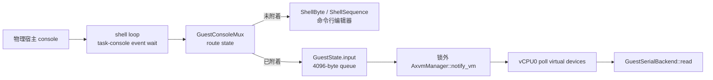
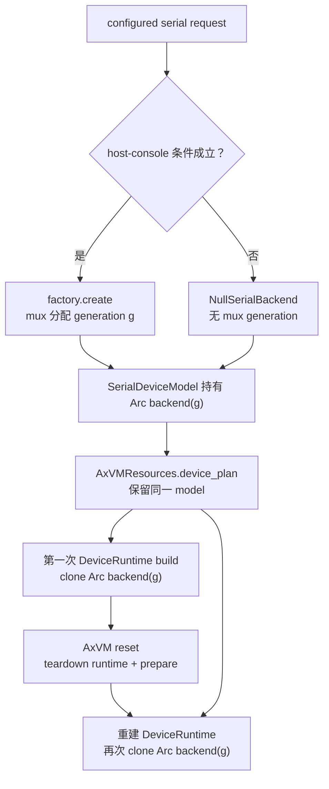
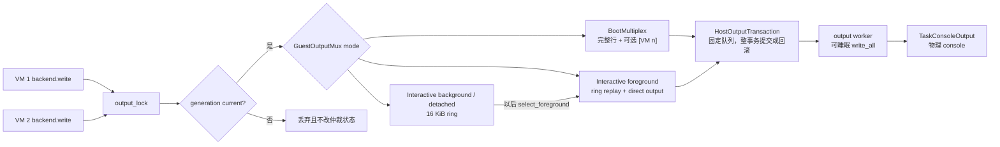

# Axvisor 客户机控制台架构

Axvisor 只有一个物理宿主控制台，但管理 shell 和多台客户机都需要收发字符。这个共享边界由 Axvisor 应用层的 `GuestConsoleMux` 管理：它是物理宿主输入的唯一读取者，决定当前前台，把输入送进对应 VM 的有界队列，并在多个客户机写同一个物理终端时完成输出仲裁。可选的 `browser-console` 传输还可以把管理 shell 和启动时成功注册的最多三个 VM 映射到独立 WebSocket 字节流，而不改变物理 UART 前台。虚拟 UART 只通过 `SerialBackend` 读写字节，不拥有前台、快捷键或宿主终端策略。

本文说明应用层的输入 ownership、前台状态、backend generation 有效性、输出模式和 VM 生命周期接入。UART 寄存器、FIFO、IRQ endpoint 与 vCPU poll 的完整语义见[设备运行时与中断架构](./device-runtime.md#5-串口完整路径)。

## 1. 模块与职责

控制台代码是 VM manager、shell、设备配置和虚拟串口之间的应用层适配器。

| 位置或对象 | 主要职责 | 所在阶段 |
| --- | --- | --- |
| `guest_console::GuestConsoleMux` | 全局入口；组合输入路由、前台切换、generation 校验和输出仲裁 | Axvisor 全生命周期 |
| `ConsoleCore` / `ConsoleState` / `GuestState` | 保存每 VM 当前 backend generation、4096 字节输入队列、运行集合、前台、上次前台与快捷键前缀状态 | 输入、输出和 lifecycle 更新 |
| `GuestSerialBackendFactory` / `GuestSerialBackend` | factory 为一个 host-console serial request 创建带 `(VMId, BackendGeneration)` 身份的 backend；backend 把设备层字节调用转入 mux | configured node 创建；UART runtime 读写 |
| `GuestOutputMux` | 在 `BootMultiplex` 与 `Interactive` 间切换，补齐物理行，维护每 VM 16 KiB 环形输出，并生成回放 | 客户机输出与前台变化 |
| `guest_console/host.rs` | 在 vCPU 启动前取得唯一的 task-console RX、日志订阅与 output；output 移交给专用任务，其他路径只向固定队列提交事务 | Axvisor 初始化与 shell 主循环 |
| `network_console` | 私有保存启动快照、四条固定容量通道、独占网页会话和 Axvisor 网页行编辑；不提供 raw TCP listener | `browser-console` 功能启用时 |
| `shell/mod.rs` | 作为输入事件循环的唯一 owner，消费 `ConsoleInputEvent`，调用 `activate()`，每轮 reconcile VM 状态 | 管理 shell |
| `shell/command/vm.rs` | `vm start --console`、`vm console` 以及 start/stop/reset/resume/delete 的 mux lifecycle 调用 | 管理命令 |
| `AxvmManager` 接入 | 提供 VM registry/status，输入入队后唤醒 VM；实际设备 poll 由 vCPU0 执行 | VM lifecycle 与运行期 |

`GuestConsoleMux` 持有一个共享的 `ConsoleCore`。`ConsoleCore` 有两把不可睡眠的
`NoPreemptMutex`：`state` 保护以上全部可变状态，`output_lock` 串行化输出仲裁以及 backend
replacement/invalidation。客户机输出路径的固定顺序是 `output_lock` → host transport queue →
`state`；它只格式化并提交一个固定容量事务，不触碰物理 UART。其他同时使用两把 mux 锁的
路径仍按 `output_lock` → `state` 加锁，禁止反向获取。网络分支不同时持有这两把锁：它先在
`state` 下校验 generation，释放后才向对应的固定网络队列复制原始字节。

## 2. 初始化与宿主输入 ownership

`main.rs` 在打印 Axvisor banner、发布普通启动日志和启动默认 VM 的 vCPU task 之前调用
`configure_host_console()`。该函数从
`ax-runtime::console` 取得唯一的 `TaskConsoleInput`、`TaskConsoleOutput` 和可选的
`ConsoleLogSubscription`。配置过程由可睡眠的一次性锁串行化；只有 output worker 创建成功
后才发布 `HostConsole`，因此不会暴露半初始化 capability，也不会并发创建两个 worker。
所有读写入口先通过 `OnceLock::get()` 做非阻塞 ready 检查；发布前不会等待配置锁或进入
可睡眠 output，提前到达的内部事件也不会触发未初始化 panic。
runtime UART 已接管时，RX IRQ 与 owner worker 发布输入并唤醒 shell；没有匹配的 runtime
UART 时，同一 capability 内部使用 RawHal。Axvisor 不维护另一条 platform reader 或亲和性状态。



`read_host_byte()` 每次从唯一的 `TaskConsoleInput` capability 消费至多一个有效字节；RX
错误项保留在公共 runtime 层并在这里跳过。输入与日志都暂时为空时，shell 调用
`wait_event()`，由 RX worker 或完整日志记录发布直接唤醒，不进行 `yield_now()` 忙轮询。模块
契约明确禁止其他 Axvisor 组件再次取得输入 capability，否则初始化会得到明确错误，而不会
形成两个 reader 拆分输入流。

日志订阅只在完整 record 边界切换。shell 未附着 guest 时，mux 先清除当前编辑行、输出宿主
日志，再重画 prompt、内容和光标；guest 位于前台时，宿主日志按完整记录进入 2 MiB 有界
backlog，返回管理 shell 后再回放。底层 64 条 record 队列和 mux backlog 的溢出都以摘要
报告，不把宿主日志字节注入 guest 虚拟 UART。

## 3. 输入状态机与前台选择

`ConsoleState.attached` 为 `None` 时，普通字节返回 shell；为 `Some(vm_id)` 时，普通字节写入该 VM 的输入队列。`Ctrl+X`（`0x18`）只设置 `shortcut_prefix_pending`，等下一个字节再决定动作。

| 当前状态与输入 | 状态变化 | 字节去向 |
| --- | --- | --- |
| shell + 普通字节 | 保持 shell | `ShellByte(byte)` |
| shell + `Ctrl+X` 后跟未知字节 | 保持 shell | `ShellSequence(Ctrl+X, byte)`，由 shell 按原顺序消费 |
| attached + 普通字节 | 保持当前前台，并进入 interactive output | 当前 VM 队列 |
| `Ctrl+X h` | 清除 `attached` 和前缀状态 | 返回 shell；不把快捷键送给客户机 |
| `Ctrl+X [` | 选择前一个 running VM | 新前台；按 VM ID 向前环绕 |
| `Ctrl+X ]` | 选择后一个 running VM | 新前台；按 VM ID 向后环绕 |
| `Ctrl+X Ctrl+X` | 前台不变 | 向当前 VM 发送一个 `Ctrl+X`；在 shell 中返回一个 `ShellByte(Ctrl+X)` |
| `Ctrl+X` 后跟其他字节 | 前台不变 | 向当前 VM 原序发送两个字节；在 shell 中返回 `ShellSequence` |

`running` 是按 VM ID 排序的 `BTreeSet`。启动期 `attach_default()` 选择最小 ID；快捷键切换以当前 `attached` 为锚，没有当前前台时以 `last_attached` 为锚，并在集合首尾环绕。两者都不存在时，`[` 从最大 ID 开始、`]` 从最小 ID 开始。集合为空则返回 `NoRunningGuest`，由 shell 打印诊断并重绘当前命令行。

### 3.1 有界输入与唤醒

每个 `GuestState.input` 最多保存 4096 字节。一次路由只写剩余容量，超出部分从本次输入尾部丢弃；已有队列内容不会被淘汰，调用者不阻塞，也不会把溢出字节改投给 shell。第一次溢出发布一条完整宿主 warning，guest 读出至少一个字节后才允许报告下一次溢出，避免静默丢失和 warning flood。backend 的 `read()` 按调用方 buffer 大小从队首取出字节。

`route_host_byte()` 在持有 mux 锁时只完成状态修改和入队，把待唤醒的 VM ID 放进 `RoutedInput`。公共入口释放 `state` 和 `output_lock` 后才调用 `AxvmManager::notify_vm()`；唤醒失败只记录 warning，已入队字节仍保留。这个锁外调用避免 mux 锁跨入 VM manager 和 scheduler。

`route_network_input(vm_id, bytes)` 复用同一有界队列和锁外唤醒，但它先要求目标
VM 仍在 running 集合且存在当前 backend generation。该入口按 VM ID 直接路由，
不取得物理 `TaskConsoleInput`、不解析 `Ctrl+X` 快捷键，也不改变 `attached`。

### 3.2 命令附着与 foreground 激活

`vm console <VM_ID>` 和 `vm start --console <VM_ID>` 最终都调用 `guest_console::attach()`。它先从 manager 查找 VM，再要求 `VmStatus::Running`，随后把 VM 记入 running 集合并设置 `attached`；不存在或非 Running 都返回明确错误，不创建悬空前台。

命令先打印“已附着”提示，再调用 `activate(vm_id)`。`activate()` 只有在该 VM 仍是当前前台时才把输出切到 `Interactive { foreground: Some(vm_id) }` 并回放缓存，因此 shell 提示与客户机历史输出不会颠倒。快捷键切换也由 shell 收到 `Attached` 事件、打印提示后调用同一入口。

## 4. Backend generation 的创建与有效性

generation 用来拒绝仍持有旧 backend Arc 的设备实例。它的数值和“哪个 generation 当前有效”都属于 mux，不属于 UART、device graph 或 VM manager。

### 4.1 Factory 何时创建 generation

Axvisor 在 `AxVMConfigParams` 中为每台 VM 注入一个 `GuestSerialBackendFactory`，但持有 factory 不等于已经分配 generation。configured serial request 转成 `DeviceNodeSpec` 时，`SerialDeviceModel` 只在以下两种情况调用 factory：

1. request 显式设置 `backend = { type = "host-console" }`；
2. request 没有 `backend`，并且该实例的 `host_console_by_default` 为 `true`。默认 `console0` 使用这条规则。

显式 `null` 不调用 factory；额外普通串口没有 backend 且 `host_console_by_default == false` 时也直接使用 `NullSerialBackend`，不会产生 mux generation。配置装配还拒绝一台 VM 拥有多个 host-console serial owner。

factory 调用 `ConsoleCore::create_serial_backend()` 时，在 `output_lock` → `state` 下递增 `next_backend_generation`，用新的 `GuestState` 替换该 VM 的旧状态，并重置其 output state。新 backend 和 `GuestState.backend_generation` 同时记录该值，因此同 VM 的下一次 factory 创建会立即使前一个 backend stale。

### 4.2 Reset 复用同一 generation

reset 是最容易误判 generation 语义的路径，因为它重建 runtime 却不重新走配置。下图从 configured request 出发追踪 backend `Arc` 的传递：factory 只在 request 转成 `DeviceNodeSpec` 时调用一次，之后 model、device plan 和两次 runtime 构建共享同一个 `Arc`。



factory 返回的 `Arc<dyn SerialBackend>` 被 `SerialDeviceModel` 持有；model 又保存在 `AxVMResources` 的不可变 device plan 中。`SerialDeviceModel::build()` 每次只把这个 Arc clone 给新 UART runtime。`AxVM::reset()` 会停止旧 runtime、重置 transient resources、再从同一 device plan prepare，因此 reset 前后的 UART 使用同一个 backend Arc 和同一个 generation。reset 命令成功后调用 `mark_running()`，不会分配新 generation，也不会恢复一个此前已被显式清除的 generation。

只有重新走 configured request → `DeviceNodeSpec` 并再次调用 factory，才会为该 VM 创建新 generation。不能把“runtime rebuild”或“reset”泛化成 generation replacement。

### 4.3 Stale 过滤与显式失效

backend 的读、写都带创建时的 `(vm_id, generation)`：

- `read_guest_input()` 只在 `GuestState.backend_generation == generation` 时取队列，否则返回 0；
- `format_guest_output()` 在修改 `GuestOutputMux` 之前做相同校验，stale 写返回 `None`，不会改变 pending、owner、mode 或物理行状态；
- `mark_stopped(vm_id)` 显式把 generation 置空、清输入、清该 VM 输出，并从 running 移除；
- `remove(vm_id)` 删除整个 `GuestState`、running/last-attached 和输出状态。

设备 runtime 的底层 stop、drop、reset 或 manager remove 不会自动调用这些应用接口。下一节列出了 Axvisor 应用层的实际调用路径。

## 5. VM 生命周期接入

控制台状态由命令路径主动更新，再由 shell 周期性对账；它不随 `VmStatus` 自动同步。

| Axvisor 路径 | manager 操作成功后的 mux 调用 | generation / 输出 / foreground 结果 |
| --- | --- | --- |
| 默认自动启动 | `launch_default_vms()` 返回成功 ID，随后 `attach_default(started_vms)` | 重建 running 集合，进入 `BootMultiplex`，附着最小 ID 并请求其下一条完整行优先 |
| `vm start` | `mark_running(vm_id)` | 保留现有 generation；加入 running，不自动改变 foreground |
| `vm start --console` | start 的 `mark_running`，再 `attach()`、打印提示、`activate()` | 切到目标并进入 Interactive，回放其 ring |
| `vm console` | `attach()` 内部在 Running 检查后调用 `mark_running`，随后命令调用 `activate()` | 不改 generation；切 foreground 并回放 |
| `vm stop` | shutdown request 成功后立即 `mark_stopped(vm_id)` | 请求发出即清 generation、输入和输出；若是前台则转为无 foreground，不等待最终 `Stopped` |
| `vm reset` | reset 完成且新 runtime 已 Running 后 `mark_running(vm_id)` | device plan 复用原 backend；generation 不变。该命令没有先调用 `mark_stopped` |
| `vm resume` | resume 成功后 `mark_running(vm_id)` | 加入 running，generation 与 foreground 不变 |
| `vm delete` | manager registry 成功移除后 `remove(vm_id)`，再调用 `vm.destroy()` | 删除所有 mux state；若是前台则返回 shell。destroy 失败不会恢复已删状态 |
| guest 自行退出、deferred reset、HTTP 等非 shell 状态变化 | 没有直接 mux lifecycle hook；shell 循环调用 `reconcile_vm_states()` | 以 registry 中实际 `Running` 集合修正 running、输出集合和 foreground |

`reconcile_vm_states()` 每轮读取 manager registry，只保留状态恰为 `Running` 的 ID。若当前前台不再运行，`set_running()` 清 `attached` 和快捷键前缀，调用 `buffer_all()` 补齐可能未完成的宿主物理行；shell 随后打印“VM stopped; returning to the management shell”并重绘提示符。非前台 VM 离开 Running 时，其 output ring 也由 `reconcile_running()` 丢弃。

reconcile 不是 `mark_stopped()` 的别名：它不会清 `GuestState.backend_generation` 或输入队列，也不会删除 `GuestState`。因此只有明确经过 shell stop/delete 路径时，才能声称 generation 被 `mark_stopped`/`remove` 失效；其他路径目前主要依赖 VM 不再运行来停止设备访问，并由 shell 对账前台显示。

## 6. 输出模式与行级仲裁

客户机 TX 由 `GuestSerialBackend::write()` 同步进入 mux，但该回调可能位于 vCPU 固定且禁止抢占
的区域，不能分配、睡眠或等待物理 UART。`output_lock` 先串行化 backend writer，随后在固定
64 KiB host transport 队列中开启事务，最后取得 `state` 完成 generation 校验和
`GuestOutputMux` 流式格式化。整个事务完整入队后才唤醒专用 output worker；若空间不足，回滚
本事务的全部分片并累计丢弃摘要，已排队事务不受影响。



### 6.1 `BootMultiplex`

启动期需要同时观察多个 VM。只有一个 running VM 时，pending 字节立即输出且不加前缀。多个 VM running 时，mux 等某个 VM 的 pending 中出现 `\n`，再一次取出一条完整逻辑行并加一个 `[VM n] ` 前缀；同一行被多次 backend write 分片时仍只加一次前缀。未结束片段留在该 VM 的 ring，不与另一 VM 的行拼接。

`attach_default()` 会为默认前台设置 preemption：该 VM 下一次形成完整行时优先取得物理行。若另一个 owner 已在宿主上留下未结束物理行，切 owner 前先输出一个 `\n`，再打印新行及前缀。

### 6.2 `Interactive`

`activate()` 或附着后的第一次普通输入会选择 foreground 并进入 Interactive。前台写先回放它在 ring 中的内容，再直接输出当前 bytes；后台 VM 只追加 ring，不写宿主。`Ctrl+X h`、前台 stop/delete/reconcile 会调用 `buffer_all()`，把 mode 设为 `Interactive { foreground: None }`，此后所有 guest 都只缓存。

每 VM ring 上限是 16 KiB。它在 backend 注册的任务上下文中一次预分配；vCPU 热路径满后只执行 pop/push，不扩容。继续追加会从头淘汰最旧字节并累计丢失数，因此保留最新日志并限制内存。下次形成可输出的 boot 行或切到该 VM 时，mux 先输出 `[Axvisor VM n console dropped N buffered bytes]` 摘要，再回放保留内容。`select_foreground()` 在同一个 `output_lock` 临界区内 drain ring 后接入直写；并发 writer 必须等回放完成，不能插到回放中间。ring 保存原始客户机字节，`[VM n]` 只在 BootMultiplex 输出完整行时临时生成，不会回流到客户机输入。

### 6.3 物理行完成

`physical_line_open` 和 `owner` 描述宿主终端当前未以换行结束的输出。以下转换会在 owner 不兼容时先补一个 `\n`：BootMultiplex 从一个 VM 的未结束片段切到另一 VM 的完整行、切换 interactive foreground、detach/stop/delete 返回 shell。这个补行是宿主显示边界，不写入任何 VM ring。

## 7. 并发边界与当前限制

控制台的并发正确性依赖几个显式约束：宿主输入单 reader、双锁固定顺序、vCPU0 独占设备 poll。下表逐条列出这些边界的当前保证与已知限制；SMP 唤醒限制是当前设计的已知约束而非实现缺陷，演进方向在本节末尾说明。

| 边界 | 当前保证 | 限制 |
| --- | --- | --- |
| 宿主 RX | shell loop 独占 `TaskConsoleInput`；runtime RX IRQ/worker 或 RawHal fallback 保持单 owner | capability 已被取得或 runtime 停止时，初始化/等待返回明确错误 |
| 宿主日志 | 唯一 `ConsoleLogSubscription` 按完整 record 投递；编辑行清除后重画，guest 前台期间有界缓存 | 两级有界队列溢出时丢弃并报告摘要，panic/emergency 不保证重画 |
| mux 锁 | 双锁路径固定 `output_lock` → `state`；vCPU 回调使用 `NoPreemptMutex`，不进入可睡眠 API | hard IRQ 不进入 mux；新增路径必须保持同一锁顺序 |
| VM notify | 入队后锁外 notify，不把 mux 锁带进 manager/scheduler | notify 失败只告警，字节等后续 poll |
| 虚拟设备 poll | 只有 vCPU0 调用 `poll_vm_devices()`，它是串口 backend 的唯一 poll owner | secondary vCPU 不消费串口输入 |
| 单 vCPU guest | `notify_vm()` 设置 Release 发布的 pending device-poll flag 并唤醒；vCPU0 用 Acquire/AcqRel 消费 | flag 只表达“需要 poll”，不计数；队列才保存字节 |
| SMP guest | 当前沿用共享 wait queue 的 `notify_one()`，不发布 shared poll flag | 无法定向唤醒 vCPU0，可能只唤醒 secondary；空闲 SMP guest 的输入会延迟到 vCPU0 下次 VM-exit 或其他唤醒 |
| 输出并发 | `output_lock` 覆盖 format 与 ring replay；固定队列保持事务边界，只有 output worker 等待 UART | transport 满时丢弃当前完整事务；per-guest ring 淘汰最旧字节；两者均报告摘要且不阻塞 vCPU writer |
| 网络输出 | 每端点独立 64 KiB 固定队列；有连接时 vCPU 只复制原始字节并通过 `IrqNotify` 唤醒对应网页输出任务 | 无连接时不保留历史也不获取网络队列锁；慢客户端只影响自身通道并最终触发该端点队列丢弃摘要 |

`browser-console` 在默认 VM 初始化后只获取一次运行时 VM 列表并按 VM ID 排序。网页通过 `/api/consoles` 获取这个启动快照，
使用 `/ws/axvisor` 和 `/ws/vm-<真实 ID>` 路由，并直接显示客户机 TOML 的 `base.name`。
零个客户机时只有管理窗格，一个、两个或三个客户机时分别生成两个、三个或四个窗格；
运行中创建、删除 VM 不重建网络通道。超过三个启动客户机时，只为按 VM ID 排序后的前三个
客户机创建网络通道，其余客户机仍正常启动并保留物理 UART 路径。
这些 WebSocket 是无 TLS、无认证的原始控制台字节流，每端点同时只接受一个会话，只能用在受信任的管理网络。网络 shell 不给客户机提供 IP 栈；连接终止在 Axvisor 现有的 virtual-UART backend。

启用 `browser-console` 后，Axvisor 会在配置的 HTTP 地址直接发布一个自适应页面。
浏览器通过同源 WebSocket 取得 management/guest 独占会话、固定队列及溢出统计；
该 feature 不隐式启用 `http-axum` VM 管理 API，也没有 raw TCP 控制台、per-lane dispatcher
或 Tokio `mpsc` 中转。命令执行主机不参与运行时链路。页面的
HTML、CSS 和 JavaScript 均编译进 Axvisor，不依赖 GitHub、CDN 或开发板根文件系统；
不存在需要命令主机持续运行的网页代理路径。

SMP 限制不能通过让任意 vCPU poll 来规避，那会破坏设备 poll 的 single-owner 假设。正确演进方向是为 vCPU0 提供可定向的 wait/wake 路径，再为 SMP 发布 pending poll 请求。

## 8. 故障定位

控制台问题通常表现为丢字符、无响应或输出交错，多数可以从 mux 的状态直接定位。下表把每种现象映射到应首先检查的状态，第三列给出对应的机制事实。

| 现象 | 首先检查 | 对应事实 |
| --- | --- | --- |
| shell 和客户机都偶发丢字符 | `TaskConsoleInput` 是否被第二次取得；runtime RX error/overrun 统计是否增长 | 当前契约是 capability single-owner；RX IRQ 只采样并由 owner worker 发布 |
| 输入空闲时 shell 占用 CPU | `wait_for_host_event()` 是否走 `wait_event()` / `wait_readable()` | shell 不应以 `yield_now()` 轮询 task-console |
| 宿主日志插入正在编辑的命令 | 是否取得唯一日志订阅；记录是否经 `route_host_log()`；drop 摘要是否增长 | shell 模式必须清行、输出完整记录并重画；guest 前台模式必须缓存而非直写 |
| `vm console` 报错 | VM ID 是否存在，状态是否严格为 `Running` | attach 不接受 Ready、Paused、Stopping 或 Stopped |
| 客户机不立即收到输入 | 输入队列是否满及 overflow warning；`notify_vm` warning；guest 是否 SMP 且 vCPU0 空闲 | 4096 字节尾部丢弃并按 drain 周期报告一次；SMP notify 不能定向 vCPU0 |
| reset 后控制台永久无输入输出 | reset 前是否调用过 `mark_stopped()`；是否误以为 reset 会创建 backend | reset clone 同一 backend Arc，不会发布新 generation；已失效 generation 不会自动复活 |
| replace/stop 后仍看到 late output | 应用路径是否真的调用 `mark_stopped()`/`remove()`；写入 backend generation 是否仍 current | 底层 stop/remove 不自动接入 mux；stale 写应在修改 output 前被拒绝 |
| 多 VM 启动日志看似停住 | 对应 VM 是否只写了未结束片段 | BootMultiplex 在多 VM 时等完整 `\n` 行；切换 owner 才做物理补行 |
| 切换前台后少了早期日志 | 该 VM ring 是否超过 16 KiB，是否出现 dropped 摘要，或 lifecycle/reconcile 是否 reset/discard 了 output state | ring 淘汰最旧字节并在回放前报告；stop/remove/replacement/reconcile 会清理相应 output state |
| detach 后 shell prompt 接在 guest prompt 后 | 检查 `buffer_all()` 是否返回补行、调用方是否写出其结果 | `physical_line_open` 为真时必须先写 `\n` |

## 9. 测试覆盖与验证命令

`os/axvisor/src/guest_console/mux/tests.rs` 的测试覆盖范围应按实际断言理解：

- `Ctrl+X h` detach，`[`/`]` 环绕切换，未知后缀与重复 `Ctrl+X` 的原序路由；
- 最小 running VM 默认附着、输入只到前台、前台从 running 集合消失后返回 shell；
- 输入队列只在每个 drain 周期报告一次 overflow；
- `mark_stopped`、`remove` 和 backend replacement 的 generation 失效，以及 stale writer 不改变 output snapshot；
- BootMultiplex 多 VM 行前缀、默认附着和输入触发的抢占、命令 echo 后的前台结果；
- 第一次前台输入进入 Interactive、切换时回放后台 ring、detach 后全部缓存；
- foreground 或 background 未结束物理行在切换时正确补行。
- VM 2 网络输入不改变物理 VM 1 foreground，并拒绝 stopped 或 stale backend；
- 有连接的 VM 输出只进入对应网络通道，无连接时跳过网络输出路径；
- 启动布局按 VM ID 排序、最多选择三个客户机并使用配置名称。

`mux/output.rs` 另有 16 个内部测试，直接覆盖完整行选择、分片只加一次前缀、pending/total 容量上界、超大单次 write、16 KiB 淘汰与回放、Interactive 前台分片、reset/reconcile 后物理分隔符。`console_mux/transport.rs` 的 4 个测试验证 FIFO、队列满、超大事务和分块溢出时的整事务回滚。顶层 mux 测试还覆盖宿主完整日志隔离、guest 前台缓存与返回 shell 后回放；`axvm::runtime` 与 vCPU runtime 测试单 vCPU poll flag 和 SMP 不发布 shared flag 的差异。

现有测试仍没有直接断言 shell 命令解析。以上测试也不是完整的真实 UART、VM lifecycle 和终端端到端覆盖，不能把顶层 mux 测试泛化为所有边界都已验证。

目标环境中的建议命令如下：

```bash
cargo xtask ktest qemu -p axvisor --test axtest --arch aarch64
cargo xtask axvisor test qemu --arch aarch64 --test-case atomic-output
cargo xtask axvisor test qemu --arch aarch64 --test-group normal --test-case qemu-console-interleave/interleave
cargo xtask axvisor test qemu --arch x86_64 --test-group normal --test-case direct-acpi-vmx
```

第一条在受支持的 aarch64 target 上运行带 `axtest` 标记的 Axvisor 控制台测试。
`atomic-output` 先在禁止抢占区填满 runtime ingress，再通过固定 host transport 提交成功标记，
直接验证 atomic producer 不进入可睡眠 output；真实 `GuestSerialBackend` 的 generation 与格式化
边界由 mux/axtest 覆盖。`qemu-console-interleave` 经公共任务态 output 固定构造 `rm` 片段与
以 `:` 开头的宿主日志，验证 task output 与完整日志不会拼成失败标记。最后一条使用包含一台 x86 Linux
guest 的 `direct-acpi-vmx` 配置：guest 通过 `console=ttyS0` 输出成功标记，因此可观察 VM 启动、
虚拟串口 TX 和宿主控制台输出组合路径；它不验证输入快捷键、foreground 切换或 4096 字节
队列边界。AMD/SVM 宿主上的对应 case 是 `direct-acpi-svm`。VMX/SVM 用例依赖 KVM 和相应的
CPU 能力。
