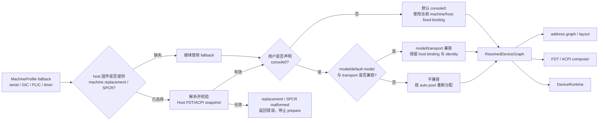
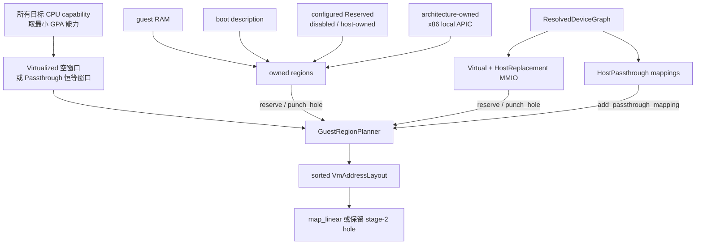

# Axvisor Machine 与资源规划架构

Machine 层回答的是“这台客户机是什么平台”：串口、中断控制器和架构定时器采用什么模型，固定资源位于哪里，哪些地址只能由架构或 host replacement 占用，以及最终应向客户机发布哪种固件描述。用户只表达设备需求，不在 TOML 中重复这些平台数字。配置边界见[客户机配置架构](./guest-configuration.md)，设备 model、资源 slot 和运行时生命周期见[模拟设备框架](./emulated-devices.md)与[设备运行时与中断架构](./device-runtime.md)。

## 1. 代码组成与阶段

Machine 事实、设备计划、地址布局和固件 composer 分处不同模块，但都消费同一份已解析资源，不各自重新分配地址或 IRQ。

| 位置 | 主要类型或入口 | 阶段与职责 |
| --- | --- | --- |
| `virtualization/axvm/src/machine/mod.rs` | `MachineProfile`、`machine_profile_for()`、`current_machine_profile()` | 按架构和 vCPU 数生成 fallback 平台事实 |
| `virtualization/axvm/src/machine/serial.rs` | `GuestSerialProfile`、`HostSerialSnapshot`、`GuestSerialFirmwareIdentity`、`ResolvedSerialDevice` | 表达串口模型/传输；保存 host FDT/ACPI identity；从 resolved graph 取最终串口 DTO |
| `virtualization/axvm/src/machine/gic.rs` | `GuestGicProfile`、`GuestGicCpuRegion`、`GuestItsProfile` | 保存并校验 GICv2/v3、Redistributor 和 ITS 几何 |
| `virtualization/axvm/src/machine/plic.rs` | `GuestPlicProfile` | 保存 PLIC 固件 identity 和 context 窗口 |
| `virtualization/axvm/src/machine/timer.rs` | `GuestTimerProfile` | 保存 Arm architectural timer 的 FDT 节点、PPI specifier 与可选频率 |
| `virtualization/axvm/src/boot/fdt/device.rs` | `ResolvedFdtDevice`、`resolve_fdt_devices()` | 从 frozen `DeviceFirmwareSpec` 与 resolved slot 生成架构中立的普通 FDT 设备 DTO |
| `virtualization/axvm/src/vm/prepare/device_plan/mod.rs` | `VmDevicePlan`、`ArchitectureVmPlan`、`SimpleVmPlan` | 合成架构、用户和 host 节点，一次性 resolve；架构 plan 持有不可变图 |
| `virtualization/axvm/src/arch/aarch64/vm_plan.rs` | `Aarch64VmPlan`、`Aarch64FirmwarePlan` | 同时冻结 VGIC、设备图和 AArch64 FDT 输入 |
| `virtualization/axvm/src/arch/*/resource_pools.rs` | `ResourcePools` 构造函数 | 声明各架构自动 MMIO/PIO/wired/MSI 池；x86、AArch64、RISC-V 另预留已分配的物理 IRQ |
| `virtualization/axvm/src/layout.rs` | `GuestRegionPlanner`、`VmAddressLayout`、`build_address_layout()` | 将 owned region、模拟 MMIO 和 passthrough 归一化成最终 stage-2 布局 |
| `virtualization/axvm/src/vm/prepare/address_space.rs` | `prepare_guest_address_space()` | 收集 RAM、boot description、Reserved 和 resolved graph 资源并安装映射 |
| `virtualization/axvm/src/boot/fdt/core/create.rs` | `GuestFdtRuntimePatch`、`patch_guest_fdt_for_runtime()` | AArch64/RISC-V FDT composer：重建内存、控制器、普通配置设备、timer 和 serial 节点 |
| `virtualization/axvm/src/arch/x86_64/boot/acpi/*` | `X86FirmwarePlan`、direct/fw_cfg ACPI builders | 从 resolved graph 生成 x86 ACPI 的直接启动镜像和 fw_cfg blobs |
| `virtualization/axvm/src/arch/loongarch64/boot/{probe,fdt,acpi}/*` | `GuestPlatform`、host ACPI probe、FDT/ACPI composer | 归一化 LoongArch 平台快照，生成 UEFI FDT 与 fw_cfg ACPI blobs |

### 1.1 MachineProfile 拥有什么

`MachineProfile` 的字段是 `serial`、`serial_fdt_interrupt`、可选 `timer`、`gic`、`plic` 和 `default_passthrough_device_path`。它没有 IVC 字段，也不拥有通用设备 model 的 `DeviceFirmwareSpec` 或 `DeviceRuntime`。

设备图则保存每个节点的 kind、依赖、firmware binding 和已解析资源。`VmDevicePlan::build()` 先声明节点和固定需求，再加入 host passthrough，最后一次性 resolve；固件 composer 与 runtime 都读取 `VmDevicePlan::graph()`，不会各自再做一次资源选择。`DeviceFirmwareSpec` 如何用 slot 把 model 元数据绑定到 resolved 资源，以及 `DeviceRuntime` 如何消费 claim，见[模拟设备框架](./emulated-devices.md)。

### 1.2 profile 的消费点

`current_machine_profile()` 不只在 `AxVMConfig::new()` 中使用。除了初始化 config，它还为 app/config 侧查询、FDT host interrupt resolution、串口 fallback 和 FDT composer 的默认中断编码提供当前架构事实；`os/axvisor` 的 `build_axvm_config()` 在转换配置时也会先调用它，以取得默认串口和 `default_passthrough_device_path`。因此 `MachineProfile` 是平台 fallback 的入口，不是仅在构造函数中被拆散后就失去作用的临时值。

## 2. Machine、host snapshot 与用户 console0

来源优先级固定为：machine fallback → 有效 host FDT machine-replacement 或 ACPI SPCR snapshot → 用户 `console0` 请求。对这些会替换 machine 资源的输入，fallback 只适用于没有 snapshot 的情况，不用于掩盖已经选中但解析失败的固件对象。LoongArch 用于补充 PCI、中断和固件设备的 host ACPI 平台拓扑 probe 是另一条 best-effort 路径，不经过下图的 fail-closed 分支。



### 2.1 FDT 与 ACPI snapshot

AArch64/RISC-V 在 `prepare_dtb_guest()` 开始时调用 `resolve_machine_resources_from_host()`：

- host FDT 字节不存在时直接保留 fallback；整个 FDT 无法解析时返回 `InvalidData`。
- `host_selected_serial()` 只在 `/chosen/stdout-path` 确实选择 UART 时生成 `HostSerialSnapshot`。没有选择时返回 `None`；路径、`reg`、interrupt、clock、型号或传输已经出现但畸形/不支持时返回错误。
- `host_gic_profile()`、`host_plic_profile()` 没有发现相应控制器时保留 fallback；发现后必须通过几何和 firmware identity 校验。
- AArch64 fallback 含 timer，因此 host FDT 路径要求得到有效 `arm,armv8-timer`；节点缺失或 PPI specifier 畸形是错误，不退回 QEMU 默认 PPI。

x86（启用 `host-fs` 时）和 LoongArch 从 host ACPI SPCR 取得控制台。没有 SPCR 时保留 fallback；SPCR 已选择串口但 range、address space、access size、IRQ 或宽度无法表示时返回配置错误。有效 snapshot 保存寄存器模型、地址、IRQ、时钟和可用的 ACPI namespace identity。

### 2.2 console0 替换规则

用户不声明 `console0` 时，`default_serial_intent()` 根据当前 config 中的 machine/host 结果生成默认节点。用户声明同 ID 时是完整替换 request，不做逐字段 TOML merge：

```toml
[[devices.virtual]]
id = "console0"
model = "pl011-mmio"
clock_hz = 48000000
backend = { type = "host-console" }

[[devices.virtual]]
id = "serial1"
model = "uart16550-mmio"
backend = { type = "null" }
```

若用户 model/transport 与当前 machine/host 串口兼容，`console0` 保留固定 MMIO/PIO、wired IRQ 和 FDT/ACPI identity，只替换 model options；不兼容时丢弃这些 fixed bindings 和 identity，成为从自动池分配的普通虚拟串口。第二个串口始终自动分配。每台 VM 最多一个 `host-console` backend owner，重复 owner 在图构建前报配置错误。

## 3. 四架构平台参考

下表中的范围均为左闭右开。它区分三类数字：Machine fallback、架构创建的固定节点、以及只供普通设备自动分配的池。fixed 资源会先占用池中相交的位置，auto 分配按地址或输入号从低到高进行。

| 架构 | fallback 串口 | 中断控制器 | timer | 普通配置设备固件 | 自动资源池 | `ARCH_OWNED_REGIONS` | 最终固件格式 |
| --- | --- | --- | --- | --- | --- | --- | --- |
| x86_64 | 16550 PIO `0x3f8..0x400`，GSI 4，1.8432 MHz | virtual IOAPIC MMIO `0xfec0_0000..0xfec0_1000`，另有 vPIC/vLAPIC | PIT + ACPI PM timer；无 `GuestTimerProfile` | 通用 ACPI resolver；缺少 ACPI contribution 即拒绝 VM | MMIO `0x8000_0000..0xc000_0000`；PIO `0x1000..0x5000`；GSI `5..16` | local APIC `0xfee0_0000..0xfee0_1000` | ACPI：direct image 与 fw_cfg table-loader blobs；direct image 位于 `0xe0000..0x100000` |
| AArch64 | PL011 MMIO `0x0900_0000..0x0900_1000`，SPI INTID 33，24 MHz | fallback GICv3：GICD `0x0800_0000..0x0801_0000`；GICR 从 `0x080a_0000` 起，每 vCPU `0x2_0000`；host 可替换为 GICv2/v3/ITS snapshot | Arm architectural timer：PPI INTID 29/30/27/26；FDT specifier 顺序 secure/nonsecure/virtual/hypervisor | 通用 FDT resolver；缺少 FDT contribution 即拒绝 VM | MMIO `0x0b00_0000..0x1000_0000`；SPI `32..32+spi_count`；GICv3 ITS 还提供 DeviceID/EventID `0..0x1_0000` 与 LPI `8192..lpi_limit+1` | 无 | patch 后 FDT/DTB |
| RISC-V | 16550 MMIO `0x1000_0000..0x1000_0100`，PLIC source 10，3.6864 MHz | vPLIC fallback `0x0c00_0000..0x0c60_0000`，host FDT 可替换 path/phandle/window | 架构 timer/SBI 路径；无 `GuestTimerProfile` 或 timer FDT replacement DTO | 通用 FDT resolver；缺少 FDT contribution 即拒绝 VM | MMIO `0x1100_0000..0x2000_0000`；PLIC source `1..1024` | 无 | patch 后 FDT/DTB |
| LoongArch64 | 16550 MMIO `0x1fe0_01e0..0x1fe0_02e0`，PCH-PIC line 2，100 MHz | host replacement PCH-PIC `0x1000_0000..0x1000_1000`；固件拓扑另含 CPUIC/EIOINTC/PCH-MSI | LoongArch vCPU/IOCSR timer 路径；无 `GuestTimerProfile` | 通用 FDT 与 ACPI resolver；当前平台同时发布两种接口，因此设备必须同时支持 | MMIO `0x3000_0000..0x4000_0000`；PCH-PIC input `20..32` | 无 | UEFI FDT（加载于 `0x0010_0000`）+ fw_cfg ACPI（FACS/DSDT/FADT/MADT/SRAT/SPCR/MCFG/RSDT/RSDP） |

表中的自动 wired 范围不是全部控制器容量。例如 x86 IOAPIC 有 24 个 GSI、LoongArch PCH-PIC 有 64 个 input，但 machine 只把未留给平台固定设备的子集开放给 auto。

### 3.1 profile 几何校验

machine replacement snapshot 进入 config 前必须形成能实现的客户机平台：

- GICv2 distributor 至少 `0x1000`、CPU interface 至少 `0x2000`；GICv3 distributor 至少 `0x1_0000`。
- GICv3 Redistributor stride 不小于 `0x2_0000` 且按 `0x1_0000` 对齐；所有 region 可容纳的 frame 总数不得少于 vCPU 数。GICD、GICC/GICR 和 ITS 窗口不能互相重叠。
- PLIC 按每 vCPU 两个 context 计算最小窗口：`0x20_0000 + 2 * vcpu_count * 0x1000 + 8`。
- Arm timer 必须有 4 或 5 个三 cell PPI specifier；前四项解码后必须依次等于 secure physical、non-secure physical、virtual、hypervisor INTID，可选 clock frequency 不能为 0。

### 3.2 物理 IRQ 预留

直通设备的物理 IRQ 不进入 auto pool，而是由各架构在构建 pool 时显式预留，避免自动分配占用宿主设备已经使用的中断输入。x86、RISC-V 和 AArch64 采用“同号预留”规则，LoongArch 例外：

- x86 遍历 `config.pass_through_irqs()`，以物理 IRQ source 同号的 IOAPIC GSI 调用 `reserve_wired_host_irq()`。
- RISC-V 同样遍历 `config.pass_through_irqs()`，以 source 同号的 PLIC input 预留 host IRQ route。
- AArch64 从 VGIC construction plan 的 `assigned_spis()` 取得已经分配的 SPI、host IRQ 和 trigger，再在 pool 中预留该 SPI。
- LoongArch 的 resource pool 当前不调用 `reserve_wired_host_irq()`；固定平台路由与只开放 `20..32` 的 auto PCH-PIC 子集分离，不能套用前三种“同号预留”规则。

## 4. 地址空间规划

`GuestRegionPlanner` 处理的是最终 stage-2 可见性，不是设备访问分派。`AddressSpacePolicy::Virtualized` 从空映射开始，只加入显式 passthrough；`Passthrough` 从整个可用 GPA 恒等窗口开始，再逐个打孔。这些步骤的顺序就是 `GuestRegionPlanner` 的收集顺序：先声明的区间先占用地址空间，后续与之冲突的固定资源会让 prepare 失败，而不是被自动挪动。

1. 计算 guest address-space 上限。GPA 能力来自 VM 的所有目标物理 CPU：`minimum_recorded_target_cpu_capability()` 对 `virtualization/axvm/src/percpu.rs:18-21` 发布的 `CPU_MAX_GPT_LEVELS` / `CPU_GPA_BITS` 取最小值；缺少任一目标 CPU snapshot 直接报 unsupported。x86/LoongArch 3/4 级换算为 39/48 位，RISC-V 3/4 级为 41/50 位，AArch64 由 stage-2 levels 得到 39/48 位。最终 size 是架构 `VM_ASPACE_SIZE` 与 `1 << gpa_bits` 的较小值。
2. 收集 guest RAM，标为 `Memory` owned region。
3. 收集 `boot_description.occupied_ranges()`，包括 DTB、ACPI、MP table 等已注册启动描述，标为 `BootDescription`。
4. 收集用户/host parser 写入的 configured `Reserved` 范围。
5. 加入架构拥有范围。目前只有 x86 local APIC `0xfee0_0000..0xfee0_1000`；SVM 保持 hole 供 nested page fault 模拟，VMX 可在 `map_arch_address_space()` 中安装 APIC-access backing page。
6. 从 resolved graph 收集 `Virtual` 节点的 MMIO，保留为 `EmulatedDevice`。
7. 同样收集 `HostReplacement` 的 MMIO。它们在地址布局中也是 emulated hole，但语义上保留 host firmware identity，例如 VGIC、vPLIC、PCH-PIC 或兼容的 host console replacement。
8. 加入 resolved `HostPassthroughMapping`。virtualized policy 创建显式 GPA→HPA 映射；passthrough policy 已有的同址映射不重新插入，但前述 owned region 仍保持 hole。
9. `devices.disabled`、未分配给客户机的 host-owned 节点以及 parser 排除的 provider range 不映射。FDT parser 将其 `reg`/PCI ranges 4K 对齐后写入 reserved ranges，因此在 passthrough policy 下同样打孔。
10. `finish()` 按 GPA 排序，合并相邻且 flags/kind/线性偏移一致的映射，并拒绝任何残余重叠；随后 `map_linear()` 安装最终 stage-2 mappings。未出现在 mappings 中的 owned、disabled、host-owned 或超出 GPA 能力的区间就是 stage-2 hole。

下图按输入来源归并了上述步骤：RAM、启动描述、保留区和架构范围先汇入 owned regions，resolved graph 分成 emulated 与 passthrough 两路，最终统一交给 `GuestRegionPlanner` 排序、合并并安装。



固定资源不会因冲突而被静默挪动。fixed MMIO/PIO 必须落在 allowlist 内，并且先于 auto request resolve；它与 RAM、另一个 fixed 节点或 passthrough 冲突时，VM prepare 失败。只有声明为 `Auto` 的 slot 才会改从池中寻找下一个可用位置。

## 5. 平台固件

平台 composer 读取 machine/host identity 和 resolved graph，生成客户机最终看到的描述。通用 `DeviceFirmwareSpec`、register/interrupt slot 的解析规则和常规设备固件生成不在本篇重复，见[模拟设备框架：固件生成](./emulated-devices.md#7-固件生成)。

### 5.1 AArch64 与 RISC-V FDT

共同 FDT composer 的顺序是：重建 memory nodes 和 `/chosen`，替换 machine interrupt controller，写入通用 resolved 配置设备节点，替换 architectural timer，再安装 `console0` 与额外串口。

AArch64 的 `Aarch64FirmwarePlan` 从同一 `ResolvedDeviceGraph` 固化 GIC、所有串口、普通 FDT contribution 和 timer。host GIC 节点 path/phandle、GICD/GICC/GICR/ITS 窗口和 host-selected serial identity 尽量保持；composer 删除物理实现节点后以虚拟实现重建。兼容的 `console0` 沿用原 `stdout-path`、node path/phandle、interrupt parent/specifier 和必要 clock provider identity；PL011 会生成虚拟 fixed-clock，避免把 host clock 控制硬件暴露给客户机。不兼容的 `console0` 使用新地址并建立新的 serial node、alias 和 `/chosen/stdout-path`。

RISC-V 在运行时从 graph 解析 `console0`、额外串口和普通 FDT contribution，再结合 config 中仍匹配 binding path 的 serial identity 与 PLIC profile patch FDT。PLIC host replacement 保留 node identity 和窗口；没有独立 machine timer replacement DTO。

### 5.2 x86 ACPI

`X86FirmwarePlan::from_graph()` 从 `ioapic`、`fw-cfg`、`acpi-pm-timer` 和所有 resolved serial 节点取最终资源。direct boot 在 `0xe0000..0x100000` 组成 RSDP、XSDT、FADT、FACS、DSDT、MADT 和 SPCR；firmware boot 使用相同逻辑内容生成 `etc/acpi/tables`、`etc/acpi/rsdp` 和 table-loader 命令，由 fw_cfg 完成地址重定位与 checksum。

MADT 发布 vCPU APIC IDs、local APIC 和 IOAPIC；FADT/DSDT 发布 PM timer、电源端口、PCI 和 fw_cfg；SPCR/DSDT 发布最终 `console0` 以及额外串口；通用 ACPI composer 编码普通配置设备的 `_HID`、`_UID` 与 `_CRS`。兼容 SPCR snapshot 能保留 ACPI namespace binding；不兼容用户替换没有 host identity。FDT-only 设备会在选择 x86 ACPI 时明确失败。

### 5.3 LoongArch FDT 与 ACPI

`GuestPlatform::discover()` 先调用 `resolved_fw_cfg()` 和 `resolved_serial()` 从 resolved graph 取得 `fw-cfg` 与 `console0`；graph 缺少 `fw-cfg` 会立即返回 `NotFound`，当前 discover 路径不会使用 `defaults.fw_cfg`。随后 host ACPI probe 才补充可复用的平台拓扑。这里要区分两种 ACPI 消费：创建 VM 前的 SPCR serial replacement 解析失败会返回错误；`GuestPlatformBuilder::apply_host_acpi()` 对 PCI、中断和固件设备的拓扑 probe 则是 best-effort。

`apply_host_acpi()` 保留 collector 返回 `Err` 时记录 warning 的防御分支。当前 `host_acpi_resources()` 主要把 ACPI 字段不存在解释为资源缺失：PCI 和 interrupt 缺失由 `build()` 的 defaults 补齐；firmware devices 在 collector 内以 `QemuVirtDefaults` 为基线，再按探测结果覆盖。RTC 资源查询失败由 `.ok()?` 转成“没有 RTC snapshot”，不会触发该 warning。最终 IRQ routes 按补齐后的拓扑生成（`virtualization/axvm/src/arch/loongarch64/boot/probe.rs:70-98`）。

UEFI FDT 在 `0x0010_0000` 发布 memory、CPU、CPUIC/EIOINTC/PCH-PIC/PCH-MSI、PCI、RTC、flash、GED、fw_cfg、serial 和普通配置设备；fw_cfg ACPI composer 生成 FACS、DSDT、FADT、MADT、SRAT、SPCR、MCFG、RSDT、RSDP 及普通配置设备 AML。

SPCR 与 DSDT 使用 resolved `console0` 的 MMIO、IRQ 和 clock；PIO console 在这里明确 unsupported。PCH-PIC 的 runtime 节点与固件 platform topology 必须匹配。LoongArch 的启动协议会同时构造 FDT 和 ACPI，因此 graph 中每个 `Interfaces` 设备必须同时提供两侧 contribution；例如 FDT-only 的 IVC 在这里会明确失败，而不会只发布一半平台描述。

## 6. 普通配置设备的固件边界

IVC、virtio 及后续普通配置设备都遵守同一边界：

1. `MachineProfile` 不包含某一种普通设备，也不预创建其地址或 IRQ。
2. AxVM catalog 把用户 request 变成持有 `Arc<dyn DeviceModel>` 的 graph node，并由 model 的 `requirements()` 统一解析 MMIO/PIO/IRQ。
3. node 创建时对强制实现的 `firmware()` 求值一次并冻结。它只引用命名 slot，不复制任何已分配数字。
4. `boot/fdt/device.rs` 与 `boot/acpi/device.rs` 按平台选择解析 frozen contribution；composer 匹配 typed category，不匹配 model、ID 或固定地址。
5. `DeviceFirmwareSpec::None` 表示设备无需固件节点；`Interfaces` 缺少平台选中的一侧则 VM prepare 失败，不自动回退或静默忽略。
6. IVC aperture allocator、virtio DMA/backend 和其他运行期能力属于设备自己的 model/runtime 模块；Machine 层只保证平台描述与 runtime 使用同一份 resolved graph。

## 7. 故障定位与验证

Machine 层的失败大多发生在 VM prepare 阶段，错误信息通常能直接对应一个失败边界。下表按可观察现象归类，“首要检查”列给出排查入口；表中未覆盖的运行期访问错误属于设备 runtime，见[设备运行时与中断架构](./device-runtime.md)。

| 现象 | 失败边界 | 首要检查 |
| --- | --- | --- |
| `physical device ... is a host-owned device` | FDT assignment/parser | 用户是否显式 passthrough 了 host console、GIC/PLIC/timer 或其 provider；这类对象应由 replacement 接管 |
| fixed resource conflict / outside allowlist | graph resource planner | fixed MMIO/PIO/IRQ 是否与 RAM、另一个 fixed node、replacement 或物理 IRQ reservation 重叠；fixed 不会自动搬迁 |
| GIC/PLIC/timer profile geometry 错误 | host snapshot 校验或架构 plan | Redistributor frame/stride、PLIC context window、timer PPI 次序和触发编码是否满足第 3.1 节 |
| `InvalidData` / unsupported machine replacement 或 SPCR snapshot | FDT/ACPI parser | AArch64/RISC-V replacement 或 x86/LoongArch SPCR snapshot 是“缺失”还是“已选择但畸形”；后者必须修复 firmware，不应期待 fallback |
| LoongArch 出现 host ACPI 平台拓扑 collector warning | `GuestPlatformBuilder::apply_host_acpi()` 的防御分支 | 这不是字段缺失或 RTC 查询失败的常规路径，也不是 SPCR replacement 失败；保留原始 collector 错误排查 |
| LoongArch UEFI firmware 报缺少 `fw-cfg` | `resolved_fw_cfg()` | graph 必须有 `fw-cfg` 节点及 `registers` MMIO slot；当前 discover 不用 `defaults.fw_cfg` 兜底 |
| `mmio` / `pio` / wired / MSI auto pool exhausted | `VmResourcePlanner` | 设备数、slot size/alignment 和对应架构自动池；x86/RISC-V/AArch64 还检查物理 IRQ reservation，LoongArch 检查固定路由与 `20..32` auto 子集；错误会带 namespace、requester 与 slot |
| firmware plan missing device/slot、selected interface unsupported 或 transport mismatch | FDT/ACPI composer | composer 是否在读取同一 resolved graph；model 是否声明平台选中的 FDT/ACPI contribution；`console0` binding 是否仍与 host identity 匹配；LoongArch 是否误用了 PIO |
| 地址存在但客户机访问 stage-2 fault | address layout | 该区间是否属于 disabled、host-owned、x86 local APIC、replacement hole，或超过所有目标 CPU 的最小 GPA 能力 |

现有覆盖包括 machine fallback 常量、host serial/GIC/PLIC/timer 解析与畸形输入、设备图 fixed conflict 与 pool exhaustion、host-owned 显式选择、x86 local APIC hole、目标 CPU 最小能力和 FDT/ACPI composer 的表指针/checksum。`virtualization/axvm/src/configured/append.rs:231` 是 `console_override_and_extra_serial_share_deterministic_planning` 的位置。该测试只覆盖不兼容 model 的重新分配；兼容 model 保留 fixed resources 与 firmware identity 尚无直接测试。

最小验证命令：

```bash
cargo test -p virtualization-tests --test configured_device_graph
cargo xtask axvisor test qemu --list --arch aarch64
```

涉及实际启动时，还应按受影响架构运行 `test-suit/axvisor/normal/qemu/smoke/` 下的 `qemu-aarch64.toml`、`qemu-riscv64.toml`、`qemu-x86_64-vmx.toml`、`qemu-x86_64-svm.toml` 或 `qemu-loongarch64.toml`；timer 变更再覆盖 `qemu-timer-stress`，IVC 变更再覆盖 `qemu-ivc`。这些是建议的 smoke 范围，不代表本文档修改已执行物理板或 QEMU 启动测试。
