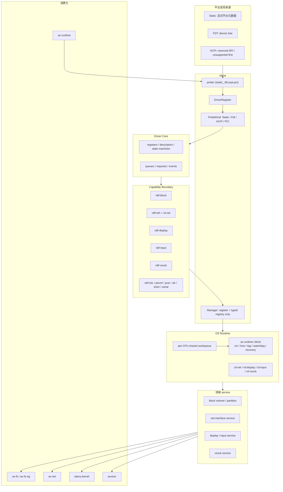

# 总体架构

`rdrive + rdif` 驱动框架以分层隔离为核心。新的宿主设备路径分为六层：平台发现来源、`rdrive` backend 分发、具体驱动 core、`rdif` 能力边界、OS runtime、领域 service 与上层消费方。各层之间通过明确的契约交互，不反向依赖。

## 六层结构

`rdrive::Manager` 只保存 `DriverRegister` 和类型化设备 registry。Static、FDT、ACPI、PCI 各自拥有独立 `probe::*::{System, Info, FnOnProbe}`，不把平台状态合并成一个大 `System`。

## 数据流方向

设备数据流是单向的：平台发现 → probe → driver core 实例化 → rdif 能力注册 → 领域 service 查询 → 上层消费。反向依赖被严格禁止：

- Driver Core 不依赖 `rdrive`、`ax-driver`、`ax-hal` 或平台 crate。
- `rdif-*` 不依赖平台、runtime 或任务调度。
- OS Glue 不引入上层 FS/NET 策略。
- Runtime（`rd-*` 或 `ax-runtime::block`）不参与 probe、设备树解析或平台选择。

块设备在 capability 与 service 之间必须经过 `ax-runtime::block`。它在调用驱动前发布 tag，将 hardware queue 映射为独立 hctx，并把每个 hctx 的固定串行 work item 交给共享 per-CPU worker pool；IRQ top-half 只产生稳定事件，watchdog 只判定失败并进入 recovery。文件系统不拥有 IRQ handler、completion table 或周期 drain worker。

逻辑 `WorkQueue` 只定义 CPU、优先级、admission 与 flush/drain 边界，不拥有专属线程。`drain_workqueue()` 先关闭该逻辑域的新提交，再等待此前接受的 intrusive item 全部回到 idle；per-CPU normal/highpri worker 始终保留，其他逻辑域仍可继续执行。设备 teardown 仍须按“停止 submit → mask/synchronize IRQ → cancel delayed work → flush/drain”的顺序完成，不能把停止共享 worker 当作设备隔离手段。

`cancel_delayed_work_sync()` 在返回前还必须等待 timer expiry 的 publication baton 离开 `PUBLISHING`：旧 generation 要么回到 `ARMED` 并被 control work 取消，要么先把 activation 发布成 `QUEUED` 再由 `cancel_work_sync()` 消费。不允许在取消已返回后再由晚到 expiry 发布工作。

incoming MPSC 栈与 worker doorbell 是一个不可拆分的 lost-wake 协议：它们的 publish、clear 和 detach 通过同一顺序一致次序线性化。若 clear 先发生，producer 必须留下 doorbell；若 clear 后发生，consumer 必须观测并 detach incoming node。不能只在两个独立原子上分别使用 Acquire/Release，那会在弱内存序架构上允许跨对象次序环。

## 核心源码

| 源码 | 职责 |
| --- | --- |
| `drivers/rdrive/src/manager.rs` | `Manager`、`DeviceContainer`、类型化设备查询 |
| `drivers/rdrive/src/register/mod.rs` | `DriverRegister`、`ProbeKind`、`ProbeLevel`、`ProbePriority`、`RegisterContainer` |
| `drivers/rdrive/src/probe/mod.rs` | `ProbeError`、`OnProbeError`、backend 分发 |
| `drivers/rdrive/src/probe/static_.rs` | Static platform probe |
| `drivers/rdrive/src/probe/fdt/` | FDT probe、compatible 匹配 |
| `drivers/rdrive/src/probe/acpi.rs` | ACPI probe、HID/CID 匹配、MCFG/GSI routing |
| `drivers/rdrive/src/probe/pci/` | PCIe endpoint 枚举 |
| `drivers/rdrive/src/driver/mod.rs` | `PlatformDevice`、`register()` |
| `drivers/rdrive/src/descriptor.rs` | `Descriptor`、`DeviceId` |
| `drivers/ax-driver/src/lib.rs` | ArceOS glue：`module_driver!`、feature 分发 |
| `drivers/ax-driver/src/binding_info.rs` | `BindingInfo`、IRQ binding 元数据 |
| `drivers/ax-driver/src/binding_resolver.rs` | FDT/ACPI/PCI IRQ 解析 |

## 设计选择

### 为什么不用单一大容器

旧的 `AllDevices` 模型把 block/net/display/input/vsock 设备塞进一个全局结构体，runtime 启动时拆包逐个传给模块。这种设计的问题：

- 新增设备类别需要修改全局容器和 runtime 拆包逻辑。
- 设备数量固定，无法支持运行期动态注册（如 Wi-Fi AP、USB 热插拔）。
- 上层模块被迫依赖整个容器类型，耦合扩散。

`rdrive + rdif` 改用类型化 registry：每个设备按 `DeviceId` 注册为 `DeviceOwner`（持有 `Box<dyn DriverGeneric>`），上层通过 `Device<T>` 弱引用按领域能力 trait 查询。设备数量和类别可在运行期增长。

### 为什么 Capability Boundary 独立

`rdif-*` 只定义“某类设备向上暴露什么能力”，不包含设备发现、iomap、IRQ 注册或任务调度。这样做的收益：

- Driver Core 可以在不同 OS（ArceOS、StarryOS、Axvisor）之间复用而不重新实现能力接口。
- 上层模块面向 trait 编程，设备实现可替换。
- 能力契约稳定，硬件演进不影响上层 API。

### 为什么多来源并列

嵌入式/aarch64 平台常用 FDT，x86/服务器用 ACPI，PCIe 设备独立枚举，某些静态平台需要显式注册。把这些来源合并成单一 `System` 会引入隐式优先级和状态污染。`rdrive` 让每个 backend 拥有独立 `System`，通过 `ProbeKind` 分发，平台来源显式且可组合。

详细 backend 模型见 [rdrive 设备管理](rdrive.md)，初始化时序见 [设备探测与初始化](probe.md)。
