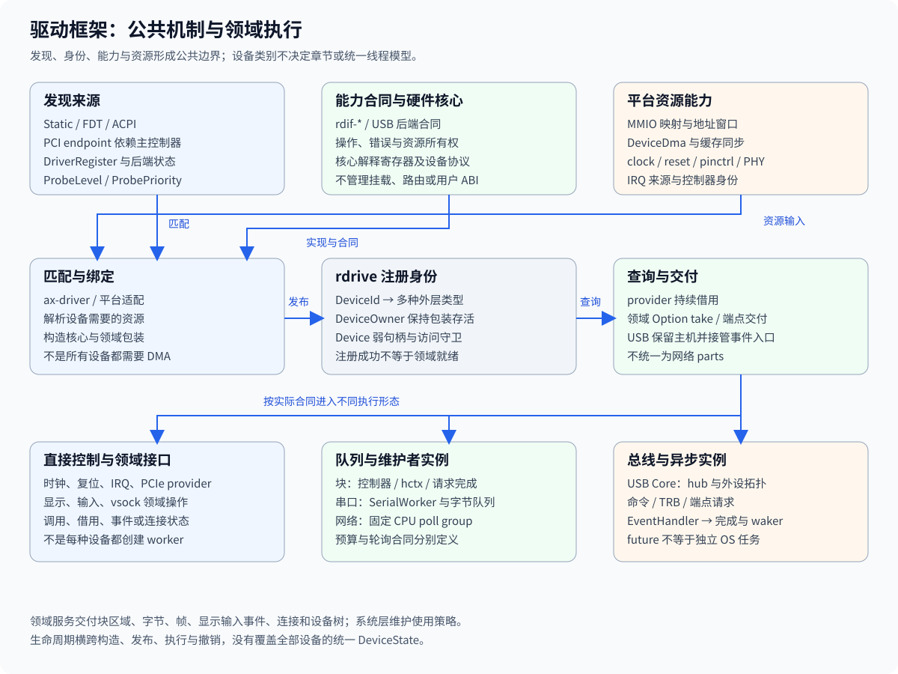
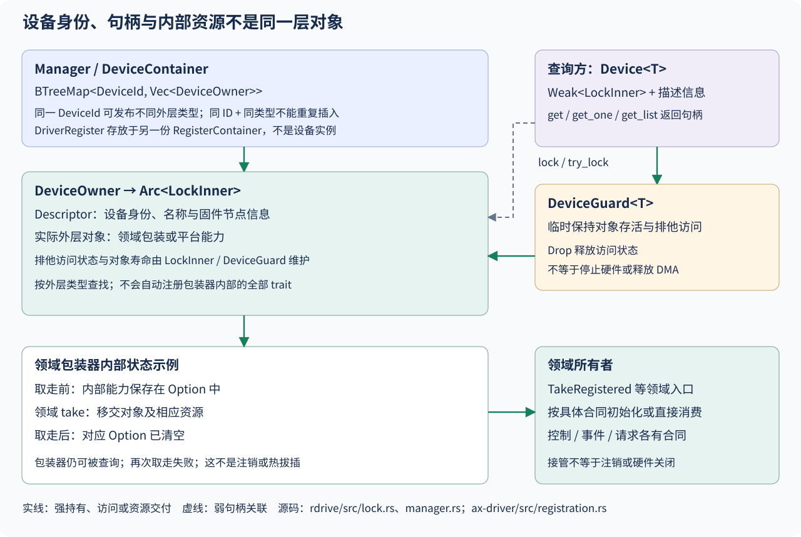
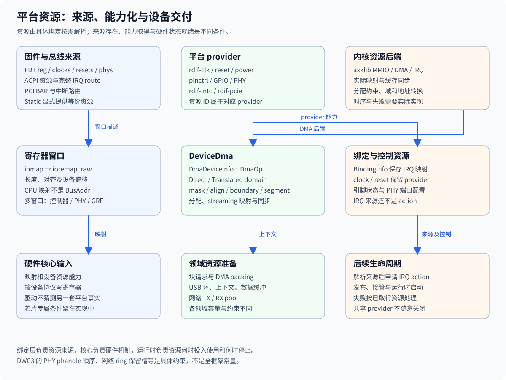
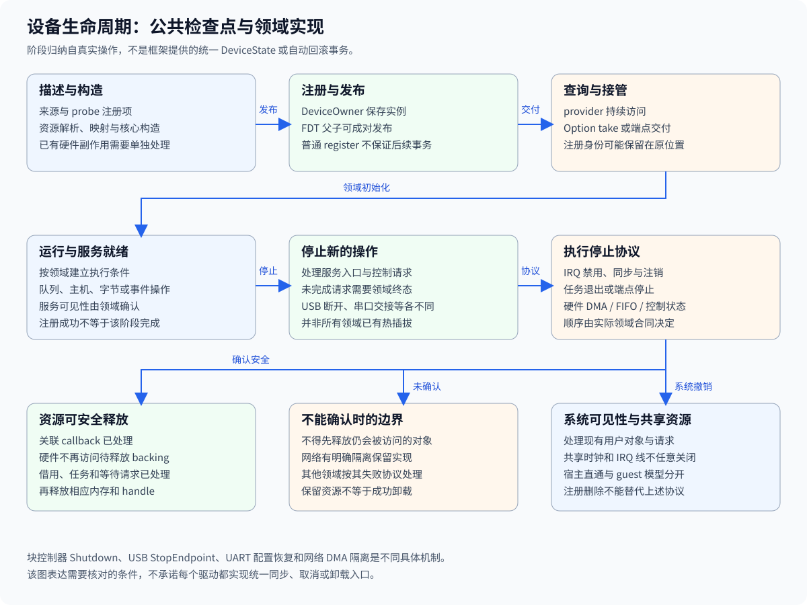

# 驱动框架总体架构

驱动框架以设备身份、领域能力和资源所有权连接硬件与系统。发现机制负责确定实例，绑定层提供平台资源，硬件核心实现设备协议，运行时按领域合同推进工作，服务层交付系统需要的操作。它不是一个集中拥有所有设备、IRQ 和任务的统一对象。

## 1. 组件模型

组件边界由持有的状态决定。`rdrive` 保存注册关系，`rdif-*` 定义可调用能力，`ax-driver` 组织现有平台绑定，具体领域代码维护请求、等待者和服务状态。

### 1.1 静态结构

架构图将公共入口与不同执行形态分开。时钟与复位等 provider、队列设备、USB 主机以及显示输入都经过资源与身份边界，但后续调用路径不同。

能力定义与硬件实现之间的关系是合同约束，不表示每次调用都必须经过固定数量的包装层。框架也不要求每个运行时独立成包。

### 1.2 组件职责

源码目录对应现有实现位置，不代表所有目录中的代码已经具有完全一致的依赖结构。

| 组件 | 状态或操作 | 主要源码 |
| --- | --- | --- |
| 发现与注册 | 来源状态、匹配、身份及类型查询 | `drivers/rdrive/src/` |
| 领域能力 | 操作、错误、端点和所有权前置条件 | `drivers/interface/` |
| 平台绑定 | FDT/ACPI/PCI 资源、对象构造与发布 | `drivers/ax-driver/src/` |
| 内存资源能力 | 映射、DMA domain、约束及同步 | `memory/mmio-api/src/lib.rs`、`memory/dma-api/src/lib.rs` |
| 硬件核心 | 寄存器、描述符、设备状态 | 具体存储、网络、USB 和 SoC 驱动 |
| 领域运行时 | 提交、完成、事件、任务及停止 | `fs/ax-fs-ng/src/block/runtime/`、USB `Core` 等 |
| 系统适配 | 启动组织和用户态语义 | `os/arceos/modules/axruntime/src/`、StarryOS 与 Axvisor |

代码归属以依赖和状态所有者判定。硬件机制与系统策略的边界由[驱动分层](layering.md)进一步定义。

## 2. 设备发现与身份

设备来源和注册身份具有不同作用域。固件节点用于匹配和查找资源，`DeviceId` 用于关联注册实例，Rust 类型用于选择外层能力对象。

### 2.1 探测调度

`DriverRegister` 包含 `ProbeKind`、`ProbeLevel` 和 `ProbePriority`。`Manager::unregistered()` 生成排序快照，`probe_system()` 按阶段和优先级分组；组内依次处理 Static、FDT 和 ACPI，`probe_all()` 随后执行 PCI 枚举。

早期调用筛选 `PreKernel`，`probe_all()` 则取得全部注册项并依靠后端完成记录跳过已处理对象。时钟、IRQ 域和 PCIe 主控制器需要在消费者使用前发布，优先级本身不自动生成完整依赖图。

### 2.2 注册与查询

`DeviceContainer` 使用 `BTreeMap<DeviceId, Vec<DeviceOwner>>`。同一身份可保存不同外层类型，相同身份和类型重复发布会失败。`Device<T>` 保存弱引用，`DeviceGuard<T>` 保持对象存活并保护访问。

句柄存在不表示包装内的硬件对象尚未被接管。`Option::take()` 可以清空待交付对象而保留注册身份；平台 provider 则可能持续通过查询句柄访问。两种模式由[设备管理](rdrive.md)和[生命周期](lifecycle.md)分别说明。

## 3. 能力与资源

能力定义操作语义，资源定义执行操作所依赖的平台条件。接口实现不能凭一个裸整数混用 CPU 地址、DMA 地址、中断来源和设备身份。

### 3.1 操作合同

`rdif-clk` 和 `rdif-reset` 表达资源控制，`rdif-block` 表达控制器与 owned 请求队列，`rdif-eth` 表达可拆分网络端点，显示输入及 vsock 提供各自领域接口。USB `CoreOp`、`BackendOp` 与主机对象表达枚举和传输，其结构不必强制套进其他领域的 trait。

共享合同包括可变访问和资源归属，但方法、返回状态和完成条件不同。例如输入事件可读不等于块请求完成，显示 flush 返回也不是网络 DMA 停止证明。接口差异由[能力接口](capability.md)维护。

### 3.2 平台注入

`iomap()` 使用平台 MMIO 映射入口；`DeviceDma` 保存 domain、一致性与约束；FDT 的时钟、复位和引脚 helper 解析对应 provider；`BindingInfo` 保留局部中断源与平台来源。

DWC3 的 PHY 和 GRF、PCI 设备的 BAR 与 IRQ、SD/MMC 的时钟复位都属于这一资源边界，但所需字段不同。设备树声明一个资源不表示通用 probe 已自动应用它，具体绑定函数的解析范围见[平台资源](resources.md)。

## 4. 执行与事件

运行时将已发布能力接入可推进的执行上下文。框架没有统一的 `poll()`、工作线程或固定 CPU 要求；实际合同由设备能力和领域运行时共同决定。

### 4.1 执行形态

不同形态可以组合。例如 USB 枚举 future 会提交 xHCI 命令，再等待事件服务交付完成；块控制器初始化与数据队列也使用不同推进条件。

| 形态 | 实现证据 | 执行边界 |
| --- | --- | --- |
| provider 直接控制 | `rdif-clk`、`rdif-reset` | 调用者在有效访问上下文执行操作 |
| 控制器与请求队列 | `BlockController`、`HardwareQueue` | 控制状态、批量提交和 IRQ 完成分离 |
| 异步命令与传输 | USB `Core`、`Finished`、`TWaiter` | 请求任务等待预登记完成对象 |
| 借用及事件接口 | `RdifDisplayDevice`、`RdifInputDevice` | 领域方法与可选 IRQ 接入 |
| 固定 CPU 队列域 | `NetworkRuntimeBuilder` | 网络 group、IRQ 和队列 owner 满足特定亲和合同 |
| 连接传输 | `rdif-vsock::Interface` | 按 CID、连接 ID 和事件推进 |

网络的 poll group 和块的 hctx 不是通用驱动对象。它们的队列预算、背压、重试和状态推进由[运行时与完成](runtime.md)说明。

### 4.2 事件交付

`BindingIrq` 解析为域 `IrqId` 后，消费者申请实际 action。块 IRQ 将确认结果写入 latch 并通知维护者，USB handler 消费 Event Ring 并发布命令或传输完成，网络端点发布 group 调度状态。

硬 IRQ 不能在任意位置调用需要分配和全局锁的注册查询，但“禁止消费任何完成环”并不是全框架规则，USB 的事件处理本身需要读取硬件事件。每种 callback 的可用操作、锁和通知方式由[中断与事件](irq.md)明确限定。

## 5. 发布与生命周期

probe、接管、运行、停止和释放跨越多个对象，框架不提供一个覆盖全部设备的公共生命周期枚举。上层服务的可用性也不能由注册表非空推导。

### 5.1 发布条件

FDT 父子注册可在发布前校验关联；领域构建器需要自行管理接管后的失败资源；USB 主机还需初始化、枚举并形成拓扑变化；文件系统需要控制器和卷识别完成后才能消费相应块区域。

图中是跨实现的检查点，不是所有设备已经实现的自动回滚服务。`PlatformDevice` 的发布一致性不能替代控制器关闭或用户态设备撤销。

### 5.2 停止与动态变化

涉及 DMA 的资源需要确认硬件不再访问，涉及 callback 的资源需要处理注销与同步，用户可见对象还需要处理等待请求和后续访问。块控制器、USB 端点和网络 owner 的停止协议不同，不能只调用一个包装对象的析构就宣称安全卸载。

USB `disconnect_port()` 维护子树断开，注册表增加对象不等于全系统热插拔已实现。网络的隔离保留资源策略也不能被描述成其他领域自动具备的恢复机制，具体限制见[生命周期](lifecycle.md)。

## 6. 服务与系统

服务交付可由上层消费的能力，系统集成决定其何时初始化及如何映射用户接口。驱动框架不重新保存一套竞争的路由、挂载或用户设备状态。

### 6.1 领域交付物

块运行时交付块设备句柄，卷层提供磁盘区域和分区元数据；网络运行时交付帧端口；显示和输入交付帧缓冲及事件接口；USB 主机交付设备变化与设备对象；平台控制器交付配置能力。

分区解析在 `fs/ax-fs-ng/src/volume/`，不属于 `ax-driver`；协议和 socket 不属于网卡寄存器层；Linux USBFS 不属于 DWC3 PHY 核心。交付关系由[领域服务](services.md)定义。

### 6.2 系统与构建配置

`rust_main()` 组织 HAL、链接注册项、调度器、中断和领域初始化，系统差异保留在外围适配。Cargo feature 控制实现与 probe 的链接，实际固件描述决定设备匹配，二者都不能替代运行期资源校验。

[系统集成](integration.md)、[构建配置](features.md)和[迁移约束](migration.md)分别维护启动调用、构建选择及旧合同转换。[USB 实现专题](usb/overview.md)补充具体设备代码，不构成公共架构的另一套主线。
