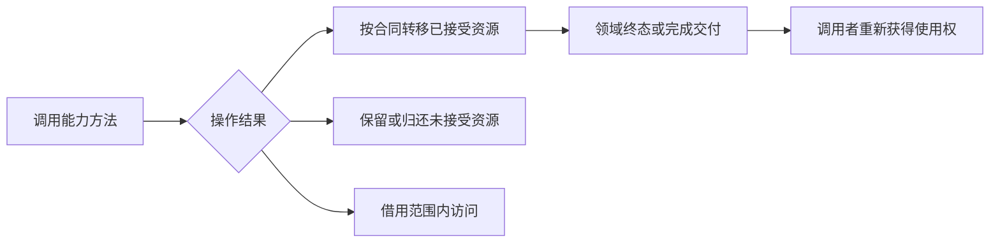

# 能力接口与所有权合同

能力接口表达设备可执行的操作、资源交接方式和错误结果。`drivers/interface/` 中的 `rdif-*` 不统一规定线程、队列和固件格式；USB 后端也保留自己的主机与传输合同。接口的组织依据是操作形态，不是将所有设备套进网络收发模型。

## 1. 注册类型与能力

注册类型确定如何在 `rdrive` 中找到对象，领域接口确定找到后能执行什么操作。平台包装还可能保存尚未解析的资源来源，不能把它与内部驱动能力混为一谈。

### 1.1 类型化发布

`drivers/ax-driver/src/registration.rs` 的 `BoundDevice` 关联 `BindingInfo`，领域包装保存具体能力对象。`DeviceId` 下可以发布不同外层类型，但 `get::<T>()` 不会扫描对象实现的任意 Rust trait。

`rdif-base` 的通用类型信息与领域接口的操作方法具有不同职责。显示 `Interface`、块 `BlockController` 和串口 `SplitUart` 不能通过一个未经定义的通用 downcast 自动互换。

### 1.2 合同分类

相同设备可能同时提供控制、事件和传输端点。分类用于解释职责，不要求每个设备同时实现表中所有形态。

| 形态 | 关键接口 | 操作与交付 |
| --- | --- | --- |
| 平台资源控制 | `rdif-clk`、`rdif-reset`、`rdif-power` | 按资源 ID 执行配置 |
| 总线与中断控制 | `rdif-pcie`、`rdif-intc` | 配置空间、路由及控制器能力 |
| 请求队列 | `BlockController`、`HardwareQueue` | 控制状态、owned 批次及完成 |
| 拆分端点 | `SplitUart`、`NetDevice` | 控制、IRQ 与任务侧资源分开 |
| 借用与事件读取 | 显示、输入 `Interface` | 帧缓冲、事件和能力查询 |
| 连接传输 | vsock `Interface` | CID、连接、数据和连接事件 |
| 主机枚举与异步请求 | USB `CoreOp`、`BackendOp` | hub 拓扑、寻址和传输完成 |

运行方式和生命周期分别由[运行时与完成](runtime.md)与[生命周期](lifecycle.md)维护，接口章节只定义交付对象和操作条件。

## 2. 资源控制能力

平台 provider 的资源身份只在相应控制器语境中有意义。时钟 ID、复位 ID 和 GPIO 线号不能当作设备 ID 或 IRQ 注册 ID。

### 2.1 时钟、复位与电源

`drivers/interface/rdif-clk/src/lib.rs` 的 `Interface` 按 `ClockId` 启用和查询、设置频率。`assignment_mmio_write_protection()` 表达直通场景下 provider 寄存器写入的保护要求，其中 `None` 与空集合具有不同语义。

`drivers/interface/rdif-reset/src/lib.rs` 的 `reset()` 默认依次调用 `assert()` 和 `deassert()`，错误通过 `ResetError` 返回；默认实现不自动插入设备特定的脉冲延时。电源和 PWM 分别由 `rdif-power`、`rdif-pwm` 的接口表达，不能以复位释放代替电源已稳定。

### 2.2 引脚、总线与时间

`rdif-pinctrl` 的 `PinState`、`MuxSetting` 和 `ConfigSetting` 表达复用与电气配置，GPIO 操作和事件另有接口。`rdif-pcie` 提供主控制器能力供枚举使用，`rdif-intc` 提供中断控制器操作。

`rdif-timer` 与 `rdif-systick` 分别表达计时及系统 tick 所需能力。它们是平台资源，并不负责维护块请求超时、网络状态机 deadline 或 USB future；这些等待由相应运行时解释。

## 3. 队列与端点合同

队列合同需要明确谁能提交、何时资源归还、IRQ 能访问哪些状态。块、串口和网络都划分执行端点，但拆分结果不同。

### 3.1 控制器与 owned 请求

`drivers/interface/rdif-block/src/hardware.rs` 的 `BlockController::advance()` 推进控制器，`HardwareQueue` 由一个任务上下文维护者独占。IRQ 端点返回队列及控制事件，不直接调用维护者的队列对象。

`submit_batch_owned()` 接收 `OwnedRequestBatch` 的有序前缀，通过 `SubmissionSink` 同序报告请求 ID。未接受的后缀保持原顺序和运行时所有权；接受数非零时，即使结果包含故障，也必须调用一次 `commit_submissions()` 发布已接受描述符。

| 对象或结果 | 合同 |
| --- | --- |
| `BatchSubmitResult::accepted()` | 已从批次转移的请求数量 |
| `Continue` / `QueueFull` / `Fatal` | 区分额度内已接受、空间不足与不可继续提交 |
| `CompletionSink::complete()` | 返回终态请求及 DMA backing |
| `drain_completions()` | 由已确认 IRQ 驱动，不作为周期或提交侧轮询 |
| `advance_register_retry()` | 只推进寄存器或协议记账，不读取硬件完成源 |

队列深度、批次上限和控制器队列数分别由实现报告，单深度控制器不会因使用该合同而变成原生多队列硬件。

### 3.2 串口端点

`drivers/interface/rdif-serial/src/raw.rs` 的 `SplitUart::split()` 返回 `SerialParts`，分别交付控制端点、IRQ 端点和紧急发送端点。`UartPort` 提供启动、配置、RX/TX 和 rearm；`UartIrq` 返回有界 `SerialIrqReport`；`UartEmergencyTx` 只用于紧急输出。

`UartIrq::handle()` 不调用运行时代码，也不写 TX FIFO。`mask()` 只屏蔽本设备源，不能关闭共享中断控制器线路。紧急端点需要进入 `UartRegisterGate`，不能把正常配置、RX 和紧急发送混成一个可任意并发调用的对象。

### 3.3 网络部件

`drivers/interface/rdif-eth/src/lib.rs` 的 `NetDevice::into_parts()` 消耗设备，交付控制、可选无线控制和 poll group。group 表达共同屏蔽与 rearm 的硬件服务域，不是其他领域必须实现的通用队列类型。

| 对象或字段 | 所有权与能力 |
| --- | --- |
| `NetDeviceInfo`、`NetControlEndpoint` | 静态信息和独占控制查询 |
| `wifi_control` | 可选无线有限步事务端点 |
| `queues` | 独占 `ITxQueue` 和 `IRxQueue` |
| `irq_control` | owner 上的 `quiesce()`、`rearm_and_check()`、`shutdown()` |
| `owner_startup` | 可选设备启动状态机 |
| `irq_endpoints` | 携带局部 `NetIrqSourceId` 的可移动硬 IRQ 端点 |

`DmaBuffer` 不可克隆，提交失败由 `SubmitError` 返回原令牌。`TxSubmitOptions` 的校验和与延迟通知是显式选项，默认实现可以拒绝不支持的请求。准备层拒绝空 group、重复身份、缺失 IRQ endpoint 和小于 2 的 ring，具体资源约束见[平台资源](resources.md)。

## 4. 借用与事件能力

部分领域保留对象的可变访问，不需要 owned-DMA 队列合同。借用有效期、事件字段和操作缺省值仍需明确。

### 4.1 显示与输入

`drivers/interface/rdif-display/src/interface.rs` 的 `framebuffer()` 返回 `FrameBuffer<'_>`，其内存视图受设备借用约束；`need_flush()`、`flush()` 描述刷新，事件以 `handled`、`changed` 区分处理与显示变化。

`drivers/interface/rdif-input/src/interface.rs` 提供设备标识、位置、事件位图和 `read_event()`。`get_prop_bits()` 默认返回零，`get_abs_info()` 默认返回 `NotSupported`；输入 `input_ready` 不能解释成块 I/O 或显示刷新完成。

### 4.2 连接与主机

`drivers/interface/rdif-vsock/src/interface.rs` 使用 `VsockConnId`，提供监听、连接、收发、断开、终止和事件查询。vsock 不需要 MAC 或 DHCP，虽然系统消费位置也在网络模块。

USB `drivers/usb/usb-host/src/backend/kmod/kcore.rs` 的 `CoreOp` 提供主机初始化、根 hub 和已寻址设备创建，`USBHost` 对上层暴露设备变化及打开操作。hub 信息、端点请求和事件 handler 分别有自己的对象，不通过网络 parts 表达。

## 5. 资源转移与错误

接口的成功与失败结果必须明确是否发生所有权转移。错误类型无法单独证明资源已恢复，调用者还需结合操作阶段。

### 5.1 转移条件

块批次可能部分接受，网络失败提交返回令牌，显示帧缓冲是借用，USB 完成与取消需要等待控制器协议。统一的是准确记录所有权，而不是强迫这些操作使用相同返回类型。

图示仅归纳合同种类，部分接受与借用不是所有接口都支持的分支。错误后可否重试由具体能力定义。

### 5.2 合同与执行分离

`UartPort::startup()` 要求失败时恢复配置，无法证明恢复的寄存器错误要求调用方停止正常服务；块控制器关闭期间需要保留队列；网络有 DMA 停止未确认错误。这些是不同失败语义，不能统一转换为“忽略并继续”。

接口不提供上层挂载、socket 或用户设备撤销语义。资源来源、执行推进与服务交付分别由[平台资源](resources.md)、[运行时与完成](runtime.md)和[领域服务](services.md)定义。
