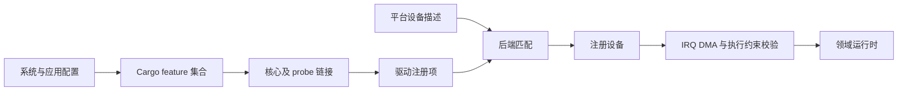

# 构建配置与设备选择

Cargo feature 决定链接哪些能力、硬件核心和探测模块；平台描述决定目标机器上实际可发现哪些设备；运行时决定已注册设备能否满足执行与资源约束。这三个条件缺一不可。feature 的事实来源是 `drivers/ax-driver/Cargo.toml`，不是历史设备支持列表。

## 1. 配置层次

`ax-driver` 的默认 feature 集合为空。启用领域能力不等于启用某个具体驱动，启用具体驱动也不等于创建实例。模块级 `cfg`、注册宏和最终链接器注册项共同决定可执行的 probe 集合。

### 1.1 能力与平台来源

基础 feature 表达领域依赖，`rdrive::init_sources()` 表达平台发现来源。Static、FDT、ACPI 不是用于选择一组旧平台私有驱动类型的 feature。

| feature | 主要作用 | 不负责的工作 |
| --- | --- | --- |
| `block` | 块能力与 OS 绑定 | 扫描分区或挂载文件系统 |
| `net` | `rd-net`、同步依赖与网络绑定 | 创建队列和协议任务 |
| `display` | `rdif-display` 绑定 | 自动选择已验证显示硬件 |
| `input` | `rdif-input` 绑定 | 生成用户态输入设备节点 |
| `vsock` | `rdif-vsock` 绑定 | 物理网卡发现 |
| `pci` | PCIe、MSI 相关能力与探测 | 保证平台一定提供 root complex |
| `usb` | 引入 `crab-usb` | 自动完成设备枚举 |
| `serial` | 串口能力及实现依赖 | 选择所有平台的固定控制台 |

IRQ binding 解析属于基础资源适配，不存在要求调用方额外启用 `ax-driver/irq` 才能解析的通用开关。

### 1.2 镜像与运行实例

`os/arceos/modules/axruntime/src/registers.rs` 装载链接器注册项；`devices.rs` 在探测之后接管设备。相同镜像在不同 FDT 或 ACPI 环境中可以得到不同设备集合。

匹配失败与运行时启动失败处于不同阶段。增加 feature 只能解决驱动未链接的问题，不能修复错误 IRQ 路由、缺失时钟或 DMA 地址限制。

## 2. 硬件 feature

具体硬件开关组合领域能力、核心实现和总线依赖。别名保留的是配置名称兼容性，不表示多了一条独立实现路径。

### 2.1 网络与 VirtIO

VirtIO 网络、显示、输入和 socket 开关都组合 `virtio` 与 `pci`；`virtio` 是 `virtio-core` 的别名。不能凭命名惯例编造当前 Cargo 文件没有定义的 `virtio-gpu-mmio` 或 `virtio-gpu-pci` feature。

| feature | 关键依赖或组合 |
| --- | --- |
| `virtio-net` | `net`、`virtio`、`pci`、同步能力 |
| `virtio-gpu` | `display`、`virtio`、`pci` |
| `virtio-input` | `input`、`virtio`、`pci` |
| `virtio-socket` | `vsock`、`virtio`、`pci` |
| `ls2k1000-gmac` | `net` 与同步能力 |
| `fxmac` | `net`、`fxmac_rs`、分配及接口适配 |
| `intel-net` | `net`、`pci`、`eth-intel` |
| `realtek-rtl8125` | `net`、`pci`、对应硬件核心 |
| `aic8800-wifi` | `net`、`aic8800/rdif`、SDIO host 及认证算法依赖 |

`aic8800-wifi` 中的 `dep:cv181x-sdhci` 是可选依赖启用语法，不等于启用同名块设备 feature。`sdmmc-protocol/sdio` 从 AIC 的依赖关系引入，不能将 Wi-Fi 路径解释成先创建一块 SD 磁盘。

### 2.2 块设备

当前 Cargo 文件公开 AHCI、NVMe 和多种 SD/MMC 控制器 feature。公开入口仅证明可选择该实现，不能据此宣称已经完成所有板卡和写入组合验证。

| feature | 主要路径 |
| --- | --- |
| `ahci` | 块能力、PCI、`ahci-driver` |
| `ahci-fdt` | 块能力与 `ahci-driver`，不强制 PCI |
| `ls2k1000-ahci` | `ahci-fdt` 别名 |
| `nvme` | 块能力、PCI、`nvme-driver` |
| `rockchip-sdhci` | Rockchip 资源、`sdhci-host`、SD/MMC 协议 |
| `cv181x-sdhci` | CV181x host、`sdhci-host`、SD/MMC 协议 |
| `cvsd` | `cv181x-sdhci` 别名 |
| `k230-sdhci` | SDHCI host 与 SD/MMC 协议 |
| `phytium-mci` | `phytium-mci-host` 与 SD/MMC 协议 |
| `rockchip-dwmmc` | Rockchip 资源、SCMI、DWMMC host 与协议 |
| `starfive-jh7110-dwmmc` | StarFive 资源、DWMMC host、协议及 SDIO 支持 |

硬件队列数量、提交批次和 IRQ 合同由实际控制器实现给出，不由 feature 个数决定。公开入口与硬件验证记录分开维护，不能由前者推导后者。

### 2.3 USB 与 SoC 设备

USB transport 开关和 SoC 初始化开关可明确区分，DWC3 路径还需要 PHY、时钟、复位及 GRF 资源。

| feature | 关键组合 |
| --- | --- |
| `xhci-mmio` | `usb` |
| `xhci-pci` | `usb`、`pci` |
| `rockchip-dwc-xhci` | `usb`、`rockchip-soc`、`rockchip-pm` |
| `rockchip-ehci` | `usb`、Rockchip SoC 和电源依赖 |
| `sg2002-dwc2` | `usb`、`sg200x-bsp` |
| `rk3588-pcie` | PCI、Rockchip 资源、`rk3588-pci` |
| `rk3588-pwm` | Rockchip 资源、PWM 能力与实现 |
| `rknpu`、`rga`、`jpeg` | 对应加速核心与 Rockchip 资源 |

`rockchip-soc` 和 `rockchip-pm` 引入的依赖不意味着每个资源都由使用它的 probe 自动启用；具体操作仍由回调和平台资源提供者实现。

## 3. 构建工具与验证边界

系统配置经过构建工具转换后才成为 Cargo 参数。应用能力名、带软件包前缀的 feature 和旧平台开关不能混用。

### 3.1 配置映射

`scripts/axbuild/src/arceos/cbuild/features.rs` 处理 C 应用 feature 映射，`scripts/axbuild/src/build/platform.rs` 处理平台相关配置，`std_build.rs` 处理标准构建路径。`ax-driver/virtio-net` 是显式软件包 feature，与上层 `net` 能力具有不同含义。

映射层负责配置名称和构建输入，不验证设备树中是否存在对应节点。构建成功后没有注册对象，需要继续核对最终注册项与平台匹配，而不是直接归因于上层协议初始化。

### 3.2 支持证据

配置支持、编译支持、启动支持和数据完整性验证应分开记录。尤其块设备写入、DMA 一致性和多核 IRQ 亲和需要对应目标的运行证据，不能由源码中出现 feature 推导。

资源约束由[平台资源](resources.md)定义，执行与停止条件分别由[运行时与完成](runtime.md)和[生命周期](lifecycle.md)定义。驱动实现按项目 `cargo xtask` 入口验证实际受影响的功能组合，构建参数需要与目标设备描述一致。迁移旧配置的行为差异由[迁移约束](migration.md)说明。

## 4. 实现与注册对应

feature 选择依赖，注册模块选择实际 probe。硬件核心与绑定可能在不同目录，也可能处于同一文件，不能仅从软件包名称推导完整接入链。

### 4.1 平台与领域入口

`drivers/ax-driver/src/usb/dwc.rs` 绑定 Rockchip DWC3 资源，`drivers/usb/usb-host/src/backend/kmod/` 保存 USB 核心和后端；`drivers/serial/some-serial/` 保存串口实现，运行时位于 `os/arceos/modules/axruntime/src/serial/`。块接管位于 `drivers/ax-driver/src/block/binding.rs`，运行时与卷在 `fs/ax-fs-ng/`。

显示输入使用各自 `rdif` 能力与 ArceOS 包装，没有独立 runtime crate 也不表示缺少运行时职责。

### 4.2 网络硬件绑定

网络实现同样以 feature、核心及 probe 三者对应，保留具体实现路径便于验证配置，不作为独立的架构分类。

| 实现 | 核心或适配位置 | 平台绑定 |
| --- | --- | --- |
| VirtIO-net | `drivers/ax-driver/src/virtio/net.rs` | 同文件传输构造与 probe |
| Intel E1000 | `drivers/net/eth-intel/src/e1000/mod.rs` | `drivers/ax-driver/src/net/intel.rs` |
| RTL8125 | `drivers/net/realtek-rtl8125/src/lib.rs` | `drivers/ax-driver/src/net/realtek.rs` |
| Phytium Fxmac | `drivers/ax-driver/src/net/fxmac.rs` | 同文件包装 `fxmac_rs` |
| Loongson GMAC | `drivers/ax-driver/src/net/loongson_gmac.rs` | `ls2k1000-gmac` feature |
| AIC8800 | `drivers/net/aic8800/src/rdif/device/endpoints/device.rs` | `drivers/ax-driver/src/net/aic8800/` |

该表证明源码和配置入口，不表示所有板卡、多核亲和和 DMA 组合都已经完成运行验证。
