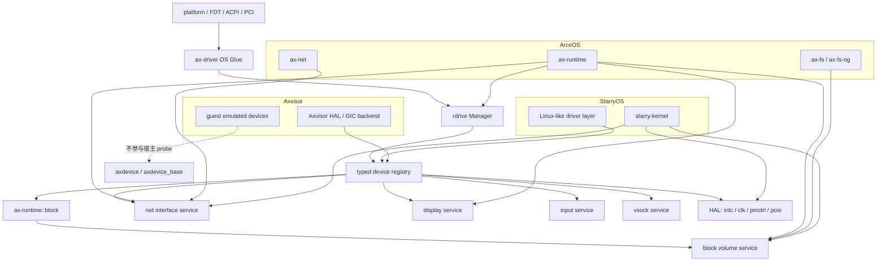

# 系统集成

`rdrive + rdif` 驱动框架是 ArceOS、StarryOS、Axvisor 共享的宿主设备能力来源。三个系统通过各自的 OS Glue 和领域 service 接入驱动框架，但不复制设备状态或绕过 `rdrive` registry。

## 集成模型

## ArceOS 集成

ArceOS 的 `ax-runtime` 是驱动框架的主要消费者：

| 集成点 | 职责 |
| --- | --- |
| `ax-runtime` init_later | 调用 `rdrive::init()`、`register_append()`、`probe_pre_kernel()` |
| `ax-runtime` devices init | 调用 `rdrive::probe_all(false)`，选择 block activation plan，建立 ownership domain/IRQ，运行 controller init FSM，再初始化领域 service |
| `ax-runtime` IRQ | 将 platform IRQ 注册能力适配为 `ax_net::EthernetIrqRegistrar` 等 |
| `ax-runtime::block` | 管理 ctx/hctx/tag/credit、线性 evidence、maintenance owner、watchdog、recovery 与 passthrough handoff |
| `ax-fs` / `ax-fs-ng` | 通过 block volume service 消费块设备 |
| `ax-net` | 通过 net interface service 消费网卡 |

`ax-runtime` 不再拆 `AllDevices.block/net/display/input/vsock` 后逐个传给模块，只触发 probe 和领域 service 初始化。

块设备启动顺序固定为：scheduler/IRQ online → controller discovery → runtime 冻结 activation plan → 在目标 CPU 建立 control maintenance owner → owner 注册 disabled control IRQ action → action enable 与 device source unmask → bounded init FSM → `Ready` 拆出纯 publication coordinator、combined shared-domain 的不可变 queue facts 和 move-only independent domains → combined domain 继续由原 control owner 在同一维护线程内服务，每个 independent domain 则移入最终 owner 并绑定自己的 IRQ → 所有 owner 返回线性 proof → coordinator 原子发布 queue/device catalog → root mount。任何 IRQ source 缺失、注册失败、evidence 未 drain、binding proof 缺失或初始化失败的硬件 controller 都不得进入 block volume service。

## StarryOS 集成

StarryOS 复用 ArceOS 的 `ax-driver` glue 和 `rdrive` registry，上层通过 Linux-like driver layer 适配：

| 集成点 | 职责 |
| --- | --- |
| starry-kernel 启动 | 复用 ax-runtime 的 probe 流程 |
| Linux-like driver layer | 把 `rdif-*` 能力适配为 Linux 驱动模型（如 `/dev/kpu`、USBFS） |
| Starry USBFS host 管理 | 允许直接使用 `rdrive::get_*` 查询 USB 设备 |

StarryOS 的 ext4 rootfs 启动、net/DHCP、display/input 都通过领域 service 消费驱动能力。

## Axvisor 集成

Axvisor 作为 hypervisor，使用驱动框架管理宿主物理设备：

| 集成点 | 职责 |
| --- | --- |
| Axvisor HAL | 查询 `rdif-intc` 设置 GIC backend |
| Axvisor GIC backend | 允许直接使用 `rdrive::get_*` 查询中断控制器 |
| guest emulated devices | `axdevice` / `axdevice_base` 提供 guest 设备模型，不参与宿主 probe |
| passthrough handoff | freeze/unmount host FS，quiesce hctx 与 DMA，撤销 host route 后转移 MMIO/DMA/IRQ lease；guest 退出后走同一 init FSM 并 remount |

`axdevice` 与 `axdevice_base` 不纳入驱动框架范围。它们作为 Axvisor / axvm 的 guest emulated device model，不作为 FS、NET、display、input、vsock 的设备来源。

passthrough 使用 typed prepare/commit/return permit，不能用计数或裸布尔值宣称 DMA 已停止、guest route 已撤销或 host route 已恢复。任一阶段缺少证明时 controller 保持 quarantine/failed-closed；host 与 guest 不得同时访问同一 queue、MMIO 或 IRQ source。

## 自定义平台接入

`ax-driver` 不再提供面向旧平台私有路径的自动注册 feature，也不再通过 feature 选择平台探测路径。仓库内置平台路径默认使用 FDT/ACPI/PCI probe 注册设备；外部平台应优先提供可发现的设备描述，缺少固件描述时再使用 `rdrive::Platform::Static` / `PlatformSource::Static` 和 `ProbeKind::Static` 做显式设备注册。完整平台侧接入方式见[设备发现](../platform/devices.md)。
