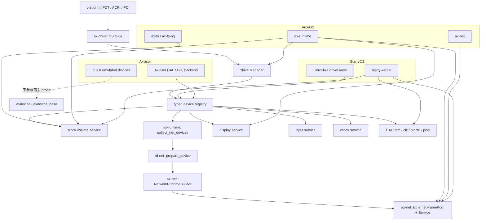

# 系统集成

`rdrive + rdif` 驱动框架是 ArceOS、StarryOS、Axvisor 共享的宿主设备能力来源。三个系统通过各自的 OS Glue 和领域 service 接入驱动框架，但不复制设备状态或绕过 `rdrive` registry。

## 集成模型

```mermaid
flowchart TB
    Platform["platform / FDT / ACPI / PCI"] --> AxDriver["ax-driver OS Glue"]
    AxDriver --> Rdrive["rdrive Manager"]
    Rdrive --> Registry["typed device registry"]

    Registry --> BlockSvc["block volume service"]
    Registry --> NetTake["ax-runtime: collect_net_devices"]
    NetTake --> NetPrepare["rd-net: prepare_device"]
    NetPrepare --> NetQueue["ax-net: NetworkRuntimeBuilder"]
    NetQueue --> NetSvc["ax-net: EthernetFramePort + Service"]
    Registry --> DispSvc["display service"]
    Registry --> InSvc["input service"]
    Registry --> VsSvc["vsock service"]
    Registry --> HalSvc["HAL: intc / clk / pinctrl / pcie"]

    subgraph ArceOS["ArceOS"]
        AxRuntime["ax-runtime"]
        AxFs["ax-fs / ax-fs-ng"]
        AxNet["ax-net"]
    end

    subgraph StarryOS["StarryOS"]
        StarryKernel["starry-kernel"]
        StarryDrv["Linux-like driver layer"]
    end

    subgraph Axvisor["Axvisor"]
        AvHal["Axvisor HAL / GIC backend"]
        AvGuest["guest emulated devices"]
    end

    AxRuntime --> Rdrive
    AxRuntime --> BlockSvc
    AxRuntime --> NetSvc
    AxRuntime --> DispSvc
    AxFs --> BlockSvc
    AxNet --> NetSvc

    StarryKernel --> HalSvc
    StarryKernel --> BlockSvc
    StarryKernel --> NetSvc
    StarryDrv --> Registry

    AvHal --> Registry
    AvGuest -.->|"不参与宿主 probe"| AxDevice["axdevice / axdevice_base"]
```

## ArceOS 集成

ArceOS 的 `ax-runtime` 是驱动框架的主要消费者：

| 集成点 | 职责 |
| --- | --- |
| `ax-runtime` init_later | 调用 `rdrive::init()`、`register_append()`、`probe_pre_kernel()` |
| `ax-runtime` devices init | 调用 `rdrive::probe_all(false)`，初始化领域 service |
| `ax-runtime` IRQ | 将 platform IRQ 注册能力适配为仅接受固定 CPU 的 `ax_net::PinnedNetIrqRegistrar`，并由网络 builder 原子注册/回滚所有 queue source |
| `ax-fs` / `ax-fs-ng` | 通过 block volume service 消费块设备 |
| `ax-net` | `NetworkRuntimeBuilder` 消费准备后的设备，`init_network()` 用帧端口建立协议服务 |

`ax-runtime` 不再拆 `AllDevices.block/net/display/input/vsock` 后逐个传给模块，只触发 probe 和领域 service 初始化。

网络启动由 `os/arceos/modules/axruntime/src/devices.rs` 的 `init_net()` 组织。`collect_net_devices()` 取走 `PlatformNetDevice` 后先调用 `rd_net::prepare_device()`，再逐项解析 `TakenNetDevice::irq_sources`，构造含 TX 策略的 `NetworkDeviceInput`。当前集成为每个设备选择 `TxQueueDiscipline::Fifo { max_frames: 64 }`；代码使用 `NonZeroUsize` 表达非零容量。

`NetworkRuntimeBuilder::build()` 确认 worker 固定 CPU、完整 IRQ 映射及禁用状态注册后，使能全部 action，再执行队列启动、初始 refill/rearm 和配置的无线启动事务。只有成功返回才调用 `ax_net::init_network(Some(runtime), ports, config)`。无已注册物理网卡时使用 `init_network(None, Vec::new(), config)` 建立协议服务，不为缺少 IRQ 的物理网卡增加轮询后备路径。

`parse_network_config()` 当前返回 `NetworkConfig::default()`，不解析系统配置文件。默认地址策略与协议状态由 `ax-net` 控制；固定亲和注册、DMA 令牌与失败隔离流程位于[网络驱动](network.md)。

## StarryOS 集成

StarryOS 复用 ArceOS 的 `ax-driver` glue 和 `rdrive` registry，上层通过 Linux-like driver layer 适配：

| 集成点 | 职责 |
| --- | --- |
| starry-kernel 启动 | 复用 ax-runtime 的 probe 流程 |
| Linux-like driver layer | 把 `rdif-*` 能力适配为 Linux 驱动模型（如 `/dev/kpu`、USBFS） |
| Starry USBFS host 管理 | 允许直接使用 `rdrive::get_*` 查询 USB 设备 |

StarryOS 的 ext4 rootfs 启动、net/DHCP、display/input 都通过领域 service 消费驱动能力。

## Axvisor 集成

Axvisor 作为 hypervisor，使用驱动框架管理宿主物理设备：

| 集成点 | 职责 |
| --- | --- |
| Axvisor HAL | 查询 `rdif-intc` 设置 GIC backend |
| Axvisor GIC backend | 允许直接使用 `rdrive::get_*` 查询中断控制器 |
| guest emulated devices | `axdevice` / `axdevice_base` 提供 guest 设备模型，不参与宿主 probe |

`axdevice` 与 `axdevice_base` 不纳入驱动框架范围。它们作为 Axvisor / axvm 的 guest emulated device model，不作为 FS、NET、display、input、vsock 的设备来源。

## 自定义平台接入

`ax-driver` 不再提供面向旧平台私有路径的自动注册 feature，也不再通过 feature 选择平台探测路径。仓库内置平台路径默认使用 FDT/ACPI/PCI probe 注册设备；外部平台应优先提供可发现的设备描述，缺少固件描述时再使用 `rdrive::Platform::Static` / `PlatformSource::Static` 和 `ProbeKind::Static` 做显式设备注册。完整平台侧接入方式见[设备发现](../platform/devices.md)。
